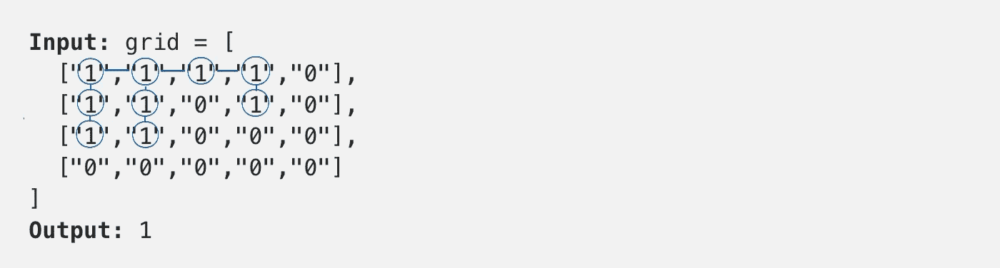
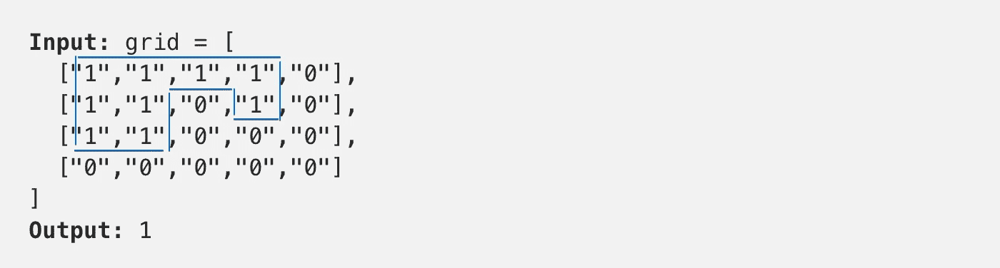
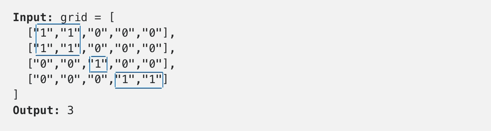
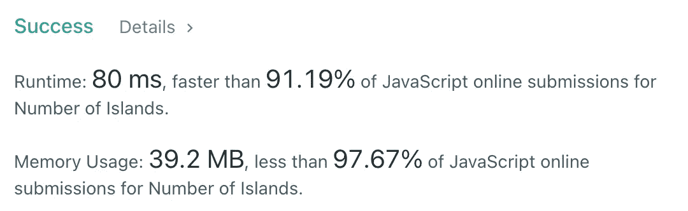

# JavaScript 算法:孤岛数量(LeetCode)

> 原文：<https://javascript.plainenglish.io/javascript-algorithms-number-of-islands-leetcode-6eff200bdf1?source=collection_archive---------3----------------------->


Photo by [Upgraded Points](https://unsplash.com/@upgradedpoints?utm_source=medium&utm_medium=referral) on [Unsplash](https://unsplash.com?utm_source=medium&utm_medium=referral)

# 描述

给定一张`'1'` s(陆地)和`'0'` s(水域)的`m x n` 2d `grid`地图，返回*岛屿的数量*。

**岛**四面环水，由相邻的陆地水平或垂直连接而成。你可以假设网格的四个边缘都被水包围。

**例 1:**

```
**Input:** grid = [
  ["1","1","1","1","0"],
  ["1","1","0","1","0"],
  ["1","1","0","0","0"],
  ["0","0","0","0","0"]
]
**Output:** 1
```

**例 2:**

```
**Input:** grid = [
  ["1","1","0","0","0"],
  ["1","1","0","0","0"],
  ["0","0","1","0","0"],
  ["0","0","0","1","1"]
]
**Output:** 3
```

**约束:**

*   `m == grid.length`
*   `n == grid[i].length`
*   `1 <= m, n <= 300`
*   `grid[i][j]`是`'0'`还是`'1'`。

# 解决办法

我们来看看**例 1。**



正如我们所见，它看起来像一个图表。但是不像有孩子的图，这里我们有右上左下的邻居。所以，我们可以说，我们需要找到这个图中所有连接的组件。在图论中，无向图的一个[分量](https://en.wikipedia.org/wiki/Component_(graph_theory))是一个诱导子图，其中任意两个顶点通过路径相互连接，并且在图的其余部分不连接任何额外的顶点。

在**示例 1** 中，我们只有一个连接组件。



例 2 —三。



在这个问题中，我们有两种边缘情况:

*   `grid`的四个边缘都被水包围(我们需要检查我们是否在网格之外)
*   我们应该只访问每个`1`一次(避免无限递归)

我们可以通过使用[广度优先搜索](https://en.wikipedia.org/wiki/Breadth-first_search)或[深度优先搜索](https://en.wikipedia.org/wiki/Depth-first_search)算法来解决这个问题。先说 DFS。

让我们浏览这个 2D 数组，如果我们看到`1`，我们将调用`dfs`并增加一些岛`counter`。我们应该记住我们的优势案例。第一个问题可以通过检查我们是否在`drid`中来解决:

```
if (
  i >= 0 &&
  j >= 0 &&
  i < grid.length &&
  j < grid[i].length &&
  grid[i][j] === '1'
) {...}
```

第二个问题可以通过`0`改变每个被访问的小区来解决。让我们看看整个解决方案:



DFS submissions details

这个解决方案的时间复杂度是`O(nm)`,因为我们一次访问 2D 数组中的每个元素。在整个网格充满`1`的情况下，该解决方案的空间复杂度也是`O(nm)`。

现在，让我们来看看如何用 BFS 来解决这个问题。

我们可以遍历所有单元格，做同样的事情——每次看到`1`时调用`bfs`算法，并增加一些`counter`。

该方案的空间和时间复杂度与`DFS`算法相同。

我希望，它对你有用。感谢阅读！期待您的反馈。回头见，✌️