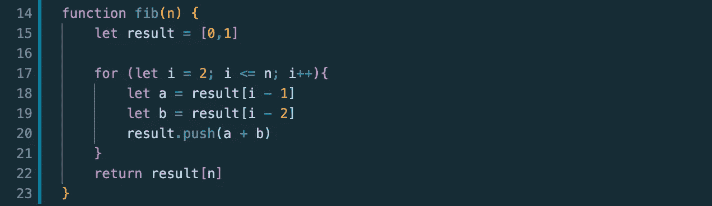
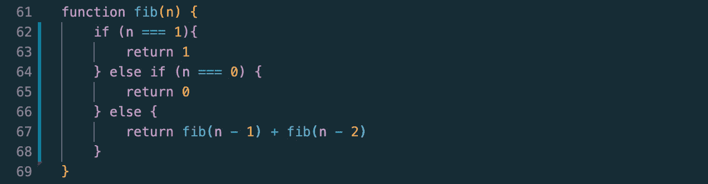
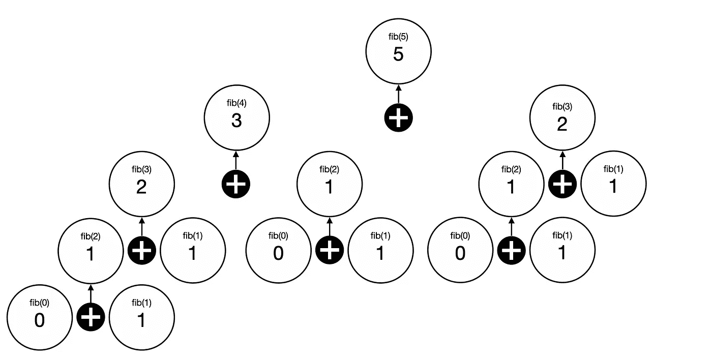
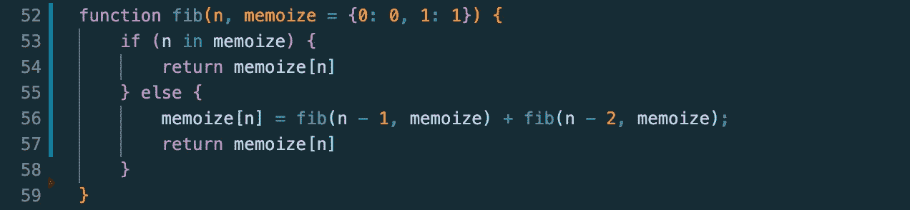

# JavaScript 算法:第 N 个斐波那契入口

> 原文：<https://javascript.plainenglish.io/javascript-algorithms-the-n-th-fibonacci-entry-417afa581182?source=collection_archive---------9----------------------->

什么是斐波那契数列，我们如何找到第 N 个条目的数字？我将在这篇博客中讨论三种不同的解决方案。

Photo by [Aaron Burden](https://unsplash.com/@aaronburden?utm_source=medium&utm_medium=referral)

对于那些不熟悉它的人来说，斐波纳契数列是一系列数字，其中前两个数字加起来是后一个数字。例如，前 9 个条目是:0，1，1，2，3，5，8，13，21。这种模式在世界各地不同的地方频繁出现，例如在花、动物和鹦鹉螺壳上。这也是一个常见的测试你递归知识的技术面试问题。在这篇文章中，我将介绍解决这个问题的两种方法，同时也讨论这两种方法的运行时和时空复杂度。

**打印出斐波那契数列中的第 n*个*条目。例如，fib(6)将导致 8。如果您参考上面的示例列表，该数组中的第 6 个索引将是 8，因为数组索引从 0 开始。**

让我们从简单的迭代解决方案开始。这个解决方案的诀窍在于，前两个数字不能自己生成，因为它们没有一个开始的模式。我们可以通过声明一个包含 0，1 的数组来手动输入 0 和 1。

在声明了一个名为 *result* 的数组(其中包含 0 和 1)之后，我将继续手动执行*循环。记住从 2 开始启动 *i* ，因为索引 0 和 1 已经声明了。我们希望 *i* 增加到或等于 *n，*，因为我们需要知道第 *n 个*条目是什么。在 *for* 循环中，我们希望开始向结果数组中添加新的条目。为此，我们可以通过将前两个条目相加来获得下一个条目。我们可以将这些条目中的每一个设置为变量 *a* 和*b*，然后，我们将 *a* 和 *b* 的和推送到结果数组中，该数组最终会添加下一个条目。*

让我们为 fib(5)看一遍这个例子。当我们开始时，结果将包含 0 和 1。在通过循环的*的第一次迭代期间， *a* 将为 1， *b* 将为 0。然后，我们推送 0 和 1 的结果，为下一个结果条目提供 1，并将 *i* 增加到 3。我们用新的数组[0，1，1]重复这个过程。在迭代这个循环的时候， *a* 现在会是 1， *b* 也会是 1。总的来说，我们为下一个条目得到 2，并得到一个数组[0，1，1，2]。然后，将 *i* 增加到 4。我们再次迭代循环，这次 *a* 将等于 2，而 *b* 将等于 1。将这两者相加，并将其推到结果上将得到[0，1，1，2，3]的数组。最后将 *i* 增加到 5。由于我们的条件语句等于 5，我们最后一次运行循环，其中 *a* 等于 3，而 *b* 等于 2。将它们相加，并将其推入我们的结果，将得到数组[0，1，1，2，3，5]。现在我们已经达到了计数器 5，我们中断循环并返回索引为 *n 的*结果*，结果【5】*将返回 5，因此 fib(5)将返回 5。*

这个解决方案的运行时间复杂度是 O(n)，或者说是线性的。随着 n 增加 1，我们只需要再做一次循环。空间复杂度也将是 O(n ),因为无论数组列表有多长，所需的空间量总是会随着数组的大小而增加。

现在让我们来看一下递归解:

这个解决方案看起来很简单，但是如果你不熟悉递归，实际上非常复杂。本质上，我们对前两个值做了一些类似的事情，其中我们说如果 *n* 等于 1 或 0，我们只返回与它们相关的值。现在到了棘手的部分，我们开始递归。最简单的可视化方法是用一个返回值和函数调用的树形图。

让我们从树的最开始，或者第一个函数调用开始。当我们运行 fib(5)时，我们必须通过调用 fib(4)和 fib(3)将它们的返回值相加。要得到 fib(4)，我们必须得到 fib(3)和 fib(2)的返回值。要得到 fib(3)，我们必须得到 fib(2)和 fib(1)的返回值。当我们到达 fib(2)时，由于 fib(1)和 fib(0)不进行任何额外的函数调用，我们可以开始返回一些值。我们知道 fib(0)返回 0，fib(1)返回 1。因此，fib(2)将返回 1。本质上，我们一直进行函数调用，直到我们遇到(n)等于 1 或 0 的两个条件。只有这样，我们才能开始添加返回值，并沿着堆栈向上到达 fib(5)。

正如您可能知道的，这个递归解决方案的运行时会很糟糕。事实上，这是我们使用 O(2^n 运行时的情况之一，也称为指数运行时。 *n* 每增加一次，函数调用的次数就会呈指数级增加。空间复杂度为 O(n)。

那么，有什么方法可以改善递归解决方案的运行时间呢？为了实现这一点，我们可以使用一种叫做记忆的策略。记忆包括将函数调用的返回值存储为参数。如果再次调用该函数，我们将进行检查，以确保由于返回值已经存在，我们返回预计算结果，而不是再次调用该函数。这可以有效地降低运行时的复杂性。

让我们继续使用 fib(5)示例。使用这个解决方案，我们会从上面往下看返回值树，但是每当我们遇到新的返回值时，它就会被存储到 memoize 中。例如，当第一次到达 fib(2)时，由于 memoize 中还不存在 2，memoize[2]将创建新条目。完成该函数调用后，memoize 将包含{0: 0，1: 1，2: 1}。下一次我们调用 fib(2)时，由于 2 在 memoize 中，我们不再需要进行额外的函数调用，只需要返回 1 的预计算结果。通过记忆，我们可以将运行时间减少到只有 O(n)。

斐波那契序列是自然界中最迷人的模式之一。在代码中使用它也是一种非常有趣的模式。这个问题让我对递归的理解有了更深的理解，这在我第一次尝试学习递归时无疑是一场斗争。我希望这个博客的解释是有帮助的。请随时通过[领英](https://www.linkedin.com/in/jiangmichael1/)或[推特](https://twitter.com/dev_jiams)与我联系，寻求问题、评论或更正。谢谢你的阅读！