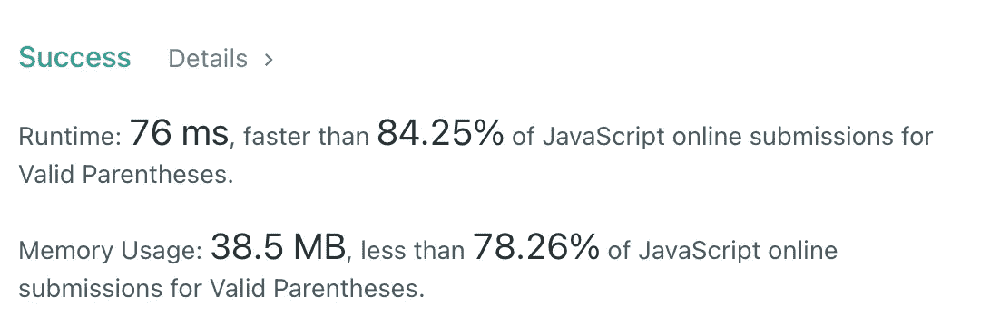

# JavaScript 算法:有效括号(LeetCode)

> 原文：<https://javascript.plainenglish.io/javascript-algorithms-valid-parentheses-leetcode-71c5b2f61077?source=collection_archive---------0----------------------->


Photo by [Iva Rajović](https://unsplash.com/@eklektikum?utm_source=medium&utm_medium=referral) on [Unsplash](https://unsplash.com?utm_source=medium&utm_medium=referral)

# 描述

给定一个仅包含字符`'('`、`')'`、`'{'`、`'['`和`']'`的字符串`s`，确定输入的字符串是否有效。

在以下情况下，输入字符串有效:

1.  左括号必须用相同类型的括号括起来。
2.  左括号必须以正确的顺序结束。

**例 1:**

```
**Input:** s = "()"
**Output:** true
```

**例 2:**

```
**Input:** s = "()[]{}"
**Output:** true
```

**例 3:**

```
**Input:** s = "(]"
**Output:** false
```

**例 4:**

```
**Input:** s = "([)]"
**Output:** false
```

**例 5:**

```
**Input:** s = "{[]}"
**Output:** true
```

**约束:**

*   `1 <= s.length <= 104`
*   `s`仅由括号组成`'()[]{}'`。

# 解决办法

这里最好的数据结构是`stack`。因为我们需要检查这些括号的正确顺序。例如，如果我们有`{][}`，括号的数量是正确的，但是顺序是错误的。

所以。算法非常简单——仔细检查这些括号，如果我们看到一个开始字符，我们需要把它推到`stack`，如果没有(结束)——我们需要检查`stack`的顶部是否是一个相应的开始字符。

让我们看看下面的例子`{[()]}`

让我们想想如何优化这个解决方案。


Photo by [Jason Strull](https://unsplash.com/@jasonstrull?utm_source=medium&utm_medium=referral) on [Unsplash](https://unsplash.com?utm_source=medium&utm_medium=referral)

我们可以创建一个带有开始字符的`Set`和带有结束字符的`Map`来开始键-值对。现在，我们很容易理解它是否是开放的。如果没有，我们可以很容易地判断出`stack`是否有相应的带有开始字符的顶部。

看起来更好，但我们仍然可以改进它。

我们可以按结束字符，而不是按开始字符。当我们看到一些结束字符时，我们可以将其与`stack`的顶部匹配。因此我们可以减少我们的代码库(只使用`Map`)。

下面我们来看同一个例子`{[()]}`

让我们实现这种方法:

我们可以检查`s.length`是否均匀。如果不是，我们可以返回 false。

现在，我认为它是最优的。因此，时间复杂度是`O(n)`，空间复杂度也是`O(n)`，因为在最坏的情况下，如果我们得到一个只有开始字符`(({[([{{[(`的序列，我们会把它们都推到`stack`。



我希望，它对你有用。感谢阅读！期待您的反馈。回头见，✌️

喜欢这篇文章吗？如果有，通过 [**订阅获取更多类似内容解码，我们的 YouTube 频道**](https://www.youtube.com/channel/UCtipWUghju290NWcn8jhyAw?sub_confirmation=true) **！**