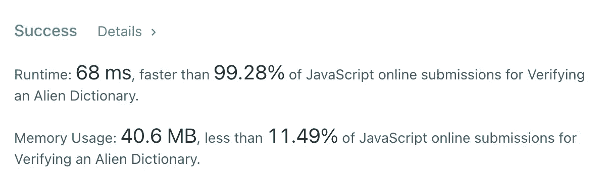

# JavaScript 算法:验证外来字典(LeetCode)

> 原文：<https://javascript.plainenglish.io/javascript-algorithms-verifying-an-alien-dictionary-leetcode-4769a7605a2a?source=collection_archive---------6----------------------->


Photo by [Pisit Heng](https://unsplash.com/@pisitheng?utm_source=medium&utm_medium=referral) on [Unsplash](https://unsplash.com?utm_source=medium&utm_medium=referral)

# 描述

在外星语言中，令人惊讶的是他们也使用英文小写字母，但可能是不同的`order`。字母表中的`order`是一些小写字母的排列。

给定一个用外星语言写的`words`序列和字母表的`order`，当且仅当给定的`words`按外星语言的字典顺序排序时，返回`true`。

**例 1:**

```
**Input:** words = ["hello","leetcode"], order = "hlabcdefgijkmnopqrstuvwxyz"
**Output:** true
**Explanation:** As 'h' comes before 'l' in this language, then the sequence is sorted.
```

**例 2:**

```
**Input:** words = ["word","world","row"], order = "worldabcefghijkmnpqstuvxyz"
**Output:** false
**Explanation:** As 'd' comes after 'l' in this language, then words[0] > words[1], hence the sequence is unsorted.
```

**例 3:**

```
**Input:** words = ["apple","app"], order = "abcdefghijklmnopqrstuvwxyz"
**Output:** false
**Explanation:** The first three characters "app" match, and the second string is shorter (in size.) According to lexicographical rules "apple" > "app", because 'l' > '∅', where '∅' is defined as the blank character which is less than any other character ([More info](https://en.wikipedia.org/wiki/Lexicographical_order)).
```

**约束:**

*   `1 <= words.length <= 100`
*   `1 <= words[i].length <= 20`
*   `order.length == 26`
*   `words[i]`和`order`中的所有字符都是英文小写字母。

# 解决办法

首先，我们来搞清楚字典序是什么— [wiki](https://en.wikipedia.org/wiki/Lexicographic_order) 。为了解决这个问题，我们真正需要知道的是字典顺序:

*   如果两个单词有相同的第一个字母，我们比较第二个。如果第二个字母相同，我们就比较第三个，以此类推。最后，如果第一个不同的字母在对应的字母之前，则一个单词在另一个单词之前。
*   如果两个单词在较短的单词长度上完全相同，则较短的单词先出现。

换句话说——JavaScript . info:

1.  比较两个字符串的第一个字符。
2.  如果第一个字符串的第一个字符大于(或小于)另一个字符串的第一个字符，则第一个字符串大于(或小于)第二个字符串。我们完了。
3.  否则，如果两个字符串的第一个字符相同，以同样的方式比较第二个字符。
4.  重复直到任一字符串结束。
5.  如果两个字符串以相同的长度结束，那么它们相等。否则，字符串越长越大。

在 JavaScript 中比较两个字母意味着比较它们在 [Unicode](https://en.wikipedia.org/wiki/Unicode) (16 位 Unicode 转换格式)中的代码。因此，使用 Unicode 我们知道`a`有`feff0061`的字符代码，`b`有`feff0062`的字符代码，以此类推。

```
'a'.charCodeAt().toString(16) -> 61
'b'.charCodeAt().toString(16) -> 62
...
'z'.charCodeAt().toString(16) -> 7a
```

在这个问题中，我们有一个新的字母表`order`,我们需要找出如何有效地比较两个字母。在这种情况下，最好的数据结构是 HashMap。键将是一个字母，值将是索引，因为我们需要比较两个字母，较大的字母将具有较高的索引。

所以，在我们理解了所有这些之后，我们可以切换到一个算法。我们可以遍历所有单词，并在每次迭代中逐个字母地比较两个单词(`current`和`next`)。比较算法非常简单:

*   如果`current[i] === next[i]`我们需要更进一步。
*   如果`map[current[i]] < map[next[i]]`我们需要返回`false`，因为我们不再需要比较其他字符。
*   如果下一个单词对存在，我们需要转到它。

让我们看一下实现:



时间复杂度为`O(mn)`，其中`m`为字数，`n`为这些字的平均长度。根据约束条件，我们可以说时间复杂度是线性的，因为我们在一个单词中最多可以有 20 个字符。空间复杂度是恒定的，因为我们在`order`中最多有 26 个字母。

我希望，它对你有用。感谢阅读！期待您的反馈。回头见，✌️