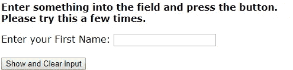
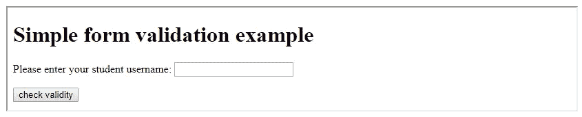
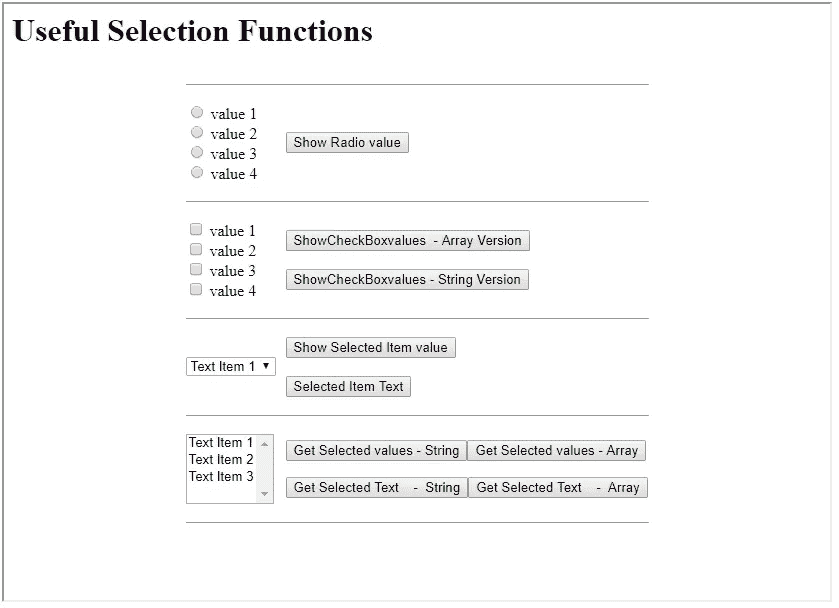

# JavaScript 及其形式

> 原文：<https://javascript.plainenglish.io/javascript-and-its-forms-32a419304b9c?source=collection_archive---------1----------------------->


Photo by [Safar Safarov](https://unsplash.com/@codestorm?utm_source=medium&utm_medium=referral) on [Unsplash](https://unsplash.com?utm_source=medium&utm_medium=referral)

# 获取和设置输入文本字段值

一个检查学生用户名长度的功能

```
<html>
  <head>
    <script>
    function checkUserName( form ) {
       if ( form.reg.value.length != 8 ) {
          alert( "You have not entered an eight character string" );
          return false;
       } else {
          alert( "This is correct" );
          return true;
       }
    }
    </script>
  </head>
  <body>
   <p> Please enter your student username: <input type="text" name="reg" />
   <input type="button" onclick="checkUserName(form);" value="check validity"/> 
  </body>
</html>
```

这个表单包含一个输入文本字段和一个输入按钮。该表单旨在演示如何获取和设置文本字段中的文本。输入按钮的 HTML 包含一个事件处理程序属性。按下按钮调用一个功能，该功能:

*   检索文本字段中的值
*   在警告对话框中显示文本
*   通过将文本字段的值设置为空字符串来清除文本字段:“”



获取和设置输入文本字段中的文本是通过使用输入字段的 value 属性完成的。例如，如果有一个名为 **test** 的表单和一个名为 **firstName** 的输入字段，那么可以像这样访问字段中的文本:

> ***结果= document . test . first name . value***

类似地，文本可以这样放置在字段中:

> ***document . test . first name . value = " Hello World！"***

在设计用来对窗体执行某种操作的函数中很少看到这种窗体。大多数情况下，对表单对象、输入对象或文本值的引用是从调用它的事件处理程序传递给函数的。这就是本例中发生的情况。输入按钮标签中的`onClick=""`处理程序调用一个函数:

> ***onClick = " showAndClearField(this . form)"***

关键字`this`指的是输入标签。为了方便起见，每个输入对象都有一个名为 form 的属性，该属性引用它所在的表单。因此`this.form`持有对表单对象的引用，这就是传递给函数的内容。

向该函数传递对表单的引用。由于函数的参数列表包含一个名为 frm 的变量，对表单的引用将被复制到 frm 中。现在可以使用以下方式读取文本字段中的数据:

> ***frm . first name . value***

可以通过以下方式将文本字段设置为字符串:

> ***frm . first name . value = " Hello World "***

这是完整的 HTML 页面。页面上最相关的部分以绿色突出显示，并在下面详细描述。


**函数 showAndClearField(frm)** 该函数在表单中的按钮被按下时被调用。 **frm** 参数应该接收对表单的引用。在这种情况下，引用等同于 **document.test** ，这是引用表单的另一种方式——作为文档对象的属性。该函数旨在报告文本字段中的内容，然后清除它。

**if(frm . first name . value = = " ")
这一行检查文本输入字段是否被留空。**

**frm.firstName** 是指表单中名为 **firstName** 的输入文本字段。

**frm.firstName.value** 引用字段中的值。

**alert("该字段包含文本:"+ frm.firstName.value)** 此处 **frm.firstName.value** 还检索已经输入到名字输入字段中的值。在这种情况下，它被连接到另一个字符串，并显示在一个警告对话框中。

**frm . first name . value = " "** 在这个短函数快结束时，通过将其值设置为空字符串来清除该字段。

**<form name = " test ">** 因为这个例子从不使用 **document.test** 来访问表单，所以实际上没有必要命名表单。但是，这样做是很好的做法。

**<input type = " text " name = " first name ">** 为了引用输入文本字段，创建它的 HTML 标签必须有一个 name 属性。

**<input type = " button " Value = " Show and Clear input " onClick = " showAndClearField(this . form)">** 按钮标签包含 **onClick=""** 事件处理程序。因此，每当按钮被按下(或“点击”)时，引号内的 Javascript 就会被执行。在这种情况下，调用名为 **showAndClearField** 的函数，并向其传递参数 **this.form** 。每当你在 HTML 标签的事件处理程序中看到单词 **this** 时，单词 **this** 指的是 Javascript 对象，它反映(或表示)由标签创建的 HTML 对象。在这个 cae 中，**这个**是指按钮。每个 form 元素也有一个引用它所在表单的属性。所以 **this.form** 是对按钮所在的表单对象的引用。因此，我们将表单的引用传递给函数。



# 功能和表单—单选按钮

# 从单选按钮数组中获取当前选中的单选按钮值。

向`getRadioValue`传递对单选按钮数组的引用，并返回选中的单选按钮的值或返回空字符串。只有在创建单选按钮的 HTML 标记中为每个单选按钮定义了一个值时，这才有用。

## 例子

```
<input type="radio" name="r" value="y">
<input type="radio" name="r" value="z">function getRadioValue( radioArray ) {
   var i;
   for ( i = 0; i < radioArray.length; i++ ) {
      if ( radioArray[ i ].checked ) { 
         return radioArray[ i ].value;
      }
   }
   return "";
}
```

# 函数和表单—复选框

# 获取包含检查值的数组

向`getCheckValuesA`传递对复选框数组的引用。由于没有复选框，一个复选框，或几个复选框可能被选中，这个函数返回一个数组的复选框的值。如果没有选中，数组的长度为零。只有在创建复选框按钮的 HTML 标记中为每个复选框定义了一个值时，这才有用。

## 例子

```
<input type="checkbox" name="c" value="y">
<input type="checkbox" name="c" value="z">function getCheckValuesA( checkBoxArray ) {
   var values = [];
   for ( i = 0; i < checkBoxArray.length; i++ ) {
      if ( checkBoxArray[ i ].checked ) {
          values[ values.length ] = checkBoxArray[ i ].value;
      }
   }
   return values;
}
```

# 获取带有检查值的字符串

向`getCheckValuesS`传递对复选框数组的引用。由于没有复选框、一个复选框或几个复选框可能被选中，因此该函数返回由 separator 参数中传递的值分隔的复选框的值的字符串。如果没有选中，字符串将为空。只有在创建复选框按钮的 html 标记中为每个复选框定义了一个值时，这才有用。

## 例子

```
function getCheckValuesS( checkBoxArray, separator ) {
   var tempString = "";
   var count = 0;
   for ( i = 0; i < checkBoxArray.length; i++ ) {
      if (checkBoxArray[ i ].checked) {
         if ( count > 0 ) { 
            tempString += separator;   //don't put the separator 
                                       //before the first value
         }
         tempString += checkBoxArray[ i ].value;
         count++;
      }
   }
   return tempString;
}
```

# 函数和表单—选择

# 获取选定的值

`getSelectedValue`返回单项选择列表中当前选中选项的值。为此，必须设置选项项目的值。例如，该函数将在此处返回“x”或“y ”:

```
<select name="s">
  <option value="x">the variable x</option>
  <option value="y">the variable y</option>
<select>
```

## 例子

```
function getSelectedValue( selectList ) {
  return selectList[ selectList.selectedIndex ].value;
}
```

# 获取选定的文本

`getSelectedText`返回单项选择列表中当前选中选项的文本。在下面的示例中，将返回“变量 x”或“变量 y”。

```
<select name="s">
  <option value="x">the variable x</option>
  <option value="y">the variable y</option>
<select>
```

## 例子

```
function getSelectedText( selectList ) {
   return selectList.options[ selectList.selectedIndex ].text;
}
```

# 函数和表单—选择多个

# 获取选定值的数组

函数`getMSelectValuesA( selectList )`接收对多选列表的引用，并返回列表中选定值的数组。在下面的 HTML 选择列表中，根据所选择的选项，该函数将返回一个空数组(如果没有选择任何项目)或值“x”和/或“y”。注意:要实现这一点，必须使用 option 标记的 VALUE 属性。

```
<select name="s" multiple>
  <option value="x">the variable x</option>
  <option value="y">the variable y</option>
<select>
```

## 例子

```
function getMSelectValuesA( selectList ) {
   var i;
   var values = [];
   for ( i = 0; i < selectList.length; i++ ) {
      if ( selectList.options[ i ].selected ) {
         values[ values.length ] = selectList.options[ i ].value;
      }
   }
   return values;
}
```

# 获取选定的值

函数`getMSelectValuesS( selectList, separator )`接收对多选列表的引用，并返回列表中所选值的字符串。每个值由 separator 参数中传递的字符或字符串分隔。在下面的 HTML 选择列表中，根据所选的选项，该函数将返回一个空字符串(如果没有选择任何项目)或值“x”和/或“y”。注意:要实现这一点，必须使用 option 标记的 VALUE 属性。

```
<select name="s" multiple>
  <option value="x">the variable x</option>
  <option value="y">the variable y</option>
<select>
```

## 例子

```
function getMSelectValuesS( selectList, separator ) {
   var i;
   var count = 0;
   var tempString = "";

   for ( i = 0; i < selectList.length; i++ ) {
      if ( selectList.options[ i ].selected ) {
         if ( count > 0 ) {
            tempString += separator;
         }
         tempString += selectList.options[i].value;
         count++;
      }
   }
   return tempString;
}
```

# 获取所选文本的数组

函数`getMSelectTextA( selectList )`接收对多选列表的引用，并返回列表中所选文本的数组。在下面的 HTML 选择列表中，根据所选的选项，该函数将返回一个空数组(如果没有选择任何项)或值“变量 x”和/或“变量 y”。注意:要实现这一点，option 标记的 VALUE 属性不是必需的，因为返回的是选项文本。

```
<select name="s" multiple>
  <option value="x">the variable x</option>
  <option value="y">the variable y</option>
<select>
```

## 例子

```
function getMSelectTextA( selectList ) {
   var i;
   var values = [];
   for ( i = 0; i < selectList.length; i++ ) {
      if ( selectList.options[ i ].selected ) {
         values[ values.length ] = selectList.options[ i ].text;
      }
   }
   return values;
}
```

# 获取所选文本的字符串

函数`getMSelectTextS(selectList, separator)`接收对多选列表的引用，并返回列表中所选文本的字符串。每个值由 separator 参数中传递的字符或字符串分隔。在下面的 HTML 选择列表中，根据所选的选项，该函数将返回一个空字符串(如果没有选择任何项目)或值“变量 x”和/或“变量 y”。注意:要实现这一点，option 标记的 VALUE 属性不是必需的，因为返回的是选项文本。

```
<select name="s" multiple>
  <option value="x">the variable x</option>
  <option value="y">the variable y</option>
<select>
```

## 例子

```
function getMSelectTextS( selectList, separator ) {
   var i;
   var count = 0;
   var tempString = "";
   for ( i = 0; i < selectList.length; i++ ) {
      if ( selectList.options[ i ].selected ) {
         if ( count > 0 ) {
            tempString += separator;
         }
         tempString += selectList.options[ i ].text;
         count++;
      }
   }
   return tempString;
}
```