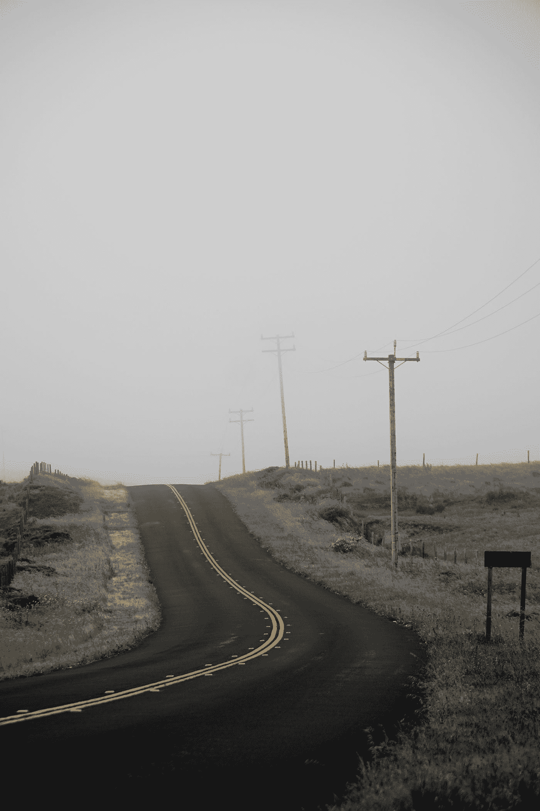

# JavaScript 和网络——画布

> 原文：<https://javascript.plainenglish.io/javascript-and-the-web-canvas-edd17906df75?source=collection_archive---------6----------------------->


Photo by [Denise Chan](https://unsplash.com/@denmychan?utm_source=medium&utm_medium=referral) on [Unsplash](https://unsplash.com?utm_source=medium&utm_medium=referral)

JavaScript 是世界上最流行的编程语言之一。为了有效地使用它，我们必须了解它的基本知识。

在这篇文章中，我们将看看如何在画布上画东西。

# 在画布上绘画

在画布上画画，我们有两个选择。首先，我们可以使用可缩放矢量图形或 SVG，或者我们可以使用画布。

画布是封装图片的单个 DOM 元素。

SVG 是静态矢量图形，我们可以直接将它包含在 HTML 文档或`img`标签中。

# 挽救（saving 的简写）

SVG 可以包含在`svg` 标签中，如下所示:

```
<svg >
  <circle r="50" cx="50" cy="50" fill="green" />
</svg>
```

我们用`circle`标签画了一个圆`cx`和`cy`是圆心的 x 和 y 坐标。

`r`是半径。`fill`是圆的填充颜色。

DOM 元素是在我们添加标签时创建的，所以我们可以动态地改变形状属性。

例如，我们可以写:

```
const circle = document.querySelector("circle");
circle.setAttribute("fill", "orange");
```

将圆的填充颜色自动更改为橙色。

# 画布元素

我们可以使用 canvas 元素来绘制更复杂或更动态的东西。

它的工作原理是使用 canvas 标签，然后我们从中获取上下文，这是一个我们可以在上面绘图的对象。

上下文可以是二维图形的`'2d'`或三维图形的`'webgl'`。

例如，我们可以写:

```
<canvas width="120" height="60"></canvas>
```

并且:

```
const canvas = document.querySelector("canvas");
const context = canvas.getContext("2d");
context.fillStyle = "green";
context.fillRect(10, 10, 100, 50);
```

在画布上画一个矩形。

10，10 是左上角的 x 和 y 坐标，100 表示 100 像素宽，50 表示 50 像素高。

`fillStyle`有我们矩形的填充颜色。

# 线条和表面

我们可以用`strokeRect`方法画一个没有填充的矩形。

例如，我们可以写:

```
const cx = document.querySelector("canvas").getContext("2d");
cx.strokeStyle = "green";
cx.strokeRect(5, 5, 50, 50);
```

然后我们有一个绿色边框的矩形，左上角坐标为(5，5)，宽度和高度都是 50px。

# 小路

路径是一系列的线。

要画线，我们可以用`moveTo`移动到我们想要的坐标。

然后我们使用`lineTo`绘制从当前坐标到我们传入`lineTo`的坐标的直线。

例如，我们可以写:

```
const cx = document.querySelector("canvas").getContext("2d");
cx.beginPath();
for (let x = 10; x < 100; x += 10) {
  cx.moveTo(x, 10);
  cx.lineTo(x, 80);
}
cx.stroke();
```

画一串竖线。

第一个从(10，10)开始，到(10，80)结束。

第二个从(20，10)开始，到(20，80)结束，依此类推。

可以将路径绘制成形状并进行填充。

例如，我们可以写:

```
const cx = document.querySelector("canvas").getContext("2d");
cx.beginPath();
cx.moveTo(50, 10);
cx.lineTo(10, 200);
cx.lineTo(100, 70);
cx.fill();
```

我们用`moveTo`移动到(50，10)。

然后我们画一条线到(10，200)，然后我们画一条线从(10，200)到(100，70)。

然后我们调用`fill`来填充行。

然后我们得到一个填充了黑色的三角形。

# 曲线

我们可以用`quadraticCurveTo`来画一条曲线。

线的曲率由控制点和目标点给出。

例如，我们可以写:

```
const cx = document.querySelector("canvas").getContext("2d");
cx.beginPath();
cx.moveTo(10, 120);
cx.quadraticCurveTo(100, 10, 120, 120);
cx.lineTo(100, 10);
cx.closePath();
cx.stroke();
```

我们使用`quadraricCurveTo`从(10，120)开始画一条线。

然后我们用控制点(100，10)和终点(120，120)画一条曲线。

然后我们从(120，120)到(100，10)画一条线。

同样，我们可以画一条有两个控制点而不是一个控制点的贝塞尔曲线。

例如，我们可以写:

```
const cx = document.querySelector("canvas").getContext("2d");
cx.beginPath();
cx.bezierCurveTo(10, 10, 200, 10, 50, 90);
cx.stroke();
```

那么 2 个控制点分别是(10，10)和(200，10)。我们的线在(50，90)处结束。

要画圆弧，有`arc`的方法。

例如，我们可以写:

```
const cx = document.querySelector("canvas").getContext("2d");
cx.beginPath();
cx.arc(100, 100, 40, 0, Math.PI * 0.5);
cx.stroke();
```

画一条四分之一圆的曲线。

中心是(100，100)。半径为 40°，起始角度为 0°，终止角度为`Math.PI*0.5`。



Photo by [Casey Horner](https://unsplash.com/@mischievous_penguins?utm_source=medium&utm_medium=referral) on [Unsplash](https://unsplash.com?utm_source=medium&utm_medium=referral)

# 结论

我们可以用画布元素绘制直线、矩形和曲线。

要添加静态矢量图形，我们可以使用 SVG。

## **用简单英语写的 JavaScript**

你知道我们有四份出版物和一个 YouTube 频道吗？在 [**plainenglish.io**](https://plainenglish.io/) 和 [**找到它们订阅我们的 YouTube 频道**](https://www.youtube.com/channel/UCtipWUghju290NWcn8jhyAw) **！**