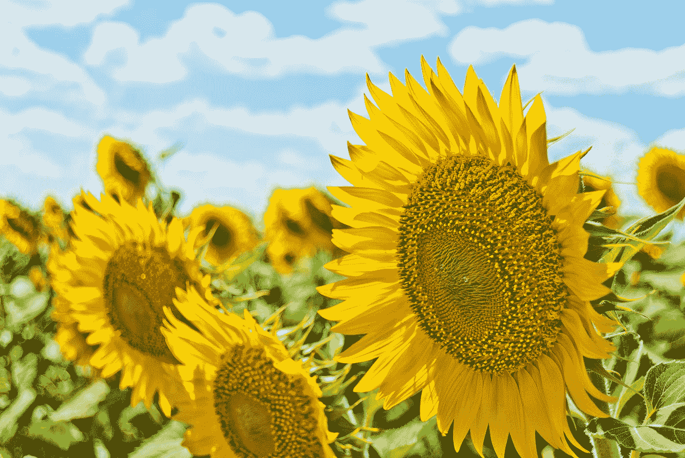

# JavaScript 和网络——画布文本、图像和转换

> 原文：<https://javascript.plainenglish.io/javascript-and-the-web-canvas-text-and-images-ebcace677e08?source=collection_archive---------8----------------------->


Photo by [Markus Winkler](https://unsplash.com/@markuswinkler?utm_source=medium&utm_medium=referral) on [Unsplash](https://unsplash.com?utm_source=medium&utm_medium=referral)

JavaScript 是世界上最流行的编程语言之一。为了有效地使用它，我们必须了解它的基本知识。

在本文中，我们将看看如何在画布上绘制文本和图像。

此外，我们看看如何缩放和转换画布形状。

# 文本

我们可以在画布上绘制文本。

为此，我们可以调用`fillText`方法。

例如，我们可以写:

```
const cx = document.querySelector("canvas").getContext("2d");
cx.font = "20px arial";
cx.fillStyle = "green";
cx.fillText("hello world", 10, 50);
```

使用给定的字符串以及 x 和 y 坐标绘制文本以开始绘制。

字体样式为`'20px arial'`，`fillStyle`为文本颜色，为绿色。

我们也可以将字体设置为斜体或粗体。

同样，我们可以通过将`textAlign`属性设置为`'end'`或`'center'`来改变水平位置，通过将`textBaseline`设置为`'top'`、`'middle'`或`'bottom'`来改变垂直位置。

# 形象

`drawImage`方法让我们在画布上绘制像素数据。

数据可以来自一个`img`元素或另一个画布。

例如，我们可以通过书写在画布上绘制图像:

```
const cx = document.querySelector("canvas").getContext("2d");
const img = document.createElement("img");
img.src = "https://images.unsplash.com/photo-1520763185298-1b434c919102?ixlib=rb-1.2.1&ixid=eyJhcHBfaWQiOjEyMDd9&auto=format&fit=crop&w=889&q=80";img.addEventListener("load", () => {
  cx.drawImage(img, 10, 10, 500, 500);
});
```

我们创建一个 img 元素，然后在图像加载完成时调用它的`drawImage`。

# 转换

我们可以通过调用各种方法来转换对象。

要缩放对象，我们可以使用`cale`方法。

它有两个参数，一个用于水平刻度，一个用于垂直刻度。

例如，我们可以写:

```
const cx = document.querySelector("canvas").getContext("2d");
cx.scale(3, .5);
cx.beginPath();
cx.arc(50, 50, 40, 0, 2 * Math.PI);
cx.lineWidth = 3;
cx.stroke();
```

然后我们得到一个被平方成椭圆形的圆。

要移动一个形状，我们可以使用`translate`方法。

它把 x 和 y 坐标带到我们想要移动形状的地方。

例如，我们可以写:

```
const cx = document.querySelector("canvas").getContext("2d");
cx.translate(80, 80);
cx.beginPath();
cx.arc(50, 50, 40, 0, 2 * Math.PI);
cx.lineWidth = 3;
cx.stroke();
```

当我们调用`translate`时，我们分别根据第一个和第二个参数将画布移动 x 和 y 的量。

然后我们会看到一个向右移动了 80px，向下移动了 80px 的圆。



Photo by [Aleksandr Eremin](https://unsplash.com/@notevilbird?utm_source=medium&utm_medium=referral) on [Unsplash](https://unsplash.com?utm_source=medium&utm_medium=referral)

# 结论

我们可以通过平移或缩放来移动和缩放画布形状。

此外，我们可以轻松地在画布上添加文本和图像。

## 简单英语的 JavaScript

你知道我们有四份出版物和一个 YouTube 频道吗？在[**plain English . io**](https://plainenglish.io/)和 [**找到它们订阅我们的 YouTube 频道**](https://www.youtube.com/channel/UCtipWUghju290NWcn8jhyAw) **！**