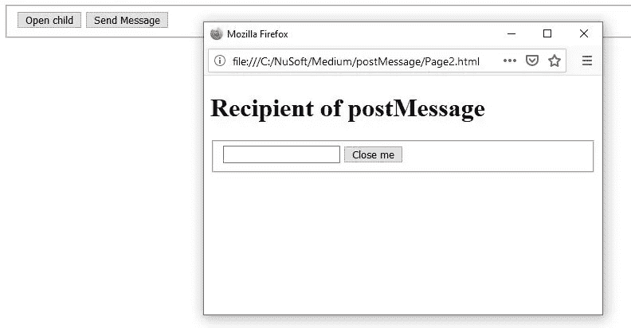
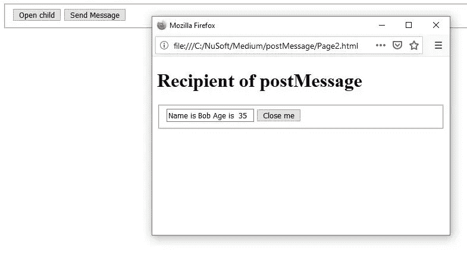

# 使用 JavaScript 和 window.postMessage()

> 原文：<https://javascript.plainenglish.io/javascript-and-window-postmessage-a60c8f6adea9?source=collection_archive---------0----------------------->

## 安全跨域通信


Photo by Kate Macate on [Unsplash](https://unsplash.com/)

# 介绍

C 跨域通信(也称为跨来源)可能会很困难，并带来安全风险。但是，HTML5 [有一个很有用却经常被忽略的特性，window.postMessage()，](https://developer.mozilla.org/en-US/docs/Web/API/Window/postMessage)如果使用正确是安全的。

如 [MDN](https://developer.mozilla.org/en-US/docs/Web/API/Window/postMessage) 上所述，

> `**window.postMessage()**`方法安全地启用了`[Window](https://developer.mozilla.org/en-US/docs/Web/API/Window)`对象之间的跨原点通信；*例如，*在页面和它产生的弹出窗口之间，或者在页面和嵌入其中的 iframe 之间。

> 在本文中，我们将关注窗口之间的通信**，而不是窗口和 iframe。**

*顺便说一下，MDN 上的语句说弹出窗口，我们会用到，但是收件人窗口* ***并不一定是*** *弹出的。*

# **语法**

## 两个必需的组件及其语法

两个**所需的**部件是，

1.  window.postMessage() —发送消息
2.  window.addEventListener(" *消息*"，*回调* ) —接收并处理消息

postMessage()方法的语法是，

```
*targetWindow*.postMessage(*message*, *targetOrigin*, [*transfer*]);
```

还有一个可选的第三个参数[transfer]，我们不会用到。您可能想了解更多关于 MDN 的信息。

*   **targetWindow** 是你要发送消息的窗口的句柄。
*   **消息**可以是相当多的复杂对象。但是，函数不能作为消息的一部分发送，因为消息数据是使用[结构化克隆算法](https://developer.mozilla.org/en-US/docs/DOM/The_structured_clone_algorithm)序列化的。结构化克隆算法不允许使用函数。然而，这确实意味着您可以安全地传递各种各样的数据对象。
*   **targetOrigin** 是*非常重要的一块*。是收件人页面的 URI **。在发送时(postMessage)，如果 targetOrigin 与 targetWindow 页面的主机名不匹配，则发送失败。
    *可以使用“*”作为 targetorigin，但只是为了简单的测试才这样做(就像我们在这里做的一样。)***

为了进一步强调这一点，在生产中，在接收端，您将需要根据 targetOrigin 验证接收者域。如果它们不匹配，请不要接受该邮件。

**小心**:如果“*”被用作 targetOrigin，信息可能来自任何人。

> 请记住，我们通常是**从一个域发送到另一个域**，所以 targetOrigin 必须与 targetWindow 侦听器的域匹配。

**换句话说**，我们可能想要从[https://abcd.com](https://firstdomain.com)向[https://defg.com 发送一个信息。](https://seconddomain.com.)所以 targetOrigin 将是[https://defg.com。](https://def.com.)并且受体的域也将是[https://defg.com](https://defg.com)。

# 例子

我们将创建两个名为 Page1.html 和 Page2.html 的网页。Page2.html 将是一个弹出窗口，它不一定是，这只是我的选择。

Page1.html 将向 Page2.html 传递一个信息。

## **页面**

创建以下文件

**Page1.html(注意发送消息功能)**

```
<!DOCTYPE html>
<html>
<head>
    <title></title>
 <meta charset="utf-8" />
<script>var childwin;
const childname = "popup";
function openChild() {childwin = window.open('Page2.html', childname, 'height=300px, width=500px');

}
function sendMessage(){
    let msg={pName : "Bob", pAge: "35"};
    // In production, DO NOT use '*', use toe target domain
    childwin.postMessage(msg,'*')// childwin is the targetWindow
    childwin.focus();
}</script>
</head>
<body>
    <form>
        <fieldset>
            <input type='button' id='btnopen' value='Open child' onclick='openChild();' />
            <input type='button' id='btnSendMsg' value='Send Message' onclick='sendMessage();' />
        </fieldset>
    </form>
</body>
</html>
```

**Page2.html(注意 addEventListener 中的回调函数)**

```
<!DOCTYPE html>
<html>
<head>
    <title></title>
    <meta charset="utf-8" />
    <script>// Allow window to listen for a postMessage
    window.addEventListener("message", (event)=>{// Normally you would check event.origin
        // To verify the targetOrigin matches
        // this window's domain
        let txt=document.querySelector('#txtMsg');
        // event.data contains the message sent
        txt.value=`Name is ${event.data.pName} Age is  ${event.data.pAge}` ;

    });function closeMe() {
        try {window.close();
        } catch (e) { console.log(e) }
        try {self.close();
        } catch (e) { console.log(e) }}
    </script>
</head>
<body>
    <form>
        <h1>Recipient of postMessage</h1>
            <fieldset>
                <input type='text' id='txtMsg' />
                <input type='button' id='btnCloseMe' value='Close me' onclick='closeMe();' />
            </fieldset>

    </form>
</body>
</html>
```

## 试运转

打开 Page1.html，然后单击“打开孩子”按钮。这将打开弹出窗口。



Popup-targetWindow

单击“发送消息”按钮。该消息由弹出窗口接收。



Result of childwin.postMessage()

# 发生什么事了？

当点击“发送消息”时，一个对象将被发送到收件人页面，并引用在窗口期间创建的窗口 childwin。

**childwind.postMessage(msg，“*”)**

*再次声明，除检测外，请勿使用“*”。*

> targetOrigin 应该是收件人页面所在的域。

收件人窗口的事件侦听器在名为“事件”的参数中接收消息。

回调函数，在我们的例子中是 Arrow 函数，处理消息。

*   该消息包含在**事件. data** 中。
*   targetOrigin 包含在**事件中。origin** 。

# 结论

window.postMessage()是一种在不同域或不同来源的窗口之间发送消息的安全方法。人们也可以发布到 IFrame。

正在发送的数据使用[结构化克隆算法](https://developer.mozilla.org/en-US/docs/DOM/The_structured_clone_algorithm)进行序列化，并将接受几乎任何类型的简单或复杂数据。

还有一个 postMessage()可以在浏览器上下文相同时使用。这涉及到一个渠道。

channel.postMessage()将在另一篇文章中介绍。

**感谢您的阅读和快乐编码！**

在 Medium 上阅读所有你想要的文章，并通过成为 Medium 会员来帮助我继续写作，每月只需 5 美元。

[](https://bobtomlin-70659.medium.com/membership) [## 通过我的推荐链接加入灵媒——重力井(罗伯·汤姆林)

### 作为一个媒体会员，你的会员费的一部分会给你阅读的作家，你可以完全接触到每一个故事…

bobtomlin-70659.medium.com](https://bobtomlin-70659.medium.com/membership) 

你也可以享受，

[](https://medium.com/javascript-in-plain-english/using-javascript-and-the-broadcast-channel-api-a3134739781d) [## 使用 JavaScript 和广播频道 API

### 对于选项卡之间的浏览器上下文通信

medium.com](https://medium.com/javascript-in-plain-english/using-javascript-and-the-broadcast-channel-api-a3134739781d) [](https://medium.com/javascript-in-plain-english/introduction-to-javascripts-geolocation-api-b01ca61e47f8) [## JavaScript 地理定位 API 简介

### JavaScript 的地理定位 API 是什么以及如何使用它

medium.com](https://medium.com/javascript-in-plain-english/introduction-to-javascripts-geolocation-api-b01ca61e47f8) [](https://medium.com/javascript-in-plain-english/closing-a-window-with-javascript-beeec56344bb) [## 用 JavaScript 关闭窗口

### 简而言之，什么可行，什么不可行

medium.com](https://medium.com/javascript-in-plain-english/closing-a-window-with-javascript-beeec56344bb)