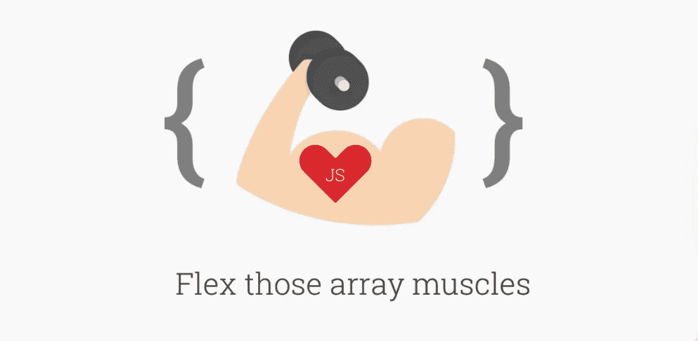

# 用于代码挑战的 JavaScript 数组方法

> 原文：<https://javascript.plainenglish.io/javascript-array-methods-for-code-challenges-96a55dddadc6?source=collection_archive---------3----------------------->



在您遇到的大量代码挑战中，您会发现许多挑战会要求您遍历和/或操作数组。数组是我最喜欢的 JavaScript 数据结构，因为它们有时简单，有时有点复杂。前一分钟你认为你实现了正确的方法，得到了解决方案。下一分钟你意识到你完全错了，它没有返回你期望的结果。让我想起了我最后约会的人。

说真的，这个博客可以帮助你了解各种数组方法，这些方法对任何代码挑战都是有益的。请注意，这不是所有数组方法的列表，而是您将使用的最常用的方法的列表。

重要的事情先来。数组是值的有序集合。这些值可以是字符串、数字、布尔值，甚至其他数组(这将导致嵌套数组)。数组被索引；索引规定了顺序，从 0 开始。数组带有内置方法，允许您修改它们并访问其值。

若要访问数组中的特定元素，请使用括号符号及其索引值。

```
let shoppingList = ["celery", "limes", "lemons", "grenadine", "oranges"]shoppingList[0] // returns celery
```

*   Array.length →返回数组中元素的个数

```
let shoppingList = ["celery", "limes", "lemons", "grenadine", "oranges"]shoppingList.length // returns 5
```

*   Array.push() →将元素添加到数组末尾

```
let shoppingList = ["celery", "limes", "lemons", "grenadine", "oranges"]shoppingList.push("salt")//shoppingList is now ["celery", "limes", "lemons", "grenadine", "oranges", "salt"]
```

*   Array.pop() →删除数组中的最后一个元素并返回该元素。

```
let shoppingList = ["celery", "limes", "lemons", "grenadine", "oranges"]shoppingList.pop()//returns oranges
//shoppingList is now ["celery", "limes", "lemons", "grenadine"]
```

*   Array.unshift() →在数组的开头添加一个新元素

```
let shoppingList = ["celery", "limes", "lemons", "grenadine", "oranges"]shoppingList.unshift("salt")//shoppingList is now ["salt", "celery", "limes", "lemons", "grenadine"]
```

*   Array.shift() →删除数组中的第一个元素，并返回该元素。

```
let shoppingList = ["celery", "limes", "lemons", "grenadine", "oranges"]shoppingList.shift()//returns celery 
//shoppingList is now ["limes", "lemons", "grenadine"]
```

*   Array.forEach() →对数组中的每个元素调用一次函数。

```
let shoppingList = ["celery", "limes", "lemons", "grenadine", "oranges"]shoppingList.forEach(item => console.log(`Need ${item}`))// returns Need celery
Need limes
Need lemons
Need grenadine
Need oranges
```

*   Array.map() →通过为数组中的每个元素调用一次给定函数来转换原始数组中的元素。

```
let shoppingList = ["celery", "limes", "lemons", "grenadine", "oranges"]shoppingList.map(item => item.toUpperCase()))// returns [ 'CELERY', 'LIMES', 'LEMONS', 'GRENADINE', 'ORANGES' ]
```

*   Array.filter() →创建一个新数组，只包含通过给定函数测试的元素。

```
let shoppingList = ["celery", "limes", "lemons", "grenadine", "oranges"]shoppingList.filter(item => item.startsWith("l"))//returns [ 'limes', 'lemons' ]
```

*   Array.find() →返回数组中通过函数测试的第一个元素。

```
let shoppingList = ["celery", "limes", "lemons", "grenadine", "oranges"]shoppingList.find(item => item.startsWith("l"))returns limes
```

*   Array.reduce() →对数组的每个值执行给定的函数，并返回单个值。

```
let costs = [2.00, 3.00, 4.00, 13.00]costs.reduce((total, cost) => total + cost)//returns 22
```

*   Array.includes() →确定数组是否有特定元素。

```
let shoppingList = ["celery", "limes", "lemons", "grenadine", "oranges"]shoppingList.includes("limes")
//returns trueshoppingList.includes("salt")
// returns false
```

*   Array.indexOf() →在数组中搜索特定元素并返回其第一个索引

```
let shoppingList = ["celery", "limes", "lemons", "grenadine", "oranges"]shoppingList.indexOf("lemons")
//returns 2shoppingList.indexOf("salt")
//returns -1 when element is not found
```

*   Array.findIndex() →返回数组中通过给定函数测试的第一个元素的索引。

```
let shoppingList = ["celery", "limes", "lemons", "grenadine", "oranges"]shoppingList.findIndex(item => item.startsWith("g"))
//returns 3
//returns -1 when element is not found
```

*   Array.every() →检查数组中的所有元素是否都通过了函数测试

```
let shoppingList = ["celery", "limes", "lemons", "grenadine", "oranges"]shoppingList.every(item => item.length > 1)
//return true if there is 1 element that returns a *false* value*,* the function returns false and does not check the rest of the elements
```

*   Array.concat() →合并两个或多个数组，并返回一个新数组。

```
let shoppingList = ["celery", "limes", "lemons", "grenadine", "oranges"]let anotherList = ["salt", "mint leaves", "olives"]shoppingList.concat(anotherList)
//return [ 'celery','limes','lemons','grenadine','oranges','salt', 'mint leaves','olives' ]
```

*   Array.slice() →选择数组的一部分，返回一个新数组。选择从提供的*开始*参数开始，到*结束的元素，但不包括提供的*结束*参数*。

```
let shoppingList = ["celery", "limes", "lemons", "grenadine", "oranges"]shoppingList.slice(1,3)
//returns [ 'limes', 'lemons' ]
```

*   Array.splice() →添加/移除数组中的元素并返回移除的元素。第一个参数接受一个整数，该整数指定在哪个索引处添加/移除元素。第二个参数接受要移除的项目数。可选的第三个参数接受要添加到数组中的新元素。

```
let shoppingList = ["celery", "limes", "lemons", "grenadine", "oranges"]shoppingList.splice(2, 2)
//returns [ 'lemons', 'grenadine' ]shoppingList.splice(2, 2, "cherries")
console.log(shoppingList)
//returns [ 'celery', 'limes', 'cherries', 'oranges' ]
```

*   Array.sort() →对数组中的项目进行排序。排序顺序可以是字母或数字，也可以是升序或降序。默认情况下，sort()将值作为字符串按字母和升序排序。可以接受一个比较函数，它指示你是想按升序还是降序排序。

```
let shoppingList = ["celery", "limes", "lemons", "grenadine", "oranges"]shoppingList.sort()
//returns [ 'celery', 'grenadine', 'lemons', 'limes', 'oranges' ]let costs = [3.00, 2.00, 13.00, 4.00]costs.sort((a,b) =>  b - a))
//want to sort by descending order
//returns [ 13, 4, 3, 2 ]costs.sort((a,b) =>  a- b))
//want to sort by ascending order
//returns [ 2, 3, 4, 13 ]
```

*   Array.reverse() →反转数组中元素的顺序。

```
let shoppingList = ["celery", "limes", "lemons", "grenadine", "oranges"]shoppingList.reverse()
// returns [ 'oranges', 'grenadine', 'lemons', 'limes', 'celery' ]
```

*   Array.toString() →将数组转换为字符串。

```
let shoppingList = ["celery", "limes", "lemons", "grenadine", "oranges"]shoppingList.toString()
//returns celery,limes,lemons,grenadine,oranges
```

*   Array.join() →将数组的元素转换为字符串。可以接受一个可选参数“separator”，它指示元素将如何分隔。默认分隔符是逗号。

```
let shoppingList = ["celery", "limes", "lemons", "grenadine", "oranges"]shoppingList.join("! and ")
//returns celery! and limes! and lemons! and grenadine! and oranges
```

*   Array.isArray(obj) →检查对象是否为数组。对象需要作为参数传递。

```
let shoppingList = ["celery", "limes", "lemons", "grenadine", "oranges"]Array.isArray(shoppingList)
//returns true
```

*   最后，ES6 的一个特性:spread 操作符。由这三个点“…”表示的扩展操作符扩展了数组的内容，并将其从数组结构中取出。

```
let shoppingList = ["celery", "limes", "lemons", "grenadine", "oranges"]console.log(...shoppingList)
//returns celery limes lemons grenadine oranges
```

希望这对你有用，复习这些数组方法将有助于你下一次挑战✌️.