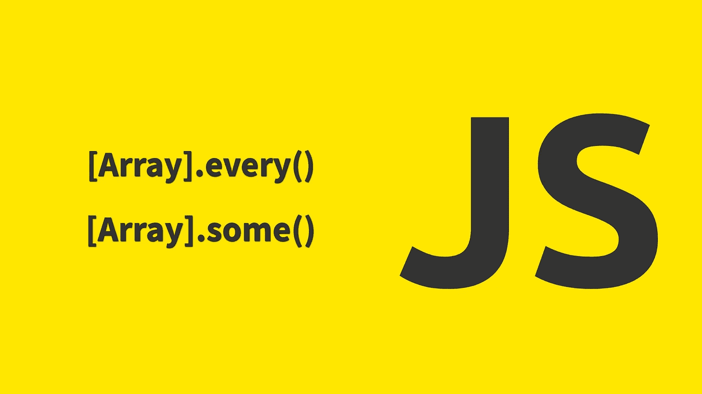

# JavaScript Array.some()和 every()

> 原文：<https://javascript.plainenglish.io/javascript-array-some-and-every-2975e0cc12f0?source=collection_archive---------9----------------------->



最近我遇到了两种数组原型的方法，我想和大家分享一下。

## **Array.some()**

这可以用来测试数组是否至少有一个我们正在寻找的类型的元素。假设我们有一个整数数组，如果你想知道它是否有负数，你可以用 some()方法。

```
const array = [10, 0, 2, -11, 5, 6];const isNegative = (number) => number < 0;if(array.some(isNegative)) {
    // do something
}
```

当回调返回 true 时，`some()`方法停止执行，在上面的例子中，当它到达-11 时，它找到了它要找的东西，并停止检查数组的剩余元素。

## **Array.every()**

这与某些方法正好相反。Every()方法测试数组中的每个元素是否都是我们要测试的类型。类似于上面的例子，如果你想知道数组是否只有正数，你可以使用 every()方法。

```
const array = [10, 0, 2, -11, 5, 6];const isPositive = (number) => number >= 0;if(array.every(isPositive)) {
    // do something
} else {
   // do something else
}
```

当回调返回 false 时，`every()`方法将停止执行，在上面的例子中，当达到-11 时，它发现所有的都不是正的，并且它执行 else 情况下的所有内容。

我们可以编写自己的方法来做一些或每个人做的事情，但为什么要重新发明轮子。