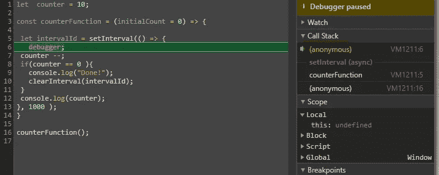
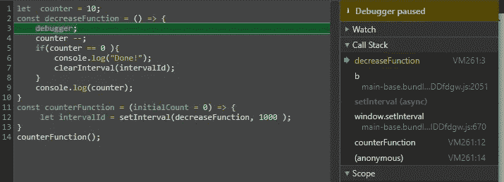

# JavaScript 箭头函数:如何使用名称推断来调试它们

> 原文：<https://javascript.plainenglish.io/javascript-arrow-functions-how-to-debug-them-with-name-inference-ac0d7cd5c43b?source=collection_archive---------0----------------------->

## 简短、有用的 JavaScript 课程——让它变得简单。


箭头函数是**匿名的**，也就是说没有命名。如果您想调试，这个**是个问题，因为您将无法跟踪函数的名称。在调试会话期间，匿名函数被标记为匿名，这个 no 提供了关于正在执行的代码的线索。**

在这里，如您所见，箭头函数名是空的

```
( param  => param * 2  ).name;
// ""
```

相反，在常规函数中，我们可以有函数的名称

```
(function multiply(param){ return param *2 }).name
//"multiply"
```

为了解决这个问题，你可以使用 ES2015-ES6 中引入的一个特性，即**函数名推断。**

这个背后的思想是 JavaScript 可以从它的语法位置确定箭头函数名:例如，从保存函数对象的变量名。

```
const multiply = param => param * 2;multiply.name; // => 'multiply'
//"multiply"
```

在这里，我们可以看到一个稍微复杂一点的例子，它是一个执行匿名函数的代码的调试会话。

```
let  counter = 10;const counterFunction = (initialCount = 0) => {let intervalId = setInterval(*() => {
   debugger;
   counter --;
   if(counter == 0 ){
      console.log("Done!");
      clearInterval(intervalId);
   }
   console.log(counter);
  }*, 1000 );
}counterFunction();
```

如下图所示，调用堆栈由一个标记为匿名的函数组成。从这样的调用栈信息中得不到任何有用的东西。



Anonymous inner arrow function

现在让我们用使用名称推理的**代码检查一个调试会话:**

```
let  counter = 10;const **decreaseFunction** = () => {
    debugger;
    counter --;
    if(counter == 0 ){
        console.log("Done!");
        clearInterval(intervalId);
    }
    console.log(counter);
}decreaseFunction.name;
//"decreaseFunction"const counterFunction = (initialCount = 0) => {
     let intervalId = setInterval(**decreaseFunction**, 1000 );
}counterFunction();
```

这里，调用堆栈给出了关于正在执行的代码的更多信息:



Anonymous inner arrow function assigned to a variable

总之，如果您想调试代码，使用函数名推断来命名箭头函数是一个很好的实践。

## 如果这对你有帮助，请点击下面的拍手按钮。谢谢！！