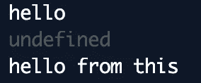
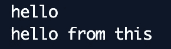
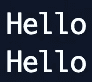
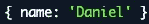

# JavaScript:箭头函数与函数

> 原文：<https://javascript.plainenglish.io/javascript-arrow-functions-vs-functions-3f6ce860f8b5?source=collection_archive---------2----------------------->

## 他们真的一样吗？

嘿大家好！

我经常听说“箭头函数和 *JavaScript* 中的函数是相同的，只是语法不同”。为了澄清这一点，我将参考一些它们行为不同的用例，包括一些为什么和注释。

Photo by [Hello I’m Nik 🇬🇧](https://unsplash.com/@helloimnik?utm_source=medium&utm_medium=referral) on [Unsplash](https://unsplash.com?utm_source=medium&utm_medium=referral)

# 这和争论

## 这

让我们看看下面这个匿名函数的例子，它是由 *setTimeout* 在 1000 毫秒后调用的。在其中，我们记录了 hello 变量值和分配给这个的 hello 属性。

A function using *this*

预计输出将是`hello`和`hello from this`。但是结果却是这样的:

Function using this output

发生这种情况是因为*这个*的值是根据运行时调用该函数的方式来确定的。因此，匿名函数正在使用由 *setTimeout* 提供的 *this* ，而不是其作用域内的函数。

**注意:**为了避免这个问题，人们经常使用 *self/that* 模式来保证他们可以访问自己的作用域 *this* ，而不是调用者提供的作用域。

Self pattern

Self pattern output

现在看同一个例子，但是用一个箭头函数重写了。

An arrow function using this

让我们看看输出。

Arrow function using this output

输出正是我们对第一个函数示例的预期。发生这种情况是因为**箭头函数没有自己的*和*自变量**** *而取而代之的是利用作用域进行一切操作。*

## *争论*

*A function logging its arguments returning an anonymous function that also logs its arguments*

*这里我们定义了一个记录其 *arguments* 对象内容的函数，并返回一个匿名函数来做同样的事情。*

**

*The output of the values of the argument for each function*

*输出正是我们所期望的。这是因为分配给 *arguments* 对象的值与每个函数相关，所以每个新函数都有其 *arguments* 对象。*

*看一个类似的例子，但是使用了箭头函数。*

*A function logging its arguments returning an arrow function that also logs its arguments*

*现在我们有了同样的例子，但是它没有返回一个匿名函数，而是返回一个箭头函数。*

**

*The output of the values of the argument for each function*

*如上所述，arrow 函数没有自己的 *this* 和 *arguments* 。这里发生的事情是，arrow 函数中使用的 *arguments* 对象是来自其作用域的对象，在本例中，它是来自返回它的函数的对象。*

***注** : *ES6* 为我们介绍了*的其余参数*。使用 *rest 参数*优于使用 *arguments* 对象，因为每个函数和 arrow 函数都有自己的一个。*

*Using rest parameters*

**

*The output of using rest parameters for each function*

# *使用绑定、调用和应用*

*使用函数和箭头函数的另一个不同之处是*绑定*、*调用、*和*应用*函数。这是因为前面提到的*这个*的行为。既然 arrow 函数没有自己的 *this，*那么试图用这些函数绑定或传递它就无关紧要了。*

*Using apply with a function*

**

*The output of using apply with a function*

*这个例子如预期的那样工作。使用*调用*函数时传递的对象被绑定到*这个*函数。*

*Using apply with an arrow function*

**

*The output of using apply with an arrow function*

*正如你所看到的，分配给 *this* 的 hello 属性的输出是 *undefined* ，因为尽管在使用 *call* 时试图分配它，但 arrow 函数没有为这个绑定工作的*this*——同样，由于全局 *this* 没有 hello 属性，它将记录 *undefined* 。*

## *箭头函数不能充当构造函数*

*如果我们想要创建对象，我们会使用构造函数。*

*Constructor Function*

*正如你在上面看到的，为了实例化一个对象，我们使用了 *new* 关键字来调用这个函数作为构造函数。对于箭头函数，这不起作用，因为箭头函数不能作为构造函数调用。*

*An attempt of calling an arrow function as a constructor*

**

*The output of the failed attempt*

***注意**:在 *ES6* 之后，我们可以留下构造函数，使用一个*类*。*

*Using a class*

***注 2** :由于 arrow 函数不能作为构造函数调用，试图在其中使用 *new.target* 会抛出错误。*

**

*The output of the attempt of using new.target inside an arrow function*

# *箭头函数没有原型*

*尽管函数有*原型*属性，但箭头函数没有。*

*Using prototypes with a function and an arrow function*

**

*The output of each prototype*

# *箭头函数不能是生成器*

*箭头函数不支持在其体内使用 *yield* ，除非在嵌套函数内。此外，还没有合适的*语法*和生成器箭头函数的实现。*

*Generator*

*An attempt of Generator with Arrow Function*

**

*The output of the attempt*

# *要小心*

## *对象文字*

*使用箭头函数返回对象文字必须用括号括起来，以保证它的键不被视为标签。*

*The name is being treated as a label*

**

*The output of the return of the arrow function*

*Since we wrapped with parentheses, now the key is treated as it should*

**

*The output of wrapping the object literal with parentheses*

# *结论*

*即使看起来一样，箭头函数的行为也不像常规函数。它们对*这个*和*参数*没有绑定，没有*原型、*，不能作为生成器或构造器使用。*

*尽管如此，arrow 函数允许编写更短的函数，减少函数的大小和“噪音”。我们所要做的就是小心整篇文章中提到的一些细微差别。*

*我希望你喜欢并关注未来的帖子。*