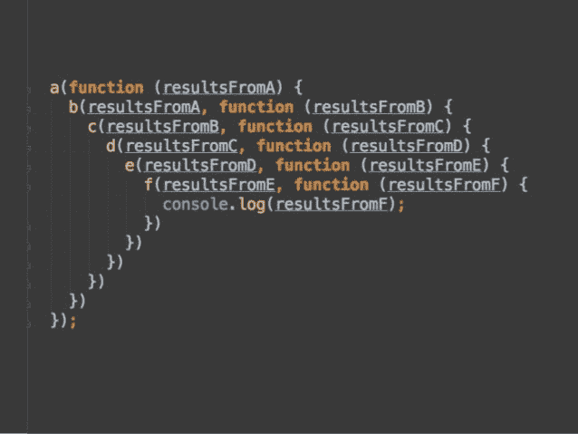
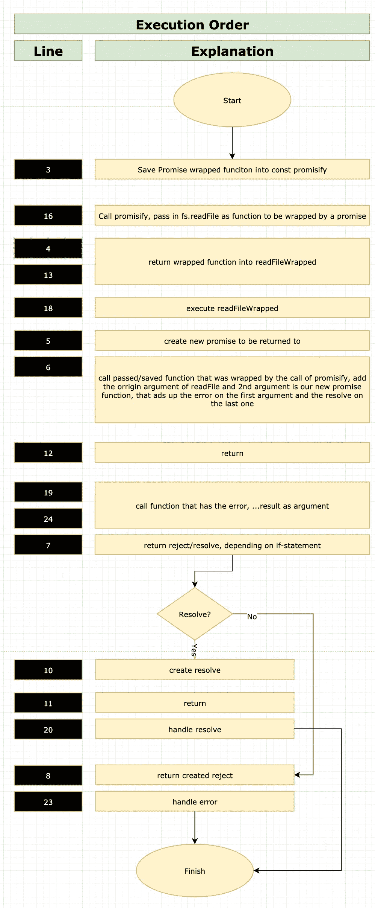

# JavaScript Async Await:承诺未来不再回调！

> 原文：<https://javascript.plainenglish.io/javascript-async-await-promisify-the-future-to-callback-never-again-6762707e18e5?source=collection_archive---------12----------------------->

## 对承诺的回调直到异步等待

[Kyle Broad](https://unsplash.com/@kylebroad), by [unsplash](https://unsplash.com/photos/P9rQn2qcEV0)

# 介绍

有 C#背景？那么您应该熟悉 async-await。JavaScript 在 2017 年将这些关键词引入语言。它们有助于解决异步代码的问题。

到目前为止，异步代码以使用回调而闻名，它们大多是嵌套的，导致代码难以理解。这里有一张[回调地狱](http://callbackhell.com/)或者也称为[末日金字塔](https://levelup.gitconnected.com/escape-the-pyramid-of-doom-c58edd326225)【2】【1】的图片。

author: [summary so far](https://www.summarysofar.com/2019/11/24/mdn-make-me-understand) (All rights reserved)

解决这个问题有很多选择，但没有一个是大的，成为一个可行的方法。他们都提出了自己的问题。无论是承诺还是生成器函数，甚至是 Async 之类的模块。JS [3]。

# 昨天的代码

尽管 async 和 await 是一个重大的变化，但是我们不应该抛弃旧的概念。Async await 在内部基于生成器函数和承诺。承诺依赖于什么？对！复试。新的抽象层次带来了封装旧概念的更好方法，但也带来了同样的问题。[软件公司的乔尔](https://www.joelonsoftware.com/2002/11/11/the-law-of-leaky-abstractions/)在这种情况下做得很好。

具体来说: *Async-Await* 只能用于已经依赖于承诺的函数。如果你有没有的方法，你必须转换它们以便使用 *async-await* 。这样做的一个好方法是使用一种叫做包装的技术。将现有的基于回调的函数包装到另一个使用承诺的函数中。这里有一个使用 *readFile* 的例子来说明我的意思。

包装函数清晰可见，调用 promise 构造函数。主体公开了基于回调机制的源函数。

现在想象你一整天都在为不同的项目做这件事。这是一个可怕的任务，只会给你带来痛苦和折磨。好在还有希望。如果您在节点中工作。基于 JS 的环境，你可以加快这一点。有一个准则，回调是函数的最后一个参数。返回错误通常是这个函数的第一个参数。当您的代码符合这些准则时，您可以只使用 Node 的效用函数。JS [*许诺*](https://nodejs.org/dist/latest-v8.x/docs/api/util.html)【5】。

我们可以从这里的差价操作中获得巨大的利润。

这个片段相当令人困惑。不要着急，仔细查看这个抽象的图表，看看各行的执行顺序和旁边的解释:

“Promisify the future”-explained, Author: Arnold Abraham

# 现在

带有 8.0 版本节点。JS 引入了一个内置的[实用程序](https://nodejs.org/dist/latest-v8.x/docs/api/util.htm) [5]让你更容易地使用 promisify，并使它能够使用*异步等待*关键字。你可以得到丰富的源代码，易于理解，非常紧凑。

看看这段代码，读起来像同步代码吗？是的，肯定会，但它不会同步执行。在*等待*之后的函数被分解成一个协同例程。从技术上讲，这是一个生成器函数，在等待期间，异步代码可以继续运行。

为了使用 *await* ，函数本身必须用关键字 *async* 标记。调用函数 *processFile* 也可以等待，只要调用方法也是异步标记的。只要调用方的调用方是异步方法，也可以等待调用方。

记得我提到末日金字塔的那部分。也可以在这里建立。新技术，老问题。此外，即使嵌套的 if 语句也可以被构造成厄运金字塔。

# 第一批订单等待？

末日金字塔问题带来了一些问题。这个链条的第一条是什么？难道不应该是程序的主函数或者 JavaScript 的入口函数也应该是异步的吗？技术上是的，但它是同步的。还做什么？

急救可以是自调用异步函数:

只是提一下，在这个[*stack overflow-answer*](https://stackoverflow.com/questions/46515764/how-can-i-use-async-await-at-the-top-level)中列出了在你的入口点内部调用一个 async 的不同方法。[6]

Async 也可用于 lambdas，当然，正如您在示例中看到的 try-catch(*03 _ async await . js*)。这是纯承诺或回调做不到的。try-catch 会在语法上中断同步程序的执行。
由于与同步程序相似，同步程序的控制结构很容易包含。特别是对于循环， *async-await* 被证明是非常有用的。它让您的代码的读者理解循环，而没有异步思维，尽管它是。

你曾经尝试过用纯回调或者基于承诺的代码来做一个循环吗？那么你知道我在说什么。

# 结论

当你想侮辱的时候，深入挖掘，你会有所发现。这里你可能会说 *async-await* 并没有解决开发的根本问题。JavaScript 并没有获得更多的技能，它以前和最后，也没有新的技术问题用这两个关键字解决。你是对的，但是对于可读性和理解以及编写代码所消耗的时间来说， *async-await* 弥补了巨大的差异。

在编码时解决更简单的生活，更快的可理解性，可维护性，更少的易错性，我会说， *async-await* 已经使它的定位更加清晰，并给 JavaScript 带来了很多。

为你自己节省大量的时间，专注于重要的主题。

# 继续读

 [## JavaScript 打破承诺&保持回调

### JavaScript 中的回调:异步与同步

pjdarnold.medium.com](https://pjdarnold.medium.com/javascript-break-promises-keep-callbacks-4dbf9cff3d9a)  [## JavaScript ES6 模块导入导出

### ES6 模块导入导出业务用 JavaScript 和 JS 遗留代码

medium.com](https://medium.com/javascript-in-plain-english/javascript-es6-modules-import-export-129a90e83ad6)  [## Enums TypeScript 4.0 和 JavaScript 指南—您需要知道的一切

### 你将读到的关于 enums 的最后一个指南！

medium.com](https://medium.com/next-level-source-code/enums-typescript-4-0-and-javascript-guide-all-you-need-to-know-5e090355bff6) 

# 链接和参考

[1] **末日金字塔**
[https://level up . git connected . com/escape-the-Pyramid-of-Doom-c 58 edd 326225](https://levelup.gitconnected.com/escape-the-pyramid-of-doom-c58edd326225)

[2] **回调地狱** [http://callbackhell.com/](http://callbackhell.com/)

[3]**async . js** [https://caolan.github.io/async/v3/](https://caolan.github.io/async/v3/)

[4] **乔尔关于软件** [https://www . joelonsoftware . com/2002/11/11/the-law-of-leaky-abstracts/](https://www.joelonsoftware.com/2002/11/11/the-law-of-leaky-abstractions/)

**节点[5]。Js 官方 API-Doc util。许诺** [https://nodejs.org/dist/latest-v8.x/docs/api/util.html](https://nodejs.org/dist/latest-v8.x/docs/api/util.html)

[6] **来自 main** [的异步入口 https://stack overflow . com/questions/46515764/how-can-I-use-Async-await-at-the-top-level](https://stackoverflow.com/questions/46515764/how-can-i-use-async-await-at-the-top-level)