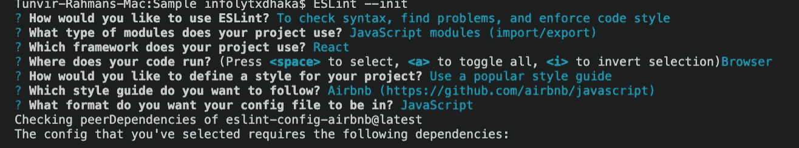
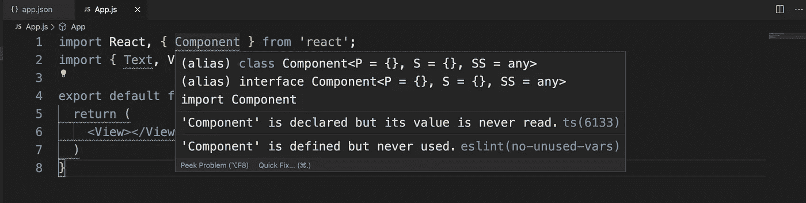
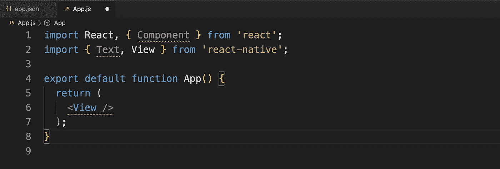
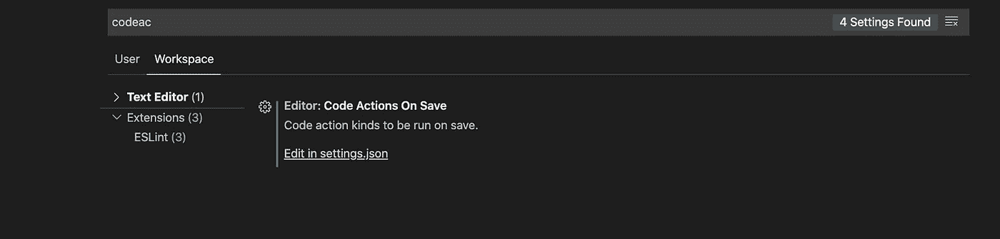

# VSCode 中的 JavaScript 自动林挺

> 原文：<https://javascript.plainenglish.io/javascript-auto-linting-in-vscode-98fad4c60faf?source=collection_archive---------7----------------------->

## 开发的同时去掉难看的 JS 代码！


Photo by [Caspar Camille Rubin](https://unsplash.com/@casparrubin?utm_source=unsplash&utm_medium=referral&utm_content=creditCopyText) on [Unsplash](https://unsplash.com/s/photos/javascript?utm_source=unsplash&utm_medium=referral&utm_content=creditCopyText)

编写代码并关注代码格式是一项巨大的工作。

这将有助于 JavaScript 开发人员在开发软件时将注意力集中在写作和思考逻辑上，而不是样式上。

**注意:建议在你的 VSCode 上安装** [**eslint**](https://github.com/Microsoft/vscode-eslint) **。**

# 设置

```
$ npm install -g eslint
# Or for yarn users
$ yarn global add eslint
```

现在创建你的**。eslintrc** 文件

```
ESLint --init
```



Tell them why you need lint?

现在，这将在您的项目中创建类似这样的内容

Sample [.eslintrc.js](https://gist.github.com/TunvirRahman/6a4055f2b513250209b4bc843c516775)

添加不需要 lint 检查的文件夹或文件。创建名为的文件。根中的**eslintinignore**。

```
// .**eslintignore**node_modules/
**/node_modules/
.webpack/
.vscode/settings.json
coverage/
```

# 手动林挺



Linting in Action in my App.js File

现在点击 **cmd+shift+P** 它将打开这个


Hit Fix all Auto-Fixable problem

现在我的文件看起来像这样。好多了。



my App.js File

# 林挺汽车

现在我想在我点击 **CTRL + S** 时完成这个操作

```
$ mkdir .vscode
$ touch .vscode/settings.json
# Or for windows users
$ new-item .vscode/settings.json
```

在 setting.json 中粘贴以下内容

```
{
  "editor.codeActionsOnSave": {
    "source.fixAll.eslint": true
  },
  "eslint.validate": ["javascript"]
}
```



**File > Preferences > Settings > Workplace** then `**Code Actions On Save**`

现在，ESLint 已经准备好行动了。只需编写和保存代码。林挺马上就好了。

# 感谢阅读。🍻