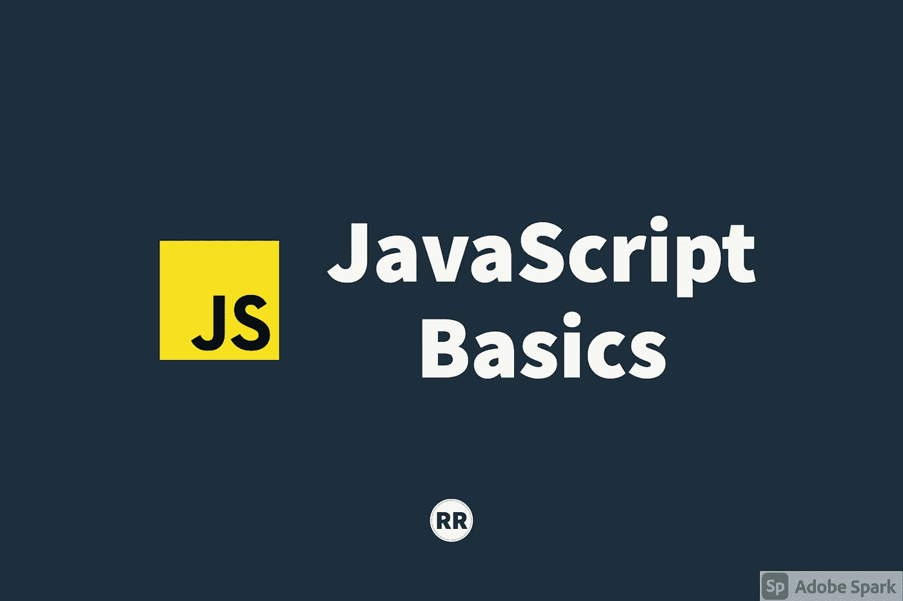

# JavaScript 基础:执行上下文

> 原文：<https://javascript.plainenglish.io/javascript-basics-execution-context-bd79ede1ccdd?source=collection_archive---------20----------------------->

## 运行 JavaScript 代码



在这篇文章中，我们将讨论编译和执行 JavaScript 代码时会发生什么。

每当在 JavaScript 中执行代码时，它都在所谓的`execution context`中运行。`execution context`被定义为 Javascript 执行的上下文或环境。可以把它想象成一个帮助管理正在运行的代码的包装器。

# 全局执行上下文

基地`execution context`被称为`global execution context`。它总是在 JavaScript 代码最初执行时创建。把`global`想象成任何不在函数内部的代码。在 JavaScript 文件中的任何地方都可以访问`global`级别中的所有代码。

`global execution content`创造了两件事:

1.  全局对象
2.  变量，`this`

当一个 JavaScript 文件被创建并运行时，一个`execution context`将被创建，即使该文件没有代码。对于浏览器，“全局对象”将被称为`window`对象。特殊变量`this`也将指向`window`对象。对于`Node.js`，该“全局对象”将被称为`global`对象。

在 JavaScript 中，当在全局级别创建一个函数时，它会被附加到全局对象上。举个例子，

```
function sample(){ console.log('sample')}window.sample() // logs out "sample"
```

# 执行上下文:创建和执行

当 JavaScript 代码运行时，变量和函数在某种程度上是可用的，即使它们是在代码的后面编写的。这个概念背后的推理发生在`execution context`正在被创建的过程中，这发生在两个阶段。

## 创造

在`creation`阶段，我们有`global object`和`this`，它们是在内存中设置的。当解析器运行代码并翻译编写的代码时，它通过关键字`var`、`let`、`const`和`function`识别变量和函数是在哪里创建的。

变量和函数的存储空间在`creation`阶段设置。这就是所谓的`hoisting`。在开始逐行执行代码之前，JavaScript 引擎已经为变量和函数留出了内存空间。整个函数都放在内存中。然而，对于变量，JavaScript 引擎直到执行时才知道它的值是多少。取而代之的是，分配一个占位符值`undefined`。

`undefined`是 JavaScript 中的一个特殊值/关键字，表示变量尚未设置。它是变量在`creation`阶段得到的值。如果变量由定义，

```
let sample;
```

默认情况下，`sample`的值为`undefined`，即使在`creation`阶段之后也是如此，因为它从未被赋值。

## 执行

`execution`阶段拥有`creation`阶段的所有可用内容。这个阶段逐行运行编写的代码，并调用它运行的任何函数。

顺便提一下，JavaScript 是`single threaded`，这意味着它按照出现的顺序一次运行一行代码。

# 函数调用和执行堆栈

到目前为止，我们知道每当运行一个 JavaScript 文件时，都会创建一个`global execution context`，它在创建阶段为函数和变量提供`this`变量、全局对象(`window`)和内存空间。

在`execution`阶段，当它到达一行调用`function`的代码时会发生什么？让我们检查以下内容:

```
let global = 'variable';function sample(){ let a = 1;
   other();}function other(){ let b = 'hey';
}sample();
```

当一个函数被调用时，一个新的`execution context`被创建并被放置在所谓的`execution stack`上。可以把`execution stack`看作是跟踪正在运行的代码的东西。`execution stack`遵循**后进先出(LIFO)** 原则。让我们使用上面的示例代码来可视化这种方法:

```
//EXECUTION STACKother() Execution Context
sample() Execution Context
Global Execution Context // initial code run
```

第一个进入堆栈的是`global execution context`，它包含变量`global`和函数`sample`和`other`。一旦进入堆栈，它就逐行运行代码。当它到达调用`sample()`的行时，另一个`execution context`被创建，它包含变量`a`。

对于要从堆栈中移除的`global execution context`，它必须完成所有代码行的执行，现在包括`sample()`。因此，从`sample()`创建的`execution context`被添加到仍然包含`global`的现有堆栈中。

我们现在在`sample()`的上下文中，它在代码块中运行两行代码。但是在它完成之前，它调用另一个函数`other()`，创建另一个`execution context`并将其添加到堆栈中。

`other()`代码块中的一行代码运行并结束。然后它被弹出并从栈顶移除。因为它是最后添加的执行上下文，所以也被删除。然后`sample()`结束，并且`execution context`从堆栈中移除。最后，`global execution context`也被移除。一旦`execution stack`被清空，代码就完成了运行。

让我们看看同一个例子，但有一些变化:

```
let global = 'variable';function sample(){
   let a = 1;
}function other(){
   let b = 'hey';
}sample();
other();
```

当代码一行一行地运行**时，你认为`execution stack`会是什么样子？**

# 功能、上下文和可变环境

每一次函数调用都会导致一个`execution context`的创建，在那个环境中定义了它自己的一组变量和函数。这些变量和函数不能在上下文之外访问。让我们探索一下变量在内存中的位置以及它们之间的关系。假设我们有以下代码:

```
function b(){
   let myVar;
   console.log(myVar); // undefined
}function a(){
   let myVar = 2;
   console.log(myVar); // 2
   b();   
}let myVar = 30;
console.log(myVar); // 30a();
console.log(myVar); //30
```

我们在不同的行中定义了变量`myVar`。每个`myVar`的值是多少？让我们想象一下代码运行时`execution stack`的样子。

```
// EXECUTION STACKb() Execution Context // myVar = undefineda() Execution Context // myVar = 2Global Execution Context // myVar = 30
```

在最初的代码执行中，我们总是有`global execution context`，在那个上下文中，我们有一个`myVar`被声明并赋给 30。因此，上下文中的`console.log(myVar)`将输出 30。

当我们调用函数`a()`时，我们创建了一个`execution context`，它自己的`myVar`在上下文中声明并被赋值为 2。当那个`console.log(myVar)`运行时，它将打印 2。

当最后一个函数`b()`被调用时，另一个`execution context`将被创建，并且声明的`myVar`没有被赋值，默认情况下该值将被赋值给`undefined`。该上下文中的`console.log(myVar)`将打印出`undefined`。`b()`随后从堆栈中弹出，随后是`a()`。

但是函数`a()`执行完之后的最后一个`console.log(myVar)`会怎么样呢？那个`console.log()`在全局上下文中，它的`myVar`赋值为 30，这将导致打印 30。我们看到的每个变量都是在它自己的`execution context`中定义的。因此，每个上下文都在其范围内寻找变量。

然而，如果我们对代码做了一点小小的改动，就会影响打印出来的内容。如果我们移除`a()`内的`let`，现在将打印 2。但是为什么呢？

## 变量声明

在回答这个问题之前，我们先来快速定义一下`let and const, and var`这样的关键词是做什么的。有了这些关键字，我们就`declaring`了一个新变量，并赋予了一个新值。因此，如果我们删除关键字`let`，我们就不再是内存中的一个新变量，我们只是重新分配一个现有的变量。

有关`let, const, and var`的更深入信息，请参考[https://ui.dev/var-let-const/](https://ui.dev/var-let-const/)

这就引出了另一个问题:JavaScript 如何知道要重新分配哪个`myVar`？

# 范围链

当我们用变量做一些事情时，JavaScript 不仅仅是查看当前`execution context`的变量环境。每个`execution context`都有一个对“外部”环境的引用。

外部环境指的是`lexical environment`。它是你写的代码中的物理位置。从前面的例子来看，

```
function b(){
   let myVar;
   console.log(myVar);
}function a(){
   myVar = 2;
   console.log(myVar);
   b();   
}let myVar = 30;
console.log(myVar);a();
console.log(myVar);
```

`function a(), b(), and let myVar`都位于全球环境的顶端。JavaScript 关心每个`execution context`获得的外部引用的`lexical environment`。

当引用一个变量时，如果在当前的`execution context`中找不到变量，JavaScript 将会查看外部引用。`Scope Chain`是下到`execution stack`直到到达`global execution context`寻找变量的过程。

为了解决前面的问题，当我们在`a()`内部引用`myVar`变量，而 JavaScript 无法在该上下文中找到它时，它会通过外部引用来找到它。在这种情况下，`a()`的外部引用是全局上下文。它找到定义的`myVar`并重新赋值。

让我们再看一个关于`scope chain`的例子。

```
function a(){
    console.log('inside')
    function inner(){
       myVar = 'hello'
    }
    inner()
}let myVar = 'goodbye'
a()
```

在这个例子中，我们有一个函数`a()`，它包含另一个函数`inner()`。当`inner()`在某个点被调用时，它将重新分配`myVar`的值。然而，JavaScript 并不是简单地引用`global execution context`来找到`myVar`变量。它经历了参照外部环境的过程。

在这种情况下，`inner()`的外部参考是`a()`。然而，`a() execution context`不包含对`myVar`变量的引用。JavaScript 继续到`a()`的外部引用，也就是`global execution context`。当确定外部引用时，是在`execution context`中创建函数，即谁创建了函数？

# 结论

我们已经讨论了 JavaScript 代码是如何在内部运行的。很好地理解或接触提到的概念有助于在更深层次上理解其他 JavaScript 概念，如提升、闭包和作用域。

感谢您的阅读和快乐编码！