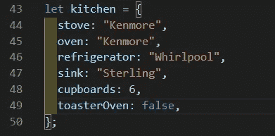

# JavaScript 基础——对象和对象操作

> 原文：<https://javascript.plainenglish.io/javascript-basics-objects-object-manipulation-82fc9d39db06?source=collection_archive---------6----------------------->

你可能在开发人员中或互联网上听说过“面向对象编程”或“OOP”这个术语，这篇文章介绍了对象的概念以及我们如何在代码中使用它们。


# 什么是对象？

简而言之，对象是按键/值对分类的数据集合。为了在本文中保留一个运行示例，让我们把您的厨房看作一个对象。在你的厨房里，你有一个炉子、一个烤箱、一个冰箱、一个水槽和一些橱柜——也许有些厨房有烤面包机烤箱，而有些没有。这些都是我刚才提到的键/值对中的键。这些值可以是代表这些键的任何数据。用 JavaScript 编写，我们的厨房对象可能看起来像这样…



所以我们用花括号定义一个对象，然后用逗号分隔键/值对。

# 对象数据类型

您的值不限于字符串、整数和布尔值。你也可以使用数组，更多的对象，甚至可以使用对象数组。

考虑这样一个事实，一个炉子有燃烧器，可以使用多种加热方法——它开始听起来像一个物体本身，我们肯定可以把一个物体放在一个物体里面，这就是它看起来的样子…

```
let kitchen = {
  stove: {
    brand: "Kenmore",
    burners: 4,
    heatingMethod: "induction",
  },
  oven: "Kenmore",
  refrigerator: "Whirlpool",
  sink: "Sterling",
  cupboards: 6,
};
```

喔，反对意见。我们所要做的就是添加更多的花括号，然后开始写另一个对象，就在我们的厨房对象里面。我们称之为“嵌套对象”,就像俄罗斯娃娃一样思考——一个对象在另一个对象里面。让我们为烤箱添加一些更多的信息，比如它有多少个架子，它的加热方式是什么，下面的抽屉里储存了什么…

```
let kitchen = {
  stove: {
    brand: "Kenmore",
    burners: 4,
    heatingMethod: "induction",
  },
  oven: {
    brand: "Kenmore",
    racks: 2,
    heatingMethod: "electric",
    drawer: ["glass baking dish", "baking tray", "muffin pan"],
  },
  refrigerator: "Whirlpool",
  sink: "Sterling",
  cupboards: 6,
};
```

我们能够通过添加方括号和逗号分隔的字符串来添加数组作为值。我想你现在已经看到一种模式了，但是让我们想想冰箱可能是什么样子。我很明确地没有使用“冰箱”这个术语，因为冰箱(通常)有一个冷藏室和一个冷冻室——冰箱和冰柜。冰箱底部通常有一些抽屉和一些搁板。让我们看看一个冰箱分解成两个物体会是什么样子…

```
let kitchen = {
  stove: {
    brand: "Kenmore",
    burners: 4,
    heatingMethod: "induction",
  },
  oven: {
    brand: "Kenmore",
    racks: 2,
    heatingMethod: "electric",
    drawer: ["glass baking dish", "baking tray", "muffin pan"],
  },
  refrigerator: {
    brand: "Whirlpool",
    fridge: {
      drawers: 2,
      shelves: 3,
      temp: 40,
    },
    freezer: {
      shelves: 1,
      temp: 0,
      iceMaker: false,
    },
  },
  sink: "Sterling",
  cupboards: 6,
};
```

哇，太多了！我们用三把钥匙——冰箱、冰柜和品牌——把冰箱变成了一个物体，也把冰箱和冰柜变成了物体。接下来是水槽，这应该是一个容易更新的。一个水槽有一个水龙头(控制水流)，一个喷口和一个或两个水槽。有些还在排水管中安装了处理装置…

```
let kitchen = {
  stove: {
    brand: "Kenmore",
    burners: 4,
    heatingMethod: "induction",
  },
  oven: {
    brand: "Kenmore",
    racks: 2,
    heatingMethod: "electric",
    drawer: ["glass baking dish", "baking tray", "muffin pan"],
  },
  refrigerator: {
    brand: "Whirlpool",
    fridge: {
      drawers: 2,
      shelves: 3,
      temp: 40,
    },
    freezer: {
      shelves: 1,
      temp: 0,
      iceMaker: false,
    },
  },
  sink: {
    brand: "Sterling",
    faucetType: "mixer",
    spoutType: "hose",
    sinks: 1,
    disposal: false,
  },
  cupboards: 6,
};
```

没有什么特别新的东西，但是和我呆在一起，因为我把最好的留到了最后。对于橱柜，我们将使用一系列物体。这是它的样子…

```
let kitchen = {
  stove: {
    brand: "Kenmore",
    burners: 4,
    heatingMethod: "induction",
  },
  oven: {
    brand: "Kenmore",
    racks: 2,
    heatingMethod: "electric",
    drawer: ["glass baking dish", "baking tray", "muffin pan"],
  },
  refrigerator: {
    brand: "Whirlpool",
    fridge: {
      drawers: 2,
      shelves: 3,
      temp: 40,
    },
    freezer: {
      shelves: 1,
      temp: 0,
      iceMaker: false,
    },
  },
  sink: {
    brand: "Sterling",
    faucetType: "mixer",
    spoutType: "hose",
    sinks: 1,
    disposal: false,
  },
  cupboards: [
    { location: "below sink", contents: [] },
    { location: "above stove", contents: [] },
    { location: "left of stove", contents: [] },
    { location: "right of stove", contents: [] },
    { location: "below counter", contents: [] },
    { location: "above counter", contents: [] },
  ],
};
```

唷，这么多代码！但不要让它压倒你，这只是采取基本原则的对象，并以创造性的方式将它们加在一起。您可能已经注意到，我在每个橱柜的“内容”字段中留下了空数组。部分地，这是为了保持代码更短，但它也为我们以后使用方法提供了一些乐趣。

那么，现在我们已经建立了这个对象，你一定想知道..

# 我如何获取信息？

问得好，访问对象中的信息最简单的方法是通过“点标记法”。厨房是对象，您想要访问关于它的信息。为了简单起见，我们假设您只想在控制台中显示这些信息。假设您的代码包含我们上面构建的对象，您可以键入以下内容来查看整个对象…

```
console.log(kitchen)
```

不令人震惊，是吧？你刚刚得到了你输入的所有东西，但是是在控制台里。假设你现在只对冰箱的信息感兴趣，你可以输入…

```
console.log(kitchen.refrigerator)
```

我们使用句点来访问该对象中的信息层。这是点符号——用一个点来移动你的对象。上面的代码应该为您的厨房控制台记录整个对象。让我们深入了解一下，看看我们能从冰箱里找到什么…

```
console.log(kitchen.refrigerator.fridge)
```

现在我们只得到包含抽屉、架子和温度的对象。如果我们只想知道厨房冰箱里有几个抽屉呢？你猜对了，我们再加一个句号…

```
console.log(kitchen.refrigerator.fridge.drawers)
```

现在，如果您使用上面的对象示例，您应该在控制台中得到数字 2。很简单，对吧？只是为了确认一下，让我们看看当我们试着看看烤箱下面的抽屉里有什么时会发生什么…

```
console.log(kitchen.oven.drawer)
```

我们得到了一个字符串数组，现在我们得到了一个数组，我们肯定可以像访问数组一样访问它，使用方括号来确定我们想要看到数组的哪个索引…

```
console.log(kitchen.oven.drawer[1])
```

现在我们可以打开抽屉里的烤盘了。很漂亮吧？

此时你可以开始写函数到`push()`到`kitchen.cupboards[2].contents`，或者说是`kitchen.sink.brand = "Whirlpool"`，这绝对没问题，但是有一个更好的方法…

# 对象方法

在本文开头，当我告诉您一个对象可以采用什么数据类型时，我漏掉了一项——一个对象也可以包含函数，我们称之为方法。这些方法特定于创建它们的对象，清理了全局范围。下面我们来添加一个简单的方法，给烤箱下面的抽屉添加一个物品。为了简洁起见，我将在这个片段中省略很多对象…

```
let kitchen = {
  oven: {
    brand: "Kenmore",
    racks: 2,
    heatingMethod: "electric",
    drawer: ["glass baking dish", "baking tray", "muffin pan"],
  },
  addToDrawer: function (item) {
    this.oven.drawer.push(item);
  },
};
```

所以你会注意到函数中的关键字‘this’，**‘this’是在方法中使用时，指的是调用它的对象。**为了从该对象外部声明的函数获得相同的功能，我们需要使用变量名‘kitchen’直接寻址该对象。

为了使用我们刚刚创建的这个方法，您只需要通过‘kitchen’访问它，然后像平常一样调用它。这里有一个例子，你可以尝试证明它的工作…

```
console.log(kitchen.oven.drawer);
kitchen.addToDrawer("cake tin");
console.log(kitchen.oven.drawer);
```

或者换句话说，看数组，推到数组，然后再看数组。

您可以在我在这里演示的基础之上，让这些方法变得尽可能复杂。例如，您可以构建一个方法来将项目添加到任何给定的橱柜中…

```
let kitchen = {
  cupboards: [
    { location: "below sink", contents: [] },
    { location: "above stove", contents: [] },
    { location: "left of stove", contents: [] },
    { location: "right of stove", contents: [] },
    { location: "below counter", contents: [] },
    { location: "above counter", contents: [] },
  ],
  addToCupboard: (index, item) => {
    this.cupboards[index].contents.push(item)
  },
};
```

考虑到数组从索引 0 开始，我们可以使用下面的命令向水槽下面的橱柜添加一些东西…

```
kitchen.addToCupboard(0, "cleaning spray")
```

# 结论

关于对象，还有很多东西需要学习，但希望这有助于您理解对象在 JavaScript 中如何工作的基本原理。

## **用简单英语写的 JavaScript**

喜欢这篇文章吗？如果有，通过 [**订阅获取更多类似内容解码，我们的 YouTube 频道**](https://www.youtube.com/channel/UCtipWUghju290NWcn8jhyAw) **！**