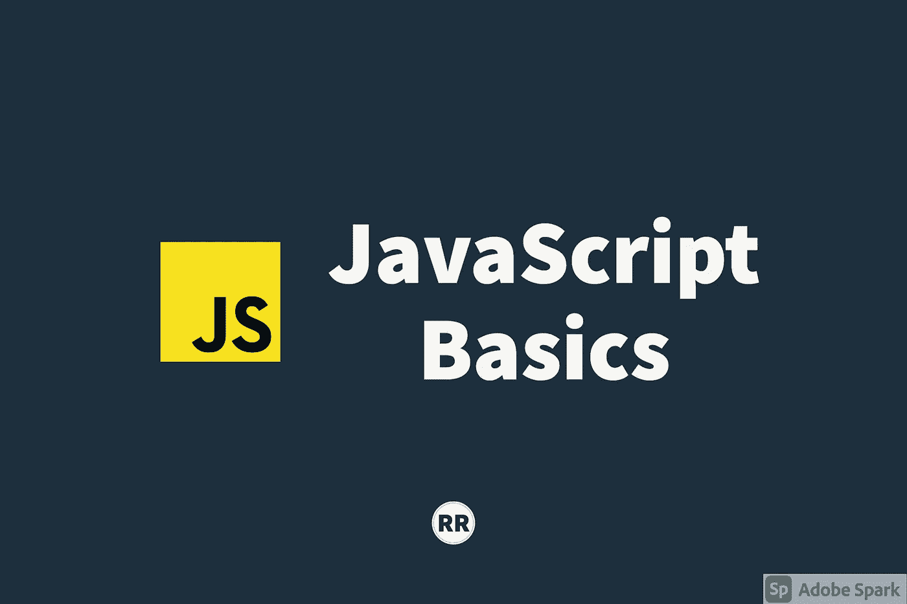

# JavaScript 基础:类型和强制

> 原文：<https://javascript.plainenglish.io/javascript-basics-types-and-coercion-3a48ce667e39?source=collection_archive---------27----------------------->

## JavaScript 中的数据类型



在这篇文章中，我们将讨论 JavaScript 的基本数据类型和强制的概念。

JavaScript 如何处理类型被称为`dynamic typing`，这意味着变量的类型没有明确定义。这都是在代码运行时确定的。

在 JavaScript 中，没有关键字来告诉引擎你打算给变量分配什么样的数据(剧透:TypeScript 解决了这个问题)。其他语言如 Java 和 C++使用一种叫做`static typing`的东西，这意味着变量的类型被定义了。如果赋值，而不是声明的值，将抛出一个错误。

```
// Sample C++bool isNew = true; //valid assignment
bool isError = "imNotaBooleanValue" // will throw an error
```

使用 JavaScript，我们可以在不声明类型的情况下给变量赋值。如果有必要，我们甚至可以将变量重新分配给完全不同的数据类型。

```
// Sample JavaScript
let isNew = true;
isNew = "imStringNow";
```

让我们快速浏览一下 JavaScript 中的原语(不是对象也没有方法的数据)类型:

*   `undefined`，代表缺乏存在。变量未设置值。
*   `Boolean`，真值或假值
*   `Number`，在 JavaScript 中，这包括整数和小数
*   `BigInt`，JavaScript 中的数字原语，可以表示任意精度的整数。可以安全地存储和操作非常大的整数。
*   `String`，由""或" "包围的字符序列
*   `Symbol`，唯一不变的值
*   `null`(特殊原始人)，代表缺乏存在。当变量设置为空时，可用于变量。

有一个`operator`，`typeof`，在运行时检查一个值的当前类型。

# 经营者

一个`operator`是一个语法上不同的特殊函数。如前所述，`typeof`是一个操作符，它接受一个 a 值并返回一个指示类型的字符串。

```
console.log(typeof 432) // "number";
console.log(typeof 'hello') // "string";
```

其他熟悉的运算符包括加、减、乘、除、小于、大于、等于，这些都是特殊类型的函数，通常接受两个参数并返回一个结果。当有多个操作符时，需要考虑一些特殊的规则。

`operator precedence`决定首先调用哪个操作功能，优先级较高。这里有一个[表](https://developer.mozilla.org/en-US/docs/Web/JavaScript/Reference/Operators/Operator_Precedence)，列出了每个运算符的优先级值。让我们看一个例子:

```
let a = 3 + 4 * 5 // multiplication has higher precedence
//  a = 3 + 20    // addition is left
//  a = 23
```

如果运算符具有相同的优先级，会发生什么情况？使用同一个表，我们可以参考关联性。`operator associativity`决定了操作符被调用的顺序。让我们来看看:

```
let a = 2, b = 4, c = 9;
a = b = c
console.log(a) //9
console.log(b) //9
console.log(c) //9
```

在这个例子中，我们使用了`assignment`操作符来重新分配。因为它们都有相同的优先级，所以结合性决定了哪个操作符先被执行，哪个是`right-to-left`。我们先关注`b = c`。在这种情况下，`c`是 9，我们将`b`重新分配给 9。同样，我们将`a`重新分配给 9。

# 强迫

我们被带到了 JavaScript 中一个著名的概念，`coercion`。它是一个值从一种类型到另一种类型的转换。这在 JavaScript 中经常发生，因为它是动态类型的。

```
// First Sample
let a = "sample" + "test"
console.log(a) // "sampletest"// Second Sample
let x = 1 + "2"
console.log(x) // "12"
```

第一个示例是有效的，因为 JavaScript 连接字符串并将它们组合在一起。在第二个示例中，第一个值 1 被 JavaScript 引擎强制转换成一个字符串并进行组合。与其他编程语言不同，JavaScript 在处理两种不同的数据类型时不会抛出错误。

由于 JavaScript 是动态类型的，它倾向于尝试将事物转换成您想要的值。许多这一切都是在 JavaScript 引擎的引擎盖下发生的。

# 比较运算符

让我们看另一个强迫的例子。

```
console.log(1<2<3) // true
console.log(3<2<1) // true
```

第一个`console`有意义，因为 1 小于 2，2 小于 3。但是，为什么第二个`console`会返回`true`？我们来分析一下。由于都是同一个运算符，`less than`的结合律来自`left-to-right`。所以还是把重点放在`3<2`上吧。结果返回`false`。现在让我们重写语句:

```
3 < 2 // false
false < 1
```

操作符本身需要两个数字，但是我们有一个`boolean`和一个`number`来处理。JavaScript 试图将布尔值强制转换为数字。有一个内置的 JavaScript 函数`Number()`，它接受一个值，JavaScript 决定它将强制什么。

```
Number(false) // 0
Number(undefined) // NaN
Number(null) // 0
```

用`true/false`可以强制分别变成 1 和 0。`undefined`返回`NaN`或非数字，`null`转换为 0。回到问题上来，

```
false < 1
0 < 1 // true
```

`false`被强制为 0，我们比较 0 小于 1，结果是`true`。第一个`console`可能并没有像我们想象的那样被评价。让我们重温一下:

```
1 < 2 < 3 // same operator. left-to-right
1 < 2 // true
true < 3 // true is coerced to 1
1 < 3 // true
```

原来第一个`console`碰巧返回了我们预期的结果。JavaScript 引擎决定某个特定类型将强制什么并不总是显而易见的。

# 平等比较

在 JavaScript 中有两种方法可以检查两个东西是否相等:`equality(==)`和`strict equality(===)`。先说`equality`。如果被比较的事物具有相同的类型和值，它将简单地返回`true`。然而，如果它们不是同一类型，那么`==`操作符将强制这些类型，并确定它们是否相等。例如:

```
"" == 0 //true
"0" == 0 //true
false == "false" // false
```

操作符可以导致一些有趣的情况，因为它仍然涉及强制。然而，`===`操作符做的正是我们所期望的。它检查被比较的事物在类型和价值方面是否实际相等。如果类型不同，则不尝试强制，并返回`false`。

# 结束语

因为 JavaScript 是动态类型的，所以当值被操作或比较时会出现问题。在比较 JavaScript 中的不同类型时，可能会出现许多有趣的情况。意识到`coercion`出现在 JavaScript 中有助于防止/解决开发过程中可能遇到的错误。

感谢您的阅读和快乐编码！