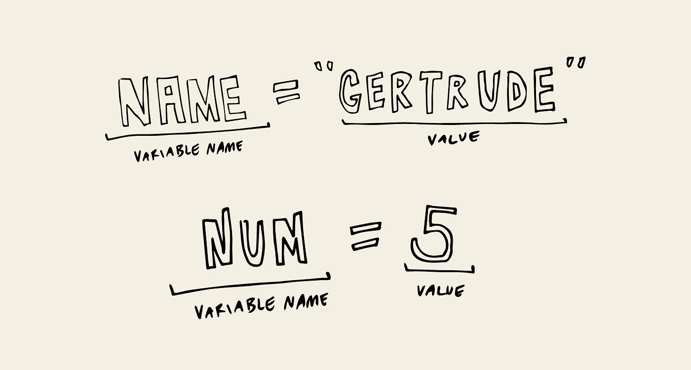

# JavaScript 基础:变量

> 原文：<https://javascript.plainenglish.io/javascript-basics-variables-cb58d26167f9?source=collection_archive---------2----------------------->


在 JavaScript 中，您可以使用变量来标记任何类型的数据。变量就像盒子，里面有标签，告诉你盒子里面是什么。


盒子里的东西可以是用户名、密码、出生日期等信息，也可以是一句问候。给盒子贴上标签后，你把它们放在壁橱里，这样当你想要拿回它们时，你就可以根据标签名称找到它们。壁橱可以被看作是计算机中的内存，盒子是变量名称，你分配给盒子的项目可以存储在那里。

使用这些变量名，您可以存储和更新分配给这些变量的信息，还可以检索信息。

有三种方法(但其中两种越来越常见)来创建变量，那就是用 **var，let，**和 **const** 。

在 ECMAScript 6 或 ES6 之前，声明变量的唯一方式是 **var** (变量的简称)。尽管您将看到 **let** 和 **const** 被更频繁地使用，但有时您会遇到使用 **var** 关键字的 ES6 之前的代码。


使用**变量**分配变量:

```
var vehicle = 'Jeep';
var age = 75;
var myPet = 'horse';
```

变量名跟在变量关键字后面，关键字后面是变量名。只要遵循命名规则(见文末)并且不是[保留关键字](https://developer.mozilla.org/en-US/docs/Web/JavaScript/Reference/Lexical_grammar#Keywords)就可以随便命名。保留关键字是 JavaScript 已经放在一边用于其他目的的词。例如 **var** 。您不能将变量命名为 var ，因为该关键字已经被声明变量 JavaScript 使用。



等号将右边的内容分配到左边，不管是文本、数字还是其他什么。

接下来的两个变量赋值关键字是 **let** 和 **const** 。


**let** 关键字表示变量可以被重新分配。

```
let vehicle = 'Jeep'
vehicle = 'Honda';
```

**const** 关键字表示变量不能被重新赋值。它是一个常数。如果您尝试更改 const 变量的值，将会得到一个 TypeError 消息。

关于 const 关键字的另一件事是你必须在声明的时候赋值。用 **let** 和 **var** ，你可以创建一个变量而不用赋值。

```
let vehicle;
var myPet;
```

如果你用一个 **const** 变量这么做，你会得到一个语法错误。

要知道什么时候使用 **let** 和 **const** ，可以把 **const** 想象成一个绑在地上的封闭盒子，把 **let** 想象成一个可以打开改变的开放盒子。如果您正在使用的变量不能被重新分配，使用**常量**。如果没有，使用**让**。


命名变量时有一些规则:

1.  变量不能包含空格。
2.  它们必须以字母、下划线或美元符号开头。
3.  除了字母，在变量名中使用其他类型的字符时，它们可以是数字、下划线或美元符号。
4.  它们区分大小写。所以在上面的例子中， **mypet** 和 **myPet** 被看作是 JavaScript 的两个不同的变量。

想看关于 JavaScript 基础知识的其他文章，这里有一些最近的文章:

[](https://levelup.gitconnected.com/javascript-basics-console-log-8532b446db22) [## JavaScript 基础知识:Console.log()

### 今天我们将学习 console.log 的基础知识。如果你看了 JavaScript 基础知识系列的第 1 部分，我们…

levelup.gitconnected.com](https://levelup.gitconnected.com/javascript-basics-console-log-8532b446db22) [](https://medium.com/@endubueze00/javascript-basics-part-1-adae36124fd1) [## JavaScript 基础知识—第 1 部分

### 在这篇文章中，我们将研究 JavaScript 的基础知识，还将研究 JavaScript 的一些部分，您可能…

medium.com](https://medium.com/@endubueze00/javascript-basics-part-1-adae36124fd1) [](https://medium.com/javascript-in-plain-english/javascript-basics-part-2-59d68aea045e) [## JavaScript 基础知识—第 2 部分

### 在本文中，我们将研究 JavaScript 的基础知识。这是 JavaScript 基础文章系列的第 2 部分…

medium.com](https://medium.com/javascript-in-plain-english/javascript-basics-part-2-59d68aea045e)