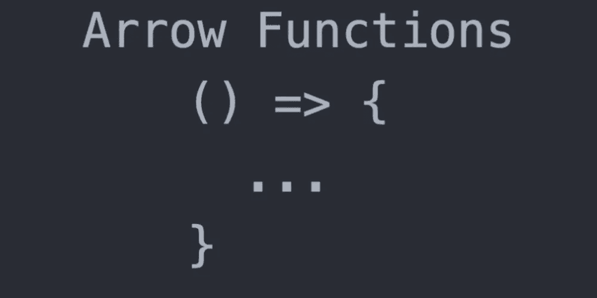
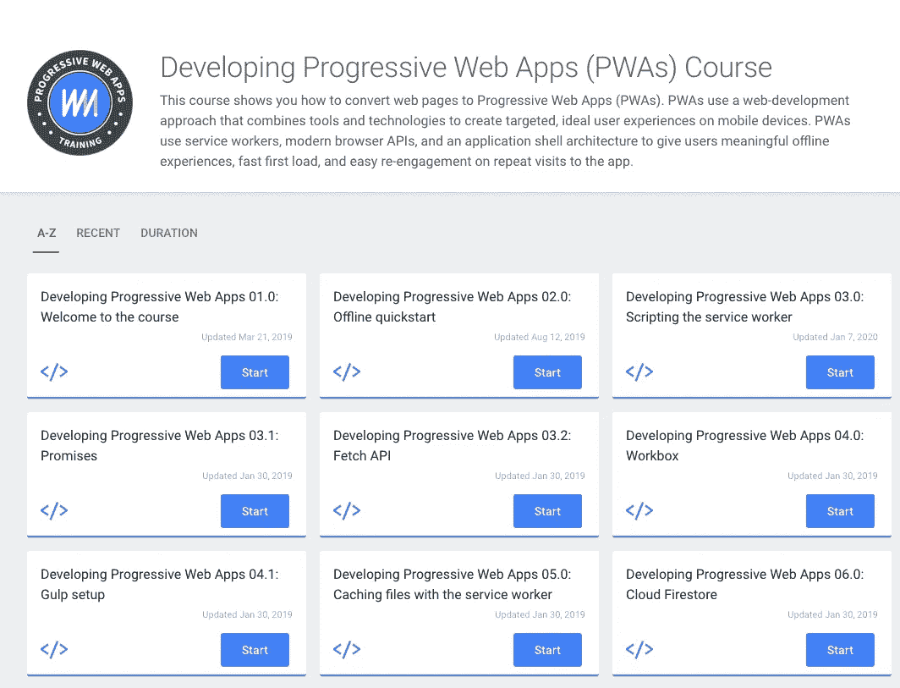
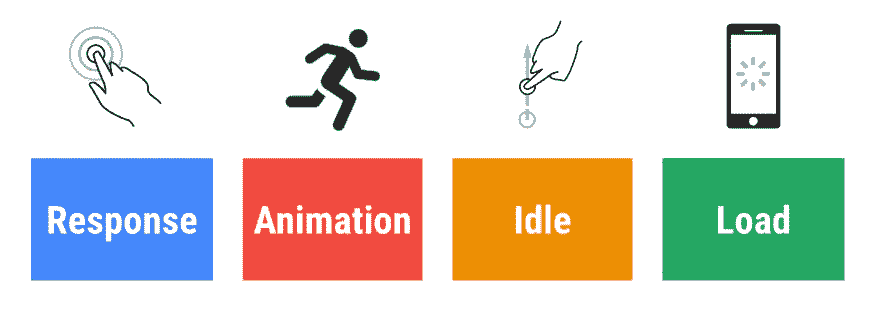

# 面向初学者的 JavaScript 最佳实践

> 原文：<https://javascript.plainenglish.io/javascript-best-practices-for-beginners-b573cbc1ec0f?source=collection_archive---------1----------------------->

## JAVASCRIPT 最佳实践

## JavaScript 最佳实践让你成为更好的程序员


Photo by [Andrew Furlan](https://unsplash.com/@andrewfurlan?utm_source=unsplash&utm_medium=referral&utm_content=creditCopyText) on [Unsplash](https://unsplash.com/s/photos/beginner?utm_source=unsplash&utm_medium=referral&utm_content=creditCopyText)

Javascript 有它的好处和最佳实践。有些事情很棘手，最好避免。一些实践让你成为更好的程序员。

在这篇文章中，我们看了近 50 个技巧，从使代码更容易阅读，到避免全局和性能技巧。

如果你喜欢视频，你可以在 YouTube 上观看:

准备，预备，开始！

# 1)坚持严格的编码风格

浏览器对 JavaScript 语法非常宽容。但这并不是编写糟糕代码的借口。即使浏览器能够消化它。

当你转换到另一个环境时，粗心的编码风格会对你不利。前提是同事没有因为你受苦而先报复你。

# 2)严格“使用严格”

严格模式对 JavaScript 的运行方式做了很多改变，从显而易见到微妙(这些是你最感激的)。

使用' use strict '时，静默错误现在会抛出错误。会使 Javascript 引擎优化变得困难的错误现在将被减轻。您的代码甚至可能工作得更快。

在 ES5 中，严格模式是可选的，但是在 ES6 中，许多 ES6 特性都需要它。

你可以阅读 Mozilla 关于严格模式的参考资料来获得更多信息。

# 3)使用林挺

JavaScript 的林挺工具是 [JSLint](http://www.jslint.com/) 。它会给你一个关于语法警告及其含义的详细报告。你也可以使用 [JSHint](https://jshint.com/) ，一个静态代码分析工具。

# 4)阅读代码风格指南

最常用和推荐的 JavaScript 代码风格指南是[Google Code Style Guide for JavaScript](https://google.github.io/styleguide/javascriptguide.xml)。也可以阅读 [Idiomatic.js](https://github.com/rwldrn/idiomatic.js/) 。

# 5)避免全局变量

尽量减少全局变量的使用。全局变量是一个非常糟糕的主意。

全局变量和函数的问题是它们会被其他脚本覆盖。

你可以用一个匿名函数来包装所有的东西。或者使用对象文字。

# 6)优先访问局部变量

JavaScript 首先搜索局部变量是否存在，然后在更高的范围内逐步搜索，直到找到全局变量。因此局部变量会被更快地找到。

要定义当前范围，请在每个变量前加上*，让*或*常量*。这将防止查找，也加快了代码。

# 7)顶层声明

将所有声明放在脚本或函数的顶部，以获得更干净的代码。你不希望代码中到处都是声明。你想减少重新申报的可能性。

# 8)初始化变量

最佳实践也是在声明变量时初始化它们。一开始就声明和发起。

```
let what = "javascript";
let one;      *// this variable is implicitly initialized with "undefined", best practice would be to set a value to it*
let two = 2;  *// this variable is explicitly initialized with the numeric value 2*
```

# 9)让它易于理解

```
**let** i1, pio, rialtv;
**let** newOrderIfItemIsOnStockAndCustomerFromAustralia;
```

i1，pio，rialt 都是不好的变量名。此外，neworderitemisonstockandcustomerfromoustaria 不是真正可读的。想象一下用这些变量读取代码。你想用简短而有意义的名字使你的代码易于理解。变量名应该有意义。

想象你自己是一个艺术家，一个作家。你希望你的故事易于理解。

# 10)使用===比较

当你使用`==`时，你的变量将被转换成匹配类型。

```
0 == **""**; // true
0 === **""**; // false
```

0 == "";这将产生真实的。

其中 0 = = = " "；会产生假的。

这是因为`===`操作符强制对值和类型进行比较。

# 11)小心自动类型转换

因为 JavaScript 是松散类型的，所以一个变量可以包含不同的数据类型。此外，变量可以改变它的数据类型。我们可以简单地这样做:

```
**var** text = **"Hello"**;
text = 5;
```

在第二个语句中，变量文本从字符串类型转换为数字。

# 12)不要声明不必要的变量

更多的变量，更多的内存空间。

例如，不要这样写:

```
const sidebar = sidebar.querySelector('#sidebar');
const paragraph = foo.querySelector('p');
paragraph.textContent = 'foo';
```

你可以这样写:

```
document.querySelector('#sidebar p').textContent = 'foo';
```

在第一种情况下，我们有两个变量。经过一点点重组，我们现在没有变数了。

# 13)使用参数默认值

当你调用一个函数而忘记传递一个参数给它时，那么丢失的参数被设置为`undefined`。

在 ES5 中，您需要这样做:

```
**function** *logNumber*(num) {
    **if** (num === **undefined**) {
        num = 25;
    }
    ***console***.log(num);
}
*logNumber*();
```

ES6 为该功能引入了默认参数**。您可以这样做:**

```
**function** *logNumber*(num = 25) {
    ***console***.log(num);
}
*logNumber*();
```

给参数分配默认值是一个好习惯。

# 14)使用默认值结束您的交换机

用一个`default`来结束你的`switch`陈述是一个好习惯。即使看起来不是这样。

```
switch(type)
{
    case 1:
        //something
    case 2:
        //something else
    default:
        // unknown type! 
        // there should probably be some error-handling
        // here, maybe an exception
}
```

# 15) eval()不是你的朋友

下面是 [Mozzila](https://developer.mozilla.org/en-US/docs/Web/JavaScript/Reference/Global_Objects/eval) 对 eval 的评价。

> **警告:**从字符串执行 JavaScript 存在巨大的安全风险。当您使用`eval()`时，一个坏演员运行任意代码太容易了。参见[千万不要用 eval()！](https://developer.mozilla.org/en-US/docs/Web/JavaScript/Reference/Global_Objects/eval#Never_use_eval!)文章。

不需要其他评论。

# 16)不使用新对象()

*   用`{}`代替`new Object()`
*   使用`""`代替`new String()`
*   用`0`代替`new Number()`
*   用`false`代替`new Boolean()`
*   用`[]`代替`new Array()`
*   用`/()/`代替`new RegExp()`
*   使用`function (){}`代替`new Function()`

优点是:

*   代码更短，可读性更强
*   代码更安全。当`Object`构造函数被覆盖时，文字仍然有效
*   它稍微快一点

# 17)注释您的代码

但只是需要的数量，而不是更多。

# 18)在有意义的时候使用快捷符号

是的，快捷符号让你的代码超级小。我们都喜欢这样。但是如果你做得太多，你的代码就会变得不可读。

条件是我觉得最有用的地方。没必要写这个:

```
let level;
if(score > 100){
  level = 2;
} else {
  level = 1;
}
```

我可以这样写:

```
let level = (score > 100) ? 2 : 1;
```

这个小例子:

```
if(discount){
  let price = discount;
} else {
  let price = 20;
}
```

可以用双管字符简化:

```
let price = discount || 20;
```

如果折扣未定义，价格的值将为 20。

还有[更多](https://www.sitepoint.com/shorthand-javascript-techniques/) …

# 19)每个任务有一个功能/让你的代码模块化

一个函数不应该做所有的事情。迟早你会在几个函数中做同样的事情。

对于一个特定的任务来说，小的、通用的帮助函数是可行的。

好的代码应该易于构建，无需重写核心。

# 20)了解这个和那个

`this`真的是这样，还是完全是别的什么？还是没有定义？

[这个](https://developer.mozilla.org/en-US/docs/Web/JavaScript/Reference/Operators/this)是真题。

# 21)了解示波器

理解 JavaScript 中的[变量作用域](https://www.sitepoint.com/demystifying-javascript-variable-scope-hoisting/)是唯一的方法。当您的代码表现得像外星人一样时，您不希望有不眠之夜。范围是运行时代码中某个特定部分的变量、函数和对象的可访问性。换句话说，范围决定了代码区域中变量和其他资源的可见性。

这里有一个[不错的教程](https://scotch.io/tutorials/understanding-scope-in-javascript)可以帮到你。

# 22)使用最快的方式循环变量

在 JavaScript 中，有很多方法可以循环数组。

第一种方式是`for`循环。其他方法包括`for...of`循环，数组的`forEach`方法。`map`和`filter.`同样，当映射和过滤操作完成时，循环遍历数组。而且还有`while`循环。

`for`循环是最快的方法。缓存`length`使循环执行得更好。

```
let arrayLength = array.length;
for(let i = 0 ; i < arrayLength; i++) {
   let val = array[i];
}
```

一些浏览器引擎已经优化了`for`循环，但没有缓存 length 属性。

步进递减的`while`循环比`for`循环大约慢 1.5 倍

使用`forEach`循环比`for`循环慢 10 倍，所以最好避免使用，尤其是对于大型数组。

# 23)不要做太多的嵌套

嵌套太深会使你的代码变得非常难以阅读。当你之后的编码者的代码编辑器换行时，他们不应该感到痛苦。

```
firstFunction(**args**, **function**() {
    secondFunction(**args**, **function**() {
        thirdFunction(**args**, **function**() {
            *// And so on…* });
    });
});
```

这里有一个[指南](https://www.w3.org/wiki/JavaScript_best_practices#Avoid_heavy_nesting)可以帮助你确定平衡嵌套的深度。

# 24)小心 DOM 的问题

访问 DOM 很慢。操作、访问、添加必须以巧妙的方式完成。

# 25)使用最好的库和框架

有这么多的 JavaScript 库和框架，你可以选择最适合你的工具。反应，角度，Vue 是看进去的方向。


React


Angular


Vue

# 26)具有高效的配置和转换

将所有配置放在一个对象中。有些事情可能会随着时间而改变。因此允许配置和转换。

# 27)减少对变量和属性的访问

执行循环时，不要在每次迭代时读取数组的长度属性:

```
let names = ['Jana','Maja','Kaja','Nika'];
for(let i=0;i<names.length;i++){
  sayHerName(names[i]);
}
```

这意味着每次循环运行时，JavaScript 都需要读取数组的长度。您可以通过将长度值存储在不同的变量中来避免这种情况:

```
let names = ['Jana','Maja','Kaja','Nika'];
let all = names.length;
let(var i=0;i<all;i++){
  sayHerName(names[i]);
}
```

# 28)不要相信任何数据

你知道用户是做什么的吗？他们总是输入不正确的数据！不是因为他们笨。或者邪恶的想黑你。他们可能很忙，心不在焉，或者指令令人困惑。

你需要检查数据。它必须是干净的，而且正是你所需要的。



# 29)使用 ES6 箭头功能的威力

为了避免一些与`this`相关的边缘情况和创伤，ES6 为我们提供了箭头功能。箭头函数绑定了这一点。


# 30)使用模板文字

模板文字使得处理字符串比以前容易多了。不再有长字符串连接！

为了创建一个模板文字，我们使用反斜线(```)字符，而不是单引号(`'`)或双引号(`"`)。这将产生一个新的字符串，我们可以用任何我们想要的方式使用它。

# 31)让 Spread 帮助您处理阵列

Spread 允许数组在应该有 0+个参数的地方扩展。

```
**function** *sum*(x, y, z) {
    **return** x + y + z;
}

**const** numbers = [1, 2, 3];

***console***.log(*sum*(...numbers)); *//6*
```

# 32)延迟加载脚本

加载文件时，浏览器必须下载文件，解析内容，然后将其转换为机器代码并运行。它是昂贵的。

最好是尽量拖延。因此将`script`标签放在文件的末尾。同样，使用`script`标签上的`defer`属性来延迟。

# 33)通过使用缩小来节省字节

缩小 Javascript 文件将在不改变文件功能的情况下减小文件大小。

# 34)避免不必要的循环

如果不需要，不要使用嵌套循环，以保持 JavaScript 的线性。此外，你不希望你的代码通过成千上万的对象。这会使你的代码非常慢。

# 35)优先选择 Map 而不是 for 循环

使用地图的好处是:

*   不变性—您的原始阵列不会受到影响。
*   范围隔离和可重用性——map 有自己的范围
*   更简洁的代码——在不改变功能的情况下增加可读性的代码越少越好
*   可组合性——将迭代操作组合在一起要容易得多。

这里有一个关于可组合性的小例子。假设我们想对一个数组中的奇数求和。让我们使用地图和其他迭代操作符。我们需要这样写:

```
**let** strings = [**'1'**, **'2'**, **'3'**, **'4'**, **'5'**];
strings
    .map(toNumber)
    .filter(isOdd)
    .reduce((sum, number) => sum + number);
```

对于 for 循环，它将如下所示:

```
let numbers = [];
let len = strings.length;for (x = 0; x < len; x++)
  numbers[x] = toNumber(strings[x])evenNumbers = [];for (y = 0; numLen=numbers.length; y < numLen; y++)
  i = 0
  if (isOdd(numbers[y]))
    evenNumbers[i] = numbers[y];
    i++sum = 0for (z = 0; let eNum = evenNumbers.length; z < eNum; z++)
  sum = sum + evenNumbers[z];
```

现在告诉我；相信编码是一门艺术是愚蠢的吗？

# 36)使用适当的事件处理程序

通过正确使用事件处理程序来减少调用堆栈的深度。此外，如果您不跟踪它们，它们可能会在您不知情的情况下重复执行。

# 37)使用 RxJs 编写异步和基于事件的程序

RxJS 是一个库，用于通过使用可观察序列来编写异步和基于事件的程序。这被称为反应式编程。它用异步数据流编程。

作为反应式系统构建的系统更加灵活、松散耦合和可伸缩。他们反应灵敏，富有弹性，富有弹性&以信息为导向。

可观察值是任何时间内任何一组值的表示。像数据流一样，事件随着时间的推移而发生，它们的有效载荷包含一些值。可观测量基本上是代码等待的数据流。

简而言之，在反应式编程中，我们不对接下来会发生什么进行编程，比如代码的线性执行。你被动地执行代码。

例如，您不必等到所有数据都就位，等到每个移动事件都已经发生，但是您可以在每个数据块发生时准确地做出反应。当事情发生时，你做出反应，处理和修改输入的数据。

你基本上是这样做的:

`thing.map(transposeFunc).merge(otherThing).subscribe(handleFunc)`

您将处理[可观察的](https://rxjs-dev.firebaseapp.com/guide/observable)、卫星类型(观察者、调度器、主题)和操作符，如 map、filter、reduce、every……您将处理异步事件集合。

使用 RxJs 和反应式编程的核心优势是:

*   你用纯函数产生值。这意味着你的代码不容易出错。
*   你孤立了这个州。
*   RxJS 有一系列的操作符，可以帮助你控制事件如何流经你的观察对象。
*   你可以转换通过你的观察值传递的值。

# 38)浏览器中的缓存

为此有两种选择。首先是使用 JavaScript 缓存 API，我们可以通过安装一个服务工作者来使用它。帮助你利用缓存和 PWA 应用的一个很好的资源是[谷歌代码实验室](https://codelabs.developers.google.com/dev-pwa-training/)。第二种是使用 [HTTP 协议缓存](https://developers.google.com/web/fundamentals/performance/optimizing-content-efficiency/http-caching)。



# 39)删除未使用的 JavaScript

当你手上有一个没有响应的 web 应用程序时，这将是首先要检查的。代码可能因为遗留问题而有一些库。尽快移除它。

此外，代码的某些部分可能永远不会运行。如果您发现某个功能没有被用户使用，请将其与相关的 JavaScript 代码一起删除。

# 40)避免使用太多内存

每当您的代码请求浏览器保留新内存时，就会执行浏览器的垃圾收集器，并停止 JavaScript。如果这种情况经常发生，页面将运行缓慢。

# 41)熟悉轨道模型

谷歌的 RAIL 模型是一种以用户为中心的方法来考虑性能目标。

RAIL 考虑了网站上用户交互的各种环境。

用户希望看到页面快速加载，但是不太可能所有的*函数都需要在页面初始加载时可用。如果用户必须执行某个动作才能执行某个功能，那么可以将该功能的加载推迟到初始页面加载之后。*



# 42)查找内存泄漏

如果内存泄漏正在进行，加载的页面将保留越来越多的内存，最终占据设备的所有可用内存，并严重影响性能。

您可以使用 Chrome 开发工具来查找内存泄漏。在 Chrome 开发工具中，可以通过在“性能”选项卡中记录时间线来分析内存泄漏。

您可以通过 [Chrome 任务管理器](https://www.howtogeek.com/437681/how-to-use-chromes-built-in-task-manager/)了解您的页面当前使用了多少内存。

使用时间线录音，您可以直观地看到一段时间内的内存使用情况。

堆快照将帮助您识别分离的 DOM 树。

通过分配时间线记录，您可以发现何时在您的 JS 堆中分配了新的内存

在内存泄漏期间，加载的页面将逐渐占据设备的所有可用内存，并严重影响性能。

# 43)将网络工作人员用于密集型任务


当您需要执行需要大量执行时间的代码时，请使用 web 工作人员。

网络工作人员帮助您在后台线程中运行脚本。工作线程可以在不干扰用户界面的情况下执行任务。

引入 Web Workers 是为了解决潜在的性能问题。

他们可以在不阻塞用户界面线程的情况下执行处理器密集型计算。

# 44)使用通用编程实践

## 当心计算复杂性

始终使用计算复杂度最低的算法，以最佳的数据结构来解决任务。

## 简化

您可以重写算法，用更少的计算得到相同的结果。

## 避免递归调用

没必要多说。

# 45) Regex 是你的朋友吗

正则表达式在从任何文本中提取信息时都非常有用。他们搜索特定搜索模式的一个或多个匹配项。

最有用的几个例子:

*   修剪文本中的空格:

^[\s]*(.*?)[\s]*$

*   找到任何有效的 HTML 标记和相应的结束标记:

**<(【a-z]+)([^】<+)*(？:>(。*)<\/\ 1>| \ s+\/>)**

*   查找任何有效的十六进制颜色

**\B#(？:[a-fA-F0-9]{ 6 } |[a-fA-F0-9]{ 3 })\ b**

*   查找有效的电子邮件地址(RFC5322)

**\b[\w！#$% & '*+\/=？^`{|}~-]+@[\w-]+(？:\.[\w-]+)*\b**

*   匹配长度从 4 到 12 的用户名。有效的是字母、数字和破折号。

**/^[a-z0–9_-]{3,16}$/**

*   匹配长度最小为 7 的密码，至少一个大写字母，至少一个小写字母，至少一个数字，至少一个特殊字符

**(？=^.{7,}$)((?=.*\w)(？=.*[A-Z])(？=.*[a-z])(？=.*[0–9])(?=.*[|!" $% & \/\(\)\？\^\'\\\+\-\*]))^.***

# 46)使用搜索阵列

它们用于根据另一个值获得一个值，而不是使用 switch/case 语句。

```
**let** array = [10, 20, 30, 40, 50];

*// Here find function returns the value of the first element* **let** found = array.find(**function**(element) {
    **return** element > 20;
});

***console***.log(found); *// 30*
```

# 47)使用谷歌灯塔


Lighthouse 是一个很好的网页性能工具，它帮助你审计性能、可访问性、最佳实践和 SEO。

你可以在 Chrome DevTools 中运行 Lighthouse，从命令行，或者作为一个节点模块。你也可以将其作为[插件安装在 Chrome 浏览器](https://chrome.google.com/webstore/detail/lighthouse/blipmdconlkpinefehnmjammfjpmpbjk?hl=en)中。

Lighthouse 是分析网页性能的最佳工具之一。它帮助您审计性能、可访问性、最佳实践和 SEO。

# 48)使用谷歌页面速度


[谷歌页面速度](https://developers.google.com/speed/pagespeed/insights/?hl=en)旨在帮助开发者了解网站的性能优化和潜在的改进领域。这些组件旨在识别网站在遵守谷歌网络性能最佳实践方面的缺陷。

# 49)使用 JavaScript 导航定时 API

**导航定时 API** 提供了可以用来衡量网站性能的数据。

您可以使用它来详细测量代码的每个部分从编程本身获得了什么。

现在是最后一个:)

# 50)测试你的代码


你将进行*单元测试、* *集成测试和*用户界面测试。

测试前端时，将 UI 从功能中分离出来是很好的实践。

只要有可能，就用真实且完全渲染的组件进行测试。

观察内容是如何通过网络提供的。

您应该基于不太可能改变的属性来查询 HTML 元素。

这里有一些你将用于测试的工具: [Jest](https://jestjs.io/) ， [Cypress](https://www.cypress.io/) ， [Enzyme](https://github.com/enzymejs/enzyme) ， [Mocha](https://mochajs.org/) ， [Chai](https://www.chaijs.com/) ， [Jasmine](https://jasmine.github.io/) ， [react-testing-library](https://github.com/testing-library/react-testing-library) 。

这就是了。JavaScript 初学者的 50 个技巧。

如果你喜欢这篇文章，请分享。也欢迎你在 youtube 上关注我。

[](https://www.youtube.com/channel/UCMQXvu8jhHNnJ2DxPLhaMuQ) [## 贾娜·贝尔甘特

### 嗨，我是一名自学了 20 年的网络开发人员。教学是我的热情所在，这也是我在 Udemy 上开设课程的原因

www.youtube.com](https://www.youtube.com/channel/UCMQXvu8jhHNnJ2DxPLhaMuQ) 

还有一些你可能会感兴趣的文章:

[](https://medium.com/ucan-learn-to-code/top-6-2-evergreen-books-to-make-you-a-better-software-engineer-f6b5585839) [## 让你成为更好的软件工程师的 6 + 2 本常青书籍

### 有很多书可以帮助你提升软件开发人员/工程师的职业生涯，这些书会让你…

medium.com](https://medium.com/ucan-learn-to-code/top-6-2-evergreen-books-to-make-you-a-better-software-engineer-f6b5585839) [](https://medium.com/ucan-learn-to-code/5-tips-to-manage-time-as-a-freelance-web-developer-984525df408a) [## 自由开发者更好管理时间的 5 个技巧

### 我一生中的大部分时间都在做一名自由开发者。以下是我管理时间的方法。我还在学习。因为我…

medium.com](https://medium.com/ucan-learn-to-code/5-tips-to-manage-time-as-a-freelance-web-developer-984525df408a) [](https://medium.com/javascript-in-plain-english/server-side-rendering-for-websites-or-gatsby-vs-next-js-6caed9a79e16) [## 网站或 Gatsby VS Next.js 的服务器端渲染

### 需要一个超级快的，对 SEO 有好处的静态网站吗？但它仍然是动态的。你需要网站吗…

medium.com](https://medium.com/javascript-in-plain-english/server-side-rendering-for-websites-or-gatsby-vs-next-js-6caed9a79e16) [](https://medium.com/ucan-learn-to-code/learn-to-code-in-2020-7d23bbc7a576) [## 2020 年学会编码

### 你决定学习编码了吗？列出 2020 年你需要掌握的前端和后端技能。当然，新兵训练营…

medium.com](https://medium.com/ucan-learn-to-code/learn-to-code-in-2020-7d23bbc7a576) 

祝您愉快！