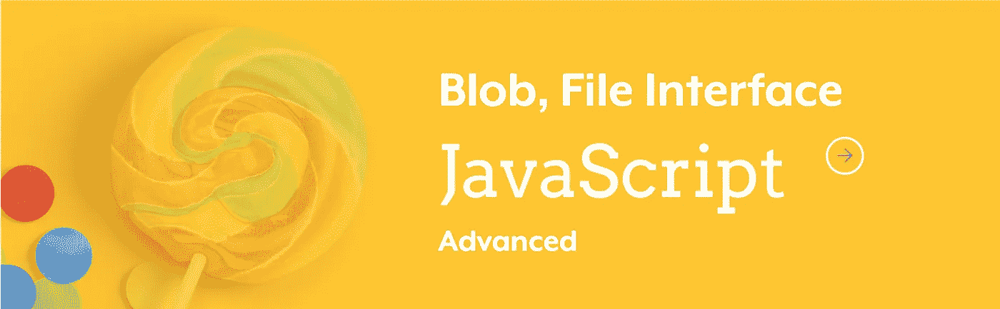
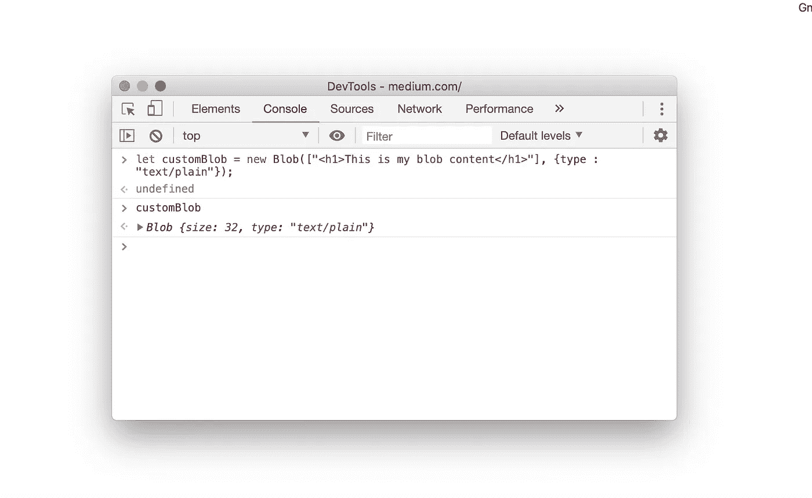

# Blobs 在 JavaScript 中的作用是什么？

> 原文：<https://javascript.plainenglish.io/javascript-blob-why-is-it-useful-20c372dfca00?source=collection_archive---------1----------------------->

> Blobs 是一种很难理解的基本数据类型。

**Blob** 是“二进制大对象”的意思，是字节块的不透明表示。Web 浏览器实现了一个负责保存数据的`Blob`对象。

Blobs 可用于多种用途。

*   它们可以由来自网络的内容创建。
*   它们可以保存到磁盘或从磁盘读取。
*   例如，它们是`FileReader` API 中使用的`[File](https://flaviocopes.com/file/)`的底层数据结构。

一个`Blob`有它的大小[和 **MIME 类型**](https://en.wikipedia.org/wiki/Media_type#Common_examples) 就像一个文件有一样。Blob 数据存储在内存或文件系统中，具体取决于浏览器和 blob 大小。A `Blob`无论我们在哪里使用文件，都可以像文件一样使用。

> 用于处理 blobs 的大多数 API 都是异步的。
> 
> 但同步版本的 API 也是可用的，因此它们可以在 WebWorkers 中使用。

blob 的内容可以读取为 **ArrayBuffer** ，因此这使得 blob 非常便于存储二进制数据。基本上 **ArrayBuffer** 用来保存二进制数据。例如，它可以是图像的二进制数据。在其他语言中，缓冲区被证明非常有用。🙂当然，它比其他数据类型更难理解或使用。

# 创建 Blob

可以使用以下方法创建 blob:

*   `Blob()`建造师
*   另一个 blob，使用`Blob.slice()`实例方法

建构函式会取得值的阵列。即使只有一个字符串要放入 blob，也必须将其包装在数组中。

当您调用`slice()`时，您可以检索 blob 的一部分。

**拥有 Blob 对象后，可以访问其 2 个属性:**

*   `size`返回 blob 内容的长度(以字节为单位)
*   `type`与之关联的 MIME 类型

# Blob URLs

正如我们有`file://`URL，引用本地文件系统中的真实文件。类似地，我们有引用 blob 的`blob://`URL。`blob://`URL 几乎可以用在我们使用普通 URL 的任何地方。

可以使用 **createObjectURL** 对象获得 blob 的`blob://` URL。

静态方法`**URL.createObjectURL()**`创建一个包含 URL 的`[DOMString](https://developer.mozilla.org/en-US/docs/Web/API/DOMString)`，该 URL 表示参数中给定的对象。

一个`[DOMString](https://developer.mozilla.org/en-US/docs/Web/API/DOMString)`，包含一个对象 URL，可以用来引用指定源`object`的内容。

> 每次你调用`createObjectURL()`，一个新的对象 URL 被创建，即使你已经为同一个对象创建了一个。

# 文件接口

JavaScript 中的 [**文件**](https://developer.mozilla.org/en-US/docs/Web/API/File) 对象引用本地文件系统中的实际文件。此文件对象从 Blob 类继承所有属性和方法。尽管 File 对象和 Blob 对象不同，但它们公开了相同的方法和属性。

没有办法创建文件对象，一些 JavaScript API 返回引用文件对象。

文件对象可从用户使用<输入>元素选择文件后返回的[文件列表](https://developer.mozilla.org/en-US/docs/Web/API/FileList)对象中检索，或从拖放操作的[数据传输](https://developer.mozilla.org/en-US/docs/Web/API/DataTransfer)对象中检索。

**结论**

在处理二进制远程文件时，blob 非常有用。

斑点可以非常大，即也可以包含音频和视频数据。它们可以动态创建，使用 blob URLs 可以作为文件使用。你可以用许多不同的方式来使用它们，使它们更有用。

🙂**感谢阅读。**

# 推荐

 [## Blob 对象

### 学习 JavaScript？下载我的免费 JavaScript 手册🔥Web 浏览器实现了一个 Blob 对象，它负责…

flaviocopes.com](https://flaviocopes.com/blob/)  [## JavaScript Blobs 和文件接口介绍

### 在这篇文章中，你将会学到所有关于 JavaScript blobs 的知识。这篇文章中的每个 API 都属于 HTML5…

qnimate.com](http://qnimate.com/an-introduction-to-javascript-blobs-and-file-interface/)  [## 文件阅读器

### FileReader 对象让 web 应用程序异步读取存储在…上的文件(或原始数据缓冲区)的内容

developer.mozilla.org](https://developer.mozilla.org/en-US/docs/Web/API/FileReader)  [## 斑点()

### Blob()构造函数返回一个新对象。blob 的内容由给定值的串联组成…

developer.mozilla.org](https://developer.mozilla.org/en-US/docs/Web/API/Blob/Blob)  [## Blob JavaScript API

### Blobs 是表示原始数据的不可变对象。File 是 Blob 的派生，表示文件中的数据…

www.javascripture.com](https://www.javascripture.com/Blob)