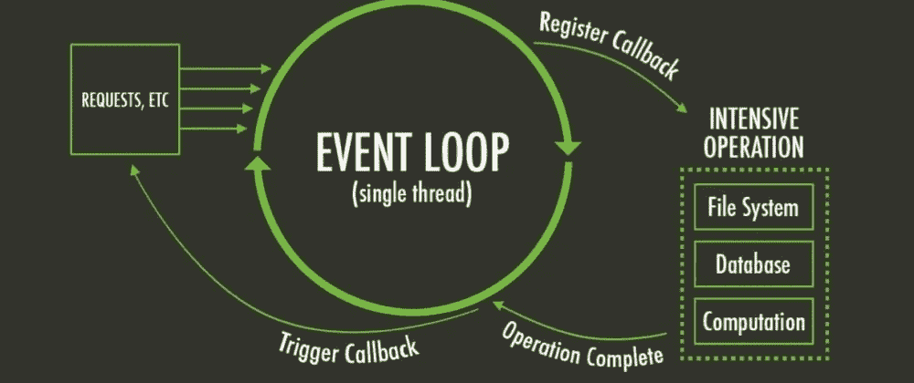

# JavaScript 中的异步与同步编程

> 原文：<https://javascript.plainenglish.io/javascript-break-promises-keep-callbacks-4dbf9cff3d9a?source=collection_archive---------11----------------------->

## JavaScript 打破承诺&保持回调

[Rojan Maguyon](https://www.pexels.com/@rojan-maguyon-2774791), by [pexels](https://www.pexels.com/photo/man-love-people-woman-5343553/) (CC0)

# 介绍

JavaScript 由单个线程执行。据此，建议首先避免长时间的操作。如果回调无处不在，我们该怎么办？

每当涉及到 I/O 操作时，比如网络或文件系统，这种情况就会变得非常严重。幸运的是，JavaScript 中有两种回调。想深入了解一下吗？浩劫的博客对此做了非常详细的调查。同步回调和异步回调的基本区别是:同步回调是在调用的上下文方法中执行的，而异步不是。

一个很好的例子就是展平数组的数组。当执行这个函数时，传入的参数将被减少，以消除一个数组中的多个数组，并将其转换为一个扁平的数组。

当这将是异步的时，函数不能返回到变量 *flat* 的赋值。这样做必须是同步的，这是同步回调应用领域的一个很好的例子，也是为什么使用它们的原因。

# 同步和异步回调

当有理由使用同步回调时，也有理由使用异步回调。每当程序需要外部资源并不得不等待时，例如，正在建立的连接、将要下载的文件等等。

以下示例将从著名的搜索引擎 Google 请求一个状态代码和一条状态消息，并将其打印到控制台。将被打印出来的第一条消息是这个简短脚本的最后一行:*请求…* ，随后是 *200* 和 *OK* 。这个例子反映了由 JavaScript 传播的对 I/O 资源的非阻塞异步调用。

API 的一致性和可靠性的关键是它的行为。它必须是一致的，永远不会像函数式编程那样改变。将 A*作为输入将总是返回 a *B* 作为输出，除此之外别无其他。将此转换回 API:函数应该总是返回一个同步回调异或(异或)一个异步回调。函数本身有时返回同步回调，有时返回异步回调，这两种情况应该没有区别。当你阅读 ha 浩劫的博客文章时，你会发现“**选择同步或异步，但不要两者都选**”并给出了充分的理由:*

> 因为同步和异步回调有不同的规则，所以它们会产生不同的错误。测试套件只异步触发回调是非常典型的，但是生产中一些不常见的情况会同步运行回调并中断(反之亦然)。
> 
> 要求应用程序开发人员计划和测试同步和异步的情况太难了，在库中很容易解决:**如果回调在任何情况下都必须推迟，总是推迟它。** —浩劫的博客

# Process.nextTick 与 setImmediate

JavaScript 为服务器端应用程序提供了两个函数: *process.nextTick* 和 *setImmediate* 。乍一看，它们似乎可以互换。你可以在它们的文档中阅读它们:[next tick](https://nodejs.org/en/docs/guides/event-loop-timers-and-nexttick/)【2】&[set immediate](https://nodejs.dev/learn/understanding-setimmediate)【3】。

对于客户端的代码解释，只有 *setImmediate* 可用。两者都期望回调作为参数，并将在以后执行这个回调。根据定义，似乎两者都在做同样的事情。看看下面的代码。

两者都显示出同样的效果。但是当你看引擎盖下的时候，他们两个是明显不同的。 *process.nextTick* 会将执行延迟到稍后的日期，但在节点之前。JS 进行 I/O 访问，并将控制权交还给事件循环。

假设您正在递归调用 *process.nextTick* 。这将在哪里结束？它在另一个延迟中结束，直到它们累积，并让事件循环饥饿。给孩子起了个名字"[事件循环饥饿](https://snyk.io/blog/nodejs-how-even-quick-async-functions-can-block-the-event-loop-starve-io/) " [6]。

Node.js under the Hood by [dev.to](https://dev.to/khaosdoctor/node-js-under-the-hood-3-deep-dive-into-the-event-loop-135d), [Lucas Santos](https://dev.to/khaosdoctor) (All rights reserved)

*SetImmediate* ，顾名思义，确实会立即执行回调函数。**对不起**，不是马上，而是在事件循环的下一轮。几乎立刻。

如果你是一个真正的夏洛克，那么你解决了这里的谜题并发现，特别是当用递归调用 *process.nextTick* 并在代码中使用 *setImmediate* 时，不仅事件循环被搁置，而且 *setImmediate* 也被挂起。这个例子说明了，确切地了解你所使用的 API 的情况是多么重要。

当您计划使用它们时，使用官方文档[2]，[3]来详细了解这两者之间的区别。

# 最后的堡垒:异步

 [## JavaScript Async Await:承诺未来不再回调！

### 对承诺的回调直到异步等待

medium.com](https://medium.com/javascript-in-plain-english/javascript-async-await-promisify-the-future-to-callback-never-again-6762707e18e5) 

在大多数情况下，通过使用 *process.nextTick* 方法，可以将同步函数转换为异步函数。下面的例子说明了一种混合方法，异步和同步工作。

将同步部分改为异步部分将使该函数具有统一性和一致性，说明每次将 *A* 放入函数时，将 *B* 作为输出的原理。

你想得到更详细的信息吗？查看艾萨克·施鲁特的博客文章。

# 结论

我们应该把编程建立在稳定性和一致性的基础上。不能因为代码中有变量，就一定要让代码本身成为变量。函数调用必须是可靠的，不依赖于大小写。让你的回调要么是纯同步的，要么是纯异步的，以避免不一致性，并在可靠性的基础上构建你的 API。如果有疑问，将您的同步调用转换为合成异步调用。
对我们有利，那个节点。JS 都知道:*流程。NextTick* 和 *setImmediate* 。

[***节省自己大量的时间，专注于重要的主题。***](https://arnoldcodeacademy.ck.page/26-web-dev-cheat-sheets)

## 延伸阅读:

 [## JavaScript ES6 模块导入导出

### ES6 模块导入导出业务用 JavaScript 和 JS 遗留代码

medium.com](https://medium.com/javascript-in-plain-english/javascript-es6-modules-import-export-129a90e83ad6)  [## Enums TypeScript 4.0 和 JavaScript 指南—您需要知道的一切

### 你将读到的关于 enums 的最后一个指南！

medium.com](https://medium.com/next-level-source-code/enums-typescript-4-0-and-javascript-guide-all-you-need-to-know-5e090355bff6)  [## 你遵循了优秀程序员的这 10 条原则吗？

### 从接吻和干燥到足球和 YAGNI 和聪明屁股代码的 10 个原则！

medium.com](https://medium.com/next-level-source-code/do-you-follow-these-10-principles-for-good-programmers-1445727af447) 

## 参考和链接:

[1] **浩劫的博客**:[https://Blog . ometer . com/2011/07/24/callbacks-synchronous-and-asynchronous/](https://blog.ometer.com/2011/07/24/callbacks-synchronous-and-asynchronous/)

[2]**process . next tick()**:[https://nodejs . org/en/docs/guides/event-loop-timers-and-next tick/](https://nodejs.org/en/docs/guides/event-loop-timers-and-nexttick/)

[3] **立即设置**:[https://nodejs.dev/learn/understanding-setimmediate](https://nodejs.dev/learn/understanding-setimmediate)

**【4】节点。JS V0.10** (稳定):[https://nodejs.org/en/blog/release/v0.10.0/](https://nodejs.org/en/blog/release/v0.10.0/)

[5] **为异步设计 API**:【https://blog.izs.me/2013/08/designing-apis-for-asynchrony】T2

[6] **事件循环饥饿**:[https://snyk . io/blog/nodejs-how-even-quick-async-functions-can-block-the-event-loop-stark-io/](https://snyk.io/blog/nodejs-how-even-quick-async-functions-can-block-the-event-loop-starve-io/)