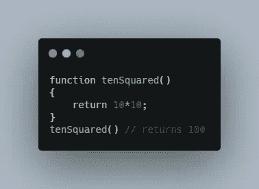
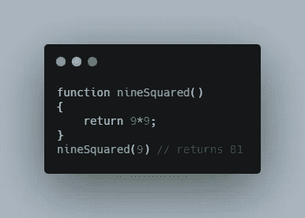
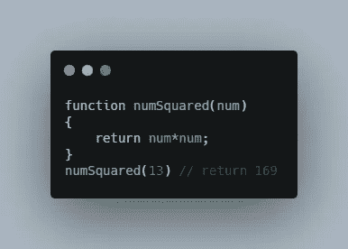
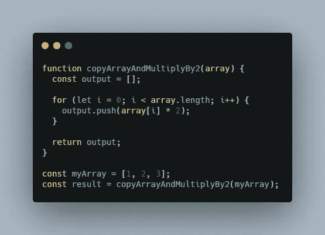
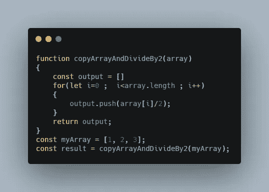
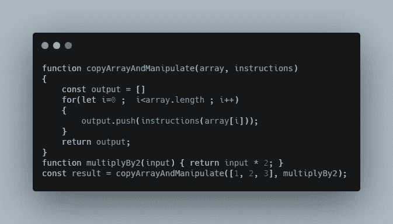

# JavaScript 回调去神秘化

> 原文：<https://javascript.plainenglish.io/javascript-callback-demystified-22aa5c63637f?source=collection_archive---------13----------------------->

An article describing JavaScript callbacks

# 介绍

嘿伙计们，这是我的第一篇文章。我将告诉你 JavaScript 回调。在开始之前，让我自我介绍一下，我是一名软件工程师，喜欢构建东西，想创造一个习惯形成的产品。我向你保证，看完这篇文章后，你会对回调有一个透彻的理解。

# 抓住你的安全带

随着介绍感觉懒惰？所以写一个函数`tenSquared`,它:

*   不接受任何输入
*   返回 10*10

function tenSquared

现在，再写一个`nineSquared`。请照我想让你感受重写的痛苦。它看起来会像:

function nineSquared

但是这种方法有问题。你能猜出我们违反了什么原则吗？是的，你说对了——是**干(不要重复)**。

我们实际上在重复自己。我们在这里可以做的是为运行函数时可以传递的数据留一个占位符。

让我们概括一下这个函数:

A more Generic function

现在，当我们想要运行函数时，可以传递数据。这个占位符被称为**参数**，它将在稍后填充一个被称为**参数**的值。

但是等等，想象一下，如果我们可以留下一些功能就像数据一样，可以在函数运行的时候传递。多酷啊！

# 到了最精彩的部分

但是在那之前让我们写更多的代码让你沮丧，让你感受到这些回调的重要性。

看看下面写的函数:

A function which performs multiply by 2 operation on each passed array element.

现在再写一个`copyArrayAndDivideBy2`:

A function which performs divide by 2 operation on each passed array element.

感觉很挫败，如果我让你再写一个`copyArrayAndAddBy2`呢。哈哈，我们只是写了这些，让你永远不要忘记干原则。抱歉，如果花的时间太长，但是值得

还记得上面那个名为`numSquared`的函数吗，我们在其中使用了一个数据占位符。

就像这样，我们希望有一个功能占位符，我们可以在运行函数时传递它。但是等等，我们如何传递功能。能不能传一个“num+2”这样的指令？

请记住，我们需要将功能捆绑或包装到一个函数中，该函数将作为参数传递。让我们看看它的实际效果。

A function which can take the functionality as input (instructions parameter) which can be called later on

请注意，在调用函数`copyArrayAndManipulate()`时，我们会将未被立即调用的功能`multiplyBy2`传递给它。而是稍后在执行`copyArrayAndManipulate`中的 for 循环时调用它。

因此，**回调**只是指稍后将被调用的函数。

它有助于编写更多可重用的逻辑和通用化功能。

请随便对这篇文章发表你的看法。我尽力让它尽可能的短。

感谢阅读！。