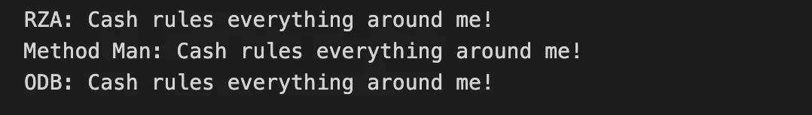

# JavaScript 中的类和实例简介

> 原文：<https://javascript.plainenglish.io/javascript-classes-4c6ed9fede4b?source=collection_archive---------17----------------------->

## 吴唐家族+ JavaScript 类=吴唐类

当我第一次开始使用 JavaScript 时，我很难理解类。我不明白它们是什么，它们是如何工作的，或者为什么你会使用它们；在这篇文章中，我将涵盖这一点。

我喜欢 hip hop，所以假设我们想要创建一个对象来代表我最喜欢的 hip hop 艺术家——来自吴唐部落的 RZA。

我们可以创建一个像这样的对象。

这很简单，对吧？现在，如果我们想做一个代表吴唐氏族每个成员的物体呢？

这可能需要一段时间。现在，这就是 JavaScript 类派上用场的地方。类是在 JavaScript 中创建对象的基本模板。类的每个实例都将从该类继承键值对和方法。我喜欢把一个类想象成 Chipotle 人们进去，出来的时候带着墨西哥卷饼。那些玉米煎饼呢？墨西哥卷饼互不相同，但它们仍然是墨西哥卷饼。让我们看看如何使用 WuTangClanMember 的类来创建其余的成员(而不是使用对象文字)。

步骤 1:类声明

接下来，我们将需要添加一个构造函数方法， ***构造函数()*** 方法是一个特殊的方法，当创建 WuTangClanMember 类的一个实例时会调用这个方法。我喜欢把建造者想象成墨西哥卷饼店的艺术家。他们接受某些参数，如玉米粉圆饼，大米，豆类，蛋白质，蔬菜等。如果你给他们以下的理由，玉米粉圆饼，糙米，豆类，sofritas，和炒蔬菜，你会得到一个有这些东西的玉米煎饼。现在，让我们看看这是如何与我们的 WuTangClanMember 类一起工作的。

步骤 2:添加构造函数方法

现在我们已经设置了构造函数，让我们看看如何在类中使用方法——毕竟，如果我们的对象不做任何事情，它们会很无聊。

步骤 3:添加方法

现在我们已经建立了我们的 WuTangClanMember 类，我们可以使用它来创建所有 Wu-Tang 家族成员的实例(这也称为实例化 WuTangClanMember 的 ***)。为了创建一个 WuTangClanMember 的实例，我们需要使用 ***新的*** 关键字。现在，我们可以实例化我们的“WuTangClanMember”类的实例，而不是为每个 Wu-Tang 家族成员创建一个对象文字，这样可以节省大量代码。***

步骤 4:实例化一个类的实例

现在，如果您在我们的每个 WuTangClanMembers 上调用***getWhatRulesEverythingAroundMe()***方法，您可以看到 cash 控制着他们周围的一切。

这是对 JavaScript 中的类和实例的简要介绍。它没有涵盖关于类的所有知识，但是希望本文已经向您展示了如何声明一个类，如何使用构造函数方法，如何实例化一个类的实例，以及使用类相对于对象文字的优势。在我的下一篇文章中， ***扩展了*** 关键词来创建子类，这将节省更多的时间和代码。