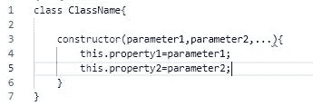
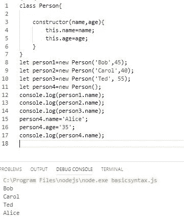
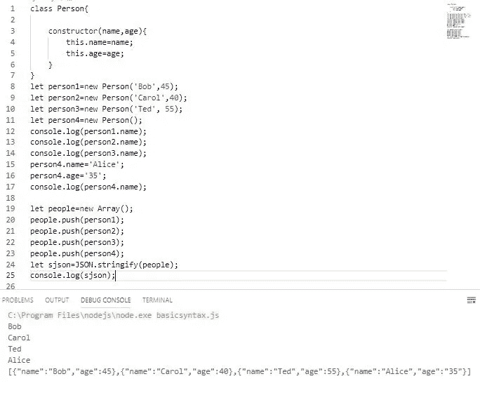
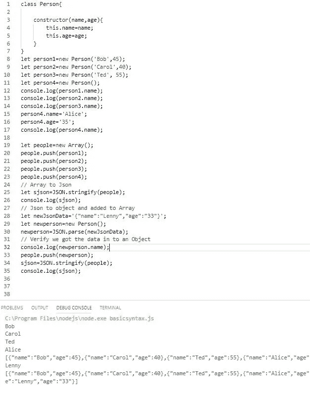

# JavaScript 类:深入研究(第 1 部分)

> 原文：<https://javascript.plainenglish.io/javascript-classes-an-in-depth-look-part-1-47d8f4e77cbd?source=collection_archive---------0----------------------->

## 成为一名优秀的 JavaScript 开发人员

# 我们将做什么？

在五个故事的过程中，我们将深入探索 JavaScript 类。

我们将开始探索一个类的基础，从这个类中创建的对象，然后向高级类前进。

**抽象定义**

> 一个**对象**由数据和行为(属性和方法)组成。)
> 
> 一个**类**是一个用于创建[对象](https://en.wikipedia.org/wiki/Object_(object-oriented_programming))的程序代码模板。
> 
> **实例化**是一个类中一个对象的实现。

# 系列预览

**在本系列课程中，我们将探索的一些项目是，**

1.  创建一个类并实例化该类以创建一个对象所需的最少时间。
2.  我们希望我们的对象拥有的属性(数据)。
3.  添加我们希望我们的对象拥有的方法(行为)。
4.  使用 JSON.stringify()将我们的对象转换为通用格式。
5.  使用 JSON.parse()将 JSON 字符串转换成我们的对象。
6.  支持字段前缀“_”的使用和需要。
7.  为什么我们要使用**获取**和**设置**的方法。
8.  [面向对象编程](https://en.wikipedia.org/wiki/Object-oriented_programming)JavaScript 类的能力

最后，我们将快速比较一下 JavaScript 类和 TypeScript 类。

# 第一部分

1.  创建一个基类。
2.  从类创建对象。
3.  将对象放入数组中。
4.  将我们的对象数组转换成 Json 字符串。
5.  将一个 Json 字符串转换成我们的对象。

# **为什么选择 JavaScript 类？**

我不想争论函数和类的用途。我只想说类为组织你的对象属性和行为提供了一个定义良好的方法。它们适合面向对象编程。其好处是众所周知的。

> 我鼓励你编码，探索和扩展我们创造的东西。

# 让我们开始吧

**什么是阶级？**

把一个类想象成一个模板或蓝图。我们创建它一次，然后通过基于类创建对象来反复使用它。

基于使用关键字“new”实例化的类*的所有对象将具有相同的结构。*

如果我们把一个类当成一个蓝图，用一个房子做例子，蓝图本身什么都不做。但是我们可以根据蓝图建造同一栋房子的许多实例，它们都有相同的结构。

**创建类—最小语法**

至少必须声明一个类并有一个构造函数。

The most basic syntax

***注*** *:对于用过或者看过类的，我没有用过这个。_property1=parameter1(注意下划线。)稍后你会看到下划线的用法，它很重要，但对一个非常基础的类来说不是必须的。在下一个故事中，我将广泛使用它，并解释它的用途。*

在我们创建一个真正的类和对象之后，我将解释这个类的语法元素。

例 1:我们的第一节课

Template for a person

> 可能的用例。创建由人对象组成的一个或多个人。这些可以存储在一个数组中，给我们一个很好的人的集合。

为了创建一个 Person 对象，我们将**用“ **new** ”关键字实例化**类，在这个过程中将数据传递给**构造函数**。这“构造”了对象。

从 person 类(person 的模板)中，我们创建了四个 Person 对象。每个都有自己的属性(数据。)这个例子没有使用任何方法。

*注意:我们使用最简单的语法访问了人们的姓名和年龄属性。最佳实践是使用 set and get，这将在后面介绍。*

**观察事项**

1.  类以关键字“class”开始，按照惯例以大写字母开始。
2.  一个类必须有一个构造函数。这用于“构造”对象并初始化其数据。必须是字*构造器。*
3.  此时，在构造函数中创建属性是很重要的(这将在[第 2 部分](https://medium.com/javascript-in-plain-english/a-practical-use-case-for-javascript-classes-8558f2ee1b09?source=friends_link&sk=e761504545af36df0bc83ff61f381283)中改变)，当你创建对象时，你不必传递任何数据。尽管我们这样做的方式不是最佳实践，但我们可以直接设置和更改属性，如示例代码行 15 和 16 中的 person4，Alice 所示。

**JSON.stringify()**

在本例中，我们要做的最后一件事是将对象放入一个数组，并将其转换为 Json。

为什么？因为 Json 是一种常见的接收和发送数据的方式。例如，我们可能想要调用一个接受 Json 的 lambda 函数。Lambda 函数可能会将数据的 json 字符串发送给 MongoDB，后者需要 Json。

Packages in to a nice Json string

**Json 到我们的对象-JSON.parse()**

最后一个例子展示了如何将 Person 对象或 Person 对象数组 people[]，打包成一个 Json 字符串，这样它就可以发送到数据库。

反过来呢，如果我们收到一个 Json 字符串呢？

大多数示例向您展示了如何使用 JSON.parse()将其转换为对象。

在最后一个例子中，让我们使用 JSON.parse()将 JSON 字符串转换为 Person 对象，并将其添加到 people[]数组中。这可能是来自数据库的数据。

Json to our Object. JSON.parse()

# **结论:**

在第一部分中，我们介绍了一些核心术语，构建了一个简单的类，并演示了如何将数据隔离到对象中。

我们展示了如何将它打包成一个漂亮的数组以供进一步操作，以及如何在 Json 字符串之间进行转换以供进一步使用。

我们还展示了来自另一个数据源的 Json 格式的数据是如何被消费和转换的，不仅仅是一个对象，还有我们的对象。

如果您开始看到一个定义良好的结构，我们可以在其中存储和检索数据，那么我已经实现了第 1 部分的目标。

**第一部结束**。请加入我的第 2 部分，

1.  在我们的类中创建方法。
2.  使用 getter 和 setter 方法，get()和 set()来添加功能和更好的封装。
3.  理解并使用支持字段前缀“_”。

同时，感谢阅读！

*   [点击这里进入第二部分](https://link.medium.com/kT0lAZ6uyZ)
*   [点击这里查看有趣的用例(在第 2 部分之后更好)](https://medium.com/javascript-in-plain-english/a-practical-use-case-for-javascript-classes-8558f2ee1b09?source=friends_link&sk=e761504545af36df0bc83ff61f381283)

或者跳到

[第三部分](https://medium.com/p/ecadd02addbc)，[第四部分](https://link.medium.com/nrwjRHTQH0)