# JavaScript 类:深入研究(第 2 部分)

> 原文：<https://javascript.plainenglish.io/javascript-classes-an-in-depth-look-part-2-88b666ed3546?source=collection_archive---------1----------------------->

## 现在你是一名优秀的 JavaScript 开发人员

# 欢迎回来

在第 1 部分中，我们介绍了一些核心术语，构建了一个简单的 Person 类，并演示了如何将数据隔离到对象中。

我们展示了如何将它打包成一个漂亮的数组，以便进一步操作，以及如何在 Json 字符串之间进行转换。

# 第二部分

在这一部分，我们将，

1.  学习一些额外的术语。
2.  使用 getter 和 setter 方法，get()和 set()来添加功能和更好的封装。
3.  理解并使用支持字段前缀“_”。
4.  在我们的类中创建方法来赋予类功能。

和以前一样，

> 我鼓励你编码，探索和扩展我们创造的东西。

# 我们开始吧

我希望我们从第 1 部分的 Person 类开始。

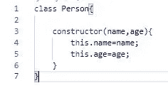

Person class

至此，我们学习了如何创建 Person 对象，并对它们的属性进行了一些处理:姓名和年龄。

我想指出的是，尽管我们可以在*实例化*或*创建*我们的对象时将数据传递给构造函数，但我们没有。

比较下面的三个代码示例。第一个在创建时设置属性 name 和 age。第二个和第三个在对象创建后设置 name 和 age 的值。他们都达到了同样的结果。

**例 1**

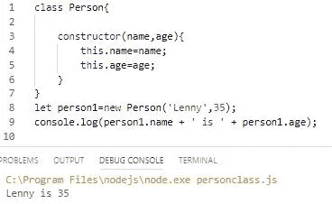

Setting the properties upon creation

**例 2**

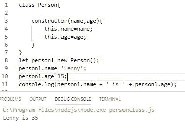

Having, but not using the constructor parameters

第三个变体在构造函数中没有参数。**注意属性只是被声明，而不是被初始化。**如果需要，我们可以设置默认值。

**例 3**

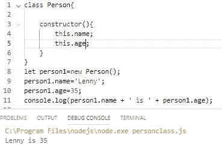

No constructor parameters

对你自己来说，你可以选择一种方法，或者三种都用。

> 第二个(例 2)是最灵活的，因为它为消费或使用该类的人(可能是您或另一个开发人员)提供了更多关于如何创建他们的对象的选项。

为了证明我上面的陈述，请看下面。请注意，在使用示例 2 中的语法时，我是如何用三种不同的方式构建对象并设置它们的属性的。

**例 4**

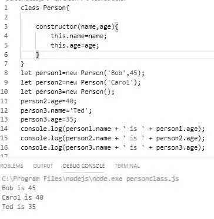

> 我们会说这个类有 ***重载*** ，这仅仅意味着我们有多种创建对象的方法。

> 我鼓励你仔细研究这些，并进行比较。键入它们并进行实验。

# 构建更加结构化和功能化的类

现在我们有了基础，我们需要实现约定和最佳实践。

此外，除了存储数据之外，我们还想给我们的类添加一些功能。

首先，请注意，让我们这一类的消费者能够直接使用属性并不被认为是好的设计。

我们所做的是通过使用 setter 和 getter 方法来“屏蔽”我们的实际属性，它们将具有我们属性的名称。

然后，我们将在实际存储数据之前添加逻辑和检查。

在下一个例子中，我将展示与 get 和 set 方法一起使用的典型约定。这里有很多东西需要研究。一会儿我会进一步解释。

> 如果遵循，它给我们的类一个良好定义的结构，并开始构建功能。

**例 5**

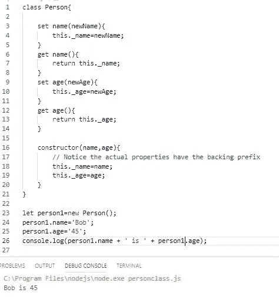

Set and get methods

起初，这看起来工作量很大，因为输出看起来与我们最初的 Person 类没有任何不同。

然而，这为我们通过添加逻辑和检查来控制参数的设置奠定了基础。具体到我们的类，至少我们可以做这样的事情，

1.  验证传入名称，确保它至少有三个字符。
2.  验证即将到来的年龄，以确保它在我们想要的范围内。
3.  以特定格式返回数据。

事实上，我们的选择几乎是无限的。

**设置说明**

那么在例 5 中到底发生了什么呢？

set 和 get 方法用一个同名的方法*替换属性名，但是在使用时表现得像一个属性*。

当我们说 person1.name='Bob '，*它实际上调用了 set 方法，set name(newName)* 。然后，该方法将真实重命名属性 _name 的值设置为“Bob”。

注意语法 person1.name='Bob '就像我们在开始时设置属性的方式一样。但是它是通过一个方法传递的，*这给了我们控制数据的能力。*

> 但是现在，我们可以在设置实际属性之前，在 set 方法中运行逻辑(或检查),这一点很快就会显示出来。这提供了更多的控制！
> 
> 如 MDN 网站*所述，set 方法语法将对象属性绑定到试图设置该属性时要调用的函数。*

上面提到的函数是 out set 方法。

**获取的解释**

我不会详细阐述 get 方法，因为它执行与 set 类似的功能，但会返回 dats。它也像实际的属性一样。但是它也可以有在返回属性值之前运行的逻辑。

**重要！**

> 按照惯例，set 和 get 使用与原始属性相同的名称。因为这样做了，所以原始属性应该由支持前缀“_”来区分。

不要求使用支持前缀，这是惯例，但是 set 和 get 方法名**必须**不同于属性名。

*无法区分属性名和用于 set 或 get 的名称将导致溢出*。见下文。

这是因为当一个 set 或 get 使用它的名字被调用时，并且 set 或 get 也使用这个名字，它无限地调用它自己。请看下面，在这里我为每个属性设置并获取与属性相同的名称。

**例 6**

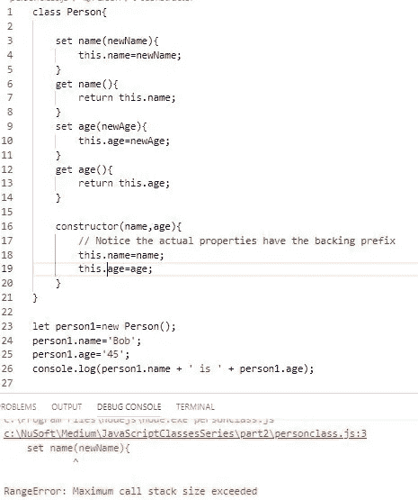

Keep property names different from set and get names. Backing prefix is the convention

# 添加逻辑

现在我们有了一个定义良好的结构，让我们添加我们一直在讨论的逻辑。

我们将做一些简单的事情来演示它是如何工作的。我鼓励你尝试更多的逻辑和检查。

这是我希望我们做的，

1.  在 name 的 set 方法中，确保名称的长度至少为三个字符。
2.  在 name 的 get 方法中，检查以确保名称存在，如果不存在，则返回一条消息。
3.  在年龄的设置方法中，确保年龄在 1 到 125 之间。

**例 7**

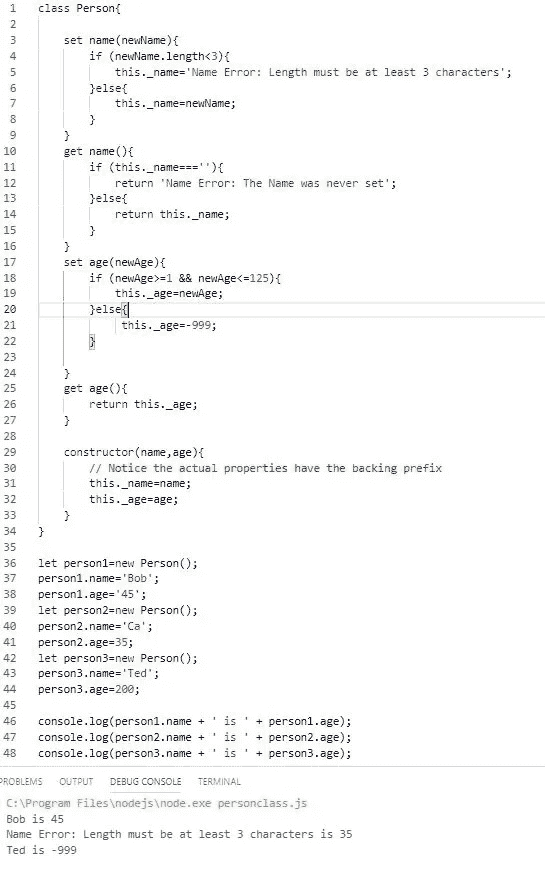

Testing get and set logic

这是一个简单的演示，但它清楚地表明了设置和获取的目的是什么。还要注意，get name()逻辑对空字符串的检查不为真，因为 set name()逻辑会处理这一点。

查看 get name()逻辑。

**例八**

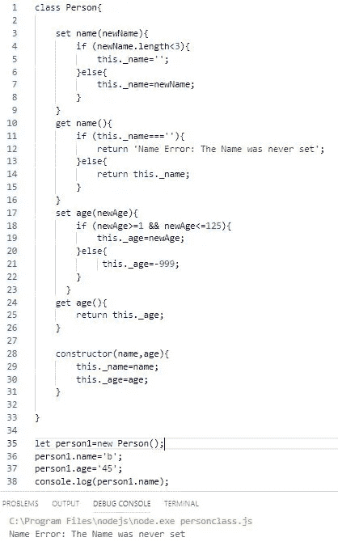

get name() logic

重要的是要注意，因为构造函数是一个方法，它也可以有逻辑。这将不会在这里处理，但会在第 3 部分做一个很好的演示。

# 方法

你可能还记得我们提到过，类可以有*属性*和*方法*。我们已经看到了构造函数、set 和 get 的特殊方法。

我指的是其他方法。

**什么是方法？**

> 方法是一个函数。

当我们在一个类中编写方法时，我们给它一个名字，但是不使用*函数*关键字。虽然属性是对象的数据，但方法通常被称为行为。

我们使用语法 objectName.methodName()调用函数。

方法以及 set 和 get 可以出现在构造函数的上面或下面。

> 方法决定了类的功能。

**例 9**

在这个例子中，我们将编写两个方法。一个显示人的姓名和年龄。另一个是考虑到他们年龄的增长。

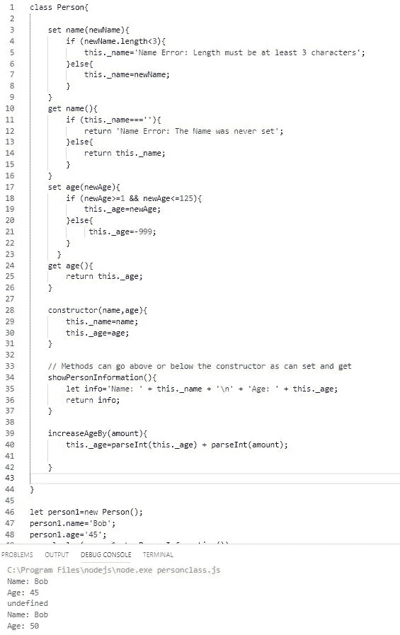

Methods are the functionality of the class

我们当然可以添加更多的功能，更多的数据检查和处理。但是这将为您提供一个良好结构的函数式 simple 的良好起点。

# 结论:

在第二部分中，我们介绍了一些额外的术语，但最重要的是学习了如何构建一个结构良好的类，能够将其数据和功能封装在一个对象中。

**综上所述，**

1.  构建您的类。
2.  用逻辑添加 set 和 get 方法。
3.  用方法添加功能。

**第二部分结束**。请和我一起看第三部分，

1.  继续在我们的课上探索方法。
2.  在我们的类中使用类。

> 我鼓励你去尝试。

同时，感谢阅读！

*   第三部分
*   [有趣的使用案例](https://medium.com/javascript-in-plain-english/a-practical-use-case-for-javascript-classes-8558f2ee1b09?source=friends_link&sk=e761504545af36df0bc83ff61f381283)
*   [实际使用案例](https://medium.com/javascript-in-plain-english/a-practical-use-case-for-javascripts-object-assign-3c37e2e42d42)

或者跳到[第四部](https://link.medium.com/nrwjRHTQH0)

## 附录

自从我最初发表这篇文章以来，就有人问我应该或者必须在哪里设置属性。它们不必在构造函数中设置。它们只能由 set()方法设置。

我如何做取决于我想如何使用这个类或者我想如何让别人实现这个类。

如果将属性放在构造函数中，参数放在构造函数中，那么类的使用者可以选择在实例化时填充类。如果您还提供了 set()方法，它们可以实例化一个空对象，然后在以后设置属性。下面是两个简单的例子。为了说明这一点，我把这些保持得非常简单。

**例 10:构造函数和 set()方法中的属性。**

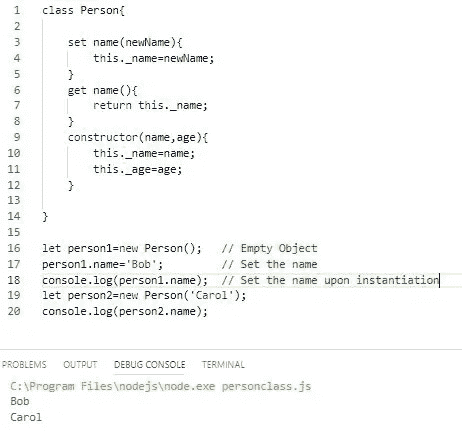

Two options for the consumer of the class

**示例 11:构造函数中没有属性。**

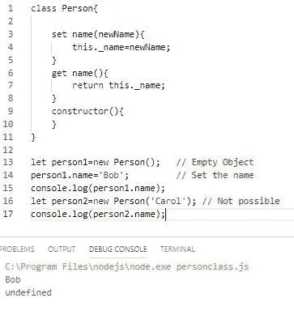

Only settable in with the set() method.

不管怎样，您必须有一个构造函数来构建对象。

感谢阅读！