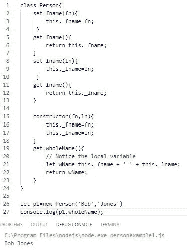
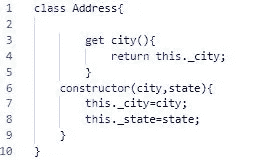

# JavaScript 类:深入研究(第 3 部分)

> 原文：<https://javascript.plainenglish.io/javascript-classes-an-in-depth-look-part-3-ecadd02addbc?source=collection_archive---------3----------------------->

## 做一名优秀的 JavaScript 开发人员

**欢迎回来**

我希望你们都喜欢《T2》1 和《T4》2 的部分。

在前两部分中，我们学习了类的基本结构，它们的用途，以及如何通过实例化来创建对象。然后，我们努力理解并实现了 getter 和 setter 方法。最后，我们通过添加方法(函数)和一些代码来添加逻辑，从而增加了类的功能。

# 第三部分

在这一部分，我们将，

1.  继续使用额外的方法和代码供外部使用。
2.  在类中添加消费方法。
3.  用我们班的其他班。

和以前一样，

> 我鼓励你编码，探索和扩展我们创造的东西。

# 我们开始吧

我们将从第 1 部分和第 2 部分中使用的 Person 类的一个简单变体开始。我们将把它简化为只有人的名和姓的属性。

这将允许我们在不使代码失控的情况下尝试不同的功能。

## 示例 1

创建以下人员类。在接下来的几个例子中，我们将为它添加各种功能。

Basic Person class

接下来让我们添加基本的 set 和 get 方法。请记住，通过在构造函数和 set 方法中设置参数，我们为类的使用者提供了两种设置名字和姓氏的选择:在实例化期间或之后。

还值得注意的是，虽然它们被称为 get 和 set 方法(函数)，但关键字 set 和 get 使它们的行为类似于属性。您给它们赋值，而不是用括号将值传递给它们。换句话说，你用 p2.fname='Lenny '，而不是 p2 . fname(' Lenny ')；

Good initial structure and functionality

## 示例 2

**增加更多功能。**

在示例 2 中，我希望我们在类中构建一个方法来提供这个人的全名。

Notice the local variable wName

*这是一个方法，因此用括号()访问。如果我们喜欢像访问属性一样访问它，就在 wholeName()方法中加入 get from 这个词。*

Notice “get” in line 19 and no parentheses in 27

我将返回到 wholeName()作为一个方法，但这真的没有什么区别。

> 如果你没有使用 get 和一个方法，你必须使用括号，它是一个函数。
> 如果在方法中使用 get，则不能使用括号，它被视为属性。有意思！

## 示例 3

使用在类内部访问方法。

> 注意，为了在类内部访问一个方法，我们必须使用关键字。

Notice this.makeName() and this.addGreet()

因此，我们看到，我们不仅在为外部消费创建方法，也在为内部功能创建方法。

## 实例 4

**重用你的内部方法。**

在这个例子中，我们将创建一个内部方法来验证名字和姓氏(确保它们至少有 3 个字符长)。)我们的目标是在多个地方重复使用这种方法。

这个方法将在类中的四个地方实现。构造函数中的两个 set 方法和两次。

Validation in setters and in constructor

## 实例 5

**使用你的类中的另一个类**

在这个例子中，我们不关注方法，而是关注创建可重用类的能力。我们将有一个雇员类和一个客户类。每个人都需要一个地址。为了解决这个问题，我们将创建一个地址类，并在 Employee 和 Customer 中使用它。

*为了保持对在类中使用类的关注，我们将保持方法和逻辑最少。*

让我们从创建地址类开始。

Minimum Address class

现在，为了简单起见，让我们在同一个文件中创建 Employee 和 Customer 类。

For simplicity, they are all in the same file.

在实现过程中，我们首先*创建地址对象*，这样它就可以在 Employee 对象的实例化过程中作为一个对象传递给 Employee 类。客户也一样。

# 结论:

在第三部分中，我们主要关注于通过添加供外部和内部使用的方法来为我们的类添加额外的功能。此外，在类中重用内部方法。我们学习了如何创建一个在其他类中使用的类，允许公共类的重用。

**第三部分结束**。请加入我的第 4 部分，

1.  用扩展探索继承。
2.  了解超级()的用法。

> 我鼓励你去尝试。

同时，感谢阅读！

*   [第一部分](https://medium.com/swlh/javascript-classes-an-in-depth-look-part-1-47d8f4e77cbd?source=friends_link&sk=f8c5fb49a292300531cfff8d08e9b5df)
*   [第二部分](https://medium.com/swlh/javascript-classes-an-in-depth-look-part-2-88b666ed3546?source=friends_link&sk=3dd83e4d62cd46f785f0d7d6f9e240f4)
*   [第四部分](https://medium.com/javascript-in-plain-english/javascript-classes-an-in-depth-look-part-4-8db6df2d16cf)
*   [一个有趣的用例](https://medium.com/javascript-in-plain-english/a-practical-use-case-for-javascript-classes-8558f2ee1b09?source=friends_link&sk=e761504545af36df0bc83ff61f381283)