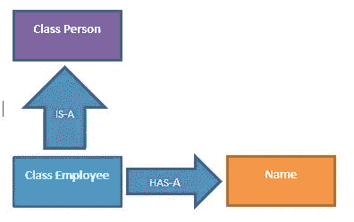
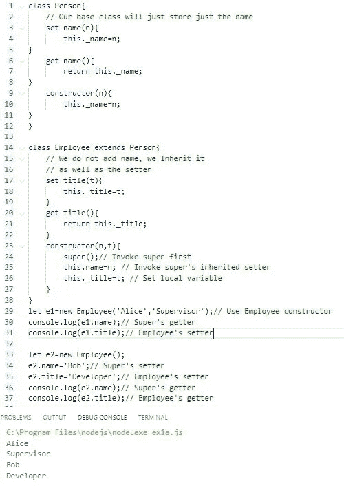
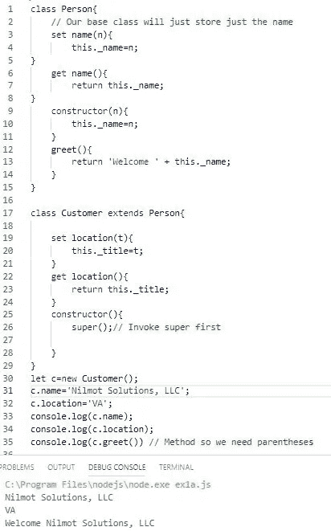

# JavaScript 类。深入的观察。第四部分。

> 原文：<https://javascript.plainenglish.io/javascript-classes-an-in-depth-look-part-4-8db6df2d16cf?source=collection_archive---------2----------------------->

## 您现在是一名优秀的 JavaScript 开发人员

欢迎回到这个系列。

*   [第 1 部分](https://link.medium.com/USs9sPFoyZ)重点介绍了类的核心结构、重要概念和术语。**通过属性添加数据。**
*   [第 2 部分](https://link.medium.com/5tVIHlNvyZ)重点介绍了特殊的 *set()* 和 *get()* 方法以及添加的功能。**通过类方法添加行为。**
*   [第 3 部分](https://medium.com/p/ecadd02addbc)更详细地聚焦类*方法*，内部和外部，并添加额外的代码逻辑。

# 第四部分

> 是时候扩展我们的课程了

> 是的。
> 最后， [**继承**](https://en.wikipedia.org/wiki/Inheritance_(object-oriented_programming)) 。在我看来，面向对象编程最重要的特性之一。

## 遗产

有了的继承，我们从一个 [***基类***](https://www.techopedia.com/definition/26896/base-class)*和 ***扩展*** 它来创建一个或多个*或子类。**

**结果是一个**父**或**超**类和一个或多个子类。**

**之所以称之为继承，是因为您的子类*继承了*超类的所有属性和方法，同时允许我们向子类添加额外的属性和方法。*这些附加的属性和方法只属于子类，不属于超类。继承是一种方式。***

> **在 JavaScript 中，继承是通过关键字 extends 实现的。**

# **我们开始吧！**

**我们将创建一个基类 Person，然后将其扩展为两个子类 Employee 和 Customer。**

**你的时间是宝贵的，所以我们将保持这些课程的简单性，只关注继承的话题。**

## **示例 1**

**首先，我们将创建我们的 Person 类并测试它。**

****

**Base class, Person**

**接下来，我们将把它扩展到 Employee 子类。当我们这样做时，它创造了一种“是-是”的关系。**

**员工**就是**人。**

> **之前没有提到的是 HAS-A 关系。这基本上是一个类的属性。**

**人物**有一个**的名字。因为雇员是一个人的延伸，所以雇员也有名字。**

****

**IS-A, HAS-A relationships**

**将 Person 视为**的超类**，将 Employee 视为**的子类**。**

**添加下面的类 Employee，并测试它。**

****

**Pretty Cool!**

## ****观察结果****

1.  **雇员是人的延伸。**

**2.我们继承了 Person 的属性和方法(在这个例子中是 get 和 set)。**

**3.要设置继承属性的值，我们可以使用 super 的 set()方法。注意第 25 行和第 34 行中 super 的 set()的使用。(还有其他方式比如调用 super(n)，在构造函数中。)**

**5.要获得继承属性的值，我们可以使用 super 的 get()方法。注意第 30 行和第 36 行中 super 的 get()的使用。**

****4。关键**。在构造函数中，super()；必须在设置本地属性或继承属性之前调用。换句话说，必须在构造函数中首先调用 *super。它可能是构造函数中唯一的项。***

**6.我们仍然可以实例化 person 类来获得 Person 对象，但是它们只有 name 属性。**

## **建议**

***如果您已经阅读了我的其他部分(尤其是* [*第 3 部分*](https://medium.com/p/ecadd02addbc) *)，您会记得我推荐使用 set 和 get 方法来设置和获取属性值，因为我们可以添加验证和其他代码来确保我们得到我们想要的。***

**正如我们在示例中看到的，您仍然可以让类的使用者能够在构造函数中设置属性值。更多信息参见零件的 [2](https://link.medium.com/5tVIHlNvyZ) 和 [3](https://medium.com/p/ecadd02addbc) 。**

> **但是，请注意，上述第 4 条适用于所有情况。**

## **可重用性**

**使用继承的一个主要原因是重用基类。我们将在下一个例子中这样做。我们将创建一个扩展 Person 的客户类。这样，我们的客户就可以通过继承获得一个名字以及一个本地定义的头衔。。我们还将在 person 类中添加一个方法来返回问候。这将被任何子类继承。**

****例 2****

****

**re-use of our base-class and inherited method, greet()**

**因为我们修改了 Person 以包含 greet()方法，所以我们的雇员也继承了它。**

# **结论**

**我们已经学习了 JavaScript 类的一个非常强大的能力的基础，继承。有了它，我们可以创建一个基类，并根据需要扩展它(并且仍然使用基类本身。)**

**我们可以扩展任何类，例如，我们也可以扩展 Employee。如果我们为全职员工和承包商提供不同的房产，我们可以建造，**

**类公司雇员扩展雇员**

**和**

**类合同雇员扩展雇员**

## **下一步是什么**

**在下一部分也是最后一部分，我们将探索更多关于**超级**和**覆盖**的概念。**

**我们还将关注真正私有的属性和方法。这将为我们提供真正的[面向对象编程规范](https://en.wikipedia.org/wiki/Object-oriented_programming#Encapsulation)，数据隐藏。遗憾的是，这仍处于提议阶段。我们将探索一个部分解决方法。然而。**

**同时，感谢阅读！**