# JavaScript 中子类和继承的工作方式

> 原文：<https://javascript.plainenglish.io/javascript-classes-inheritance-f4a1b516b160?source=collection_archive---------5----------------------->

## JavaScript 类、扩展和超的介绍

大家好，今天我又回到了 JavaScript 类介绍的第二部分。

今天，我要覆盖子类、继承、 ***、*** 和 ***超*** 关键词。所以，事不宜迟，让我们开始派对吧。

在我的上一篇文章中，我将 JavaScript 类与 Chipotle 进行了比较。事实上，我说过“我喜欢把一个类想象成 Chipotle 人们进去，出来的时候带着墨西哥卷饼。”你可能知道，你不仅限于墨西哥卷饼。你也可以吃墨西哥卷饼碗、墨西哥玉米卷或墨西哥玉米卷沙拉，但所有这些食物在配料方面仍然和墨西哥玉米卷饼有相同的选择。

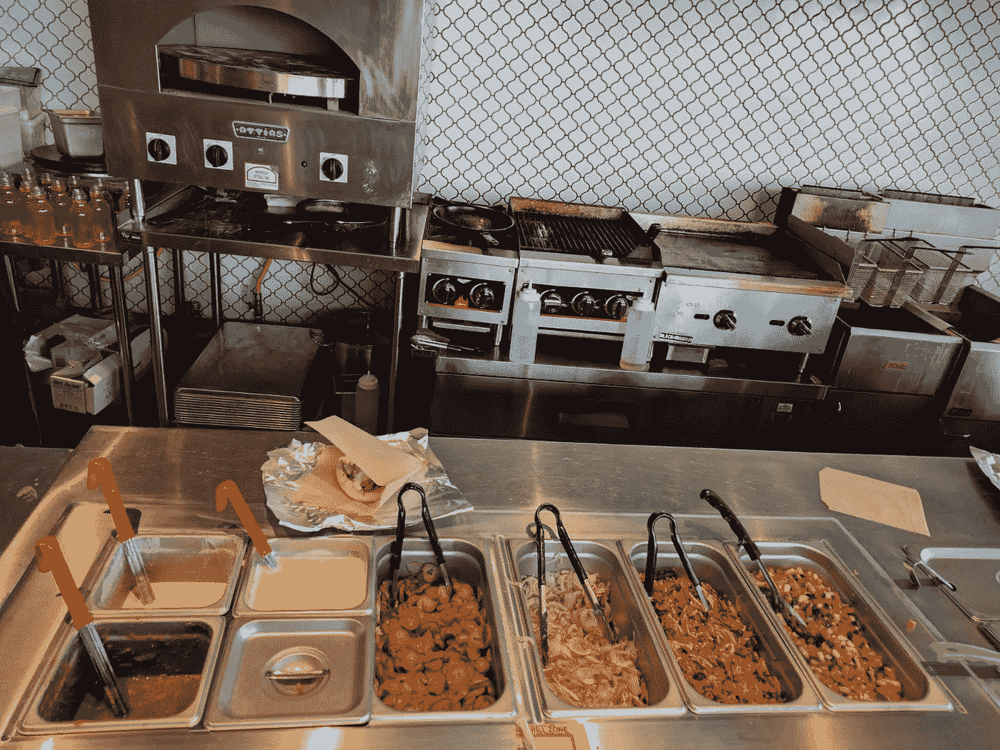

所以，修正一下我之前的说法，我喜欢把“父类”想象成 Chipotle 人们进去，出来就有饭吃。但是那些食物呢？它们可能彼此不同，但它们是由相同的成分制成的。

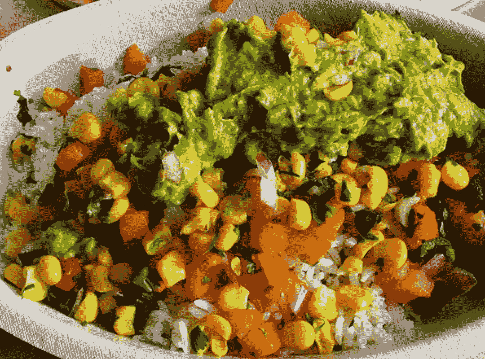

为了创建一个父类，我们需要考虑的第一件事是所有的饭菜有什么共同点。无论你是吃墨西哥卷饼、墨西哥玉米卷、墨西哥玉米卷碗还是墨西哥玉米卷沙拉，它们都有以下选择:生菜、豆类、蛋白质、蔬菜、奶酪、番石榴、酸奶油和沙拉。对吗？既然你可以在不添加这些配料的情况下做墨西哥玉米沙拉，那就让我们给自己的父母做一份墨西哥玉米沙拉吧。

步骤 1:类声明

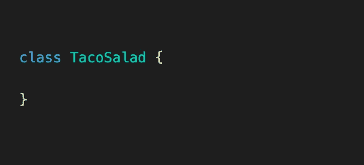

既然我们已经声明了 TacoSalad 类，我们想添加 ***构造函数*** 方法。请记住，构造函数方法就像你的墨西哥卷饼艺术家(在这种情况下是你的膳食艺术家)，这意味着我们需要给它所有配料的参数来制作墨西哥玉米沙拉，就像这样。

步骤 2:添加构造函数和方法

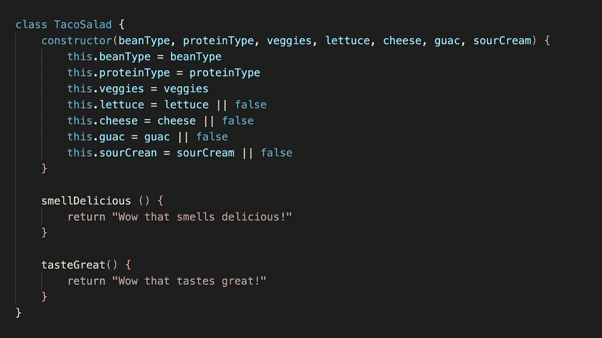

现在我们可以用我们选择的任何配料做沙拉，这并不坏，对吗？但是，如果一个顾客进来，他们想要一个玉米煎饼碗呢？我们可以创建一个名为玉米煎饼碗的新类，但是玉米煎饼碗和墨西哥玉米卷沙拉看起来非常相似。这就像有一个玉米卷沙拉配料站，一个玉米卷碗配料站，一个玉米卷配料站，一个玉米卷配料站。

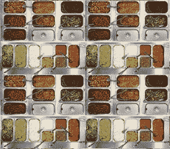

那是相当多余的，对吗？相反，我们可以将大米添加到配料站，只在需要的时候添加到食物中。这将是一个使用 ***扩展*** 关键字的好机会；我们可以使用扩展来创建一个类，它是 TacoSalad 的子类。子类将继承父类的所有键值对和方法…有点像我继承了我父亲的发际线。让我们来看看这是如何工作的。

步骤 1:带有扩展的类声明

既然我们已经声明了我们的 BurritoBowl 类，我们需要给它一个 ***构造函数*** 方法，就像我们对我们的 taco 沙拉类所做的那样，但是我们要在构造函数中放什么呢？对我来说，它看起来像一个墨西哥卷饼碗，除了它在一层米饭上之外，它的配料和玉米卷沙拉一样，所以让我们给构造函数添加一个 riceType 参数。

第 2 步:添加一个构造函数方法

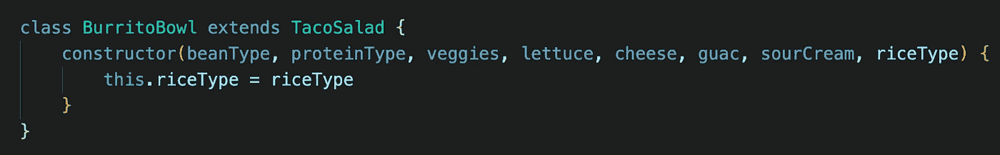

在这一点上，如果我们实例化一个新的 BurritoBowl 实例，我们将会得到一个错误，因为我们正在扩展玉米沙拉类，但是我们没有使用 ***super*** 关键字。 ***构造函数*** 可以使用 super 关键字调用父类(或“super”)的构造函数，允许子类从其父类继承所有的键值对和方法。哇，那个关键词真的很棒！…它将为我们节省大量的代码。让我们看看它是如何工作的。

第三步:添加超级关键词

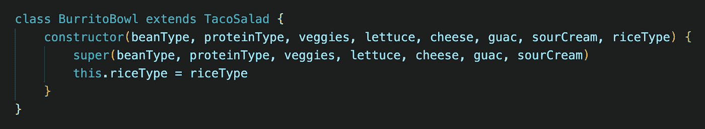

让我们创建一个新的 BurritoBowl 实例，看看它是如何工作的！请注意，因为我们的 BurritoBowl 接受 riceType 的一个额外参数，所以我们将把它包含在 BurritoBowl ***构造函数*** 中，但是，因为 taco 沙拉不接受这个参数，所以我们将它排除在 ***超级*** 之外。

步骤 4:实例化类的实例

//向 fajita 蔬菜数组添加更多内容

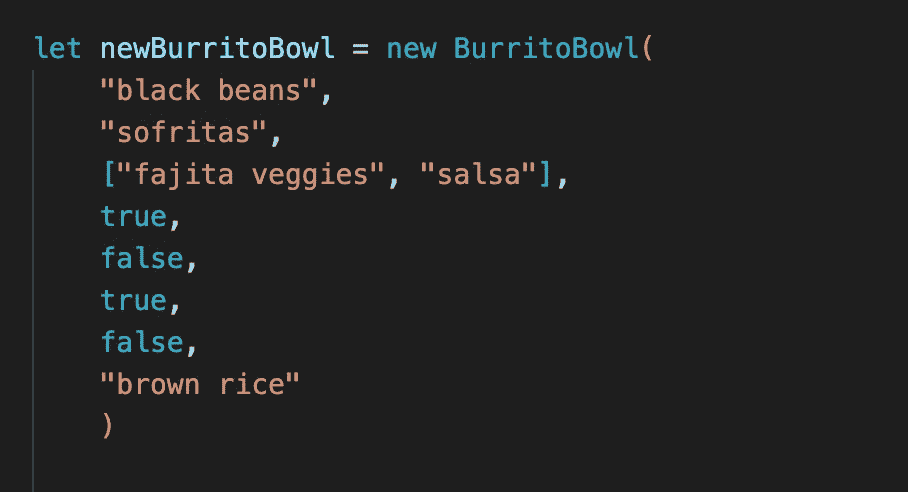

现在，如果我们记录 new 膳食(我们新的 BurritoBowl 实例)，您可以看到它继承了 TacoSalad 的键值对，并且它还有一个 riceType 属性。我们也可以登录 BurritoBowl.smellDelicious 美味()，看到它也继承了 TacoSalad 的方法。

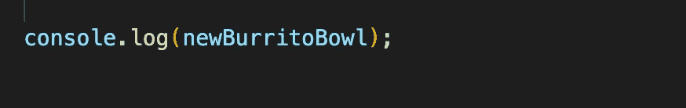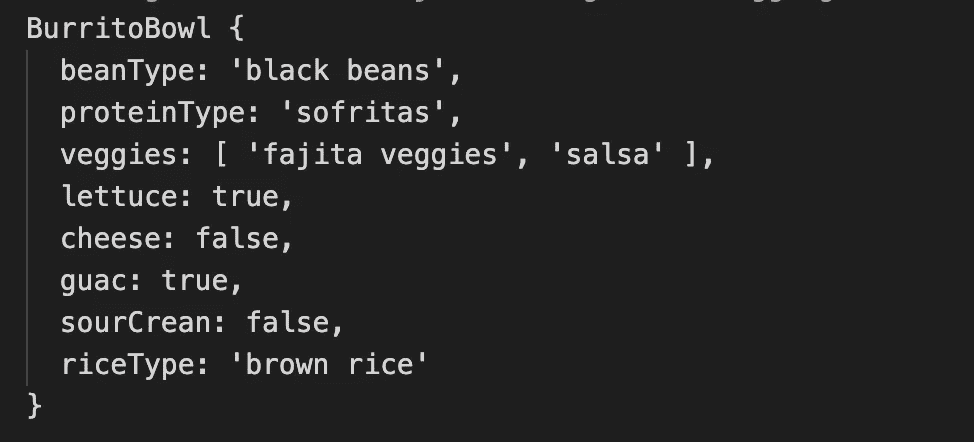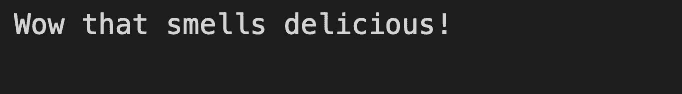

既然您已经知道如何创建子类，让我们创建一个塔科和布里托类。向下滚动之前，请继续并尝试一下。如果你感觉非常自信，试试给塔科课程增加一个新的方法。

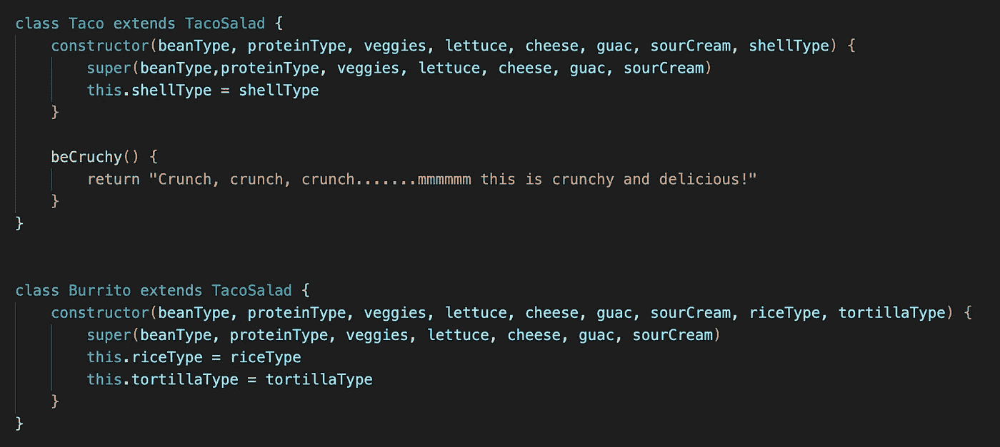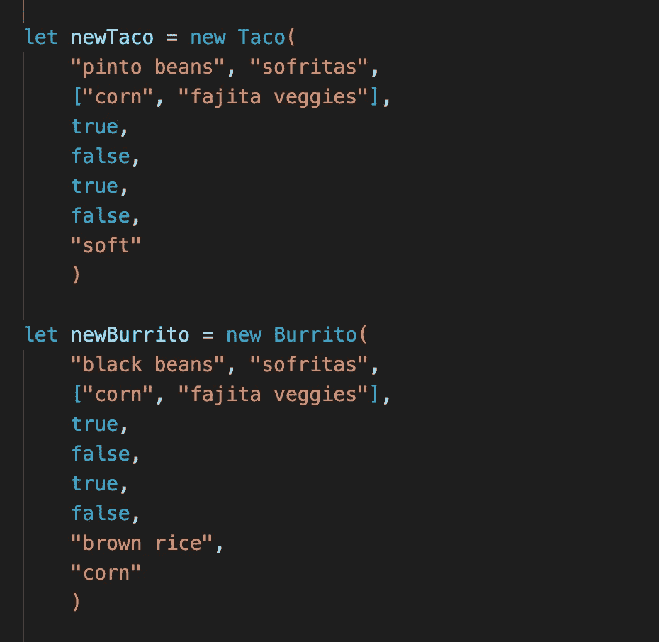

展望未来，如果我们决定在菜单中添加新的项目，我们可以使用 ***extends*** 和 ***super*** 关键字来创建一个子类，而不是复制代码。

在这篇博文中，我们讲述了如何使用继承以及 ***扩展的*** 和 ***超级*** 关键词来创建子类。我们还讨论了使用子类来生成干净的、可重用的代码的优点。我希望你觉得这篇文章很有帮助；如果你有任何你希望我在未来报道的话题，把它们放到评论中。