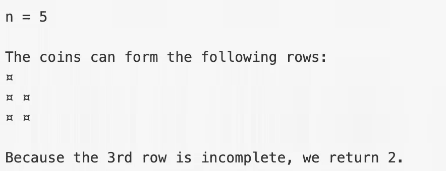

# JavaScript 编码问题(排列硬币)

> 原文：<https://javascript.plainenglish.io/javascript-coding-problem-arranging-coins-b12a20c82191?source=collection_archive---------2----------------------->

# 这个问题是在哪里问的？

Leetcode 正在进行每月一次的挑战，在 7 月的每一天，他们将每天发布一个问题，每个人将有 24 小时的时间来提出解决方案。所以，我决定抓住这个机会，通过每天解决一个问题来提高我的编码技能，并与我所有的媒体家人分享我的方法和想法。

你可以在下面找到挑战的链接。

 [## 帐户登录- LeetCode

### 提高你的编码技能，迅速找到工作。这是扩展你的知识和做好准备的最好地方…

leetcode.com](https://leetcode.com/explore/challenge/card/july-leetcoding-challenge/544/week-1-july-1st-july-7th/3377/) 

# 为什么我决定选择 JavaScript 作为编码语言？

对于选择哪种编码语言来解决 Leetcode 上的这些挑战，没有这样的限制，但是我选择了 JavaScript，原因如下:

1.  JavaScript 是技术行业广泛使用的语言。
2.  编码语言只是一种工具，只要你有逻辑，你可以用任何语言来编写你的逻辑。
3.  JavaScript 是一种容易学习的语言，我想借此机会提高我的 JavaScript 知识。

讨论到此为止，让我们快速进入问题和围绕其解决方案的讨论。

# 问题陈述

你总共有 **n 个**硬币，你要组成一个楼梯形状，其中每**个第 k 个**行必须正好有**个 k 个**硬币。

给定 **n** ，求可以形成的**全**楼梯排的总数。

**约束:-** **n** 为非负整数，在 32 位有符号整数的范围内。

# **样本输入和输出**

# **问题说明**

从上面的例子中，我们可以清楚地看到，给我们提供了 **n** 枚硬币，我们需要以这样的方式放置硬币，即每一行的位置应该等于该行硬币的数量， 因此**第一行**将有一枚硬币**第二行**将有两枚硬币，最后我们需要返回满足上述条件的最后一行的值，在上面的示例中，我们看到**第三行**没有三枚硬币，因此我们返回两枚作为最终输出。

# 算法

*   声明三个变量`i, coins, cnt`，其中 I 跟踪当前行，coins 跟踪到目前为止我们总共投入的硬币数量， **cnt** 跟踪到目前为止的有效行。
*   用条件`n-coins >= i`运行一个 while 循环，这样 **(n-coins)** 给我们到目前为止剩余的硬币，我们可以把它们放在未来的行中，I 给我们提供当前的行号。一旦我们看到剩下的硬币少于排数，我们就确定我们没有办法放置，硬币数等于第**排和第**排，这样我们就跳出了循环。
*   最后返回 **cnt** 变量，我们用它来跟踪我们的有效行。

# **代码**

# 视频讲解

希望这篇文章对你有所帮助，并激励你加入 7 月的 Leetcode 挑战赛。