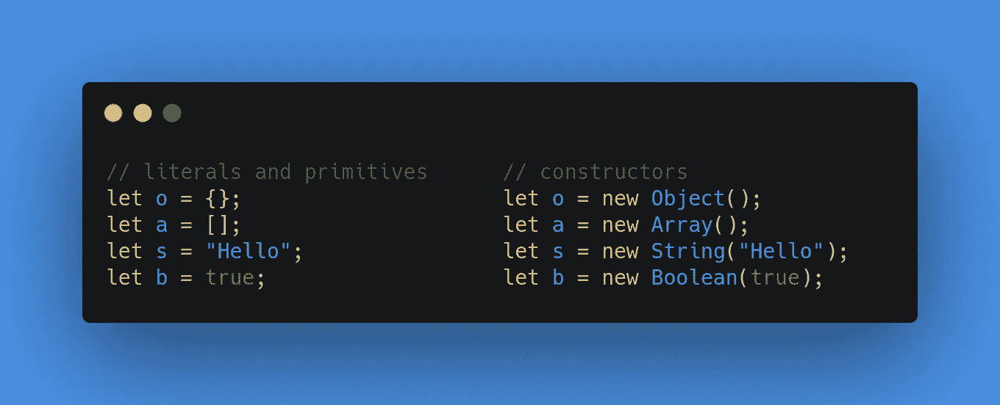

# JavaScript 中的构造函数与文字

> 原文：<https://javascript.plainenglish.io/javascript-constructors-vs-literals-2d19e8b5f2d9?source=collection_archive---------5----------------------->

在 JavaScript 中，我们确实有以不同方式获得相同结果的自由。我们可以创建字符串、数字、对象、数组等。同时使用构造函数和文本方法的值。使用这些方法中的任何一种都可以获得相同的值。然而，仍然有一些差异需要知道，哪些可能有助于避免运行时错误。

> 对于那些只阅读这段引文的人来说，长话短说，用
> **文字值创建值比内置构造函数要好。**

首先，如果你想知道这些是什么。



你可以继续使用字面量而不知道它们的区别，没有人会对你说什么。我知道，如果你有一颗好奇的心，你会继续阅读。但是特别是对于那些来自基于类的编程语言的人来说，您可能会倾向于使用构造函数方法。如果你是，那么你必须在继续编码之前阅读以下内容。

通常情况下，你应该**更喜欢文字** **和原语**和**避免内置构造函数**。

## 为什么更喜欢文字和原语？

1.文字较短，易于读写。

```
let o = new Object();let o = {}; // easier and actual representation
```

2.文本仍然可以受益于由构造函数创建的对象所提供的属性和方法。

```
let a = [1, 2, 3];
a.length // 3
a.slice(2) // [3]
```

3.当您在原语上调用一个方法时，它被隐式地转换为场景后面的一个临时对象。

```
let a = "Hello world";
a.toLowerCase() // hello world
a.length // 11
```

## **为什么要避免内置构造函数？**

1.当与动态参数一起使用时，new Object()会导致意外的结果，从而造成混乱。

```
let n = new Object(1) // Number {1}
typeof n // "object"
n.constructor === Number // truelet b = new Object(true) // Boolean {true}
typeof b // "boolean"
b.constructor === Boolean // true
```

2.new Array()使用不同数量的参数给出不同的结果。

```
let a = new Array(3) // [undefined, undefined, undefined]
a.length // 3let a = new Array(1, 2, 3) // [1, 2, 3]
a.length // 3let a = new Array(3.14) // Uncaught RangeError
```

3.新的 RegExp()，像反斜杠和引号这样的转义字符很无聊，降低了可读性。

```
let reg = /\\/g; // /\\/g
let reg = new RegExp("\\\\", "g") // /\\/g
```

4.在 JavaScript 中，您可以调用内置的构造函数，如数组、字符串等。没有使用“new”操作符，这有时可能会使您忘记使用使用“this”的“new”操作符调用自定义构造函数。

```
function Person(name) {
  this.name = name;
}let p = Person("Kelina");
p.name // undefined
```

当然，前面的语句不是错误，也不会降低任何性能，但是如果不小心的话，可能会导致意想不到的结果，从而引入错误。您仍然可以使用构造函数或文字，这实际上取决于您的偏好和必要性。

## **总结**

```
Literals and primitives   |  Built-in constructorslet o = {};               |  let o = new Object();let a = [];               |  let a = new Array();let s = “”;               |  let s = new String();let n = 0;                |  let n = new Number();let b = false;            |  let b = new Boolean();let reg = /[a-z]/g;       |  let reg = new RegExp( "[a-z]", "g" );throw {                   |  throw new Error(“oops... error”);
  name: “Error”, 
  message: “oops... error” 
};
throw Error(“oops... error”);
```

虽然每种方法都有自己的好处，但一般来说，在大多数情况下使用文字就足够了。一如既往，感谢阅读。