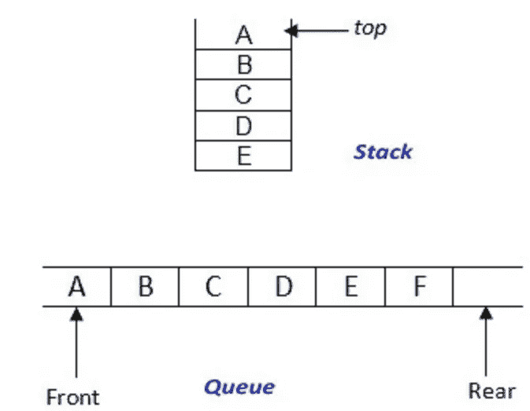
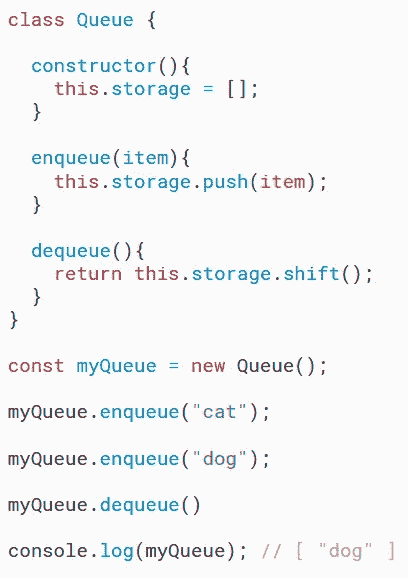
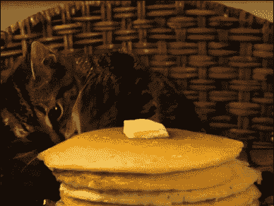
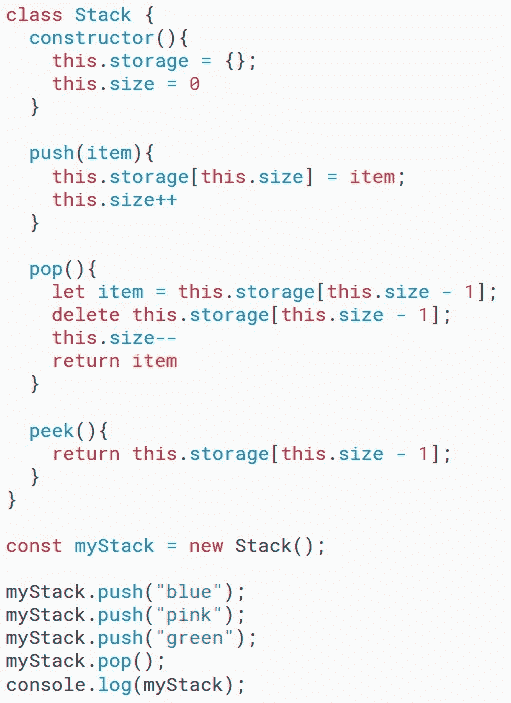

# JavaScript 数据结构:队列和堆栈

> 原文：<https://javascript.plainenglish.io/javascript-data-structures-queues-and-stacks-3708dd07f188?source=collection_archive---------8----------------------->

在这篇文章中，我们将脱离通常的 JavaScript 问题解决教程，讨论两种常见的数据结构，**队列**和**堆栈**。

**什么是数据结构？**

JavaScript 中的**数据结构**是一种用于有效组织、存储和访问数据的技术。这些值的集合拥有许多可以应用于存储数据的内置函数和操作。使用数据结构的一些好处包括简化大型数据集的处理和管理，以及提高程序算法的效率。

什么是队列？

队列是一种线性数据结构，遵循**F**first**I**n**F**first**O**ut(或 FIFO)算法。 **FIFO** 表示进入队列的第一个元素将是从队列中移除的第一个元素。为了帮助巩固这一概念，可以把排队想象成游乐园里乘车的队伍。第一个排队的人是第一个登车的人。在队伍中间等候的人直到他们之前的人都已经登车了才能登车。

This is **not** how a queue works.

队列可以访问一些基本的方法，比如`enqueue`、`dequeue`和`peek`，这些方法有助于修改或访问队列中的数据。

向队列添加数据的过程称为**入队**，而移除数据的过程称为**出列**。实现队列的一种方法是使用数组，我将在下面描述。

这里我使用数组和内置数组方法创建了一个`Queue` 类。`constructor`方法将每个`queue`实例的存储设置为一个空数组，而`enqueue`和`dequeue`方法使用`push()`和`shift()`从每个队列中添加和移除数据。在示例中，我在`myQueue`上调用了`enqueue`两次，并添加了字符串`“cat”`和`“dog”`。调用`dequeue`后，`myQueue`中的第一个字符串`“cat”`被删除，只剩下`“dog”`。

**什么是栈？**

与**队列**一样，**堆栈**是一种类似有序列表的线性数据结构，我们可以向其中顺序添加数据。堆栈通常遵循**L**ast**I**n**F**first**O**ut(或 LIFO)算法。 **LIFO** 意味着您最终访问或移除的数据是最后添加到堆栈中的数据。为了巩固这个概念，想象一堆煎饼。你放在**堆**上面的最后一个煎饼，是你拿起来吃的第一个煎饼。要够到中间的薄饼，唯一的方法是把它上面的薄饼都拿掉。

就像队列一样，堆栈也可以使用数组来实现。但是，我将向您展示如何使用一个对象实现一个堆栈，以防您的访问者明确指出您不能在您的实现中使用内置数组方法。

在这个例子中，我已经使用一个对象创建了`Stack`类。`constructor`方法将每个`stack`实例的存储设置为一个空对象，并将每个存储的大小设置为等于`0`。`push`方法将数据添加到堆栈中，`peek`方法显示堆栈中的最后一个元素，而`pop`方法从堆栈中移除最后一个元素。在示例中，我在`myStack`上调用了`push`三次，并将字符串`“blue”`、`“pink”`和`“green”`添加到`myStack`。调用`pop`后，`myStack`中的最后一个元素`“green”`被删除，只剩下`“blue”`和`“pink”`。

## **结论**

队列和堆栈是两种常见的 JavaScript 数据结构，可以使用数组和对象来实现。这些结构用于简化数据管理，同时提高算法的效率。通过掌握队列和堆栈，您可以确保您的代码是干净的、可维护的和高效的。

## **用简单英语写的便条**

你知道我们有四份出版物和一个 YouTube 频道吗？你可以在我们的主页 [**plainenglish.io**](https://plainenglish.io/) 找到所有这些内容——关注我们的出版物并 [**订阅我们的 YouTube 频道**](https://www.youtube.com/channel/UCtipWUghju290NWcn8jhyAw) **来表达你的爱吧！**