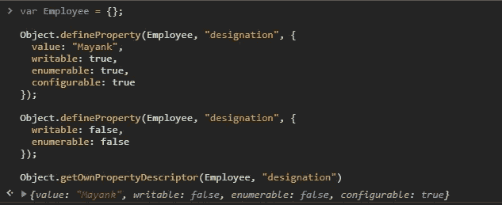
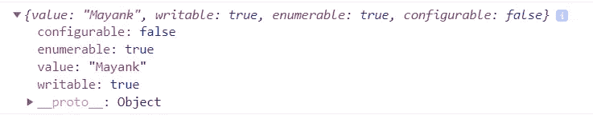
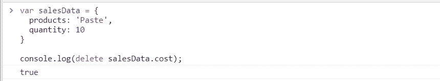
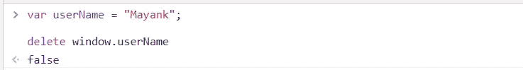
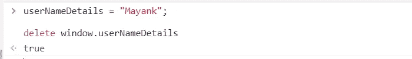
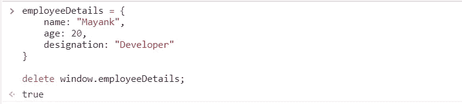
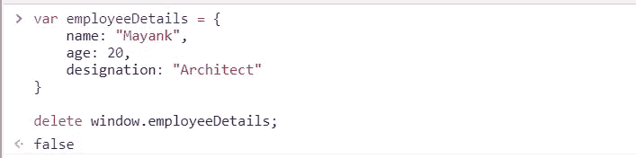
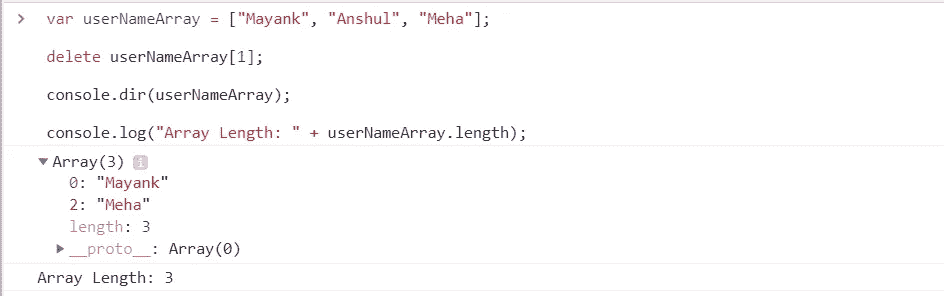

# JavaScript 删除关键字

> 原文：<https://javascript.plainenglish.io/javascript-delete-keyword-in-detail-4bdcf32dcdd8?source=collection_archive---------0----------------------->

## 使用 Delete 关键字从对象中删除属性

Illustration by [gustavofer74](https://pixabay.com/users/gustavofer74-791316/) on [Pixabay](https://pixabay.com/vectors/computer-keys-pc-delete-me-644457/)

本文的重点是理解关键字`delete`的用法和用例场景。我们还将了解如何删除不可配置的和全局的属性。

下面是我们将在本文中讨论的内容的概述:

*   在 JavaScript 中使用`delete`关键字
*   删除对象属性
*   无法删除 JavaScript 属性的情况
*   正确使用`delete`关键词

# 使用 Delete 关键字

`delete`关键字常用于删除 JavaScript 对象的属性。关于`delete`关键字的常见误解是，它被用来释放浏览器中的属性所占用的内存。但是`delete`属性不保证垃圾收集。

## 使用 delete 关键字

一旦`delete`关键字应用于特定对象属性，浏览器将执行以下步骤:

1.  属性是从对象中取消引用的。

一个对象可能包含多个属性，并且该对象包含指向这些属性所占用的内存空间的指针。

2.在执行垃圾收集时，这些解引用的属性可用于垃圾收集。

垃圾收集器在特定的时间间隔后执行。当垃圾回收执行时，它会寻找所有被取消引用的属性。然后释放这些被取消引用的属性所占用的内存。

**注意:**`delete`关键字与垃圾收集期间直接释放内存无关。

## 删除关键字的返回类型

1.如果属性被删除或没有找到，它将返回`true`。

2.如果不能删除该属性，它将返回`false`。

# Delete 关键字的语法

下面给出了一个简单的场景，其中:

1.属性`product`和`quantity`被添加到`Sales`对象中。

2.使用`delete` 关键字从`Sales`对象中删除`quantity`属性。

3.如果属性被删除，它返回`true`。

3.当用户试图访问`quantity`时，它是`undefined`。

[https://gist.github.com/Mayankgupta688/22ba941c2070e8587b4f64fb14b6d245](https://gist.github.com/Mayankgupta688/22ba941c2070e8587b4f64fb14b6d245)

更进一步，我们需要理解`delete`关键字以不同方式执行的其他场景。但是在进一步讨论之前，我们需要首先理解可配置属性的概念。

# 使用 defineProperty 向对象添加属性

让我们稍微偏离一下`delete`关键字的主题，进入 JavaScript 中的`defineProperty`的细节，以理解适用于`delete`关键字的更复杂的场景。

我们可以使用`defineProperty` 关键字为一个对象定义新的属性。当我们使用`defineProperty`时，我们提供了一些属性描述符。属性描述符包括指定以下属性。

当我们为对象定义一个属性时，默认情况下，它被创建为一个可配置的属性。我们为对象内部定义的每个属性都由以下描述符组成:

1.`value`:包含属性的值

2.`writable`:表示属性是否可以编辑/更改

3.`enumerable`:表示该属性是否可以枚举

4.`configurable`:表示是否可配置

在上面的例子中，我们创建了一个简单的对象`Sales`，并为它定义了多个属性。我们现在将看到使用`defineProperty`向对象添加新属性的其他方法。

[https://gist.github.com/Mayankgupta688/ac5c3221cd22102c66c485114b150ba3](https://gist.github.com/Mayankgupta688/ac5c3221cd22102c66c485114b150ba3)

在上面的代码中，我们向 employee 对象添加了一个新属性`“name”`。我们还为新定义的属性配置了描述符。

# 了解可配置描述符

在上面的代码中，我们将描述符添加到了`name`属性中；指定的描述符之一是`configurable`。让我们来理解一下这个`configurable`描述符的含义。

如果一个属性最初用描述符`configurable` 和一个真值标记，我们可以重新配置它。我们可以使用`defineProperty`关键字再次更新描述符。

让我们看看下面的例子。

我们将创建一个新的属性，并将描述符的值指定为`false`。将描述符指定为`false`意味着用户在描述符初始创建后将不能更新任何描述符。

让我们借助一个示例来看看这一点:

[https://gist.github.com/Mayankgupta688/1c2e369876800f02c2498b6e4d045db6](https://gist.github.com/Mayankgupta688/1c2e369876800f02c2498b6e4d045db6)

在上面的代码中，由于属性是`configurable`，我们可以更新最初为名称“property”定义的描述符。下面的代码不会给出错误。

现在让我们尝试更新不可配置的属性。让我们寻找相同的输出:

[https://gist.github.com/Mayankgupta688/b12172438dbc70bc2750c755d897beac](https://gist.github.com/Mayankgupta688/b12172438dbc70bc2750c755d897beac)

在上面的代码中，我们试图更新对象`Employee`的不可配置属性的描述符。

让我们看看上面执行的输出:

在上面的代码中，我们试图更新`designation`属性的描述符。最初，`designation`属性被设置为不可配置的属性。因为我们试图更新不可配置的属性，它返回错误通知我们属性不能被重新定义。

一旦配置被设置/更新，我们就可以在对象中寻找属性的描述符集。让我们看看所需的代码:

[https://gist.github.com/Mayankgupta688/3bb1f089dee11df67a0ae62127993f70](https://gist.github.com/Mayankgupta688/3bb1f089dee11df67a0ae62127993f70)

上面的代码将返回为`Employee`对象的`designation`属性设置的配置。让我们看看同样的输出:

现在我们知道了什么是不可配置的属性，让我们看看当我们将属性设置为不可配置时适用的一些特殊情况。

# Delete 关键字的特殊情况

## **1。试图删除不存在的对象属性**

在下面的代码中，假设我们试图删除一个对象中不存在的属性。让我们借助下面的例子来更好地理解这个场景:

在上面的代码中，我们观察到，如果我们试图删除不存在的属性，JavaScript 将返回`true`而不是返回一个错误。

## **2。不能删除用 var 关键字声明的变量**

默认情况下，使用关键字`var`添加到函数或全局范围的属性被标记为“不可配置”。

**注意:**不可配置的属性不能删除。

让我们尝试使用`var`关键字向函数范围添加一个变量，然后尝试删除创建的变量:

## **3。添加到没有 var 关键字的全局范围的属性**

如果一个属性被添加到一个没有`var`关键字的全局范围，它可以被删除。没有使用`var`关键字添加的属性被标记为可配置，可配置的属性可以被删除。

## **4。从窗口对象中删除对象**

在这个场景中，显示了相同的行为。如果使用`var`关键字将对象添加到`window`对象，则不能删除。用`var`关键字定义对象会将其标记为不可配置的属性。如果创建对象时没有使用`var`关键字，则可以将其删除。

定义不带`var`关键字的对象:

在上面的代码中，我们可以看到对象`employeeDetails`是在没有`var`关键字的情况下创建的。

因为它是在没有`var`的情况下创建的，所以可以将其从`window`对象中删除。

用`var`关键字定义对象:

在上面的代码中，我们在定义`employeeDetails`对象时添加了`var`关键字。因为我们已经添加了一个`var`关键字，所以`employeeDetails`属性被标记为不可配置，不能删除。

## **5。从数组中删除元素**

当我们试图从数组中删除一个元素时，它不会减少数组的长度。

相反，它将元素标记为`undefined`。让我们看看下面的例子:

在上面的例子中，我们可以看到值被标记为`undefined`，而不是从数组中删除元素。

# 结论

我希望你喜欢这篇文章。

*更多内容请看*[*plain English . io*](http://plainenglish.io/)