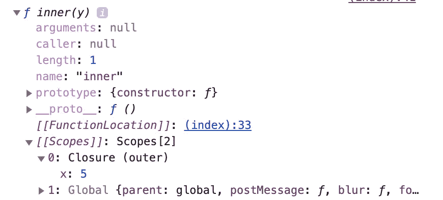

# JavaScript 设计模式—模块模式

> 原文：<https://javascript.plainenglish.io/javascript-design-pattern-module-pattern-555737eccecd?source=collection_archive---------2----------------------->

## Java Script 语言

## JavaScript 中最常见的模式之一


Photo by [sgcdesignco](https://unsplash.com/@sgcreative?utm_source=medium&utm_medium=referral) on [Unsplash](https://unsplash.com?utm_source=medium&utm_medium=referral)

有许多 JavaScript 模式可以让你的代码更加漂亮和稳定。编程设计模式已经存在了很多年，希望有一个更好的架构。今天我要讲的是 JavaScript 中一个简单但功能强大的设计模式，叫做模块模式或者闭包模式。

# 什么是终结？

闭包是一个引用了已经执行完的外部函数的函数。比如有函数，这个例子是解释闭包是什么的一个非常典型的例子。

```
function outer(x) {
  function inner(y) {
    return x + y;
  }
  return inner;
}const inner = outer(5);
inner(3); // 5 + 3 == 8
```

在本例中，内部函数由接受参数 x 的外部函数包装。内部函数也接受参数 y，它所做的是将两个参数相加并返回。



内部函数有一个新的作用域，名为 Closure，引用外部函数 x，那么在外部函数之外的作用域中，你不能访问 x，因为 x 只存在于外部函数的作用域内部。

闭包是 JavaScript 中神秘而有趣的东西。这似乎是一个神奇的咒语，*羽加迪姆·勒维奥萨* 🧙‍♂️.但是如果您了解 JavaScript 中的执行上下文，您会更好地理解这一点。如果你想了解更多的信息，我建议你先看看我的另一篇文章。

[](https://medium.com/better-programming/execution-context-lexical-environment-and-closures-in-javascript-b57c979341a5) [## JavaScript 中的执行上下文、词汇环境和闭包

### 你应该知道的高级 JavaScript 概念

medium.com](https://medium.com/better-programming/execution-context-lexical-environment-and-closures-in-javascript-b57c979341a5) 

# 模块模式

因此，我们可以利用闭包只能从函数内部访问的特性。

```
function jane() {
  const name = 'jane';
  const mid = 'A';
  const final = 'B+'; return {
    midtermScore: () => mid,
    finaltermScore: () => final,
  }
}jane().midtermScore(); // A
jane().finaltermScore(); // B+
```

在本例中，Jane 的期中和期末分数无论如何都不能修改。函数 jane 返回一个对象，该对象包含返回函数本身属性的其他函数。从作用域出简的角度来看，它不能访问里面的任何变量。

如果您以错误的方式过度使用闭包，它很容易导致内存泄漏，但是您可以安全地封装函数。如果你想修改变量，你需要做的只是在返回对象中添加 setter 函数。

```
return {
  getMid: () => mid,
  getFinal: () => final,
  setMid: score => mid = score,
  setFinal: score => final = score,
};
```

然后，改变 Jane 考试分数值的唯一方法是使用`jane`返回的对象中的方法。

# 生活中的习惯用法

通常，模块模式与 IIFE 一起使用。生命有自己独立的功能范围，没有人能从外面进入。

```
var stories = 'Medium Story';var medium = (function() {
  var stories = ['🍔', '🍟', '🍕'];
  return { getStories: stories };
})();
```

这样做的好处是，即使有一个变量与生命中的变量同名，它们的作用域也不会崩溃。此外，您还可以使用闭包，用这种模式创建私有变量或函数。

```
console.log(stories); // Medium Story
console.log(medium.getStories()); // ['🍔', '🍟', '🍕']
console.log(medium.stories); // undefined
```

在这种情况下，您无法访问`medium`中的`stories`，因为它只存在于函数范围内。访问它的唯一方法是使用`getStories`。

# Export 关键字的用法

自从 ES6 出现后，创建模块模式的方法变得简单多了。这种模式有多种方式，但基本上他们的概念是“将代码隔离到不同的文件中”。

```
const stories = ['🍔', '🍟', '🍕'];const getStories = () => stories;export { getStories };
```

并在不同的地方导入这个模块。

```
import { getStories } from '..';const stories = 'Medium Story';console.log(stories); // Medium Story
console.log(getStories(); // ['🍔', '🍟', '🍕']
```

# 与类一起使用

在 ES2020 中，增加了 JavaScript 类中的 private 关键字。所以现在你可以在现实生活中加上这个。可以用#关键字声明成员属性。

```
const stories = 'Medium Story';
class Medium {
  #stories = ['🍔', '🍟', '🍕'];
  get Stories() {
    return this.#stories;
  }
}const medium = new Medium();console.log(stories); // Medium Story
console.log(medium.Stories); // ['🍔', '🍟', '🍕']
console.log(medium.#stories); 
                   ~~~~~~~~
// Uncaught SyntaxError: Private field '#stories' must be declared in an enclosing class
```

但是你应该检查一下浏览器的支持状态，因为这是 JavaScript 中一个全新的特性。

# 额外收获:打字稿的用法

如果您使用 TypeScript，那么您甚至可以使用一个类来封装它们。

```
const stories = 'Medium Story';
class Medium {
  private stories = ['🍔', '🍟', '🍕']; get Stories() {
    return this.stories;
  }
}const medium = new Medium();console.log(stories); // Medium Story
console.log(medium.Stories); // ['🍔', '🍟', '🍕']
console.log(medium.stories); // ['🍔', '🍟', '🍕']
                   ~~~~~~~
// Property 'stories' is private and only accessible within class 'Medium'
```

即使变量 stories 在 Medium 中是私有的，您仍然可以访问它。因为 private 是一个只存在于 TypeScript 而非 JavaScript 中的关键字，所以当 TypeScript 将代码传输到 JavaScript 中时，它不做任何事情。

TypeScript 只是让你知道在你设置的规则下你做错了什么。实际上，如果不修复 TypeScript 错误，您就无法转换代码，但是转换后的代码与 JavaScript 类没有任何不同。您甚至可以通过添加这个注释来避免这个错误。

```
// @ts-ignore
console.log(medium.stories);// Now the error is gone
```

因此，TypeSript 可以帮助您避免人为错误。它实际上并没有创建一个模块模式，但是它可以帮助您创建一个合适的模块模式。

# 结论

JavaScript 中的模块模式绝对有用且强大。它将变量和函数隐藏在声明它们的范围内。而封闭是这个概念的根源。

# 资源

*   [JavaScript 模块模式基础](https://coryrylan.com/blog/javascript-module-pattern-basics)
*   [JavaScript 闭包和模块模式](https://www.joezimjs.com/javascript/javascript-closures-and-the-module-pattern/)
*   [出口— MDN](https://developer.mozilla.org/en-US/docs/web/javascript/reference/statements/export)
*   [导入— MDN](https://developer.mozilla.org/en-US/docs/Web/JavaScript/Reference/Statements/import)