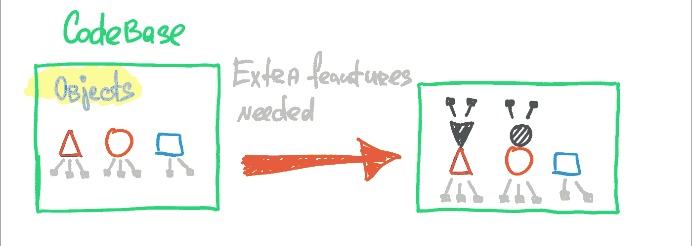
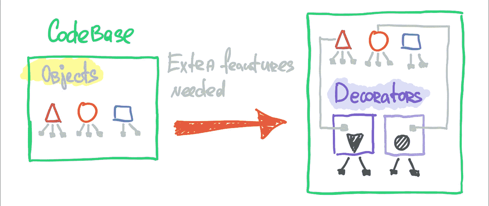
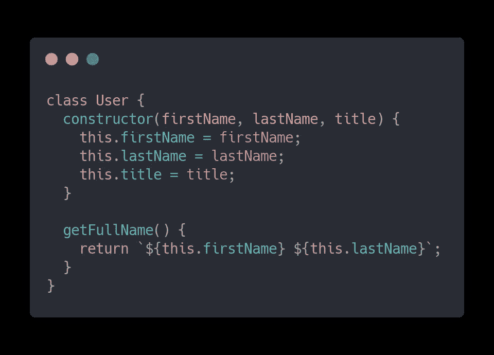
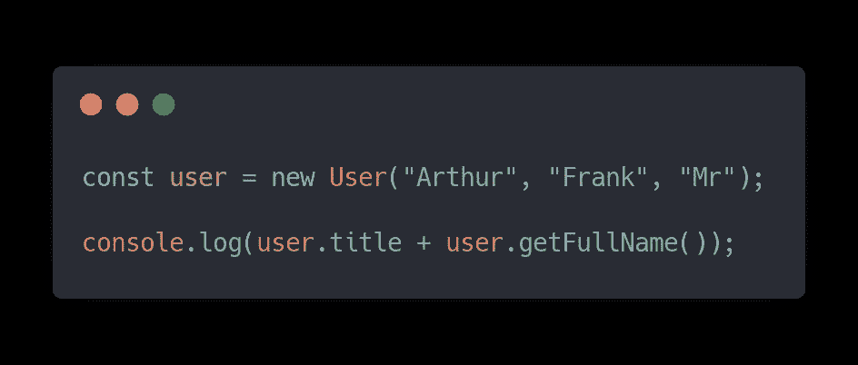
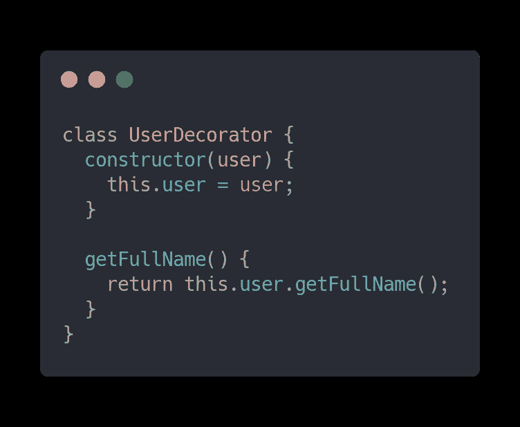
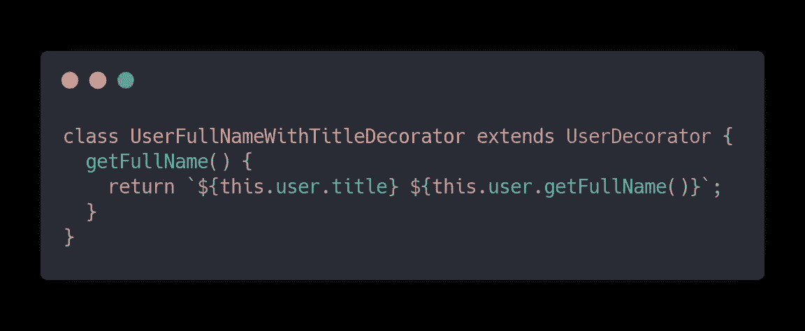
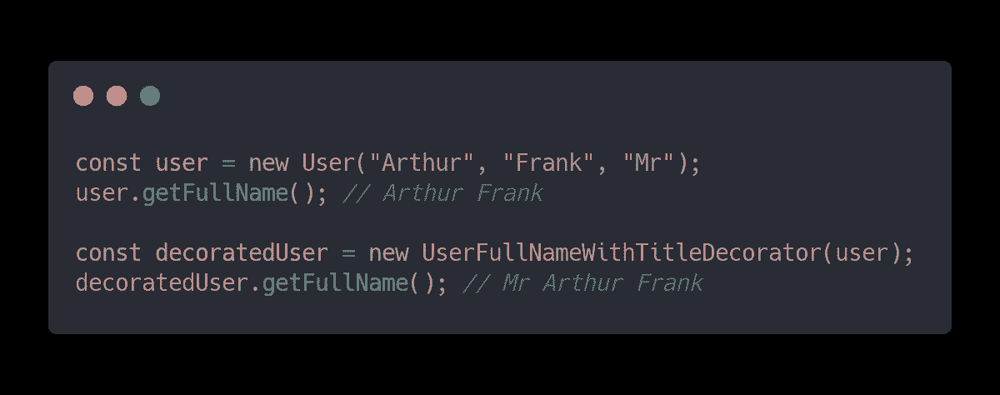

# JavaScript 设计模式——装饰模式

> 原文：<https://javascript.plainenglish.io/javascript-design-patterns-the-decorator-pattern-eaf6adc77cb7?source=collection_archive---------1----------------------->

Photo by [Vincent ROMAIN](https://unsplash.com/@vincentromain) on [Unsplash](https://unsplash.com?utm_source=medium&utm_medium=referral)

# 快速介绍

这是 **JavaScript 设计模式**系列的第三篇文章，我用简单的文字解释设计模式。网上的信息量大得不可思议，真的是让人摸不着头脑，枯燥无味。我的目标是用简单而愉快的方式解释复杂的事情。

我们已经在 JavaScript 中经历了以下设计模式:

*   [**工厂**](https://medium.com/javascript-in-plain-english/javascript-design-patterns-the-factory-pattern-6b399656d710)
*   [**适配器**](https://medium.com/javascript-in-plain-english/javascript-design-patterns-adapter-explained-cbcffbb4b8bc)

这次我们将讨论**装饰模式**以及如何在 **JavaScript** 中使用它。

# 装饰师的真实例子

Photo by [The Nigmatic](https://unsplash.com/@thenigmatic?utm_source=medium&utm_medium=referral) on [Unsplash](https://unsplash.com?utm_source=medium&utm_medium=referral)

假设你买了一辆车。这是一辆好车，总的来说你会喜欢它的。但是你突然意识到——“*伙计，靴子不够大！*“还有一两个特别的地方，你需要额外的空间来放置额外的行李。

你可以考虑买或租一辆拖车来扩大你的车的容量。一般来说，它会是一模一样的车，如果你需要，你可以不用拖车。但是，当你需要额外的启动空间，你可以使用拖车。

> 在用小行李箱比喻的汽车中，拖车扮演着装饰者的角色——它改变了我们汽车的能力，而没有改变汽车本身

# 要解决的问题

Photo by [Gabriel Crismariu](https://unsplash.com/@momentsbygabriel?utm_source=medium&utm_medium=referral) on [Unsplash](https://unsplash.com?utm_source=medium&utm_medium=referral)

在编程中，我们可能会面临类似的挑战，就像我们在上面的故事中遇到的汽车一样。想象一下，你有一个用户对象。它设计精良，可用于应用的多个领域。

在其上添加任何额外的逻辑，都会影响整个应用程序和所有用例。如果你只需要对一个或两个独特的场景进行一些调整，那就更烦人了。

我们在这里讨论的是 JavaScript，所以另一个很好的例子是 UI 组件。假设您有一个按钮组件。它的风格非常好，它有基本的逻辑来处理事件等。但是突然之间，在数百种情况中，只有一两种情况下，你需要一个带有一点额外风格和额外逻辑的按钮。

> 为了保持您的初始对象或组件不变，您可以实现装饰模式概念来扩展它们的功能

# JavaScript 中的装饰模式

Photo by [Steve Johnson](https://unsplash.com/@steve_j?utm_source=medium&utm_medium=referral) on [Unsplash](https://unsplash.com?utm_source=medium&utm_medium=referral)

装饰图案被归类为结构性的。这意味着它的核心概念在于将对象组装成更大的结构，同时保持这些结构的灵活性和高效性，并且不影响原始定义。

总的来说，如果你去掉了所有的枯燥部分，Decorator Pattern 会为你提供一种干净的方式来扩展你的原始对象或组件的能力，而不会影响它的初始状态或结构。

## 装饰模式—简单的图表

第一张图是一个没有使用装饰器的代码库的例子，当一个特定的用例需要额外的特性时。

我们用彩色的形状来代表物体或组件。浅灰色代表这些实例的用例。用深灰色的形状，我们显示了额外的功能/逻辑，这是已经添加的。最后，我们用深灰色分支代表这些特殊功能的几个用例。

Diagram without Decorator by Arthur Frank

第二张图显示了当我们实现装饰设计模式时，情况变化有多快。我们已经很好地将额外功能的实现从主结构中分离出来。这给了我们更干净的代码库，在那里我们保留了最初设计的原始对象或组件。

Diagram with Decorator by Arthur Frank

## 装饰模式—代码示例

假设我们有以下用户对象。

Code Snippet by Arthur Frank

请记住，这是一个极其简化的示例，旨在让您了解一般概念。

现在考虑以下场景。你需要在姓名前加上头衔。您可能会想——“*好吧，在这个简单的例子中，我可以用来自* `*title*` *属性*的值作为我的 `*getFullName()*` *输出的前缀。”*

Code Snippet by Arthur Frank

这种方法很容易实现——看起来很有吸引力。不过，这种解决方案也有一些缺点。首先，你永远不知道，`title`的财产是否可能会发生变化，例如去`salutation`和`title`的财产可能会被用于其他用途或被移走。

从干净代码的角度来看，这种方法也很脏。每次你需要全名与标题，你会把这个 hacky 解决方案。

另一个可能出现在你脑海中的想法是——“*好的，我将为我的用户对象添加额外的方法，该方法返回带有标题前缀*的全名”。想象一下这个大型项目的场景。在那里你可以处理已经设计好的大物件和组件。

如果每次需要满足新的需求时都要向每个实现添加额外的功能，那么您将会把原来的结构扩大到一个巨大的规模。而且很有可能你会打破第一条**坚实的**规则——**单一责任**。

没错，是时候引入 Decorator 模式了。

Code Snippet by Arthur Frank

上面的代码样本代表了用户装饰者的入口点。你可以把它想象成一个`index`装饰工。背后的原因是我们可能有多个装饰者，做不同的事情。为了给原始用户对象注入正确的方法和属性，我们需要一个入口装饰器来扩展更多具体的装饰器。

> 必须有一个前端装饰器(又名 index ),它遵循原始对象接口，充当具体装饰器的父级

就像我们这个简单的例子——在全名前面加上标题。

Code Snippet by Arthur Frank

在这个 Concrete Decorator 中，我们用我们需要的额外逻辑覆盖了原始的`getFullName()`方法，但是我们没有影响原始的结构。

现在让我们看看如何使用这些美丽的东西。

Code Snippet by Arthur Frank

我希望你已经明白了。装饰者的概念相当简单。在实际项目中，一开始就很难确定何时实现它。我希望这篇文章能让你对如何以及何时使用**装饰设计模式**有所了解。

# **一句话总结**

> *装饰器是一个为原始结构添加*额外功能*的概念，然而，保持其解耦和干净*

# 接下来阅读

*   [**工厂模式**中的JavaScript](https://medium.com/javascript-in-plain-english/javascript-design-patterns-the-factory-pattern-6b399656d710)
*   [**适配器模式中的**JavaScript](https://medium.com/javascript-in-plain-english/javascript-design-patterns-adapter-explained-cbcffbb4b8bc)

# 总结

Photo by [Kelly Sikkema](https://unsplash.com/@kellysikkema?utm_source=medium&utm_medium=referral) on [Unsplash](https://unsplash.com?utm_source=medium&utm_medium=referral)

感谢您抽出时间阅读这篇文章。我真的希望，你已经获得了一些好的见解，并成为更好的工程师。祝你玩得开心，做你喜欢的事情，下一篇文章再见。🔥

## **简明英语团队的笔记**

你知道我们有四份出版物和一个 YouTube 频道吗？你可以在我们的主页[**plain English . io**](https://plainenglish.io/)上找到所有这些信息——关注我们的出版物并 [**订阅我们的 YouTube 频道**](https://www.youtube.com/channel/UCtipWUghju290NWcn8jhyAw) **来表达你的爱吧！**