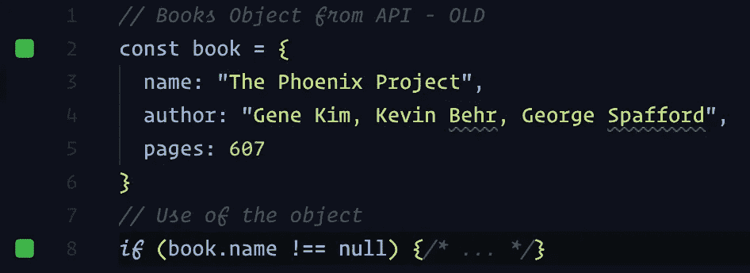
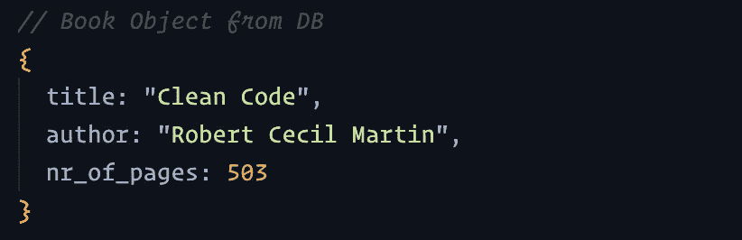
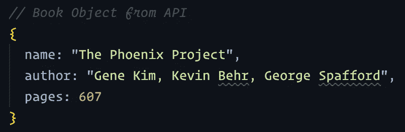
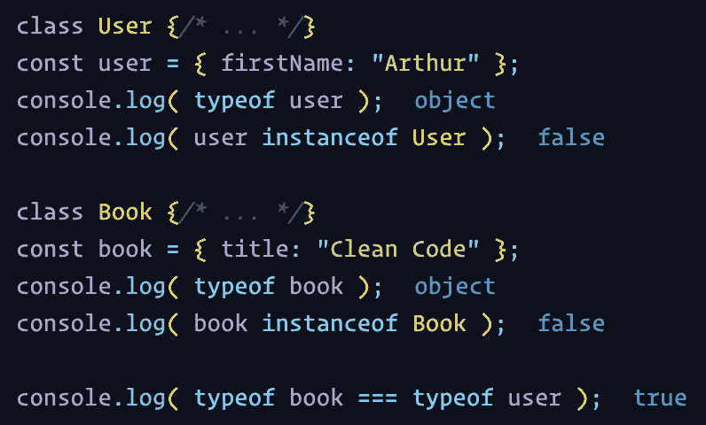
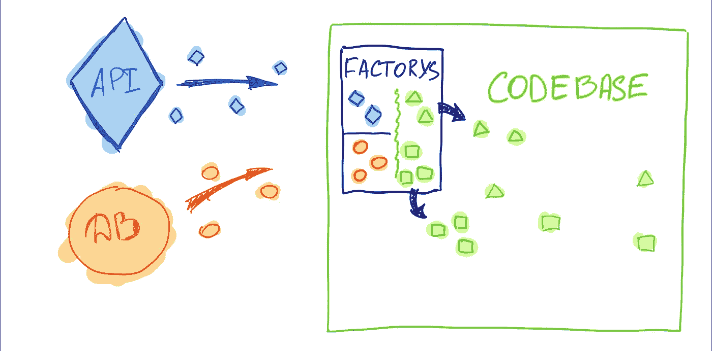
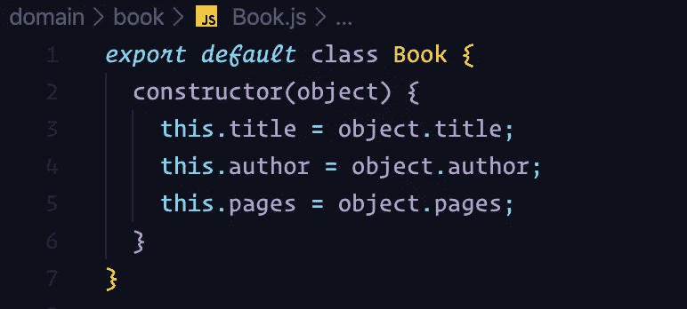
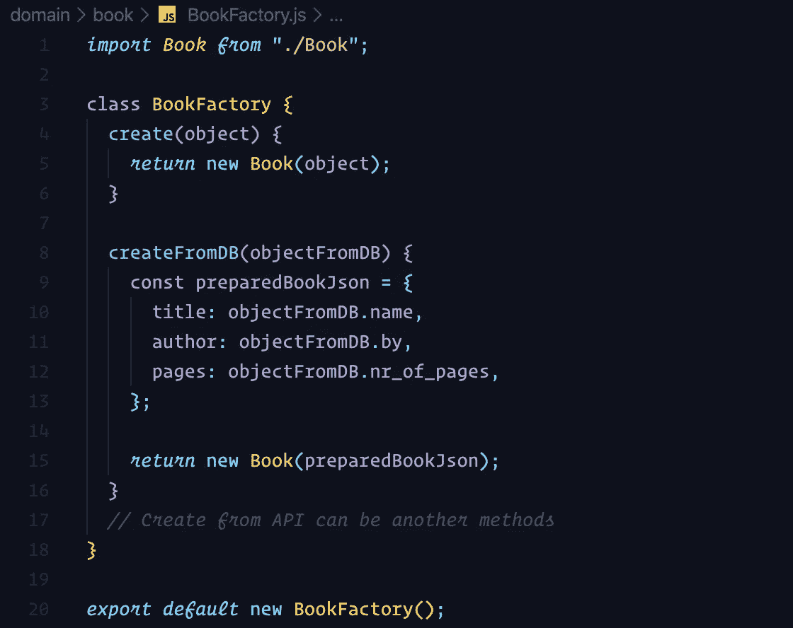
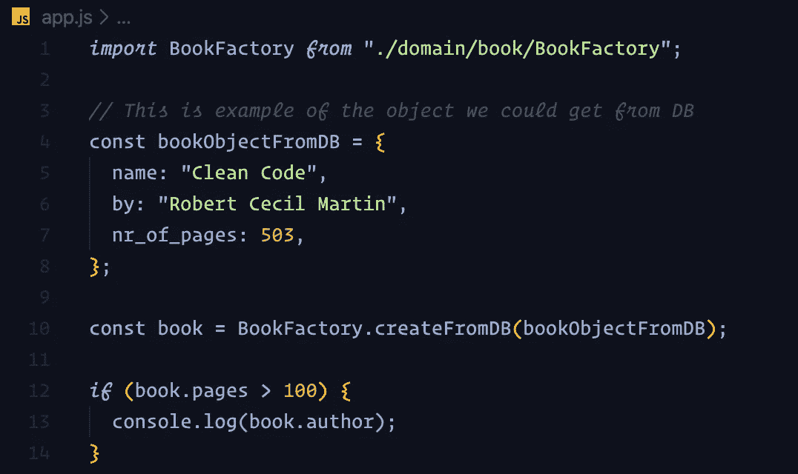
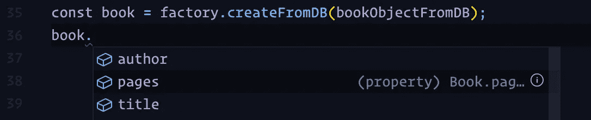
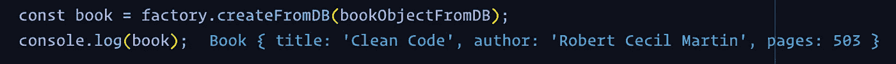

# JavaScript 设计模式:工厂模式

> 原文：<https://javascript.plainenglish.io/javascript-design-patterns-the-factory-pattern-6b399656d710?source=collection_archive---------1----------------------->

Photo by [Matteo Catanese](https://unsplash.com/@matteocatanese?utm_source=medium&utm_medium=referral) on [Unsplash](https://unsplash.com?utm_source=medium&utm_medium=referral)

# 快速介绍

这是 JavaScript 设计模式系列的第二篇文章，我用简单的文字解释了设计模式。互联网上有大量的信息，令人难以置信的混乱、枯燥和无聊。我的目标是用简单而愉快的方式解释复杂的事情。

之前我们已经介绍过**适配器设计模式**，你可以在这里 读到 [**。**](https://medium.com/javascript-in-plain-english/javascript-design-patterns-adapter-explained-cbcffbb4b8bc)

这一次我们将深入探讨**工厂模式**以及如何在 JavaScript 中使用它。

# 要解决的问题

Photo by [Ross Sneddon](https://unsplash.com/@rosssneddon?utm_source=medium&utm_medium=referral) on [Unsplash](https://unsplash.com?utm_source=medium&utm_medium=referral)

想象一个项目，其中你必须访问来自各种来源的复杂数据，如数据库、API、文件上传等。所有这些信息都必须被您的应用程序代码消费和使用。

在大多数情况下，你将操作`JSON`对象。你可能知道`JSON`是一个非常简单的对象类型。因此，如果我们只是在应用程序中使用原始的 JSON，我们的代码就会暴露在各种各样的问题之下。

## #1 对象结构

我们无法控制这些物体的结构。如果我们要在收到这些对象时使用它们，如果数据属性发生变化，我们就增加了代码在多个地方中断的风险。一个很好的例子是，如果一个 API 数据源改变了它的响应对象，或者有人重命名了数据库中的一列，这将改变你的代码接收的对象的结构。

**示例:**

Code Sample by Arthur Frank

Code Sample by Arthur Frank

由于使用了错误的属性，这将导致多处代码损坏和错误。

## #2 代码库一致性

我们将我们的代码暴露在巨大的不一致性中。如果您从多个来源收到类似的数据，例如`Book`对象，那么从对象的角度来看，两本相同的书可能会有所不同。

**示例:**

Code Sample by Arthur Frank

Code Sample by Arthur Frank

总的想法是，我们无法控制自己的领域。但是相反，我们被外部数据结构所引导。因此，你不是围绕你自己的数据实现来构建应用程序，而是围绕外部资源指定的数据结构来构建你的实现。

这个问题相当大，因为它接管了你的代码库约定和标准。

## #3 对象类型

我们无法确认在某个特定时间点我们正在操作哪种对象类型。例如，我们可能最终使用 **Book 对象**作为**用户**或 **Blog Post** 对象。

**举例:**

Code Sample by Arthur Frank

从上面的例子可以看出，我们无法确定每个 JSON 对象属于哪个实例。

# JavaScript 中的工厂模式

Photo by [Alexander Tsang](https://unsplash.com/@alexander_tsang?utm_source=medium&utm_medium=referral) on [Unsplash](https://unsplash.com?utm_source=medium&utm_medium=referral)

工厂模式的核心原理非常简单。这种模式被归类为**创造**，这是有原因的。工厂是专为**打造的。**当我们谈论编程时，我们希望它创建遵循我们的领域约定的对象。

正如我们所知，JavaScript 应用程序可以用多种方式编写，例如函数式或半面向对象式。因此，我认为公平地说，实现工厂模式可能有多种方式。

尽管我在上一篇关于适配器模式的文章中说过，这里的关键是概念本身，它可以使我们的代码更干净、更健壮，而不是书本上的 1:1 实现。

## 工厂模式—简单图表

这就是我们如何在没有工厂模式的情况下可视化我们的代码库消费和处理数据。正如你所看到的，一切都是以原始状态泄露给我们的主要代码库的，可能会有一些小的调整和转换。

Diagram without Factory by Arthur Frank

在下面的图表中，我们可以看到一个简单的可视化，如果我们在适当的地方使用工厂模式，情况会如何变化。

Diagram with Factory by Arthur Frank

## 工厂模式—代码示例

希望你对工厂模式的好处和它背后的一般概念有一个坚实的概念。现在让我们看看，如何在 JavaScript 应用程序中实现它。

让我们想象一个小的应用程序，有这样的结构。

我们有简单的入口点`app.js`和`domain/`区域，在那里我们有我们自己的定义，我们希望在我们的代码中操作这些对象。

**图书域对象**的一个简单示例可能如下所示:

Code Sample by Arthur Frank

请记住，这些代码示例已经过大量简化。在 Book 域对象的情况下，我们有一个简单的`class`，它有我们定义的三个属性— `title`、`author`、`pages`，我们可以 100%确定它们永远不会改变。

现在，让我们看看工厂:

Code Sample by Arthur Frank

如你所见，它非常简单`class`，如果你处于完全函数式编程范式中，它也可以是`function`。最后一步是使用我们的工厂。

Code Sample by Arthur Frank

这就是了！这就是模式有多简单。让我们看看它现在还能给我们带来什么好处。

Code Sample by Arthur Frank

如您所见，intellisense 现在正在帮助我们使用域对象中的可用属性和方法。

我们 100%确定，对于我们从各种来源(包括我们自己的代码)创建的 Book 对象的所有实例，该结构将是相同的——例如，如果我们决定创建全新的 Book 对象。

我们还可以看到我们正在操作的对象的实际类型。

Code Sample by Arthur Frank

我们可以看到我们正在处理的类的实例。这给了我们某种类型控制——你可以用更好的单元测试和你所用数据的验证来构建更健壮的代码。

Code Sample by Arthur Frank

**快，一句话总结。**

> *工厂从脆弱或易受攻击的数据结构中创建域对象。*

# 总结

Photo by [Kelly Sikkema](https://unsplash.com/@kellysikkema?utm_source=medium&utm_medium=referral) on [Unsplash](https://unsplash.com?utm_source=medium&utm_medium=referral)

感谢您抽出时间阅读这篇文章。我真的希望，你已经获得了一些好的见解，并成为更好的工程师。
玩得开心，做你喜欢的事情，下一篇文章再见。🔥

## **简明英语团队的笔记**

你知道我们有四种出版物吗？给他们一个 follow 来表达爱意:[**JavaScript in Plain English**](https://medium.com/javascript-in-plain-english)[**AI in Plain English**](https://medium.com/ai-in-plain-english)[**UX in Plain English**](https://medium.com/ux-in-plain-english)[**Python in Plain English**](https://medium.com/python-in-plain-english)**—谢谢，继续学习！我们还推出了一个 YouTube，希望你能通过 [**订阅我们的英语频道**](https://www.youtube.com/channel/UCtipWUghju290NWcn8jhyAw) 来支持我们**

**一如既往,“简明英语”希望帮助推广好的内容。如果您有一篇文章想要提交给我们的任何出版物，请发送电子邮件至[**submissions @ plain English . io**](mailto:submissions@plainenglish.io)**并附上您的媒体用户名和您感兴趣的内容，我们将会回复您！****