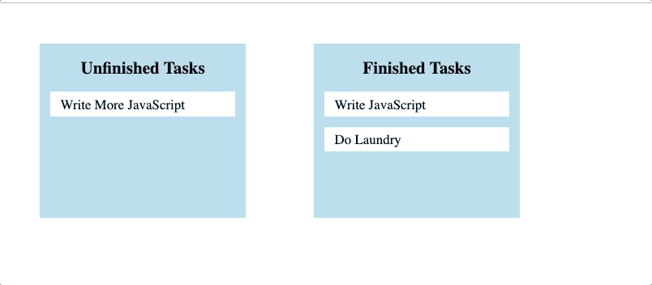
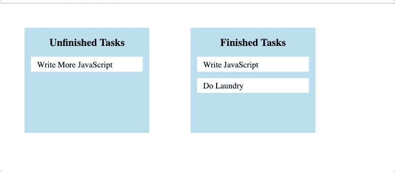

# JavaScript 拖放和后端交互

> 原文：<https://javascript.plainenglish.io/javascript-drag-and-drop-with-backend-interactivity-90f5ed68e576?source=collection_archive---------2----------------------->

## 增加拖放功能的功能和实用性

在这篇文章中，我将介绍一个 JavaScript 拖放特性，它可以与后端 API 进行交互和更新。我将从呈现的 API 数据中添加 DOM 元素，使这些元素可拖放，并更新 API 以响应拖放。我将解释一些基本的拖放组件，但是如果您需要进一步的指导，可以查看本文末尾的参考资料。

以下是我将构建的功能:



如果您想测试应用程序，[这里是存储库](https://github.com/mrwerner392/drag-and-drop-tasks)。

好了，让我们开始吧。

# 步骤 0:将 HTML 元素保存为变量

我们的任务有两个“容器”,我们将在几个地方需要它们，所以在开始之前，让我们将它们保存到 JavaScript 文件顶部的全局变量中。这些容器只是 HTML 文件中的`<div>`元素:

```
const unfinishedTasks = document.querySelector('#unfinished-tasks');
const finishedTasks = document.querySelector('#finished-tasks');
```

# 步骤 1:从后端获取数据

我有一个 Rails API 后端，里面有一些关于任务的数据。每个任务有两个属性:“内容”(类型 string)和“完成”(类型 boolean)。我们可以使用`fetch()`来获取这个任务数据:

```
fetch('http://localhost:3000/tasks')
.then(res => res.json())
.then(tasksArr => {
  tasksArr.forEach(task => handleTask(task))
});
```

解析完数据后，我们有了一个任务对象数组，我们遍历这个数组，对每个任务对象调用(待定)`handleTask()`函数。

# 步骤 2:将数据转换成可拖动的 DOM 元素

让我们定义上面调用的`handleTask()`方法:

```
function handleTask(task) { let taskPTag = document.createElement('p');
  taskPTag.innerText = task.content;
  taskPTag.id = `task ${task.id}`;
  taskPTag.classList.add('task');
  taskPTag.dataset.databaseId = task.id; if (task.finished === true) {
    taskPTag.dataset.id = 'finished';
    finishedTasks.append(taskPTag);
  } else {
    taskPTag.dataset.id = 'unfinished'
    unfinishedTasks.append(taskPTag);
  }; taskPTag.setAttribute('draggable', 'true');
  addDragEventListeners(task, taskPTag);};
```

这个功能的大部分只是为每个任务创建一个`<p>`元素，给它文本和一堆属性，并把它放在适当的任务容器中。除了类——它是用来设计样式的——在我们的 JavaScript 中，每个属性都有特定的用途。

这个函数的最后两行是拖放功能真正开始的地方。第一个给了我们的新`<p>`另一个名为“draggable”的属性，并将其值设置为“true”这个恰当命名的属性使得每个新的`<p>`可以拖动。第二个调用了一个名为`addDragEventListeners()`的方法，并将我们的`task`对象和我们新创建的`<p>`作为参数传入。我们将在下一步中定义和分析这个方法。

# 步骤 3:向可拖动元素添加拖动事件侦听器

如果我们从上一步中注释掉`addDragEventListeners()`的方法调用，我们的功能将如下所示:



我们可以拖动我们的任务，但是当我们放下它们时什么也不会发生。为了解决这个问题，我们首先需要向我们的`<p>`添加一些事件监听器，这是我们用`addDragEventListeners()`函数完成的。我们在上一步中调用了这个函数——现在让我们看看它的定义:

```
function addDragEventListeners(task, taskPTag) { taskPTag.addEventListener('dragstart', evt => {
    evt.dataTransfer.setData('text', evt.target.id);
  }, false); taskPTag.addEventListener('dragend', evt => {
    evt.dataTransfer.clearData();
    if (document.querySelector('.over')) {
      document.querySelector('.over').classList.remove('over');
    };
  });};
```

对于我们的每个`<p>`,我们添加两个事件监听器:一个用于“dragstart ”,一个用于“dragend”。在“dragstart”上，我们获取被拖动的`<p>`的 id，并将其传递给一个名为`dataTransfer`的拖动事件属性。这允许我们从不同的事件侦听器中访问该 id，稍后我们将使用它来访问被拖动的元素本身。在“dragend”中，我们从`dataTransfer`中清除这个信息，然后 if 语句用于样式目的(类名“over”是给容器绿色阴影的原因，我们不希望当拖动循环结束时这个阴影还在。)

将拖动事件侦听器添加到可拖动元素中只是解决了一半问题。现在我们需要建立我们的空投区。

# 步骤 4:设置拖放区

除非我们告诉他们，否则元素不会成为可接受的拖放区。我们通过给它们一些拖动事件监听器来做到这一点。我们有两个拖放区，每个拖放区需要相同的事件侦听器。我们将定义一个函数`addDropzoneEventListeners()`,并为每个拖放区调用该函数。这是事情变得有点忙乱的地方，所以让我们分块来做。

```
addDropzoneEventListeners(unfinishedTasks);
addDropzoneEventListeners(finishedTasks);function addDropzoneEventListeners(dropzone) { dropzone.addEventListener('dragover', evt => {
    evt.preventDefault();
    evt.currentTarget.classList.add('over');
  }, false); dropzone.addEventListener('dragleave', evt => {
    evt.currentTarget.classList.remove('over');
  }, false); ...};
```

我们的`addDropzoneEventListeners()`函数将为每个拖放区添加三个事件监听器，其中两个如上所示。这两个“dragover”和“dragleave”服务于双重目的。首先是防止实际“拖动”事件的默认行为。默认行为不允许发生丢弃，所以我们需要防止这种情况发生。这些事件侦听器的另一个目的是用于样式化，因为我们在被拖动的拖放区上添加和移除一个“over”类。如前所述，这就是绿框阴影的来源(对功能来说并不重要，但对用户来说是一个很好的特性)。

好了，现在是最后一部分——处理实际的下落。这是更新我们的 DOM 并与我们的后端交互的部分。让我们添加最后一个事件监听器:

```
addDropzoneEventListeners(unfinishedTasks);
addDropzoneEventListeners(finishedTasks);function addDropzoneEventListeners(dropzone) { ... dropzone.addEventListener('drop', evt => {

    let elemId = evt.dataTransfer.getData('text');
    let droppedElem = document.getElementById(elemId); if (droppedElem.dataset.id !== evt.currentTarget.dataset.id) { evt.currentTarget.append(droppedElem);
      evt.dataTransfer.clearData(); const dataIdToggle = {
        'finished': 'unfinished',
        'unfinished': 'finished'
      };
      droppedElem.dataset.id = dataIdToggle[droppedElem.dataset.id]; const databaseAttributeMap = {
        'finished': true,
        'unfinished': false
      };
      let isFinished = databaseAttributeMap[droppedElem.dataset.id];
      let id = droppedElem.dataset.databaseId;

      fetch(`http://localhost:3000/tasks/${id}`, {
        method: 'PATCH',
        headers: {
          'Content-Type': 'application/json',
          Accept: 'application/json'
        },
        body: JSON.stringify({
          'finished': isFinished
        })
      })
      .then(res => res.json())
      .then(task => {
        task.finished === true ? alert('Way to Go!!!') : alert('Darn
        😕')
      }); }; }, false);};
```

我们来分析一下。首先，我们使用`evt.dataTransfer.getData()`来访问被拖放的元素的 id，然后找到实际的元素。然后我们有一个`if`语句，它的目的是确定一个“已完成”的任务是否被放到了“未完成”的任务容器中，反之亦然。如果是，我们继续。否则，拖动循环结束，被拖动的元素返回到原来的位置。如果一个任务被放在它开始的同一个容器中，什么都不需要发生。

如果`if`语句返回 true，我们就实现了我们的功能。让我们放大一些代码。前两行将被拖动的元素移动到拖放区，并从`dataTransfer`对象中清除数据:

```
evt.currentTarget.append(droppedElem);
evt.dataTransfer.clearData();
```

注意，我们乐观地呈现这个更新，这对于我们简单的任务跟踪器来说似乎是合理的。然后，我们切换被移动元素的数据集 id 属性，使其与新位置相匹配:

```
const dataIdToggle = {
  'finished': 'unfinished',
  'unfinished': 'finished'
};
droppedElem.dataset.id = dataIdToggle[droppedElem.dataset.id];
```

这允许我们在前端的“已完成”和“未完成”任务容器之间来回移动元素，也帮助我们在后端适当地更新我们的任务数据。在我们向后端发出更新 API 的请求之前，我们收集了一些东西:用来更新我们的任务的新信息，以及我们正在更新的特定任务的 id:

```
const databaseAttributeMap = {
  'finished': true,
  'unfinished': false
};
let isFinished = databaseAttributeMap[droppedElem.dataset.id];
let id = droppedElem.dataset.databaseId;
```

最后，我们向`fetch()`提出请求:

```
fetch(`http://localhost:3000/tasks/${id}`, {
  method: 'PATCH',
  headers: {
    'Content-Type': 'application/json',
    Accept: 'application/json'
  },
  body: JSON.stringify({
    'finished': isFinished
  })
})
.then(res => res.json())
.then(task => {
  task.finished === true ? alert('Way to Go!!!') : alert('Darn 😕')
});
```

这样，我们的任务已经在后端更新了，这样，如果用户刷新页面，任务就会留在它的新家。(注意:容器中任务的顺序可能会在刷新时改变，因为这取决于它们在 API 中的顺序。在前端维护订单超出了本文的范围。)我们还以定制警告的形式给用户一些额外的反馈。最后，我们有了我们想要的功能:


# 最后的想法

在我看来，拖放功能是非常用户友好的。它们的功能很直观，给用户一些很好的视觉反馈。而且实现起来也不是很难！一个非常简单的拖放功能只需几个步骤就可以完成，通过添加一些后端交互性，我们可以大大增加该功能的功能和实用性。

感谢阅读！！

**资源**
[简单 JavaScript 拖拽&Drop(*Medium*post)](https://medium.com/quick-code/simple-javascript-drag-drop-d044d8c5bed5)
[拖拽& Drop 元素带香草 Javascript 和 HTML(有帮助的教程)](https://alligator.io/js/drag-and-drop-vanilla-js/)
[HTML5 拖拽(W3Schools docs)](https://www.w3schools.com/html/html5_draganddrop.asp)