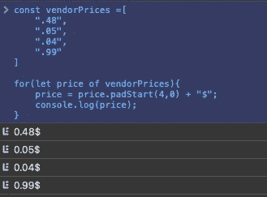
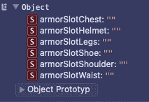
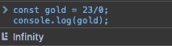
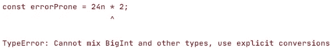

# 最近的 JavaScript 版本(ES2016-ES2020)中隐藏的技巧

> 原文：<https://javascript.plainenglish.io/javascript-ecmascript-history-the-hidden-features-acb38af57be8?source=collection_archive---------10----------------------->

## 关于每个 ECMAScript 版本中不太流行的技巧的 JavaScript 历史指南

[Ricardo Aguilara](https://unsplash.com/@ricardoaguilera) via [unsplash](https://unsplash.com/photos/ATVZGXO457I) (CC0)

# 介绍

JavaScript 已经改变了很多年，这是事实。在过去的十年里，它发生了巨大的变化。一个重大的变化带来了 ECMAScript2015，也称为 ECMAScript6 (ES6)。从那以后，每年都会发布一个新的 ECMAScript。但是当你们大多数人知道大的变化时，你们是否也知道一些小的事情呢？也值得一看的东西？在这篇文章中，我将向你介绍他们。

# ECMAScript 2016

## 或**运算符的幂

这不是一个游戏规则的改变者，但它有它存在的权利，因为它有很高的实用性。

ECMA2016 让你能够运用爱的力量...我是说用另一个数来加强一个数的最短的方法。幂运算符 **** 确保您可以省略*数学。Pow(a，b)* 。

在此之前，如果你来自 C#，你知道这里要做什么。对，叫*数学。Pow()* 。这看起来一点也不像是一个影响，但是如果你做长时间的数学计算，并且每次在这期间，一个函数调用出现，那么你已经在这些函数调用上停下来，有一个短暂的精神休息。

## 包含

这简化了检查数组中是否存在元素的过程。大多数程序员和我也是这样做的，使用 *IndexOf()* 方法，并使用返回值继续我们的操作。此外，代码变得更可读，更人性化。

*注意:Includes 只检查值类型的值，以便返回正确的结果。当使用像对象或数组这样的引用类型时，它们通过它们的链接引用进行比较！*

# ECMAScript 2017

 [## JavaScript Async Await:承诺未来不再回调！

### 对承诺的回调直到异步等待

medium.com](https://medium.com/javascript-in-plain-english/javascript-async-await-promisify-the-future-to-callback-never-again-6762707e18e5) 

2017 年对于 JavaScript 来说是不同寻常的一年，然而两个大词出现在桌面上: [*Async 和 Await*](https://medium.com/javascript-in-plain-english/javascript-async-await-promisify-the-future-to-callback-never-again-6762707e18e5) 。他们革新了编写异步代码的方式。我们从回调和承诺上升到这些新的关键词。但是等等！*异步*和*等待*不就是基于回调和承诺吗？是的，它们可以，但是它们至少使代码像同步代码一样可读，而回调和承诺却不能！

我们现在回到我们为什么在这里的话题上来。所有在大舞台上不被尊重的小事都会在我的舞台上获得毕业。从那时起，可以在函数的最后一个参数后面添加最后一个逗号。这符合数组和对象的规则。这只是一件小事，但更引人注目的是，您可以使用 *padStart/padEnd* 来填充字符串，例如用空格。

Console Print out for padStart (code: padding.js)

正如你可以从控制台打印中看到的，我正在用前导零填充便士价格，以使我的格式适合例如商店。如果你没有给这个函数发送第二个参数，它会用空格填充前导字符。

我差点忘了提到还有另外两个功能可以派上用场。 *Object.values* 和*object . entry*。它们以数组的形式返回对象的值或键值对。**提示:与 for-of 循环结合起来，它们非常坚韧！**

# ECMAScript 2018

对于 JavaScript 来说，2018 年并不是突出的一年，但是它给我们带来了 *Rest* -以及*Spread*-运算符，该运算符只用于对象而非数组。另一颗冉冉升起的新星是*等待环的引入。它是 for 循环的异步拮抗剂。*

# ECMAScript 2019

## 试试看-抓住-不要在意

来自 C#？然后，我认为您非常了解异常，您还必须指定您想要捕获的异常类型，或者至少声明所有异常的基本类型，以确保您至少可以处理它们。ECMAScript2019 引入了*可选锁扣绑定*。您可以忽略异常并返回一个对您来说更有趣的值。

*检查装备*可以是一个在装甲未装备时返回空值的功能。我们想知道是否装备了某种盔甲，你害怕任何例外吗？无论什么回来，如果它不是你故意传入的盔甲，只要返回一个错误作为默认值，你就完了！很简单，是吧？

# 平的

ECMAScript 2019 的另一个好处是*扁平*功能。用于去除嵌套数组。类似于 reduce 函数，但它只能减少一个嵌套级别。

console print out after running items.flat().

降低一级不成问题。要么你把*平面*的调用串连起来，要么你只需要传入一个整数参数，这个参数相当于你想要平面的层数。

平面功能的一个很好的相关就是*平面图*-功能。这是*平面*和*地图*的组合。与其给你一个列表作为结果，你可以立即得到一个扁平化的结果。这里有一些赌博赌注和允许的产出，如果你现在下注的话。

如果您单独调用两个函数，也会发生同样的情况，但是这会减少代码和工作量。

*FlatMap* 工作效率更高，可以在计算密集型场景中使用。

# TrimStart & TrimEnd

两者的工作方式都与引入的 *padStart* 和 *padEnd* 功能相似，但它们不是填充，而是修剪不想要的空字符。我们可以将它们视为常规 *trim* 功能的特殊任务组，以及一种快速访问方法。在游戏引擎中，Unity 也是在简单的方向上创建向量的快速访问方法。

> *Vector2.up() = > (0，1)，Vector2.left() = > (-1，0)等。*

 [## 统一中心

### 在篝火旁取暖，在团结中心与长者和智者聊天，以确保你的…

medium.com](https://medium.com/unity-hub) 

# object . from entries vs objects . entries

如果你想获得一个对象的每个键值作为一个数组，你可以使用 *Object.entries* 方法，而 *Object.fromEntries* 将数组转换回一个对象。当你使用像 *reduce* 、 *map* 、 *filter* 这样的函数，并且你得到了一个要进一步处理的对象时，你可以从中获利。使用 *Object.entries* 并用 *Object.fromEntries* 包裹它。在这里，我以我最喜欢的视频游戏**黑暗之魂**的装备对象为例向你展示我的意思:

Console printout of object.entries wrapped by object.fromEntries

你也可以用武器和饰品槽来做这件事。

# ECMAScript 2020

## BigBang 还是 BigInt？

遵循 IEEE-754 的规范*，JavaScript 只知道双精度的数据类型号。这就是为什么 JavaScript 可以保存像 *+0/-0* 和 *Infinity、*包括 *-Infinity* 这样的值。此外，不允许的数学运算:除以 0 是有效的运算，不会导致错误。*

Console printout division by zero in JavaScript

但是这种功能有其局限性。而整数没有完整的 64 位大小范围，因为内部处理为浮点数，所以等于整数
**(2⁵)-1 = 9007199254740992 的绝对最大值。**

如果要访问这个数，可以通过访问常数值 [*数来实现。MAX _ SAFE _ INTEGER*](https://developer.mozilla.org/de/docs/Web/JavaScript/Reference/Global_Objects/Number/MAX_SAFE_INTEGER)*【1】*。

有趣的是，您可以在 JavaScript 中累加可达到的最大整数值。但是如果你想把 1 或 2 相加，结果就不再明显了。大于 3 时，这也是可能的。

Console print out from goldExploit.js

ECMAScript 2020 通过在一个数字上加一个“n”或者在初始化变量时只使用 *BigInt* 函数，使得这一点变得可能。

但是请注意。只能用其他 BigInt 类型的变量计算 *BigInt* 类型的变量，否则会导致运行时错误。最糟糕的错误！

An error by calculating two different number types (BIG_INT and number)

这里不要混淆类型，你可以像普通整数一样使用它们。除法会向下舍入到下一个整数。所有其他的像 *+、-、*、/* 和 **** (功率)和 *%* (模数)都是合法的，并且非常有效。此外，比较操作符可以按预期工作。唯一的例外是“===”运算符，如果您想要比较两个数字，其中第一个数字的类型为 *BigInt* 而第二个数字的类型为 *number* ，则该运算符不可用。比较不安全的“==”一个可用。不知道“==”和“===”的详细区别？[最佳堆栈溢出贴](https://stackoverflow.com/questions/359494/which-equals-operator-vs-should-be-used-in-javascript-comparisons)。[2]

有些函数不能覆盖这个数据类型 *BigInt* 。[在你使用无头](https://developer.mozilla.org/en-US/docs/Web/JavaScript/Reference/Global_Objects/BigInt)之前最好查一下这个、[。[3][4]](https://www.smashingmagazine.com/2019/07/essential-guide-javascript-newest-data-type-bigint/)

## 不要再这样了，麻烦制造者

你有对付这个小捣蛋鬼的经验吗？当我来自 C#时，这看起来像是一个已知的关键字，但我觉得很不对劲。有模因存在于*和*之间，而不是出于任何原因。

引入*λ表达式*和*严格模式*使得*这个*变成了一个不再那么锋利的武器。因为写工作代码的努力被那两个降低了。进入全球空间变得更加困难。但是，谁想进入全球空间呢？嗯……有时候，有时候会有需要的场景。

在浏览器内部工作，你可以通过*窗口*访问它，有时也可以通过*自身*或*框架*或最后一个选项*这个*访问它。节点。JS 只提供了*全局*和*这个*。

以前，使用一个辅助函数很常见:

使用该功能也意味着不能使用*严格模式*。因为是函数的定义而不是方法的定义，你不能再在任何函数里面定义这个了(函数和方法一样，但是方法在对象里面，而函数在对象外面，就像这个 *getGlobal* 右边的无主函数)。为了解决这个问题，出现了另一个辅助函数:

这个返回，无论结果不是*未定义*。这个回归一定是全球空间。ECMAScript 2020 介绍了如何消除这些变通办法:

> *globalThis*

现在，代码可以更短、更健壮，对于编码人员来说，这是最好的衡量尺度:代码的表达能力。

## 动态导入代码

如果你开发软件，一定要以模块化为目标。JavaScript 为您提供了*导入*和*导出*关键字，以便创建和使用模块。进口当时有一个缺陷。它允许你只在文件的开头写它。这是必要的，因为环境需要检查哪些引用是导入和导出所必需的。

 [## JavaScript ES6 模块导入导出

### ES6 模块导入导出业务用 JavaScript 和 JS 遗留代码

medium.com](https://medium.com/javascript-in-plain-english/javascript-es6-modules-import-export-129a90e83ad6) 

当你做一个基于插件的解决方案时，必须在运行时分析所需的插件，因为它们直到运行时才会出现。使用 *require* 是一种变通方法，它使得在运行时动态加载模块在技术上成为可能，但是每次使用时都会留下代码味道。2020 版给我们带来了更好的工作导入。*导入*功能。从那时起，现在有了一个导入函数，可以在任何地方调用，并支持动态加载，而关键字 import 只允许在文件的顶部使用。然后，该模块被异步加载到。为了访问这个模块，你自己履行这个承诺，或者使用 await 关键字。

## 拿着它，拿着它，爱它！

因为动态类型系统比互联网本身更古老，所以有一个检查变量、参数或对象属性是否被定义的传统。检查之后，通常将其设置为默认值。主要是一个 *If-* check 赢得比赛，以找出这些是否等于未定义。结果为 true 时，将为变量、参数或属性赋一个默认值。

有什么可以让它变得更好？ *Falsy* 值！这些值导致逻辑条件结果为假。与*或*-操作符(||)结合使用，您可以将它们用作后备。

这样看起来好多了，但是效果不会长久，因为这样也改变了语义。 *GetNearestEnemy()* 将被调用，不仅当*敌人*未定义时，而且当*敌人*为空、0、假或空字符串时。这是 4 个选项，如果其中一些可能不会出现在这里，至少有两个总是匹配的，导致在*或*-操作符之后的替代。这取决于你使用哪种类型的变量。如果你想用一个数字，你可以这样写:

该函数现在对于 0 的输入是安全的。你每次都会造成伤害。0 损坏是不可能的。如果你想启用 0 损害作为一个有效的输入，你必须明确地检查未定义的，用一个 If 语句。但这是我们试图避免的一件事。解决方案，使用默认参数值:

这个案子已经结了。但是变量和对象属性呢？这些文件现在被搁置了吗？不要！退一步，追查凶手的路径……我的意思是，退一步，在这里搜索真正的问题。每当做这样的检查时，心态是:如果是*未定义*或 *null* ，取默认值，其他值都很大。
ECMAScript 2020 引入了*无效合并*操作符来解决这个问题。当你有了 C#背景，你就知道这个美女了，*？？s* ign 它在语义上做了完全一样的事情。

操作符*空合并总结:如果左侧既不是*空*也不是*未定义*，则取左侧。如果左侧*为空*或*未定义*，则取右侧。*

# 漂亮的发型和好听的声音(猫王操作员/可选链接操作员)

A Big Hunk O’ Love — Elvis Presley

这里还有一个星号，也是 C#中的。是猫王算子(对比图片)。正式命名为“可选链接操作符”。当您想要链接对象的属性时，请使用此选项。您在那里使用点运算符来访问对象的属性或方法。但是，如果您想要访问的点运算符没有定义，则会导致崩溃。

Elvis 操作符没有崩溃，而是中断并取消访问以返回 undefined。在 ECMAScript 2020 之前，您必须使用嵌套的 if 语句来检查深入到对象属性和方法深度的路径的每个部分。但是像猫王一样，我们不再生活在那个时代了。

今天只需要这个操作符:左边是定义的，右边是属性/方法，如果不是，返回未定义的。

*注意:只有“？”的对象的内部路径跟踪而不是“？:“是同样的行为。要么获取左侧的内容(如果它没有被定义),要么获取一个预定义的值。虽然它们看起来不同，但却是同一个操作员。"?:" gets 也称为三元运算符。*

# 结论

ECMAScript 为我们提供了大的更新和小的更新。本文向您展示了小家伙们的遭遇，以及如何通过外包繁琐的任务来增强您的编码体验。利用这里介绍的改进来启发您的编码，有更多的时间来做真正酷的任务。JavaScript 还没有完全进化。如果你看一下 TC39 的议程，你会发现离最终目标还有多少距离，如果有最终目标的话。语言是一种活的结构。[5]

我认为有趣的是，JavaScript 变得像 C#。C#在过去的几年里发展成为一种功能更强的语言。此外，Typescript，JavaScript 的超集，是这两种语言中最好的部分。像他们俩的孩子一样。这会不会导致一个超级孩子，我们会背弃 C#和 JavaScript 只使用 TypeScript？

我们会看到的。现在，看看 [TC39 议程](https://github.com/tc39/agendas/blob/master/2020/11.md)并关注下一篇文章，当我总结时，ECMAScript 2021 是什么！[5]

[***节省自己大量的时间，专注于重要的主题。***](https://arnoldcodeacademy.ck.page/26-web-dev-cheat-sheets)

# 继续读

 [## Enums TypeScript 4.0 和 JavaScript 指南—您需要知道的一切

### 你将读到的关于 enums 的最后一个指南！

medium.com](https://medium.com/next-level-source-code/enums-typescript-4-0-and-javascript-guide-all-you-need-to-know-5e090355bff6)  [## 你遵循了优秀程序员的这 10 条原则吗？

### 从接吻和干燥到足球和 YAGNI 和聪明屁股代码的 10 个原则！

medium.com](https://medium.com/next-level-source-code/do-you-follow-these-10-principles-for-good-programmers-1445727af447)  [## JavaScript ES6 Var，Let 或 Const

### 掌握 JavaScript 中的变量，避免用 var，let，const 提升

medium.com](https://medium.com/next-level-source-code/javascript-es6-var-let-or-const-88da65f3a0df) 

# 链接和参考

*【1】数字。MAX _ SAFE _ INTEGER*[https://developer . Mozilla . org/de/docs/Web/JavaScript/Reference/Global _ Objects/Number/MAX _ SAFE _ INTEGER](https://developer.mozilla.org/de/docs/Web/JavaScript/Reference/Global_Objects/Number/MAX_SAFE_INTEGER)

[2]“= =”和“===”的区别[https://stack overflow . com/questions/359494/which-equals-operator-vs-should-be-use-in-JavaScript-comparisons](https://stackoverflow.com/questions/359494/which-equals-operator-vs-should-be-used-in-javascript-comparisons)

[3]Operators & BigInt Doku:[https://developer . Mozilla . org/en-US/docs/Web/JavaScript/Reference/Global _ Objects/BigInt](https://developer.mozilla.org/en-US/docs/Web/JavaScript/Reference/Global_Objects/BigInt)

[4]粉碎杂志必备指南 BigInt[https://www . smashingmagazine . com/2019/07/Essential-Guide-JavaScript-newest-data-type-BigInt/](https://www.smashingmagazine.com/2019/07/essential-guide-javascript-newest-data-type-bigint/)

[5] TC39 议程【https://github.com/tc39/agendas/blob/master/2020/11.md】
T3