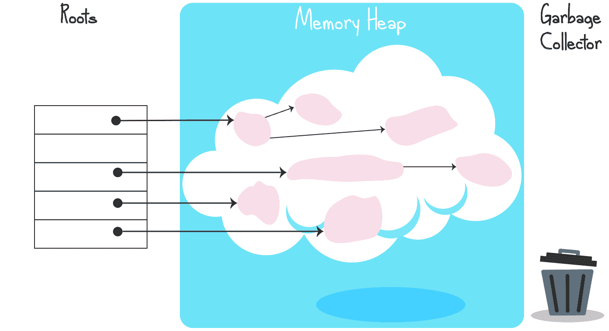
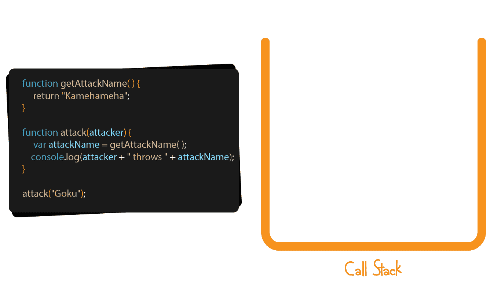
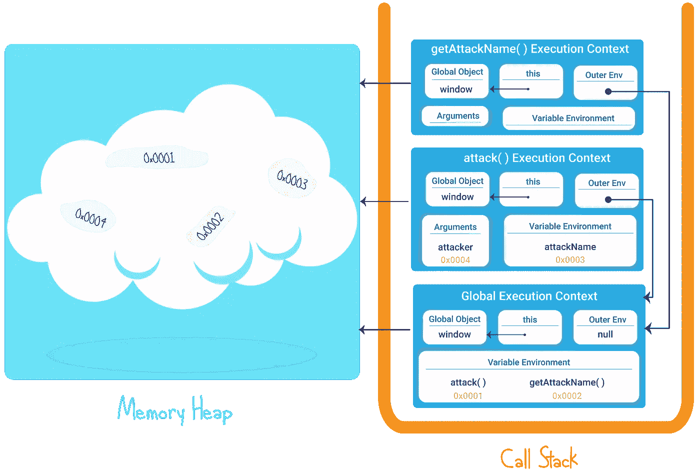
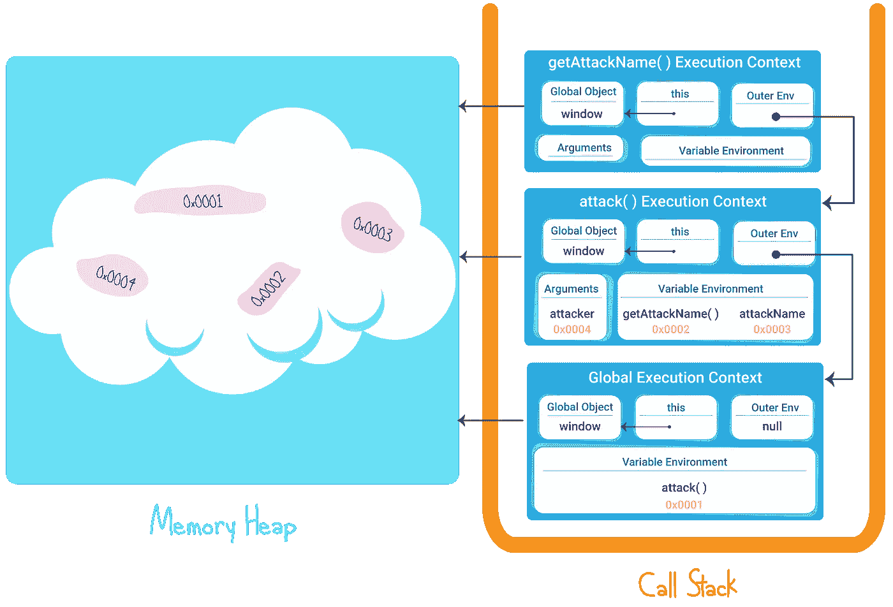

# 去神秘化的 JavaScript 引擎

> 原文：<https://javascript.plainenglish.io/javascript-engine-demystified-1b3b87b22495?source=collection_archive---------5----------------------->

Photo by [Wolfgang Lutz](https://unsplash.com/@wolfi?utm_source=unsplash&utm_medium=referral&utm_content=creditCopyText) on [Unsplash](/?utm_source=unsplash&utm_medium=referral&utm_content=creditCopyText)

在我的上一篇文章中，我讨论了什么是函数，并介绍了函数式编程。但是在深入研究之前，我认为明智的做法是稍微了解一下 JavaScript 引擎是如何形成的，以及它作为一个整体是如何工作的。我说的是调用堆栈、执行上下文、内存堆、垃圾收集器…是的，今天我们将揭开其他[新奇词汇](https://www.youtube.com/watch?v=Ml70cWWfESw)的神秘面纱。

首先，JavaScript 引擎是由什么构成的？

主要是两件事:一个调用栈和一个内存堆。

# 内存堆:

*   内存中的一个大空间，我们以无序的方式随机存储**变量和函数**。
*   一个可以分配、使用和释放内存空间的地方。
*   每个内存空间都以某种方式被引用。
*   一个内存空间可以引用另一个内存空间，使其成为其子空间。
*   如果引用被破坏，内存空间将被垃圾回收器回收。

无论内存堆空间有多大，都是有限的，超过限制就会导致内存泄漏，进而导致页面崩溃。

当我们一直分配空间而不释放它时，这很容易发生。

谢天谢地，由于垃圾收集器，JavaScript 在释放空间方面做得非常好。不像 C，例如你从来没有释放内存释放空间，这一切都发生在后台自动，**自动内存管理宝贝！**

垃圾收集器的工作方式非常简单:正如我所说的，每个内存空间都以某种方式被引用，所以对于内存中每个已用的空间，都存在一个引用它的链接。一旦链接断开，垃圾收集器就会收集该值，并释放内存空间。

**>** 我们称之为**标记和扫描**算法，下面是它是如何进行的:

1.  垃圾收集器创建一个引用内存堆中某个空间的所有根变量的列表。
2.  它标记了所有的根、它们引用的内存空间以及它们的子节点。
3.  它会清除(丢弃)所有未标记的值，并释放它们所占用的空间。

>因此，当一个内存空间的链接断开时，它将不再被垃圾收集器标记，而是被清除和释放。

Garbage collector Representation

好吧，如果垃圾收集器那么聪明，我们怎么还能得到内存泄漏呢？通过编写糟糕的代码！我们可以通过许多方式编写糟糕的代码并导致内存泄漏，这里有两个例子:

**设置定时器并忘记它们:**

在这个例子中，我们创建了一个带有处理程序的时间间隔，该处理程序检查某个条件是否为真，如果为真，我们执行一些操作。interval 的处理程序占用了内存堆中的空间，只要条件成立，它就会被执行。

但是一旦页面上不再存在 *saiyan* 元素，这意味着 if 条件不再为真，处理程序将会过时，并且会不必要地占用堆中的空间。除非我们记得清除间隔！

**使用错误或过多的全局变量:**

因为全局变量总是链接到全局对象，所以它们永远不会被垃圾收集器收集。广泛或错误地使用它们可能会耗费大量内存。

在我们的例子中，我们使用了一个全局变量 attackWarning，它在逻辑上只用于攻击函数内部。因此，在 attack()执行完毕后，attackWarning 变量将仍然存在于内存堆中，即使不再需要它。

不像 attackResult 变量和攻击者参数只存在于 attack()内部，当它们的引用在函数执行完成后被破坏时由垃圾收集器收集。

# **调用栈**

在 JavaScript 中，无论何时运行代码，它都是在一个“**执行上下文**中运行的，一个包含信息的包装器帮助我们知道我们在代码中的位置，我们需要什么变量…等等。每次执行一个函数时，都会创建一个新的执行上下文，并将其置于之前的执行上下文之上，从而创建一个堆栈:**执行堆栈**，也称为**调用堆栈**。当函数完成执行时，它的执行上下文被弹出堆栈。

换句话说，调用堆栈是内存中的一个特殊位置，它以后进先出的逻辑有序地存储包含代码信息的包装器。这些包装器有许多名称(因为开发人员喜欢让其他开发人员感到困惑)，您可以将它们称为执行上下文、堆栈帧或堆栈状态。让我们看一个例子:

执行上下文有两个阶段:创建阶段和执行阶段。

**创建阶段:**

在创建阶段，首先创建以下所有内容:

*   全局对象:当前正在执行的代码所属的对象，如果代码不属于特定的对象，默认情况下是全局对象窗口。
*   一个**这个**变量引用了全局对象
*   变量环境:列出所有变量和函数的空间，这些变量和函数在词汇上直接位于函数内部
*   对外部环境的引用:函数在代码中的词法位置。
*   arguments 对象:包含传递给函数的参数(如果存在的话)

然后，吊装发生。你可以在这里详细了解它的所有内容[，但总而言之这意味着内存空间是为变量和函数分配的。JavaScript 引擎将检查您的代码，每次发现变量或函数声明时，它都会添加一个对变量环境的引用，指向内存堆上的一个空白空间，并保留它。](https://medium.com/javascript-in-plain-english/what-is-hoisting-in-javascript-7ad4f391c40e)

有点像“是的，我知道我需要一个空间来存放变量，这里和那里，所以让我在我的变量环境中创建引用，并在内存堆中保留空白空间”。

**执行阶段:**

这时，您的代码开始逐行执行。

让我们看一个例子:

首先，每次我们运行 JavaScript 代码时，第一个创建并添加到调用堆栈的执行上下文总是全局执行上下文。在我们的示例中，全局执行上下文如下所示:

*   全局对象:**窗口**
*   **该**变量:参照**窗口**
*   变量 environment:具有指向存储在内存堆中的函数 **attack( )** 和 **getAttackName( )** 的引用。
*   对外部环境的引用: **null** ，因为我们在最外层。

当调用 attack()时，在全局执行上下文之上创建一个新的执行上下文，其内容如下:

*   全局对象:因为 attack()没有直接的父对象，所以默认情况下，attack()内部运行的代码属于全局对象窗口
*   **该**变量:参照**窗口**
*   变量 environment:引用了内存堆中的变量 attackName
*   对外部环境的引用:**引用全局执行上下文**，因为 attack()物理上位于“外部”，意思是不在另一个函数内部。
*   Arguments:对位于内存堆上的参数攻击者的引用

当调用 getAttackName()时，会创建第三个执行上下文:

*   全局对象:因为 getAttackName()没有直接的父对象，所以在 getAttackName()中运行的代码默认属于全局对象窗口
*   **本**变量:参照**窗口**
*   变量环境:为空
*   对外部环境的引用:**引用全局执行上下文**，因为 getAttackName()物理上位于“外部”，意味着不在另一个函数内部。

下面是几乎相同的一段代码的另一个例子，有一点小小的变化，getAttackName()函数是在 attack()函数内部声明的:

因为 getAttackName()函数是在 attack()函数内部按词汇声明的，所以 getAttackName()的外部环境现在将是 attack()的执行上下文。

调用堆栈，就像内存堆一样，在空间方面有一些限制，如果我们超过这些限制，我们会得到一个堆栈溢出错误(抛出一个错误，但浏览器不会像在内存泄漏的情况下那样崩溃)。例如，当我们调用递归函数(调用自身的函数)时，可以做到这一点，而无需添加任何 break 来中断递归。

Stack Overflow

这就是 JavaScript 引擎的内容:

*   一个内存堆，用来存储你使用的东西，比如变量，对象，函数…
*   **一个调用栈**来存储并跟踪你在代码中的位置，你需要什么变量，之前发生了什么，以及接下来会发生什么。

>两者都是存放东西的**内存空间**。

有了这个概念，任何人都可以制作自己的 JavaScript 引擎，而且每个人都这么做了……有这么多的 JavaScript 引擎，看看这个维基百科页面就知道了。最著名的 JavaScript 引擎是谷歌开发的，Chrome 运行在这个名为 **V8** 的引擎上。V8 也是 Node.js 和 Deno 使用的 JavaScript 引擎。有运行 Firefox 的 SpiderMonkey，Safari 的 JavaScriptCore，还有许多其他的……

有这么多的 JavaScript 引擎，必须有某种指导方针来规范它们！对，那就是 ECMA 标准。因此，如果您想创建自己的 JavaScript 引擎，尽一切办法去做吧，只要遵循 ECMA 标准中列出的规范即可。

在结束这篇越来越长的文章之前，我想补充最后一点。因为 ECMA 标准没有定义**如何**或**在哪里**存储数据(在堆或调用堆栈中)，您可能会惊讶地发现，有时变量可以直接存储在调用堆栈中执行上下文的变量环境中！

例如，如果一个 JavaScript 引擎开发人员认为，仅仅为了获得一个简单的数字值而将一个引用存储在调用堆栈的一个内存空间中，而这个内存空间指向堆中的另一个内存空间，那就太麻烦了！他可以简单地决定直接将数字存储在调用堆栈中(在当前执行上下文的可变环境中)。

因此，对于“变量存储在哪里，在堆中还是在调用堆栈中？”这个问题，没有正确或错误的答案。这真的取决于 JavaScript 引擎开发团队的喜好。

但是大多数人会这样想:

*   像数字、布尔值、字符串这样的简单变量将直接存储在调用堆栈中。
*   复杂的对象或复杂的结构会存储在堆中。

# TL；速度三角形定位法(dead reckoning)

1.  JavaScript 引擎由两部分组成:内存堆和调用栈
2.  内存堆是一个我们可以以无序方式存储变量和函数的地方
3.  如果我们一直在内存堆中分配空间，使其永远不会被释放，这可能会导致浏览器崩溃的内存泄漏。
4.  堆上未使用的内存空间由垃圾收集器收集并释放
5.  垃圾收集器使用标记和清除方法
6.  调用堆栈是一个我们可以存储包装器的地方，这些包装器以有序的后进先出方式跟踪我们在代码中的位置
7.  每个包装器被称为一个执行上下文、一个堆栈帧或一个堆栈状态
8.  每次调用一个函数时，都会创建一个新的执行上下文并将其添加到堆栈中
9.  堆栈中的第一个执行上下文将始终是全局执行上下文
10.  如果调用堆栈上添加了太多的执行上下文，可能会导致堆栈溢出错误(浏览器不会崩溃)
11.  任何人都可以创建自己的 JavaScript 引擎
12.  ECMA 标准是创建新 JavaScript 引擎的指导方针
13.  ECMA 标准没有定义数据存储的方式和位置，这取决于 JavaScript 引擎开发人员的喜好。
14.  通常简单的数据直接存储在每个执行上下文的变量环境中的调用栈上，复杂的对象存储在堆上。