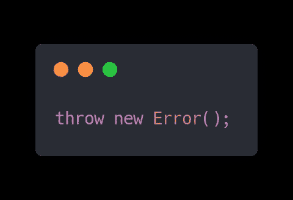
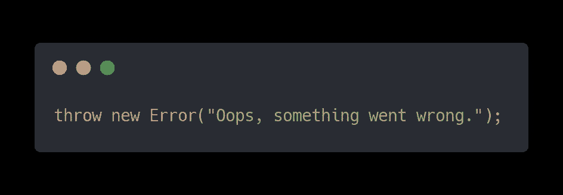
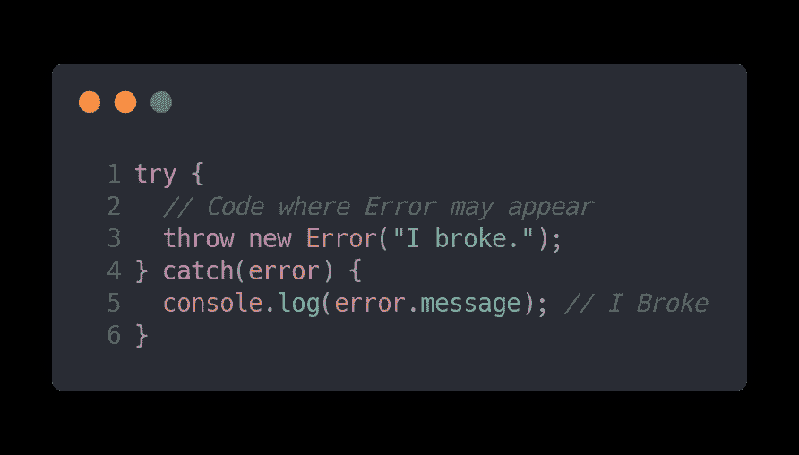
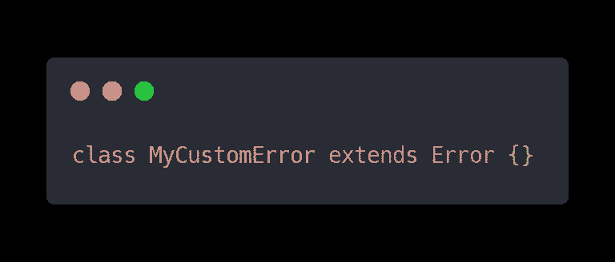
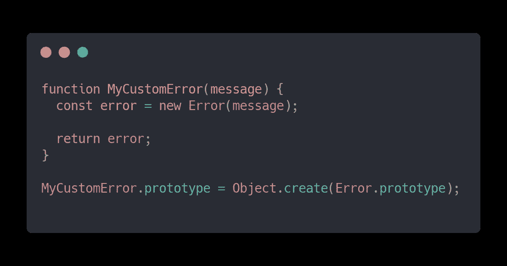
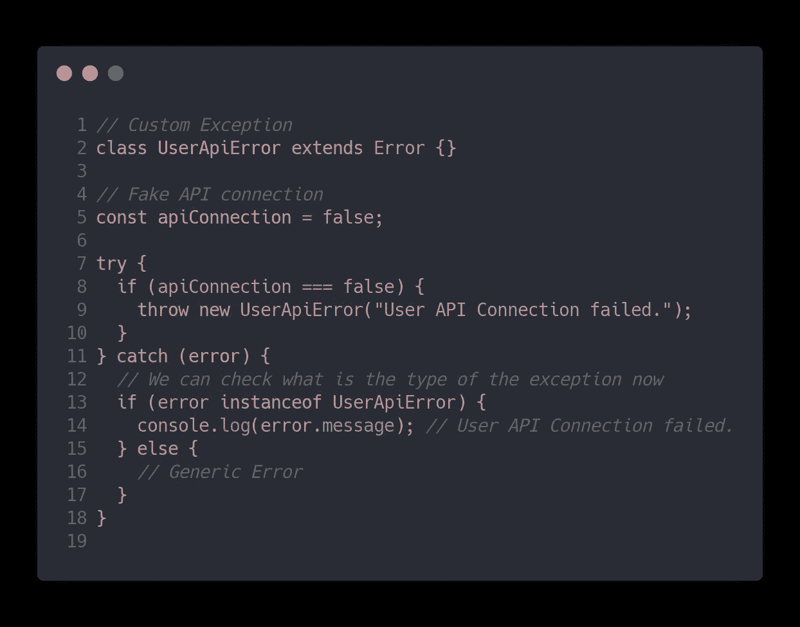

# JavaScript 错误处理:异常

> 原文：<https://javascript.plainenglish.io/javascript-error-handling-the-exception-5068b96c123?source=collection_archive---------4----------------------->

Photo by [Andre Benz](https://unsplash.com/@trapnation?utm_source=medium&utm_medium=referral) on [Unsplash](https://unsplash.com?utm_source=medium&utm_medium=referral)

# 放弃

这是一篇讲述故事的文章，只有很少的代码示例。我的目标是用简单的形式解释不同的概念，以便人们理解为什么需要它们，为什么这些概念很重要。

我在所有文章中获得的知识几乎适用于任何编程语言。

> 专注于理解想法和概念，而不是特定的语言——这是你获得洞察力的途径

# 生活故事

Photo by [Ben White](https://unsplash.com/@benwhitephotography?utm_source=medium&utm_medium=referral) on [Unsplash](https://unsplash.com?utm_source=medium&utm_medium=referral)

许多年前，我加入了新的工程师团队。当时我想——“*我是高级软件工程师*”，尽管这不是我的头衔。我当时很年轻，很自信。我想我知道很多事情，如果有什么事情，我不知道我可以很快找到答案，这将是唯一正确的答案。

你可以假设我也很固执己见。你是对的，每一次同行评议，对我来说都是一场斗争。我完全相信我知道如何正确地做事。

## 情况

有一天，我在那个 API 客户端上为用户评论工作。它应该访问经典的 REST API 端点。客户端必须非常简单，只支持两种请求类型来创建和阅读评论——POST & GET。

当时，我对错误处理方面的良好实践知之甚少。虽然我知道异常，但是我从来没有使用过它们——它们对我来说是多余的。

> 我完全相信我所需要的是一份**`if”`声明！**

**因此，我满怀信心地开始设计和实现我的解决方案。正如您所想象的，我已经尝试用`IF`语句的变体来解决所有潜在的问题。我正在检查从 API 返回的状态代码，并将它们映射到我的函数/方法的奇数返回。**

**我甚至都懒得去想如果事情变得疯狂。比如，如果 API 关闭，或者连接令牌过期，或者数据结构改变等等。**

## **学习**

****

**Photo by [Hermes Rivera](https://unsplash.com/@hermez777?utm_source=medium&utm_medium=referral) on [Unsplash](https://unsplash.com?utm_source=medium&utm_medium=referral)**

**像每一个有自尊的公司一样，我们是“敏捷的”并且在做“TDD”。嗯，我们以为我们是。在我完成代码实现后，我努力对它进行单元测试。我有太多的`IF`语句和我的函数返回的不同状态，为其编写测试真的很难。🔥**

> **如果由于代码的复杂性，你正在努力测试你的代码，这是一个代码气味的警钟**

> **公关又名同行评议时间。**

**很高兴看到人们会喜欢我的解决方案，我已经提交了拉动请求。它开始了。很快人们用评论轰炸我。**

**-" *如果这样会怎么样？如果那样会发生什么？*”**

**-" *如果出现问题，我们应该如何知道 API 客户端之外的情况？*”**

**-" *当我们需要用更多的方法和请求类型来扩展这个 API 客户端时，会发生什么？我们需要到处重复你的 IF 语句吗？***

**-" ***您应该认真研究错误处理实践，尤其是异常！*****

**我不会撒谎，那很艰难。但那是我软件工程师生涯的转折点。我意识到——“*我不是规则的例外，我必须了解例外！*”。**

# **何必呢？**

****

**Photo by [Aleksandr Ledogorov](https://unsplash.com/@breakfast_on_jupiter?utm_source=medium&utm_medium=referral) on [Unsplash](https://unsplash.com?utm_source=medium&utm_medium=referral)**

**这听起来可能有点俗气，但如果您想编写出色的代码，您必须了解并使用关于错误处理和异常的良好(如果不是最佳)实践。**

> **出色的代码可扩展、易于维护、安全、健壮且操作直观。破坏用户体验几乎不会出错。**

**这是通过向项目代码库添加良好的错误处理可以实现的。**

# **错误处理—这意味着什么**

****

**Photo by [Federica Giusti](https://unsplash.com/@federicagiusti?utm_source=medium&utm_medium=referral) on [Unsplash](https://unsplash.com?utm_source=medium&utm_medium=referral)**

**E 每个程序都会有错误。即使你已经建立了一个优秀的应用程序，有干净和健壮的实现。如果你已经修复了世界上所有的错误，你的应用程序仍然会有错误。**

**原因是——你不能控制你的应用程序的所有方面。如果你正在开发一个大型的应用程序，你将会与数据库、API、第三方库进行交互，并且很有可能你将会在一个至少有几个工程师的团队中工作。所有这些方面都是你无法控制的，它们会导致你的应用程序出错。**

> **这个错误不是一个 Bug**

**区分这两个东西很重要。Bug 是一种你无法预测的意外行为或异常现象。通常，这只是您在代码中遗漏了一些东西。**

> **Bug 是代码中不可预测的异常现象**

**另一方面，在大多数情况下，错误是可以预测的。这是你可以引导到正确方向的事情。这就是错误和错误处理的一般定义。**

> **错误是一种可预测的行为，错误处理就是你把它引向正确的方向**

**理解这一点非常重要——您也可以在自己的代码中使用错误或异常来控制代码的行为。它不仅用于对第三方或间接工具(如 DB 或 API)做出反应。**

# **告诉我—如何处理错误**

****

**Photo by [Viktor Kern](https://unsplash.com/@viktorkern?utm_source=medium&utm_medium=referral) on [Unsplash](https://unsplash.com?utm_source=medium&utm_medium=referral)**

**让我们来看几个例子，看看你如何在实践中做到这一点。正如我在本文开头提到的，我的目标是让您了解为什么这很重要。因此，我给你的代码很简单。**

**像许多其他编程语言一样，JavaScript 内置了通用错误对象。在其他语言中它被称为异常。**

**JS 错误对象的示例:**

****

**Code Sample by Arthur Frank**

**您可以将自定义错误消息传递给引发的异常，如下所示:**

****

**Code Sample by Arthur Frank**

**当你的代码出错时，在与 API、DB 或第三方交互时，JavaScript 会抛出类似的异常或错误。或者你可以自己扔。**

> **如果您不处理这些错误，它们将终止您的代码执行，并且您的应用程序将无法正常运行—破坏用户体验。**

**要处理错误，您需要使用`try/catch`块。它很容易理解和使用。您有`try`块，它将在您预计会出现错误的地方包装代码，还有`catch`块，您将在那里决定如何处理错误。**

**例如，您可以将它发送到日志服务。您可以通知用户漂亮的 UI 消息出现了问题。您可以将用户重定向到适当的位置以获得更好的体验等。**

**`try/catch`块示例:**

****

**Code Sample by Arthur Frank**

**在这里，我们需要涵盖几件事。首先，这是一个非常简单的例子，我们在这个块中使用的函数可以抛出错误，也就是异常——不一定要在`try`块中直接抛出。**

**其次，在`Line: 4`你会看到— `catch`接受一个参数。它是必需的参数，你可以给它取任何名字。如果抛出了 Error，这个参数将自动接受错误的对象，您可以随意操作它。**

> **“try”块在您预计会出错的地方包装代码，“catch”块是您处理错误的地方**

# **专业提示**

****

**Photo by [Emile Perron](https://unsplash.com/@emilep?utm_source=medium&utm_medium=referral) on [Unsplash](https://unsplash.com?utm_source=medium&utm_medium=referral)**

**在你开始处理错误之前，我给你一个提示，它将永远改变你写代码的方式——“*使用定制异常！***

## **自定义异常**

**我们已经介绍了通用的`Error()`对象。这一切都很棒，您可以捕捉异常并猜测它们的含义，还可以记录错误消息。**

**但是你怎么能做出漂亮干净的切口呢？如何确保特定的异常是特定类型的实例？假设您想知道到底发生了什么，但是一个实现可以抛出多个不同的异常。**

**如果所有这些异常都是通用的，那么区分它们的唯一方法就是它们的消息。这不是最干净有效的方式。为了帮助我们解决这个难题，定制异常**出现了。****

**这就是如何在 JavaScript 中创建自定义异常。**

****

**Code Sample by Arthur Frank**

**你不会相信我，但就是这么简单。也有创建它的函数方式。在我看来，函数式方法看起来有点脏，但我还是会展示给你看。**

****

**Code Sample by Arthur Frank**

**如你所见，差异是巨大的。我建议每次都使用`class`方法。无论如何，每个自定义异常都必须写在一个单独的文件中，所以它不会影响您的函数范式。**

**让我们看看使用自定义异常有什么好处。**

****

**Code Sample by Arthur Frank**

**我意识到，这很难接受。让我解释一下。使用自定义异常，您可以为错误创建类型，并在捕获错误时检查这些类型。当您捕捉到一个错误时，通过一个简单的`if`语句，您可以检查该错误是否是特定类型的实例。如果是，您可以针对特定的错误执行特定的操作。**

**在一个`catch`中，你可以根据需要处理许多不同的类型。请记住，这只是一个特定的错误。**

> **自定义异常是一种可以在“捕获”步骤检查并为其执行特定逻辑的类型**

**你也可以定制你自己的异常，并用默认消息文本、更好的错误跟踪等来扩展它们的能力。但这是以后的事了。**

# **包扎**

**感谢您抽出时间阅读这篇文章。我真的希望，你已经获得了一些好的见解，并成为更好的工程师。**

**玩得开心，做你喜欢的事情，下一篇文章再见。🔥**

# **想知道接下来读什么？**

*   **[**装修工**在 JS](https://medium.com/javascript-in-plain-english/javascript-design-patterns-the-decorator-pattern-eaf6adc77cb7)**
*   **[**工厂**在 JS](https://medium.com/javascript-in-plain-english/javascript-design-patterns-the-factory-pattern-6b399656d710)**
*   **[**JS**](https://medium.com/javascript-in-plain-english/javascript-design-patterns-adapter-explained-cbcffbb4b8bc)中的适配器**

**如果你喜欢这个故事的风格，去看看我的个人资料，我有一堆类似的故事。我会定期发布更多内容。**

## ****用简单英语写的便条****

**你知道我们有四份出版物和一个 YouTube 频道吗？你可以在我们的主页[**plain English . io**](https://plainenglish.io/)找到所有这些内容——关注我们的出版物并 [**订阅我们的 YouTube 频道**](https://www.youtube.com/channel/UCtipWUghju290NWcn8jhyAw) **来表达你的爱吧！****