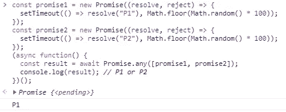

# JavaScript ES2021 (ES12)新功能

> 原文：<https://javascript.plainenglish.io/javascript-es2021-es12-new-features-7aa5f411d81f?source=collection_archive---------3----------------------->

## 准备纳入的功能


JS 2021 (es12) picture

ECMAScript 2021 版本预计将在明年发布，现在我们正在敲定这个反主题 2020，这是一个绝佳的时间来回顾将带来 ES12 版本的新功能。

这个列表基于 ECMAScript 提案四，这意味着这些特性将出现在下一个版本中。

# 索引

*   String.prototype.replaceAll()
*   Promise.any()
*   WeakRefs
*   逻辑赋值运算符
*   数字分隔符

# String.prototype.replaceAll()

String.prototype.replaceAll()用另一个字符串值替换字符串中某个子字符串的所有实例，而不使用全局 regexp。

到目前为止，最常见的方法是使用全局 regexp。

考虑下面的代码，其中我们使用正则表达式将“+”字符替换为空字符:

```
const fullname= 'fullname=Jhon+Hannibal+Smith';
const fullnameFormated = fullname.replace(/\+/g, ' ');//Jhon Hannibal Smith
```

这种方法的缺点是需要使用特殊字符的正则表达式来实现这一点。但是正则表达式的使用并不容易，而且容易出错，是常见的错误来源。

实现这一点的更直接的解决方法是将 String#split 与 Array#join 结合起来:

```
const fullname= 'fullname=Jhon+Hannibal+Smith';
const fullnameFormated= fullname.split('+').join(' ');//Jhon Hannibal Smith
```

这个过程避免了正则表达式，但代价是将字符串分割成一组部分，然后再将它们粘在一起。

Mathias bynens 的提议解决了这些问题，并给出了一种执行全局子串替换的简单方法:

```
const fullname = 'fullname=Jhon+Hannibal+Smith';
const fullnameFormated = fullname.replaceAll('+',' ');//Jhon Hannibal Smith
```

📌请注意，为了与语言中预先存在的 API 保持一致，string . prototype . replace all(search value，newvalue)的行为类似于 string . prototype . replace(search value，newvalue ),但有两个主要例外:

*   如果 searchvalue 是一个字符串，那么 String#replaceAll 将替换所有匹配项，而 String#replace 仅替换子字符串的第一个匹配项。
*   如果 searchValue 是非全局正则表达式，String.prototype.replace 仅替换单个匹配项。另一方面，String.prototype.replaceAll 在这种情况下抛出一个异常，以避免在缺少全局标志(这意味着“不要全部替换”)和被调用方法的名称(这意味着“全部替换”)之间产生混淆。

# Promise.any()

Promise.any()是任何承诺一兑现就结算，或者全部拒绝。在这种情况下，它被 AggregateError 拒绝。

考虑下面的例子:

```
const promise1 = new Promise((resolve, reject) => {
  setTimeout(() => resolve("P1"), Math.floor(Math.random() * 100));
});const promise2 = new Promise((resolve, reject) => {
  setTimeout(() => resolve("P2"), Math.floor(Math.random() * 100));
});(async function() {
  const result = await Promise.any([promise1, promise2]);
  console.log(result); // P1 or P2
})();
```

结果是 Promise.any()的第一个解析结果。



Example in Google Chrome dev tools.

在没有一个承诺被解析的情况下，Promise.any()抛出 AggregateError 异常。

📌请记住与 Promise.race()的不同之处，其中任何一个承诺一经确定，无论它们是被实现还是被拒绝，都将被确定。

# WeakRefs

武器在很多情况下都很有用。例如，我们可以使用一个 Map 对象来实现一个包含许多键值的缓存，这些键值需要大量的内存。在这种情况下，对我们来说方便的是尽快释放键值对占用的内存，WeakRefs 允许我们这样做。

WeakRef 对象包含对对象的弱引用。对对象的弱引用是指不阻止垃圾收集器恢复该对象的引用。另一方面，标准引用将对象保存在内存中。

JavaScript 中对对象的引用被保存。也就是说，只要你有一个对象的引用，它就不会被垃圾收集。

示例:

```
const obj1= { a: 10, b: 20};
```

目前，我们有 WeakMap()和 WeakSet()使用 WeakRefs:

WeakMap 对象是键-值对的集合，其中的键被弱引用。

让我们考虑下面的例子:

```
const myObj = {...};
```

使用前一个对象的函数:

```
function useTheObj(obj){
   doSomethingWith(obj);
}
```

我想记录某个特定对象调用该方法的次数，并在超过 1000 次时进行报告:

```
var map = new Map();function useTheObj(obj){ doSomethingWith(obj); //get the number of called times 
 //or initialize to 0 is null.       
 var called = map.get(obj) || 0; //Increase the counter in one
 called++; if(called > 1000) {
   console.log(’called more than 1000 times’);
 }; map.set(obj, called);
}
```

这个解决方案是可行的，但是它存在内存泄漏，因为传递给函数的每个对象都永远保留在映射上，并且没有被垃圾收集。解决方案是使用 WeakMap:

```
var wmap = new WeakMap();function useTheObj(obj){ doSomethingWith(obj); //get the number of called times
 //or initialize to 0 is null.
 var called = wmap.get(obj) || 0; //Increase the counter in one
 called++; if(called > 1000) {
   console.log(’called more than 1000 times’);
 }; wmap.set(obj, called);
}
```

📌因为引用是弱的，所以 WeakMap 键是不可枚举的。

📌WeakSet 类似于 WeakMap，但是就像集合一样，WeakSet 中的每个对象只能出现一次。WeakSet 集合中的所有对象都是唯一的。

# 逻辑赋值运算符

逻辑赋值操作符(由 Justin Ridgewell 和 Hemanth HM 提出)结合了逻辑操作符(&&，||，？？)和赋值表达式:

到目前为止，JavaScript 有以下赋值操作符:

```
=
Assignment operator./=
Division assignment.*=
Multiplication assignment.&&=
Logical AND assignment.||=
Logical OR assignment.??=
Logical nullish assignment.**=
Exponentiation assignment.%=
Remainder assignment.+=
Addition assignment.-=
Subtraction assignment.<<=
Left shift assignment.>>=
Right shift assignment.>>>=
Unsigned right shift assignment.&=
Bitwise AND assignment.^=
Bitwise XOR assignment.|=
Bitwise OR assignment.Destructuring assignment operators:[a, b] = [10, 20]
{a, b} = {a:10, b:20}
```

有了这个建议，我们可以将逻辑运算符和赋值表达式结合起来:

```
a ||= b
//Equivalent to : a || (a = b), only assigns if a is Falsy.a &&= b
//Equivalent to: a && (a = b), only assigns if a is Truthy.a ??= b
//Equivalent to: a ?? (a = b), only assigns if a is Nullish.
```

# 数字分隔符

数字分隔符(Christophe Porteneuve)扩展了现有的 [*NumericLiteral*](https://tc39.github.io/ecma262/#prod-NumericLiteral) 以允许数字之间的分隔符。

由于这个特性，通过在数字组之间创建一个可视的分隔，可以很容易地使数字更具可读性。

例如:

```
const money = 1000000000000;
```

上面的数字文字很难阅读，但是我们可以使用下划线作为分隔符使其更容易阅读:

```
const money = 1_000_000_000_000;
```

好了，现在更容易读懂“钱”这个变量了。

数字分隔符可以用在不同的位置:

```
const money = 1_000_000.123_456;
```

另外，数字分隔符在八进制整数文本中也是可用的。

```
const octal = 0o123_123;
```

# 结论

JavaScript 不断地加入新的特性。在本文中，我们回顾了 JavaScript ES2021 (ES12)中最有可能包含的一些特性。

谢谢你阅读我。保重！

# 更多信息:

*   [es 2020(es 11)中的 JavaScript 新特性](https://medium.com/javascript-in-plain-english/new-javascript-features-in-es2020-c2d76acf9c5a)
*   [es 2020(ES11)中的 JavaScript 模块名称空间导出](https://medium.com/javascript-in-plain-english/javascript-module-namespace-exports-71dc7d1a75c0)
*   [JavaScript 在 ES2019(ES10)中的新功能](https://medium.com/javascript-in-plain-english/javascript-es2019-es10-in-a-nutshell-cae6f7524519)

# 参考

 [## ECMAScript 2021 语言规范

### 编辑描述

tc39.es](https://tc39.es/ecma262/) [](https://stackoverflow.com/) [## 堆栈溢出-开发人员学习、共享和构建职业生涯的地方

### 德诺怎么了？我们与一位主要撰稿人交谈以了解情况。现在听着。我们生产的产品能够增强…

stackoverflow.com](https://stackoverflow.com/)