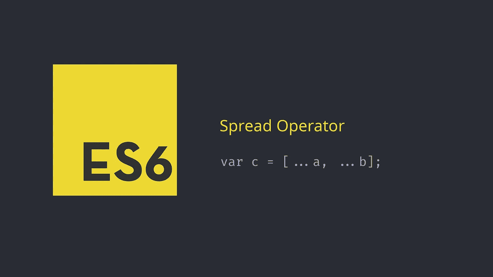

# JS 中扩展运算符的精彩技巧

> 原文：<https://javascript.plainenglish.io/javascript-es6-the-spread-operator-197cfb7c46ad?source=collection_archive---------3----------------------->



# 什么是传播算子？

JavaScript ES6 版本带来了一系列新的工具和实用程序。一个这样的新特性是**传播算子**。

运算符的形状是三个连续的点，记为:`...`

**它允许 iterable 在应该有 0+个参数的地方扩展。**

您可以对数组和对象使用 spread 运算符。您可以在不同的情况下使用它们:扩展数组或对象、组合或合并数组和对象、克隆数组和对象以及使用数学函数。

没有上下文，定义是很难的。让我们探索一些不同的使用案例:

# 扩展数组或对象:

使用新元素或以其他名称扩展数组或对象向数组或对象添加元素或属性以及对数组的操作(按下-取消移动):

## 数组:

示例 1:

示例 2:

## 对象:

## 另一个例子:

```
pickau = {…pickau, hp: 45} ;console.log(pickau)**//Output:**{ name: “pickau” , hp: 40 }
```

# 组合或合并数组和对象:

假设我们有两个不同来源的列表，我们希望将这两个来源组合起来，形成一个列表:

# 克隆阵列和对象:

## 克隆阵列:

```
const arr = [‘1’, ‘2’, ‘3’];const cloneArr = […arr];console.log(cloneArr);
```

## **永远不要克隆下面的代码:**

```
const arr = [‘1’, ‘2’, ‘3’];const cloneArr = arr;console.log(cloneArr);
```

## **为什么？**

**因为 JS 中的**数组是引用值，所以当你试图用=来复制它时它只会复制对原始数组的引用而不会复制数组的值，所以如果你会做下面的代码:

## **对象克隆:**

# 与数学函数一起使用

JavaScript 有一个`Math`对象，它包含几个方法来操作一组数据，即数据列表。

假设我们想从列表的前三个数字中获取最大值:

```
let arr = [10, 23, 83, -1, 92, -33, 76, 29, 76, 100, 644, -633];Math.max(arr[0], arr[1], arr[2]);
```

如果我们想得到一个列表中所有数字的最大值呢？如果列表有 n 个条目呢？我们肯定不会要`arr[0], arr[1]... arr[1000]`。

扩展运算符提供了一个更简洁的解决方案:

```
let arr = [10, 23, 83, -1, 92, -33, 76, 29, 76, 100, 644, -633];Math.max(...arr);
```

spread 运算符与 Math.min()很好地结合在一起，用于查找数组中的最小数字:

```
let arr = [10, 23, 83, -1, 92, -33, 76, 29, 76, 100, 644, -633];Math.min(...arr);
```

我建议欧洲大学 [**在线学位**](https://click.linksynergy.com/fs-bin/click?id=GGg4no0HUcA&offerid=871625.130&subid=0&type=4) 课程的读者，他们中的许多人都是 [**免费的。**](https://click.linksynergy.com/fs-bin/click?id=GGg4no0HUcA&offerid=871625.130&subid=0&type=4)

# 接受函数中任意数量的参数:

如果您不知道在一个 arrow 函数中需要接受多少个参数，您可以使用带有“rest”参数的 spread 运算符来实现这一点:

# **一些与传播有关的技巧:**

## 1-第一个

```
let greet = ['Hello', 'World'];console.log(greet); *// Without spread operator*console.log(…greet); *// Using spread operator*/* If we run this code we’ll see the following:[‘Hello’, ‘World’]Hello World */
```

## 2 秒钟技巧:

有时，我们可能需要将一个字符串转换成一个字符列表。我们可以对这个用例使用扩展运算符:

```
let greetings = “hello”;let chars = […greetings];console.log(chars);/*If we run this code, we’ll be greeted with:[ ‘h’, ‘e’, ‘l’, ‘l’, ‘o’ ] */
```

## 3-组织属性

有时属性并没有按照我们需要的顺序排列。使用一些技巧，我们可以将属性推到列表的顶部，或者将它们移到底部。

要将`id`移动到第一个位置，在展开`object`之前将`id: undefined`添加到新对象。

## 第四招:

```
let arr1 = [‘arbok’,’kfc’,’mack’];let arr2 = [‘sfdsdfs’, ‘tyutyu’, ‘bnmbn’ ]arr1 = [arr1, …arr2];//output: [Array(3), “sfdsdfs”, “tyutyu”, “bnmbn”]arr1 = […arr1, arr2];//output: [“arbok”, “kfc”, “mack”, Array(3)]
```

## 第五招:

```
let obj1 = {name: ‘John’, email: ‘john@example.com’ };let obj2 = {name: ‘Michael’, email: ‘Michael@example.com’}obj1 = {obj1, …obj2};console.log(obj1)//Output: {obj1: {…}, name: “Michael”, email: “Michael@example.com”}obj1 = { …obj2, obj1 };console.log(obj1)//output: {name: "Michael", email: "Michael@example.com", obj1: {…}}
```

# 浅层拷贝和深层拷贝:

请注意`spread`在复制数组时只深入一层。因此，如果你试图复制一个多维数组，你将不得不使用其他替代方法。

🤓这是我学到的一件有趣的事。浅拷贝意味着第一层被拷贝，更深的层被**引用**。

## 问题是

扩展语法和`Object.assign()`方法只能对对象进行浅层复制。这意味着被复制对象内部的深层嵌套值被放在那里，只是作为对源对象的引用。

## 错误的解决方案

在网上你会发现许多错误的建议:

1.  使用 Object.create():

```
const copied = Object.create(original)
```

这里`original`对象被用作`copied`的**原型**。

它看起来很好，但在引擎盖下，它不是:

```
const original = {
  name: 'Fiesta'
}
const copied = Object.create(original)
copied.name //Fiestaoriginal.hasOwnProperty('name') //true
copied.hasOwnProperty('name') //false
```

2.JSON 序列化:

这只有在你没有任何内部对象和函数，只有值的情况下才有效。

```
const cloned = JSON.parse(JSON.stringify(original))
```

但是你会有以下副作用:

您将**失去**任何在 JSON 中没有等价类型的 JavaScript 属性，比如`Function`或`Infinity`。分配给`undefined`的任何属性都将被`JSON.stringify`忽略，导致它们在克隆对象上丢失。

此外，一些对象被转换为字符串，例如 Date 对象(同样，不考虑时区，默认为 UTC)。

# 那么我们如何用正确的方法克隆一个物体呢？

## 1-使用[Lodash](https://lodash.com/)T21【克隆】和[克隆深度](https://www.npmjs.com/package/lodash.clonedeep)

Lodash 有两个不同的功能，允许你做浅层拷贝和深层拷贝。这些是`clone`和`clonedeep`。

Lodash 有一个很好的特性:**你可以在你的项目中单独导入单个函数**来减少依赖的大小。

看看下面的例子就明白了:

## 2-使用不变性助手库:

对对象的副本进行变异，而不更改原始源。

通过 NPM 设置

```
npm install immutability-helper --save
```

我们可以通过 NPM 得到这个图书馆:`npm install immutability-helper --save`。
要深度复制我们的对象，我们可以使用 immutanbility-helper 中可用的`update()`方法，将我们要复制的对象作为第一个参数传递，将要更改的实际数据作为第二个参数传递:

如果你喜欢读这篇文章，并且想支持我成为一名作家，你可以 [**请我喝杯咖啡！**](http://buymeacoffee.com/kirillibrahim)

如果你喜欢我的内容，我活跃在 Twitter[**@ IbraKirill**](https://twitter.com/IbraKirill)。

如果你想深入研究 JavaScript，我可以建议你看一下[**JavaScript 圣经教程**](https://click.linksynergy.com/link?id=GGg4no0HUcA&offerid=507388.1586988&type=2&murl=https%3A%2F%2Fwww.udemy.com%2Fcourse%2Fjavascript-bible%2F) ，或者看一下 [**完整的现代 JavaScript 教程**](https://click.linksynergy.com/link?id=GGg4no0HUcA&offerid=507388.1345036&type=2&murl=https%3A%2F%2Fwww.udemy.com%2Fcourse%2Fthe-complete-javascript-development-course-%2F) 。

## **用简单英语写的 JavaScript 的注释:**

我们总是有兴趣帮助推广高质量的内容。如果你有一篇文章想用简单的英语提交给 JavaScript，用你的中级用户名发邮件到 submissions@javascriptinplainenglish.com[给我们，我们会把你添加为作者。](mailto:submissions@javascriptinplainenglish.com)