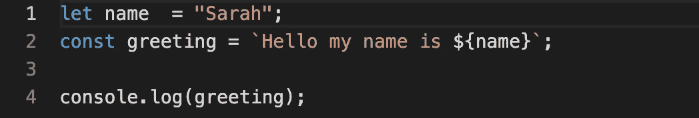
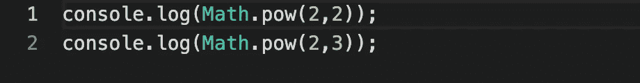
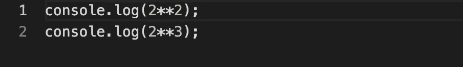

# JavaScript ES6 教程:现代 JS 的完整速成教程

> 原文：<https://javascript.plainenglish.io/javascript-es6-tutorial-a-complete-crash-course-on-modern-js-a09294bffdb7?source=collection_archive---------0----------------------->

## 2015 年以来的每一次重要更新

2015 年 6 月，JavaScript 有了重大更新，引入了大量新功能，包括箭头函数、类销毁和模板字符串等。在过去的几年中，这些特性一直在更新，以使您使用 JS 更加容易。我们不希望您落后于旧的 ES5 代码，所以今天让我们带您浏览自 2015 年以来 JavaScript 最重要的更新，并介绍如何使用每个功能。

以下是我们今天要讲的内容:

*   **第 1 部分:**JavaScript 更新概述
*   **第 2 部分:**最重要的 ES6 更新
*   **第 3 部分:【ES2016 最重要的更新**
*   **第 4 部分:【ES2017 最重要的更新**
*   **第 5 部分:【ES2018 最重要的更新**
*   **第 6 部分:【ES2019 最重要的更新**

*想通过动手实践开始学习？查看* [*现代 JavaScript*](https://www.educative.io/courses/complete-guide-to-modern-javascript) *完全指南。本课程结束时，您将对 JavaScript 的所有新增功能有一个很好的理解，并在游戏中处于领先地位。*

# 第 1 部分:JavaScript 更新概述

JavaScript (JS) 是一种轻量级的、面向对象的、解释型编程语言。1996 年，Netscape 将 JS 提交给 ECMA International 进行标准化，这导致了该语言的新版本 ECMAScript。ECMAScript 花了将近 15 年的时间才看到重大变化，从那以后，它一直在定期更新。让我们简要概述一下 ECMAScript 在过去十年中的更新历史。

## ECMAScript 2

ECMAScript 的第一个标准化版本发布于 1997 年。ECMAScript 2 在一年后发布，带来了一些小的变化，使这种语言符合 ISO 标准。

## ECMAScript 3

ECMAScript 3 于 1999 年发布，引入了许多新的流行特性，包括表达式、try/catch 异常处理等等。ECMAScript 3 之后，官方标准很多年都没有做任何修改。

## ECMAScript 4

ECMAScript 4 是 2000 年代中期提出的一项重大升级。这些更新引起了一些争议，ES4 被废弃了。

## ECMAScript 5

ECMAScript 5 (ES5)于 2009 年问世，对 ES3 进行了细微的修改，因此 JavaScript 可以在所有浏览器中得到支持。对更强大更新的渴望始于 2012 年左右，当时有一股更强的力量推动放弃对 Internet Explorer 的支持。

## ECMAScript 6

下一次大更新发生在 2015 年 **ECMAScript 6 (ES6)** 或 **ECMAScript 2015 (ES2015)** 正式发布。ES6 的特色是现代化的 JavaScript。

## 未来可期。

从那以后又有了四次更新: **ECMAScript 2016，2017，2018，2019** 。ES 这个名字。接下来是即将推出的版本，目前还在修改和提案中。你可以在这里了解更多。

> 一般来说，ECMAScript 是用来指代正式标准化语言的标题，而 JS 是程序员在实践中讨论语言时使用的。

既然你对 JavaScript 的发展历史有所了解，那么让我们直接进入 2015 年以来的变化和增加。

# 第 2 部分:最重要的 ES6 更新

## 块范围的 Let 和 Const

ES6 引入了关键字`let`和`const`，使我们能够更容易地声明变量。以前，用`var`声明的变量是函数作用域的，所以如果我们在`for`循环中声明它们，它们在循环外也是可用的。

用`let`和`const`声明的变量是块范围的，这意味着它们只能在声明它们的块中被访问。所以，如果我们用`let`声明一个变量，它不会在外部范围内改变它的值。`Const`类似，但是用这个关键字声明的变量的值不能通过重新赋值来改变。

对于何时使用哪些变量，没有严格的规则。下面是流行的 JavaScript 开发人员对如何使用这三个变量的两种不同意见。

> **来自**[**Mathias Bynes**](https://mathiasbynens.be/notes/es6-const)**:**默认使用`const`，如果需要重新绑定则使用`let`。`var`绝不应该在 ES6 中使用。
> 
> **From**[**Kyle Simpson**](https://me.getify.com/)**:**对于跨多个作用域共享的顶级变量使用`var`。将`let`用于较小的范围。

## 箭头功能

ES6 引入了箭头(`=>`)作为**声明函数**的一种速记方式。此更新有三个显著的优点:

*   你不再需要使用`.bind( )`方法
*   代码更干净，更简洁
*   可以跳过显式`return`

> *在某些情况下，您可能希望避免使用箭头功能。在与* `*this*` *关键字一起使用时，您需要小心。现在，当您使用 arrow 函数时，* `*this*` *关键字是从父作用域继承的。*

这是一个新语法的例子。

## 班级

ES6 中对类的更新没有引入新的 OO 继承模型。相反，这些类是支持原型继承的“语法糖”。这一更新非常有用，因为它简化了您的代码，而没有改变 JavaScript 的基本模型。这本质上是一种更好、更干净的继承方式。您可以通过两种方式创建类:

*   `class`宣言
*   `class`表情

你将需要方法`constructor`来创建一个`class`。让我们来看看。

## 模板文字

ES6 实现了模板字符串的有用特性，现在称为模板文字。这允许您用非常简单的语法(`${ }`)轻松实现变量并嵌入表达式。

它对于构造 API 请求和嵌套模板特别有用。

*   模板文字语法用反斜杠括起来。
*   模板文字中的语法占位符使用`${expression}`

请看下面的例子，了解模板文字是如何工作的:

## ES6 的其他更新

*   其他字符串方法
*   解构
*   阵列改进
*   标志
*   承诺
*   默认函数参数，即默认参数和默认值
*   发电机
*   委托书
*   对象文字更新
*   器械包、武器包、地图和武器地图

# 第 3 部分:最重要的 ES2016 更新

ECMAScript 2016 或 ES7 带来了对 ES6 的两个重要更新，这对现代 JavaScript 程序员来说很重要。

## `Array.prototype.includes( )`

`.includes( )`方法让你更容易检查特定的值是否存储在一个数组中。过去，JavaScript 开发人员必须使用`indexOf`并创建一个新函数。但是如果一个数组包含一个元素，那么`.include( )`将返回`true`，如果不包含，则返回`false`。看看下面的内容，看看它是如何工作的。

## 指数算子

指数运算符简化了我们在 JavaScript 中进行数学运算的方式。在过去，我们不得不使用`loop`、递归函数或者`Math.pow( )`，每次连接都会变得非常混乱。但是现在，我们的代码看起来像这样:

老路:

新方法:

# 第 4 部分:最重要的 ES2017 更新

## `Object.entires( )`和`Object.values( )`

这是两种访问对象的新方法，解决了`Object.keys( )`的一些限制，后者只返回对象的键。现在，`Object.values( )`使我们能够返回对象所有值的数组，`Object.entries( )`返回包含键和值的数组。

## 异步和等待

此次 ES8 更新提供了回调和承诺的替代方案，并使用了更易于管理的语法。异步函数允许我们定义一个异步函数并返回一个承诺。`.await( )`操作符在异步函数中等待一个承诺。看一看编写这段代码的新方法！

让我们再讨论一下新代码。

*   我们用关键字`async`创建一个异步函数
*   这将回报一个承诺
*   如果我们指定返回`non-promise`，它将返回一个包含在承诺中的值
*   await 关键字只在异步函数中有效

## 与 ES8 相比的其他变化:

*   字符串填充
*   共享内存和原子
*   `Object.getOwnPropertyDescriptors( )`
*   函数参数列表和调用中的尾随逗号

# 第 5 部分:最重要的 ES2018 更新

## 物体的静止/伸展

这个特性基于 ES6 的更新，所以我们可以对对象使用 rest/spread 语法。spread 操作符使我们能够创建一个`Object`的克隆，这样我们就可以更容易地修改原始文件。这个特性不应该在最后使用，否则会导致错误。看看下面的代码，看看它是如何工作的。

## 异步迭代

如果数据来自异步源，这个更新使您能够使用`await`来声明异步循环。我们使用`for-await-of`将可变量转换成承诺。GitHub 文档解释说“异步迭代器很像迭代器，除了它的`next()`方法返回一个对`{ value, done }`的承诺。”看看下面的代码，看看这是怎么回事。

## 其他 ES9 功能:

*   取消模板文字限制
*   正则表达式功能
*   `Promise.prototype.finally ( )`

# 第 6 部分:最重要的 ES2019 更新

JavaScript 的最新更新增加了一些小而重要的特性，作为现代 JavaScript 程序员，您应该知道这些特性。

## `Array.prototype.flat`

这个特性本质上是递归地将数组展平到预先指定的深度。flat()方法创建一个包含所有子数组元素的新数组。`Infinity`用于展平嵌套数组。看看下面的代码，看看它是如何工作的。

## `Symbol.prototype.description`

方法`.description`允许你返回一个`Symbol`对象的可选描述。`Symbol`对象可以有一个用于调试目的的可选描述，这个新的更新使您能够阅读该描述，但不包含封闭的`Symbol ( )`字符串。

## 对`Object.fromEntries`的更改

该方法将您的键值对列表转换成对象，我们可以将任何 iterable 作为参数`Object.fromEntries`传递。看看下面的代码。

## 其他更新包括:

*   `String.prototype.trimStart( )` / `trimEnd( )`
*   对`Array.sort`的更改
*   `Function.prototype.toString( )`
*   可选 Catch 绑定

# 包扎

现在您已经了解了过去几年中所有的 JavaScript 更新！要精通这些新特性和工具，还有很多东西需要学习，所以一定要将它们付诸实践，并随着时间的推移关注更多的更新。

如果你有兴趣直接进入，查看 Educative 的课程，[现代 JavaScript 完全指南](https://www.educative.io/courses/complete-guide-to-modern-javascript)。本课程将带您了解掌握嵌入式编码环境、测验等现代 JavaScript 所需的所有信息。

*立即开始，并作为一名 JavaScript 开发人员保持相关性！*

# 进一步的阅读和资源

**文章**

*   [成为全栈 JS 开发者的旅程从这里开始](https://www.educative.io/blog/the-journey-to-become-a-full-stack-js-developer-starts-here)
*   学习 JavaScript OOP:网络开发入门
*   [与全球 JavaScript 开发者的对话](https://www.educative.io/blog/conversations-with-the-worlds-javascript-developers-part-1)

**JavaScript 课程**

*   [JavaScript 实践:ES6 及更高版本](https://www.educative.io/courses/javascript-in-practice-es6-and-beyond)
*   [JavaScript 实践:入门](https://www.educative.io/courses/javascript-in-practice-getting-started)
*   [JavaScript 简介:第一步](https://www.educative.io/courses/introduction-to-javascript-first-steps)