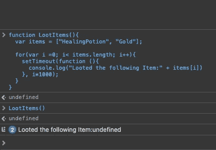
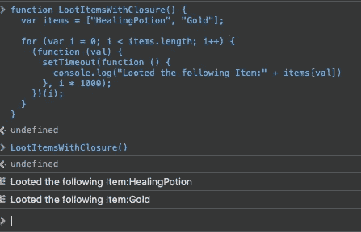
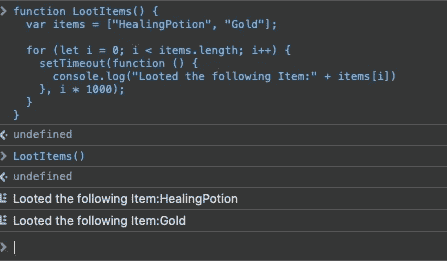

# 通过掌握变量来避免常见的 JavaScript 提升问题

> 原文：<https://javascript.plainenglish.io/javascript-es6-var-let-or-const-88da65f3a0df?source=collection_archive---------8----------------------->

## Var，Let，和 Const 进行深度检查！

[s](https://pixabay.com/de/photos/kaffee-kaffeebohnen-pokal-171653/)ource: [Christoph](https://pixabay.com/de/users/christoph-47781/) by [pixabay](https://pixabay.com/de/photos/kaffee-kaffeebohnen-pokal-171653/) (CC0)

# 序文

变量的类型由它所保存的值来设置。这就是 JavaScript 中类型系统的动态本质的来源。例如，在 C#中，我们得到了强类型变量，而它的行为正好相反。该类型被分配给变量。因此，C#知道一个已声明但未初始化的变量，而 JavaScript 必须返回一个未定义的变量作为通用答案，而不是 null。

但是这与 const、let 和 var 有什么共同之处呢？

# 提升

要回答这个问题，我们应该研究一下在 JavaScript 中声明变量的方法。我们只有三个选择。

1.  定义变量
2.  让
3.  常数

Var 是它们的真正来源，因为 let 和 const 是 ES2015 附带的。Var 是一个非常常见的关键字，即使在我们得到 let 和 const 的今天也是如此。不过，最好不要使用它。因为用 var 定义的变量就像 C#中的局部变量一样。它只能在声明它的函数内部使用。

这里有什么不同？我给你举了两个例子。第一个在方法中间声明变量，并立即初始化它。

第二个例子展示了声明和初始化变量的不同点，但在技术上是相同的。

一个变量在被声明之前就存在并不直观，但是在 JavaScript 中，这是事实。这个变量可以在这个函数的开始使用，尽管它可以在函数体的最后一行声明。这里要提到的是，在执行初始化代码行之前，变量是未定义的。

这种行为通常被称为“吊装”。可用性被提升到函数的入口点。有问题的一点是:JavaScript 在后台进行这种提升，你在源代码中看不到这种效果。

一个解决方法是在每个函数的开头收集所有的变量，就像你在 C#中可能知道的那样，以便知道这个函数是关于什么的，它需要什么。一方面，源代码的可读性降低，而变量的范围更容易识别。

对于循环，这种“提升”变得相关，导致错误，并照顾屏幕前好奇的面孔。

这段代码不会像您可能首先假设的那样，将两个项目“HealingPotion”和“Gold”打印到控制台。我们得到的是 2 倍的“未定义”。这就是证据:

它是怎么来的？函数可以定义变量的作用域。一个块(也就是我们的 for 循环)不能定义作用域。只允许方法/函数这样做。运行索引“I”在整个“LootItems()”方法中只存在一次。不是块的每次迭代一次。由于 setTimeout 将暂停执行“I”乘以 1000 毫秒，因此在打印输出之前，运行索引“I”的值将为 2。Items-Array 只有 2 个元素，它们的索引是 0 和 1。结果返回 undefined。在 C#中，我们现在会因为一个“IndexOutOfBounds”异常而有一个程序中断。

闭包会有所帮助，您可以将循环的内容放在匿名函数中，并使用运行索引作为参数来调用它。这使得外部块的状态被保存到 setTimeout 的内部块中，即匿名函数。

# let 比 var 好

从 ES2015 开始，我们就在为反对“让”而欢呼。它定义了新的规则，并不适用“吊装”。但是它也将块结构提升到了变量的作用域。

将“let”更改为“var”会导致下面这段简单的代码:

记住“var”？声明可以在方法中的任何地方，但它可以在函数的顶部访问，尤其是在声明变量之前。只有这个变量的定义(赋值)在代码执行到那一行时才有效。对于“let ”,只有当执行程序到达最终初始化变量的那一行时，两者才有效。预先访问会导致“引用错误”。

“var”的另一个奇怪行为是允许我们多次声明同一个变量。忽略每个声明，从第二个声明开始。尽管一个函数应该只有 20 行长，以保持[圈复杂度](https://www.perforce.com/blog/qac/what-cyclomatic-complexity)较低，并遵循[固-S](https://medium.com/unity-hub/unity-solid-s-single-responsibility-6707d9569e73) 原则。但是有些方法可能会出现很长时间，特别是对于遗留代码，您需要修复一个错误，用 var 声明一个临时变量。如果这已经存在，您将不会得到任何错误？去你的，JavaScript。

> 如果让这种情况不发生，就会导致“语法错误”。

这里继续 For-Loops“let”也是不同的。我提到过，当你使用“let”时，块结构也可以定义作用域。此外，这将为每次迭代创建一个已定义变量的新实例。

改变我们的旧循环，打印出未定义的，我们现在得到一个工作函数:

这也适用于 for-in 和 for-of 循环。

需要知道的最重要的事实是，当您使用 JavaScript“严格模式”时，“let”只作为保留的语言关键字出现。对于遗留代码，有机会将变量命名为“let ”,但在现代代码中，这已经不可能了。

在所有其他物品中，let 表现得像“var ”,而 linters 确实有“no-var”规则，这并不是为了好玩。它使代码稳定，因为没有奇怪的行为和错误，这需要很长时间，直到他们被调试。

# 但是 const 更好

“let”和“const”之间的区别是，使用“const”不能再进行重新分配，它们必须在同一行中声明和定义。此外，ES2015 中引入了“const”。

上面的部分是允许的，下面的部分会导致错误。

下一个代码语句对 const 来说是正确的。

在实际编码中，“const”应该是你的选择。对于棉短绒也有一个规则，它会告诉你“常量”是更好的选择，叫做“首选常量”。此外，对代码的分析可以让您意识到将变量重新分配给已经声明的变量。

# 经验法则

经验法则，对于我们的 const、let、var 三剑客来说就是:更喜欢“CONST”，然后是“LET”，然后是“VAR”。按照这个顺序。

**注意:“** Const”并不意味着这个变量是常数，它只意味着分配给它的值，以后不能改变。但是当分配一个引用时，内容可以很容易地被改变。只有引用不能改。来自 C#？那你就知道它和 C#的“const”是一样的。

# 结论

“Var”是一个遗产，但主要被新来者使用，因为它似乎是最好的/第一选择，或者你很久以前就开始编写 JavaScript 了，当时甚至没有选择。然而，“var”很容易被误解为“variable”或“variant”的简称，我在 2015 年刚接触 JavaScript 时，甚至不知道自己在做什么就使用了这个词。

今天，不再使用它是不可取的。从您的工具集中禁止它，或者至少将它锁定在遗留代码中，在那里损害可能已经发生了。为了处理遗留代码，关于提升和“var”的知识是必须的。

如今，如果配置得当，linters 会让我们的生活变得更加轻松，即使配置不当，也可以慢慢使用“const”>“let”>“var”。

# 链接和参考

## Gists

[CX _ 0 _ declaring var . js](https://gist.github.com/ArnoldATProJanitorDevs/b5edc1ad81f43e13d61cf7e54b2831aa#file-cx_0_declaringvar-js)
CX _ 0 _ declaring var . js
[CX _ 1 _ hoistingloop . js](https://gist.github.com/ArnoldATProJanitorDevs/d428c7f27f89a4b587a67a30868cab84#file-cx_1_hoistingloop-js)
[CX _ 1 _ hoistingloop . js](https://gist.github.com/ArnoldATProJanitorDevs/59ea94f24fafad7052756937deccc71e#file-cx_1_hoistingloop-js)
CX _ 2 _ Let&var . js
CX _ 3 _ Let loops . js
[CX _ 4 _ constvslet](https://gist.github.com/ArnoldATProJanitorDevs/c5a07e3e21d8cccd8aed3fefe0b6f837#file-cx_4_constvslet-js)