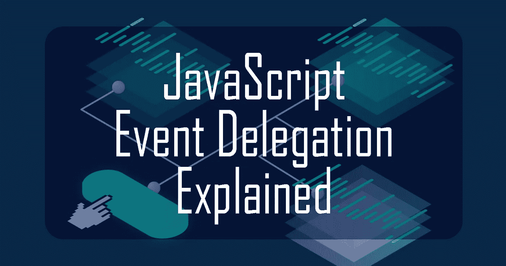

# JavaScript 事件委托解释

> 原文：<https://javascript.plainenglish.io/javascript-event-delegation-explained-4786685bb21?source=collection_archive---------10----------------------->

各位编码员好！今天，我将解释 JavaScript 中一个有用且强大的事件处理概念，称为事件委托。但首先需要一点背景知识。



# 背景知识:事件捕获和冒泡

“onclick”属性通常附加在 HTML 中的

对于“onclick”事件处理程序，会发生两个阶段:**捕获**和**冒泡**

> ***事件捕获:*** *浏览器从最顶层的元素< html >开始检查上面的 onclick 处理程序。如果是，它将在* ***向下*** *移动到下一个 HTML 元素之前运行它，并重复该过程，直到它到达目标(被单击的)元素。又名顶部到目标。*

另一方面，

> ***事件冒泡:*** *浏览器从目标(被点击)元素中检查其上的 onclick 处理程序。如果是，它将在* ***向上*** *移动到下一个 HTML 元素之前运行它，并重复该过程，直到它到达最顶端的元素< html >。又名目标到顶端。*

这是对这两个阶段的直观解释


[*miro.medium.com/max/1280/1Et5UjVPGLfF1L43T7..*](https://hashnode.com/util/redirect?url=https://miro.medium.com/max/1280/1Et5UjVPGLfF1L43T7ErrxQ.png)

> *注意:在现代浏览器中，默认情况下，所有的事件处理程序都是为冒泡阶段注册的。来源:*[*developer.mozilla.org/en-US/docs/Learn/Java..*](https://hashnode.com/util/redirect?url=https://developer.mozilla.org/en-US/docs/Learn/JavaScript/Building_blocks/Events)

出于这个原因，使用太多的“onclick”处理程序有时会变得混乱，特别是当您有一个事件在一个元素中运行，而该元素的父元素也有“onclick”属性时。即使您不想触发父元素的“onclick ”,它也会被触发。

这个问题的解决方案是:

1.  请改用`addEventListener()`
2.  在事件函数中添加`event.stopPropagation()`

虽然这两个阶段看起来很麻烦，但它们并不完全是坏事。事实上，作为一名开发人员，事件捕获和冒泡可以用来实现一种更有效的方式来编写事件处理程序。是的，这种高效的事件处理概念被称为**事件委托**。

# 事件委托

> *一个强大而有效的事件处理模式，当一个父元素中的许多元素将运行同一个事件时使用。*

让我们看一个例子。假设你有一个这样的“待办事项”应用程序:


我们可以只在父元素中放置一个事件处理程序，而不是在每个“已完成”按钮中添加一个事件处理程序，以便在单击按钮时删除任务。

这是 HTML:

```
<div id="task-box">
    <h2>My Tasks</h2>
    <div id="task">
        <button class="done">COMPLETED</button>
        <p>9am-10am</p>
        <p>Walk my dog</p>
    </div>
    <div id="task">
        <button class="done">COMPLETED</button>
        <p>10am-12pm</p>
        <p>Do homework</p>
    </div><div id="task">
        <button class="done">COMPLETED</button>
        <p>12pm-4pm</p>
        <p>Lunch with friends</p>
    </div>
</div>
```

因此，代替对每个`<button>`元素的“onclick”。我们为`<div id="task-box">`元素分配了一个“onclick ”,它将检查按钮是否被单击，并运行 removeTask()函数从待办事项列表中删除该按钮及其任务。让我们编写代码:

```
document.getElementById("task-box").onclick = function(event) { 
       if (event.target && event.target.matches("button.done")) {
                  removeTask(event.target.parentNode); 
       } 
});
```

结果非常完美:


# 说明

当按钮被点击时，冒泡阶段检查按钮(目标元素)是否有“onclick”。它没有，所以它移动到

并再次检查。不，它也没有“onclick”，所以它再次上升到。啊哈！找到一个“onclick ”!因此它将运行函数，该函数检查 event.target(被单击的元素)。如果是一个 class = "done "的按钮，那么我们将通过调用函数 removeTask()移除(event . target 的 parentNode)。

# 就是这样！

我希望这个简单的例子能帮助您理解事件委托是如何工作的，以及它是如何使用事件冒泡/捕获来实现其概念的。这在类似待办事项列表的情况下非常有用，因为元素会不断地被删除和添加。给每个按钮添加一个“onclick”会很麻烦。

实现事件委托有许多美妙的用途。我希望你能把它应用到你的项目中。感谢您的阅读，如果您觉得有帮助，请留下“大拇指”让我知道~如果您有任何关于事件捕获/冒泡和事件委托的问题，请不要犹豫，在评论中提问。下次再见，干杯！