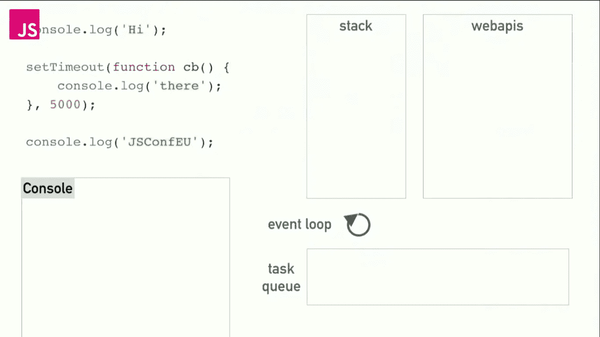
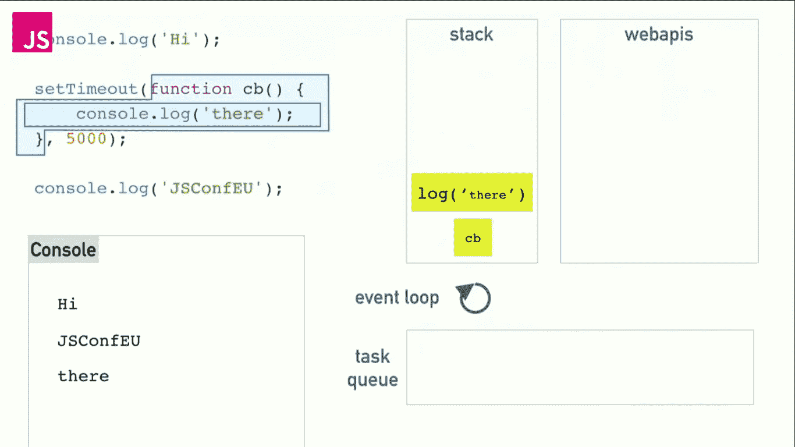

# JavaScript 事件循环解释

> 原文：<https://javascript.plainenglish.io/javascript-event-loop-explained-dd9520a58544?source=collection_archive---------3----------------------->

在前两篇文章中，我们学习了 JavaScript 的调用堆栈、单线程和非阻塞行为。为了理解 JavaScript 如何在 chrome 的 V8 引擎上运行。这是我们讨论事件循环、Web APIs 和任务队列的最后一篇文章。所有这些东西是如何一起工作并形成 JavaScript 运行时环境的。我们开始吧。

 [## JavaScript 中的单线程和非阻塞是什么意思？

### 一次性理解 JavaScript 可能会很困难，也很忙乱。我读了很多教程，但没有得到…

medium.com](https://medium.com/javascript-in-plain-english/js-single-thread-non-blocking-explained-d5de012a33cf) 

# 调用栈

调用堆栈是一个后进先出(先执行最新的任务)的数据结构，包含执行将恢复的地址。调用栈是 JavaScript 运行的整个系统的一部分。如果你想更好地理解 JavaScript，你可以阅读我在调用栈上的文章。

 [## 节点:调用堆栈解释

### 大约一年前，正如我的投资组合所说，我是一名高级 JavaScript 开发人员。但是在孤独的时候，当我问自己…

medium.com](https://medium.com/javascript-in-plain-english/node-call-stack-explained-fd9df1c49d2e) 

# Web APIs

Web APIs 不是 JS 引擎的一部分，但是它们是浏览器提供的 JavaScript 运行时环境的一部分。JavaScript 只是为我们提供了一种访问这些 API 的机制。由于 Web APIs 是特定于浏览器的，因此它们可能因浏览器而异。有些情况下，一些 Web APIs 可能出现在一个浏览器中，但在另一个浏览器中却没有。

## 例子

1.  操作 DOM 的 DOM API。`document.getElementById`、`addEventListerner`、`document.querySelectorAll`等。是浏览器提供的 DOM API 的一部分，我们可以使用 JavaScript 访问它。
2.  AJAX 调用或 XMLHttpRequest。由于 Web API 是特定于浏览器的，而 XMLHttpRequest 是一个 Web API，所以在 JQuery 拯救我们之前，我们必须以不同的方式为 IE 实现 XMLHttpRequest(还记得吗？).
3.  像`setTimeout`、`setInterval`这样的定时器功能也是浏览器提供的。

为了更好地理解事件循环和任务队列，我们将举一个例子来理解我们一直在做的事情:)。

Credits: JS Conference

在这里，我们将执行这段代码，并了解事件循环、任务队列、web APIs 和调用堆栈如何协同工作。正如我们所知，JavaScript 是一种异步语言，这意味着如果一些代码需要时间来执行，它将移动到下一行，然后当合适的时间到来时，这些代码就会执行。但是 JavaScript 是如何做到这些的，我们来看看。像网络请求、图像处理等一般需要时间的代码。我们使用`setTimeout`5 秒来创建一个延迟。

Image 1

代码开始时，一切都很顺利。正如我们所知，JavaScript 一次运行一段代码，这段代码存在于调用堆栈中。这里的`log("Hi")`是要执行的第一行。由于`log("Hi")`不需要花费时间来执行，它只是从调用堆栈中在控制台弹出窗口中打印结果。简单！

Image 2

现在让我们去下一行，`setTimeout()`它在等着我们。当`setTimeout()`被推入堆栈时，JavaScript 智能运行时已经知道执行需要时间。那怎么办呢？在这种情况下，每当某段代码需要时间来执行时，JS 会将它移入浏览器的 web API，因为`setTimeout()`是浏览器 Web API 模块的一部分，而&是 Web API 模块的 5 秒处理计时器。现在，我们的堆栈又可以自由执行其他代码了。见下图。

Image 3

现在，让我们进入下一行。`log("JSConfEU")`也是一行简单的代码，首先被推入调用堆栈，然后成功执行。请参见下图中的控制台。

Image 4

与此同时，我们的`setTimeout()`正在等待 5 秒钟完成计时器。定时器结束后，它被移动到任务队列。在这里，任务队列发挥了作用。见下图。

Image 5

最后，我们的事件循环出现了。事件循环的工作是查看任务队列和调用堆栈。如果任务队列中的一些代码准备好执行，事件循环等待调用堆栈变空，当调用堆栈空闲来执行任务时，事件循环从任务队列中取出代码，推送到调用堆栈。见下图。

Image 6

现在最后`setTimeout()`的回调函数将执行并在控制台显示结果。

Image 7

所以，毕竟，XYZ 运营的所有实体都成功地协调执行了这 3 行代码。简单总结一下。

**1:** 调用栈在 LIFO 的基础上执行代码，但一次只能执行一个代码。
**2:** 浏览器的 Web APIs 提供其他需要的功能，如 setTimeout、网络请求等。

> `console.log("HI");`也是 Web APIs 的一部分，但不是 JavaScript 的一部分。

**3:** 任务队列存储先前花费时间但现在等待执行的代码。
**4:****事件循环管理任务队列和调用栈。当调用堆栈为空并且任务队列有任务要执行时。事件循环从任务队列中取出任务，并推入调用堆栈。**

**所以，我认为现在关于事件循环和任务队列的疑问已经很清楚了&您对 JavaScript 的基本工作有了更好的理解。如果你喜欢这篇文章，请“鼓掌”，关注我更多有趣的文章。**

**鸣谢:本文内容参考自飞利浦罗伯特[视频讲解](https://www.youtube.com/watch?v=8aGhZQkoFbQ)。为了更好地理解，你也可以观看视频。**

> **感谢阅读**
> 
> **快乐编码||写 2 学**