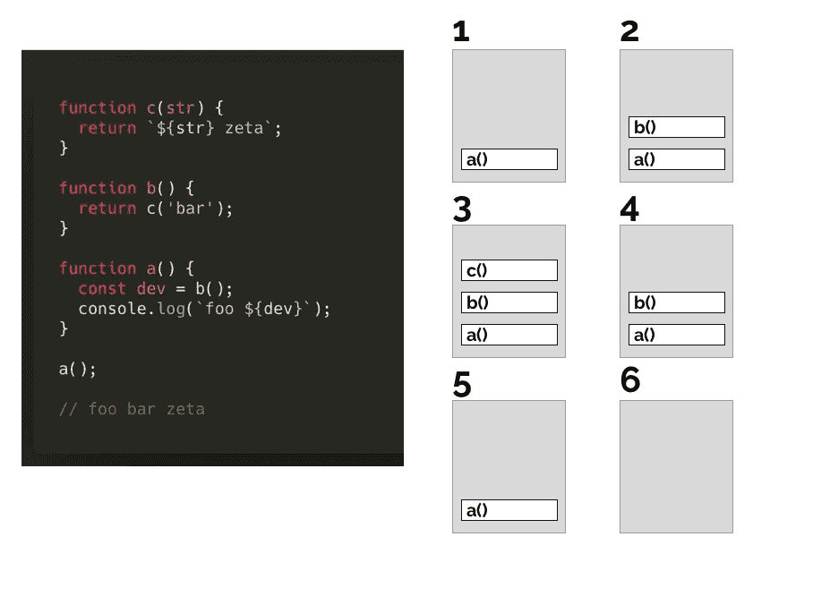
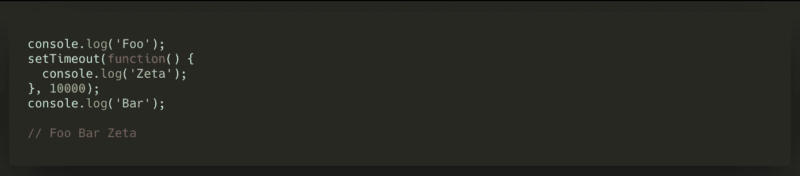
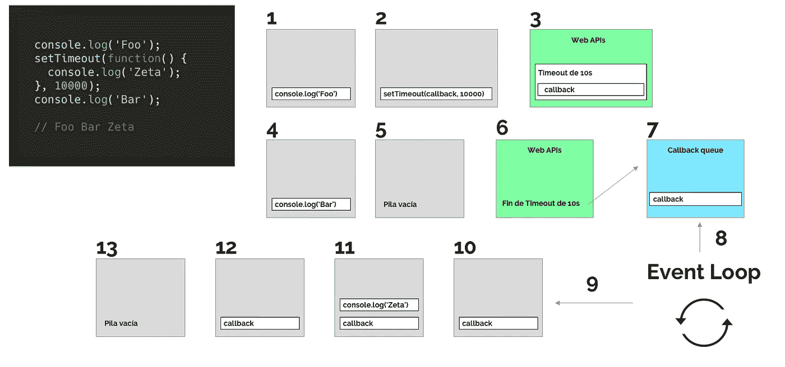
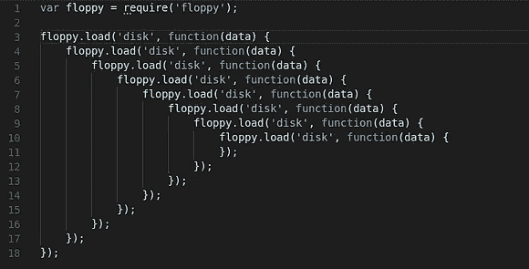

# JavaScript。事件循环和承诺

> 原文：<https://javascript.plainenglish.io/javascript-event-loop-y-promises-951ba6845899?source=collection_archive---------0----------------------->

## 执行异步代码时 JavaScript 事件循环如何工作


今天，我准备了其中一篇文章，我认为它有助于强化我们经常忽略的某些 **Javascript** 概念，因为*日复一日的*迫使我们将更多的注意力放在解决问题上，而不是理解下面事情的工作方式。

具体来说，今天我想谈谈**承诺**，随着 ES6 的到来，这种新类型的对象(最终)出现了，它允许我们异步执行任务，一旦完成，就获得它们的结果(或者如果出现错误的话)并执行我们需要的代码。不过话说回来…**Javascript 是异步的**？为了回答这个问题，我们还将深入研究被称为事件循环的“*工具*，它经常出现在选拔技术人员在面试中提出的问题中(去年在我参加的每次面试中，我都必须解释它)。

所以，我们开始吧！

# 是的，Javascript 是同步的

让我们从 Javascript 是同步的开始**并且只有一个执行线程。也就是说，它一次只能执行一个任务，这将阻止任务的执行，直到任务完成，然后才能继续执行下一个任务。**

然而，当我们必须执行繁重的查询时，会发生什么呢？例如，获取一个包含 10，000 条记录的列表，我们稍后将使用这些记录。有没有办法防止执行被阻塞，以便*在*时我们可以继续做其他任务？这就是开发人员社区提出的解决方案出现的地方，以便为 Javascript 提供异步的某个方面:著名的**事件循环**。

# Javascript 事件循环

为了理解 Javascript 事件循环，我们先来看看同步执行堆栈是如何工作的:



如您所见，当`a()`函数开始执行时，对其余函数的连续调用被添加到堆栈中，这些调用被执行并在结束时从堆栈中移除。

现在，假设我们有以下代码:



在这种情况下，如果我们在一个同步执行堆栈上工作，`setTimeout`函数将导致执行停止 10 秒钟(从而阻塞程序),因此在我们等待计数器结束时，没有办法做任何其他事情。

为了解决这些类型的情况，实施了众所周知的**事件循环**，它允许以同步方式执行这些类型的任务，以便:

*   执行没有被阻止
*   一旦异步任务完成，只要有可能就执行你的*回调***(记住后者非常重要)**

**让我们看看它是如何工作的:**

****

*   **在步骤 2 中，当`setTimeout(callback, 10000)`函数被放入堆栈时，这个调用被传递给浏览器的 Web API**o 它不再属于 Javascript 引擎**，而是属于浏览器(或运行它的系统)提供的附加功能。**
*   **因此，在步骤 3 中，您可以看到是 **Web API 负责**执行`callback`功能。**
*   **在第 4 步中，我们可以看到另一个`console.log`是如何执行的，因此在第 5 步中堆栈已经是空的。**
*   **一旦在 Web API 中找到的`setTimeout`的 10 秒过去(并且 JavaScript 摩托车的执行堆栈为空)，就发生步骤 6。由于 Web API 不能直接向堆栈添加任何东西(这可能会导致当前正在运行的代码中断)，它所做的是将`callback`添加到**回调队列**(步骤 7)。**
*   **在步骤 8 中，**事件循环**开始起作用。在 Javascript 引擎栈为空的时刻**，事件循环获取队列回调中的内容并将其添加到执行栈中。****
*   **从那里开始，`callback`执行遵循正常的执行过程(步骤 10 到 13 ),直到堆栈为空。**

**因此，尽管 Javascript 不是异步的，但是包含 WebAPI 以及*事件循环和队列回调*允许它提供某种程度的灵活性，以便较重的任务不会阻塞执行线程。**

**但是，**有一个“但是”**。由于不知道函数的*回调*将在何时被执行(正如我们所见，有必要将堆栈留空，以便*事件循环*可以从队列回调中向其添加内容)，可能有必要在我们的函数回调中嵌套连续的调用，这被称为“**地狱回调”**。**

**正如我们将在下面看到的那样，这是为了解决所产生的承诺。**

****

# **承诺**

**为了避免这种“*回调地狱”*，开发了一系列库，如 [Bluebird](http://bluebirdjs.com/docs/getting-started.html) 或 Q，允许稍微清理嵌套函数的所有混乱，并编写异步操作但看起来像是同步编写的代码:**承诺**诞生了。**

**随后，随着 ES6 的到来，将承诺带入 Javascript 的提议被接受，留下了如下语法:**

```
const p = new Promise(function(resolve, reject) {
    return setTimeout(function() { 
        resolve(1); 
    }, 10000);
});p.then(function(value) { 
     console.log(value) 
});// 1
```

> **我们可以将**承诺**定义为一个可以在未来某个时间产生单个值的对象，可以是一个值，也可以是无法解决的原因。**

**承诺可以有三种状态:待定、履行或拒绝。对于这些`Promise`对象，开发人员可以通过`then`指令附加*回调*，这样一旦承诺解析的值可用(或无法解析的原因)，我们就可以执行代码。**

**另外，**承诺**的另一个特点是**热切**，也就是说，一调用构造函数，承诺就会开始做驻留在你体内的任务。你可以在这个例子中看到:**

**[http://latentflip.com/loupe/?code = y 29 UC 3 qgy 2 fsbgjhy 2 TQ cm 9 taxnlid 0 gznvuy 3 rpb 24 odmfsdupihskicaginvbnvbguubg 9 nkcdjywxsymfjaybwcm 9 taxnljyk 7 cn 0 ky 29 UC 3 qg CCA 9 ig 5 ldybqcm 9 taxnlkgz 1 BmN 0 aw 9 ukhjlc 29 sdmupihskicagihjldybibzzxruaw 1 lb 3 v0k hjlc 29 sdmusidewmdawktskfsk 7 cmnvbnnvbguu！！pgj 1 dhrvbj 5 dbgljaybtzse 8 L2 j 1 dhrvbj 4% 3D](http://latentflip.com/loupe/?code=Y29uc3QgY2FsbGJhY2tQcm9taXNlID0gZnVuY3Rpb24odmFsdWUpIHsKICAgIGNvbnNvbGUubG9nKCdjYWxsYmFjayBwcm9taXNlJyk7Cn0KY29uc3QgcCA9IG5ldyBQcm9taXNlKGZ1bmN0aW9uKHJlc29sdmUpIHsKICAgIHJldHVybiBzZXRUaW1lb3V0KHJlc29sdmUsIDEwMDAwKTsKfSk7CmNvbnNvbGUubG9nKCdDb21pZW56bycpOwpwLnRoZW4oY2FsbGJhY2tQcm9taXNlKTsKY29uc29sZS5sb2coJ0ZpbicpOw%3D%3D!!!PGJ1dHRvbj5DbGljayBtZSE8L2J1dHRvbj4%3D)**

**如果你已经执行了代码，你会看到如何调用`setTimeout`是第一件被执行的事情，在 Web Apis 中托管这个指令。**

# **承诺和事件循环**

****

**Photo by [Claire Satera](https://unsplash.com/@daisybisley?utm_source=medium&utm_medium=referral) on [Unsplash](https://unsplash.com?utm_source=medium&utm_medium=referral)**

**然而，承诺及其"*回调*的执行与我们在上一点中看到的异步回调有所不同，因为承诺回调被添加到一个我们之前没有提到的新队列:**微任务队列。****

**从现在开始，我们将区分两种类型的异步任务:**

*   ****宏任务**，这些宏任务被编程，以便浏览器可以确保它们在从内部引擎访问 Javascript 时按顺序执行。例如，浏览器事件的回调(一个`onClick`)或者我们之前看到的`setTimeout`之类的函数的回调被认为是宏任务。**
*   ****微任务**，它们被编程为应该在当前运行的脚本之后立即发生的事情，例如执行一些异步的事情，而不支持创建新的*宏任务*的惩罚。这些微任务被粘在**微任务队列**中，微任务队列在*宏任务*之后被处理，并且在每个宏任务执行结束时，假设没有 Javascript 运行。如我之前所说，微任务中有`Promise`对象的回调。**

**因此，在**事件循环**的迭代中，我们将拥有:**

1.  **检查**宏任务**队列中是否有任务。**
2.  **如果是这样，并且该任务正在运行，请等到它完成后再进行下一步。如果没有，直接转到步骤 3。**
3.  **然后运行微任务队列中的所有**微任务**。**
4.  ****如果我们在微任务**执行期间添加新的微任务，它们也会被执行。**

> **作为这个序列的推论，我们可以说，如果在两个宏任务之间，微任务的尾部有元素，那么这两个宏任务就不能一个接一个地执行。**

**因此，在我们定义承诺的解析(通过指令`then`的方式)的时刻，一个新的微任务被表示，该微任务代表所述回调。**

**这允许我们确保这样的回调是异步的，即使承诺已经被解决。也就是说，如果我们有以下代码:**

```
console.log('start');  
Promise.resolve()
  .then(function() {   
    console.log('promise 1'); 
  })
  .then(function() {   
    console.log('promise 2'); 
  });  
console.log('end');// start
// end
// promise 1
// promise 2
```

**属于已定义承诺的回调的`console.log`被画在了最后，因为它们被粘在了一起，即使我们正在异步解析承诺。**

**在另一个例子中:**

```
console.log('start');setTimeout(function() {   
  console.log('timeout finished'); 
}, 0);Promise.resolve()
  .then(function() {   
    console.log('promise 1'); 
  })
  .then(function() {   
    console.log('promise 2'); 
  });  
console.log('end');// start
// end
// promise 1
// promise 2
// timeout finished
```

**你可以看到`timeout finished`是如何写在最后的，因为**脚本本身被当作一个宏任务，所以在最后排队的微任务被执行**，也就是引用承诺回调的两个 console.log。**

# **结论**

**如您所见，尽管我们经常使用**承诺**背后有许多概念，并且它们在当前的 Javascript 代码中已经无处不在。**

**因此，我希望这篇文章能帮助你回顾或发现所有这些类型的概念。一如既往，如果你有任何问题或想对本文有所贡献，请在评论中留下，我将很高兴收到你的来信！**

# **你想看更多这样的文章吗？**

**如果你喜欢这篇文章，我鼓励你订阅我每周日发送的时事通讯，里面有类似的出版物和更多的推荐内容:👇👇👇**

**[](https://eepurl.us20.list-manage.com/subscribe?u=c14cad2102bcf33bf216cc69e&id=2790da9378) [## 拿铁和代码

### 您即将订阅每周日收到的 Latte and Code 通讯。最后两篇文章...

eepurl.us20.list-manage.com](https://eepurl.us20.list-manage.com/subscribe?u=c14cad2102bcf33bf216cc69e&id=2790da9378)**