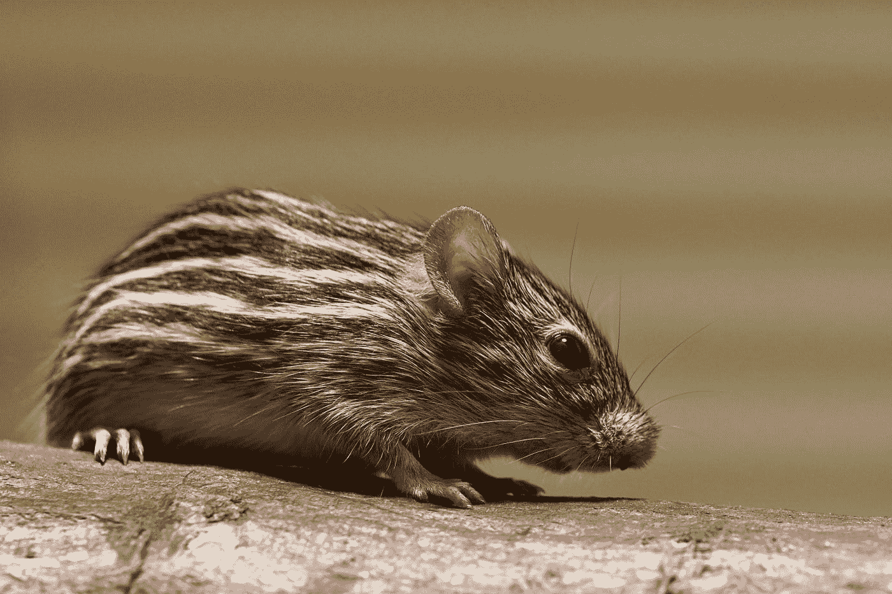
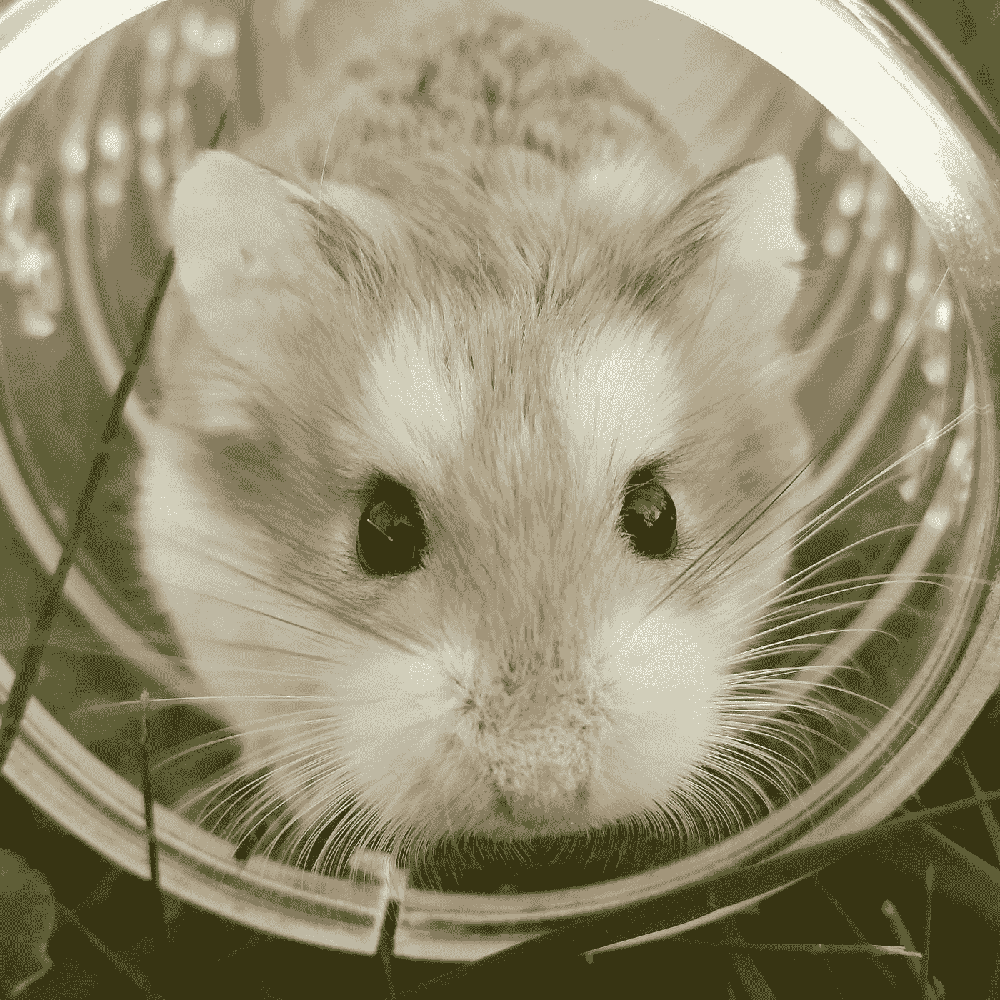

# JavaScript 事件处理程序—鼠标移动和鼠标移出

> 原文：<https://javascript.plainenglish.io/javascript-events-handlers-mouse-move-and-mouse-out-b1e275b46622?source=collection_archive---------4----------------------->



Photo by [Wolfgang Hasselmann](https://unsplash.com/@wolfgang_hasselmann?utm_source=medium&utm_medium=referral) on [Unsplash](https://unsplash.com?utm_source=medium&utm_medium=referral)

在 JavaScript 中，事件是应用程序中发生的动作。它们是由各种事情触发的，比如输入、提交表单、调整大小等元素变化，或者应用程序运行时发生的错误等。我们可以分配一个事件处理器来处理这些事件。发生在 DOM 元素上的事件可以通过为相应事件的 DOM 对象的属性分配一个事件处理程序来处理。在本文中，我们将看看`mousemove`和`mouseout`事件。

# `**onmousemove**`

DOM 元素的`onmousemove`属性允许我们分配一个函数来处理`mousemove`元素。当用户移动鼠标时，触发`mousemove`事件。

例如，我们可以用它来制作工具提示，当我们将鼠标指针悬停在一个元素上时，工具提示就会出现。首先，我们添加一些 HTML 代码来添加一些`p`元素，当我们悬停在它上面时会显示一个工具提示，就像我们在下面的代码中做的那样:

```
<p><a href="#" data-tooltip="Tooltip 1" id='tooltip-1'>Tooltip 1</a></p>
<p><a href="#" data-tooltip="Tooltip 2" id='tooltip-2'>Tooltip 2</a></p>
```

然后在 CSS 代码中，我们为工具提示放置样式:

```
.tooltip {
  position: absolute;
  z-index: 9999;
  padding: 6px;
  background: #ffd;
  border: 1px #886 solid;
  border-radius: 5px;
}
```

`tooltip`类使工具提示`div`与现有元素重叠。在 JavaScript 代码中设置位置后，它应该出现在鼠标指针附近。我们还设置了工具提示的背景颜色和边框。

最后，我们添加 JavaScript 代码，一旦我们给它分配了我们自己的`onmousemove`事件处理函数，就显示工具提示。我们通过添加以下代码来实现这一点:

```
document.onmousemove = (event) => {
  document.querySelectorAll('.tooltip').forEach(e => e.parentNode.removeChild(e)); const id = event.srcElement.id;
  const node = document.createElement('div');
  node.className = 'tooltip';
  node.textContent = event.target.dataset.tooltip;
  node.setAttribute('hidden', '');
  node.style.left = event.clientX + 20 + 'px';
  node.style.top = event.clientY + 10 + 'px';
  document.body.appendChild(node); if (id == 'tooltip-1' || id == 'tooltip-2') {
    node.removeAttribute('hidden');
  }
}
```

在我们的`mousemove`事件的事件处理函数中，我们将它分配给了`document`的`onmousemove`属性，我们用类`tooltip`获取了所有现有的元素，这样我们就可以将它们从屏幕上移除。

然后我们通过用`createElement`方法创建一个`div`元素来创建工具提示。然后我们通过设置`node`的`className`属性将其设置为`tooltip`类。接下来，我们获取`data-tooltip`属性的值，然后将其设置为`node`的`textContent`属性。然后我们设置刚刚创建的`div.tooltip`元素的`hidden`属性。然后我们将`left`和`top`位置设置为`clientX + 20`像素和`clientY + 10`像素。`clientX`和`clientY`是鼠标指针当前位置的 X 和 Y 坐标，因此我们可以用它们来定位鼠标指针附近的工具提示。

然后，如果鼠标悬停的`id`是 ID `tooltip-1`或`tooltip-2`，那么我们从刚刚创建的`div.tooltip`元素中删除`hidden`属性，并显示工具提示。

一旦我们做到了这一点，当我们将鼠标悬停在任一链接上时，我们应该会看到工具提示。



Photo by [My Name](https://unsplash.com/@zimbahcat?utm_source=medium&utm_medium=referral) on [Unsplash](https://unsplash.com?utm_source=medium&utm_medium=referral)

# `**onmouseout**`

`onmouseout`属性是 DOM 元素的一个属性，在这里我们可以将一个事件处理程序分配给一个事件处理函数来处理`mouseout`事件。当鼠标离开一个元素时，触发`mouseout`事件，比如当鼠标离开一个图像时，然后为该图像元素触发`mouseout`事件。

无论鼠标移动到另一个元素，不管它在层次结构中的位置，都会触发`mouseout`事件，而`mouseout`事件向下传播到原始元素的后代。因此，`mouseout` 事件可能会被触发多次，这会导致严重的性能问题。如果当鼠标在一个有很多后代的大元素上时，我们需要监听整个元素树中的事件，那么最好使用`mouseout`事件。

例如，我们可以用它来跟踪鼠标是否在一个元素上。首先，我们添加一个 HTML div 元素，就像我们在下面的代码中做的那样:

```
<div id='log'></div>
```

然后我们添加一些 CSS 在 div 上添加一个边框并调整它的大小:

```
#log {
  width: 300px;
  height: 150px;
  border: 1px solid black;
}
```

最后，我们可以添加以下 JavaScript 代码，根据鼠标是否在`log` div 上来设置不同的文本:

```
const log = document.getElementById('log');
log.onmouseover = () => {
  log.textContent = 'Mouse over'
}log.onmouseout = () => {
  log.textContent = 'Mouse left'
}
```

一旦我们这样做了，当我们的鼠标在盒子上时，我们应该在盒子里看到“鼠标在上面”的消息，当我们的鼠标指针离开盒子时，我们应该看到“鼠标离开”的消息。

使用`mouseout`事件的另一个例子是根据鼠标是否在图像元素上来显示不同的图像。我们只需像在下面的代码中那样更改 HTML:

```

```

然后，我们将 CSS 更改为以下内容:

```
img {
  width: 300px;
}
```

最后，在 JavaScript 代码中，我们更改了`onmouseover`和`onmouseout`事件处理函数中`img`元素的`src`，就像我们在下面的代码中所做的那样:

```
const img = document.querySelector('img');
img.onmouseover = () => {
  img.src = '[https://images.unsplash.com/photo-1503066211613-c17ebc9daef0?ixlib=rb-1.2.1&ixid=eyJhcHBfaWQiOjEyMDd9&auto=format&fit=crop&w=1500&q=80'](https://images.unsplash.com/photo-1503066211613-c17ebc9daef0?ixlib=rb-1.2.1&ixid=eyJhcHBfaWQiOjEyMDd9&auto=format&fit=crop&w=1500&q=80')
}img.onmouseout = () => {
  img.src = '[https://images.unsplash.com/photo-1546182990-dffeafbe841d?ixlib=rb-1.2.1&ixid=eyJhcHBfaWQiOjEyMDd9&auto=format&fit=crop&w=740&q=80'](https://images.unsplash.com/photo-1546182990-dffeafbe841d?ixlib=rb-1.2.1&ixid=eyJhcHBfaWQiOjEyMDd9&auto=format&fit=crop&w=740&q=80')
}
```

之后，当我们将鼠标悬停或离开`img`元素时，我们会得到不同的图像。

DOM 元素的`onmousemove`属性允许我们分配一个函数来处理`mousemove`元素。当用户移动鼠标时，触发`mousemove`事件。

`onmouseout`属性是一个 DOM 元素的属性，在这里我们可以将一个事件处理程序分配给一个事件处理函数来处理`mouseout`事件。当鼠标离开一个元素时，触发`mouseout`事件，比如当鼠标离开一个图像时，然后为该图像元素触发`mouseout`事件。

无论鼠标移动到层次结构中的哪个位置，都会触发`mouseout`事件，而`mouseout`事件会向下传播到原始元素的后代。因此，`mouseout` 事件可能会被触发多次，这会导致严重的性能问题。如果当鼠标在一个有很多后代的大元素上时，我们需要监听整个元素树中的事件，那么最好使用`mouseout`事件。