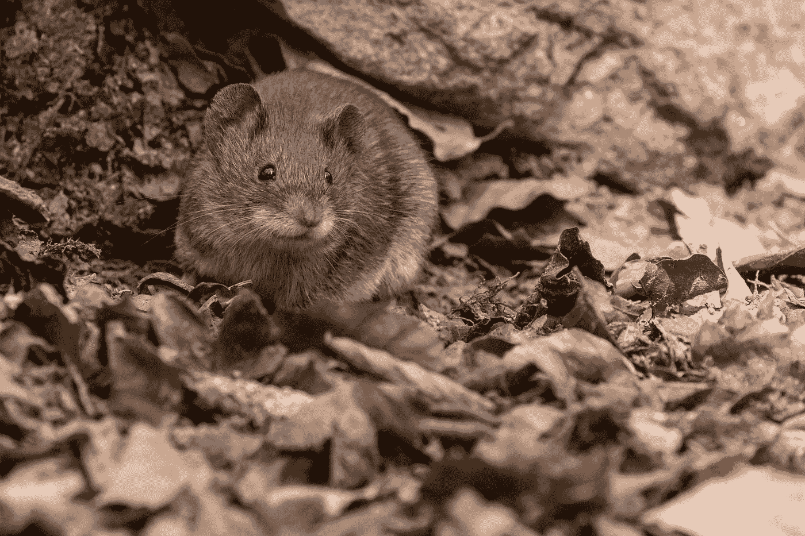

# JavaScript 事件处理程序—鼠标悬停和鼠标抬起事件

> 原文：<https://javascript.plainenglish.io/javascript-events-handlers-mouse-over-and-mouse-up-events-6bda72b07101?source=collection_archive---------3----------------------->


Photo by [Ricky Kharawala](https://unsplash.com/@sweetmangostudios?utm_source=medium&utm_medium=referral) on [Unsplash](https://unsplash.com?utm_source=medium&utm_medium=referral)

在 JavaScript 中，事件是应用程序中发生的动作。它们是由各种事情触发的，比如输入、提交表单、调整大小等元素变化，或者应用程序运行时发生的错误等。我们可以分配一个事件处理器来处理这些事件。发生在 DOM 元素上的事件可以通过为相应事件的 DOM 对象的属性分配一个事件处理程序来处理。在本文中，我们将看看如何使用 DOM 元素的`onmouseover`和`onmouseup`属性。

# onmouseover

DOM 元素的`onmouseover`属性允许我们给它分配一个事件处理函数来处理`mouseover`事件。当使用鼠标或触控板等定点设备将光标移动到元素或其子元素之一上时，它会在元素上触发。

这意味着无论鼠标移动到另一个元素，无论它在层次结构中的位置如何，都会触发`mouseenter`事件。因此，`mouseenter`事件可能会被触发多次，这会导致严重的性能问题。如果当鼠标在一个有很多后代的大元素上时，我们需要监听整个元素树中的事件，那么最好使用`mouseover`事件。

当与鼠标离开一个元素时触发的`mouseout`事件结合时，`mouseover`事件的行为方式非常类似于 CSS `:hover`伪类。

例如，我们可以使用它在图像上创建一个偷窥效果，当鼠标指针悬停在图像的一部分上时，我们显示图像的一部分。

首先，我们添加图像的 HTML 代码和隐藏图像的黑盒。此外，我们添加了一个 circle div 元素来显示我们所悬停的图像的一部分。为此，我们放入以下代码:

```
<div class='container'>
  <div class="view" hidden></div>
  </div>
```

添加`.container` div 是为了显示遮盖图像的黑盒。`.view` div 是一个圆圈，当我们将鼠标悬停在它上面时，它会显示图像的一部分，而`img`元素则显示图像本身。

接下来，我们将 CSS 代码添加到样式`div`元素中，就像我们刚刚描述的那样，添加以下 CSS 代码:

```
.container {
  background: black;
  width: 500px;
}.view {
  position: absolute;
  width: 200px;
  height: 200px;
  background: white;
  border-radius: 50%;
}img {
  mix-blend-mode: darken;
  width: 500px;
}
```

最后，我们添加 JavaScript 代码来完成我们刚刚描述的工作:

```
const img = document.querySelector('img');
const view = document.querySelector('.view');
const container = document.querySelector('.container');const showView = (event) => {
  view.removeAttribute('hidden');
  view.style.left = event.clientX - 50 + 'px';
  view.style.top = event.clientY - 50 + 'px';
  event.preventDefault();
}const moveView = (event) => {
  view.style.left = event.clientX - 50 + 'px';
  view.style.top = event.clientY - 50 + 'px';
}container.onmousemove = moveView;
container.onmouseover = showView;
```

在上面的代码中，我们通过使用`querySelector`方法获得了`.container`元素。我们对`img`和`.view`元素做同样的事情。一旦我们这样做了，我们编写事件处理函数。

`.container` `div`元素的`onmouseover`属性被设置为`showView`函数，该函数在鼠标按钮按下时运行。在函数内部，我们从`.view` `div`元素中移除了`hidden`属性，以显示`div`下面的图像。从拥有`Event`对象的`event`参数中，我们获得了`clientX`和`clientY`属性，它们拥有点击位置的鼠标坐标。我们将其设置为代表`.view`元素的`view` DOM 对象的位置。然后我们调用`event.preventDefault()`来停止默认动作，因为我们已经用它之前的代码进行了揭示。

`.container` `div`元素的`onmousemove`事件处理程序被设置为`moveView`函数，该函数处理`mousemove`事件。当鼠标移动时触发该事件。在函数中，我们将`.view`元素设置为鼠标指针当前所在的位置，同样使用`event`参数的`clientX`和`clientY`属性，该参数是`MouseEvent`对象。

一旦我们做了所有这些，当我们将鼠标悬停在黑盒上时，我们就会显示下面的那部分图像。



Photo by [Zdeněk Macháček](https://unsplash.com/@zmachacek?utm_source=medium&utm_medium=referral) on [Unsplash](https://unsplash.com?utm_source=medium&utm_medium=referral)

# onmouseup

DOM 元素的`onmouseup`属性允许我们为它分配一个事件处理函数来处理`mouseup`事件。当用户释放鼠标按钮时它被触发。`mouseup`事件与`mousedown`事件相对应。

例如，我们可以将它与`mousedown`和`mousemove`事件处理程序一起使用来制作一个简单的白板。首先，我们在 HTML 代码中创建一个`canvas`元素:

```
<canvas width="300" height="300"></canvas>
```

然后，我们创建 CSS 代码，为`canvas`元素添加边框:

```
canvas {
  border: 1px solid black;
}
```

最后，我们添加 JavaScript 代码在`canvas`元素上进行绘制:

```
let isDrawing = false;
let x = 0;
let y = 0;const canvas = document.querySelector('canvas');
const context = canvas.getContext('2d');
const rect = canvas.getBoundingClientRect();
const drawLine = (context, x1, y1, x2, y2) => {
  context.beginPath();
  context.strokeStyle = 'red';
  context.lineWidth = 1;
  context.moveTo(x1, y1);
  context.lineTo(x2, y2);
  context.stroke();
  context.closePath();
}canvas.onmousedown = e => {
  x = e.clientX - rect.left;
  y = e.clientY - rect.top;
  isDrawing = true;
};canvas.onmousemove = e => {
  if (isDrawing === true) {
    drawLine(context, x, y, e.clientX - rect.left, e.clientY - rect.top);
    x = e.clientX - rect.left;
    y = e.clientY - rect.top;
  }
};document.onmouseup = e => {
  if (isDrawing === true) {
    drawLine(context, x, y, e.clientX - rect.left, e.clientY - rect.top);
    x = 0;
    y = 0;
    isDrawing = false;
  }
};
```

上面的代码通过获取`canvas`元素并从中获取允许我们在画布上绘制的上下文对象来工作。

我们定义了`drawLine`函数，它接受`canvas`上下文、直线起始坐标的 x 和 y 坐标(分别为`x1`和`y1`)以及直线终点的 x 和 y 坐标(分别为`x2`和`y2`)。

在函数中，我们在`canvas`上下文对象上调用`beginPath`。然后，我们将`strokeStyle`设置为`red`，这将使线条变为红色。然后我们将`lineWidth`设置为 1 个像素。接下来我们用`x1`和`y1`调用`moveTo`来开始在这些坐标中绘图，然后我们用参数`x2`和`y2`调用`lineTo`方法来定义从(`x1`、`y1`)到(`x2`、`y2`)的线段。然后我们调用 context 对象上的`stroke`方法来实际绘制。最后我们调用`closePath`方法把线画回起点(`x1`，`y1`)。

然后我们附加我们的事件处理程序。我们分配`onmousedown`事件处理函数来设置`x`和`y`坐标，并将`isDrawing`设置为`true`以表示我们将开始绘制。

接下来，我们设置`canvas`元素的`onmousemove`属性，给它分配一个事件处理函数，当`isDrawing`为`true`时运行代码。如果是`true`，那么我们调用上面定义的`drawLine`方法，用(`x`、`y`)作为线段的起点，(`e.clientX — rect.left`、`e.clientY — rect.top`)作为直线线段的终点。`e.clientX`是鼠标指针所在位置的 x 坐标，`clientY`是鼠标指针所在位置的 y 坐标。`rect`从上下文的`getBoundingClientRect`方法返回，该方法返回元素的大小及其相对于视口的位置。我们减去`rect`尺寸，这样我们绘制的线段的端点和起点将与绘制直线后鼠标指针的位置相同。

最后，我们为`onmouseup`事件设置一个事件处理函数，以便在`isDrawing`为`true`时绘制剩余的线，然后将`isDrawing`设置为`false`以停止绘制，因为我们松开了鼠标按钮。

DOM 元素的`onmouseover`属性允许我们给它分配一个事件处理函数来处理`mouseover`事件。当使用鼠标或触控板等定点设备将光标移动到元素或其子元素之一上时，它会在元素上触发。

DOM 元素的`onmouseup`属性允许我们为它分配一个事件处理函数来处理`mouseup`事件。当用户释放鼠标按钮时它被触发。`mouseup`事件与`mousedown`事件相对应。

我们可以将它与其他鼠标事件处理程序一起使用来创建有用的东西，如白板或当鼠标悬停在某物上时改变内容。