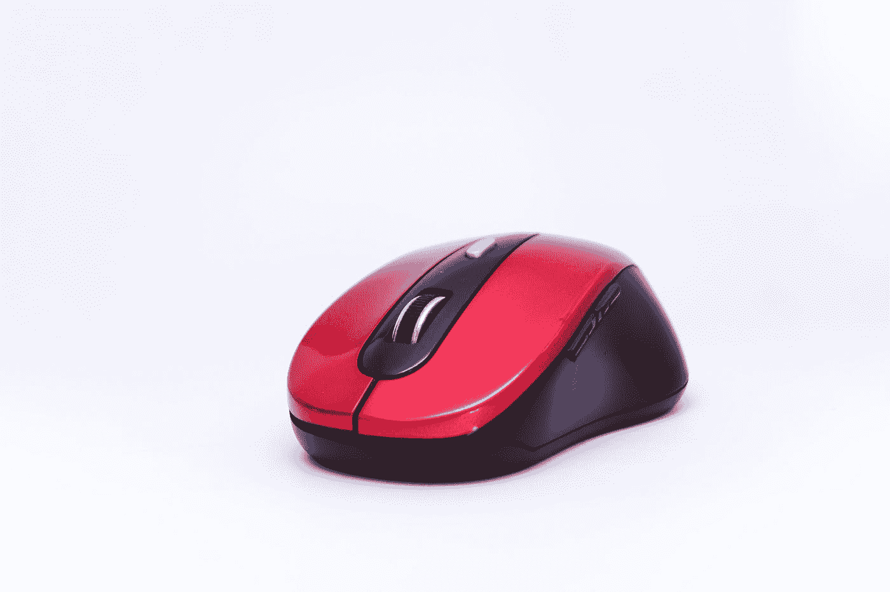

# JavaScript 事件处理程序— oncontextmenu 和 oncuechange

> 原文：<https://javascript.plainenglish.io/javascript-events-handlers-oncontextmenu-and-oncuechange-fd6474fdf96e?source=collection_archive---------5----------------------->



Photo by [Shagal Sajid](https://unsplash.com/@shagal_sajid?utm_source=medium&utm_medium=referral) on [Unsplash](https://unsplash.com?utm_source=medium&utm_medium=referral)

在 JavaScript 中，事件是应用程序中发生的动作。它们是由各种事情触发的，比如输入、提交表单、调整大小等元素变化，或者应用程序运行时发生的错误等。我们可以分配一个事件处理器来处理这些事件。发生在 DOM 元素上的事件可以通过为相应事件的 DOM 对象的属性分配一个事件处理程序来处理。我们将仔细看看`oncontextmenu`和`oncuechange`事件处理程序。

# oncontextmenu

`oncontextmenu`属性让我们给它分配一个事件处理函数来处理`contextmenu`事件。当在浏览器选项卡上单击鼠标右键时，会触发该事件。除非默认行为被阻止，否则浏览器上下文菜单将被激活。例如，我们可以通过写入以下命令来禁用右键单击:

```
document.oncontextmenu = (event) => {
  event.preventDefault();
}
```

我们还可以通过使用`MouseEvent`对象的`cilentX`和`cilentY`属性来获得右击的位置，该对象是我们从事件处理函数的参数中得到的。例如，我们可以编写下面的 HTML 代码来把文本放到右键单击的位置:

```
<p id='pos'></p>
```

然后，我们可以编写以下 JavaScript 代码来获取右键单击的坐标，然后使用调用事件处理函数时在参数中传递的`MouseEvent`对象的`cilentX`和`cilentY`属性，设置我们在上面编写的`p`元素中显示的文本:

```
const pos = document.getElementById('pos');
document.oncontextmenu = (e) => {
  console.log(e);
  pos.innerHTML = `You right clicked on (${e.clientX}, ${e.clientY})`;
}
```

`MouseEvent`对象有许多属性。它们是:

*   `altKey` —一个布尔只读属性，如果触发鼠标事件时 Qlt 键被按下，则返回`true`。
*   `button` —只读属性，指示触发鼠标事件时按下的按钮号(如果适用)。
*   `buttons` —一个只读属性，当触发鼠标事件时按钮被按下(如果有)。
*   `clientX` —只读属性，具有鼠标指针在文档坐标中的 X 坐标。
*   `clientY` —只读属性，具有鼠标指针在本地文档坐标中的 Y 坐标。
*   `ctrlKey`—boolean 只读，如果触发鼠标事件时按下了控制键，则返回`true`。
*   `metaKey`—boolean 只读，如果触发鼠标事件时元键已按下，则返回`true`。元键是 Macintosh 键盘上的 command 或 Apple 键，是 Windows 键盘上的 Windows 键。
*   `movementX` —一个只读的，它具有鼠标指针相对于上一次 mousemove 事件位置的 X 坐标。
*   `movementY` —只读属性，包含鼠标指针相对于上一次 mousemove 事件位置的 Y 坐标。
*   `offsetX` —一个只读属性，具有鼠标指针相对于目标节点填充边缘位置的 X 坐标
*   `offsetY` —只读属性，具有鼠标指针相对于目标节点填充边缘位置的 Y 坐标
*   `pageX` —只读属性，具有鼠标指针相对于整个文档的 X 坐标。
*   `pageY` —一个只读属性，即鼠标指针相对于整个文档的 Y 坐标。
*   `region` —只读属性，返回受事件影响的点击区域的 ID。如果没有命中区域受到影响，则返回`null`。
*   `relatedTarget` —只读属性，具有事件的辅助目标(如果有的话)。
*   `screenX` —一个只读属性，具有鼠标指针在全局(屏幕)坐标中的 X 坐标。
*   `screenY` —一个只读属性，具有鼠标指针在全局(屏幕)坐标中的 Y 坐标。
*   `shiftKey` —一个布尔只读属性，如果触发鼠标事件时按下了 shift 键，则返回`true`。
*   `which` —只读，当鼠标事件被触发时按钮被按下。
*   `mozPressure` —一个只读的，它具有生成事件时施加到触摸或平板设备上的压力量。该值介于`0.0`(最小压力)和`1.0`(最大压力)之间。这是一个不推荐使用的(非标准)属性。我们应该使用`PointerEvent`对象的`pressure`属性。
*   `mozInputSource` —只读属性，具有生成事件的设备类型(下面列出的`MOZ_SOURCE_*`常量之一)。我们可以确定鼠标事件是由实际的鼠标还是由触摸事件生成的，或者检测用户使用该属性与之交互的其他输入源。
*   `webkitForce` —一个只读属性，包含单击时施加的压力量
*   `x` —只读属性，是`clientX`的别名。
*   `y` —只读属性，是`clientY`的别名。


Photo by [Marcelo Leal](https://unsplash.com/@marceloleal80?utm_source=medium&utm_medium=referral) on [Unsplash](https://unsplash.com?utm_source=medium&utm_medium=referral)

# oncuechange

`oncuechange`属性让我们分配一个事件处理程序来处理`cuechange`事件，该事件在`TextTrack`改变了当前显示的提示时被触发。该事件被发送到呈现轨迹的`TextTrack`和`track`元素。例如，我们可以用它来记录视频中显示的标题，如下面的代码所示。首先，我们添加视频的 HTML 代码和视频的字幕轨道:

```
<!DOCTYPE html>
<html>
  <head>
    <title>Cue Change</title>
    <link href="main.css" rel="stylesheet" />
  </head>
  <body>
    <video controls width="250" src="./media/friday.mp4">
      <track
        default
        kind="captions"
        srclang="en"
        src="./media/friday.vtt"
        id="video-track"
      />Sorry, your browser doesn't support embedded videos.
    </video><script src="main.js"></script>
  </body>
</html>
```

然后在`main.js`中，我们添加以下 JavaScript 代码:

```
const videoTrack = document.getElementById("video-track");
videoTrack.oncuechange = e => {
  console.log(e);
};
```

从上面代码的`console.log`输出中，我们应该得到如下所示的内容:

```
bubbles: false
cancelBubble: false
cancelable: false
composed: false
currentTarget: null
defaultPrevented: false
eventPhase: 0
isTrusted: true
path: (6) [track#video-track, video, body, html, document, Window]
returnValue: true
srcElement: track#video-track
target: track#video-track
timeStamp: 11405.27500025928
type: "cuechange"
```

新的`console.log`输出应该在显示新的标题时出现，这与改变提示以及触发`cuechanged`事件时相同。我们可以从`target.track.activeCues`属性中获取标题/提示文本。`activeCues`属性是一个`TextTrackCueList`，它是一个类似数组的对象，所以我们可以用`for...of`遍历它，并对它使用 spread 操作符。例如，我们可以编写以下代码:

```
const videoTrack = document.getElementById("video-track");
videoTrack.oncuechange = e => {
  console.log([...e.target.track.activeCues].map(t => t.text).join(" "));
};
```

然后我们会得到上面视频的字幕轨道的行:

```
Hildy!
How are you?
Tell me, is the lord of the universe in?
Yes, he's in - in a bad humor
Somebody must've stolen the crown jewels
...
```

`console.log`输出行一直持续到视频结束。

属性让我们给它分配一个事件处理函数来处理事件。当在浏览器选项卡上单击鼠标右键时，会触发该事件。这对于检测右键单击事件和禁用页面上的右键单击非常方便。`oncuechange`属性让我们分配一个事件处理程序来处理`cuechange`事件，该事件在`TextTrack`改变了当前显示的提示时被触发。该事件被发送到呈现轨迹的`TextTrack`和`track`元素。我们可以用`event.target.track`属性获取跟踪数据，该属性可用于传递给`oncurchange`事件处理程序的`Event`对象。