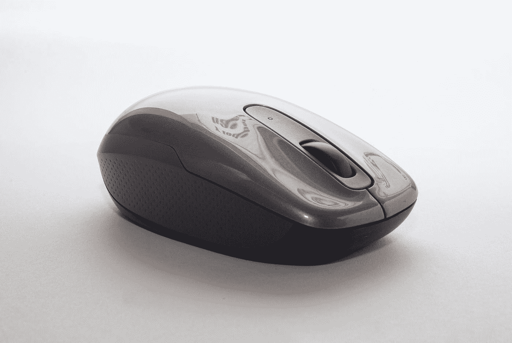

# JavaScript 事件处理程序— ondblclick 和 ondrag

> 原文：<https://javascript.plainenglish.io/javascript-events-handlers-ondblclick-and-ondrag-157446283bde?source=collection_archive---------3----------------------->



Photo by [Oscar Ivan Esquivel Arteaga](https://unsplash.com/@oscaresquivel?utm_source=medium&utm_medium=referral) on [Unsplash](https://unsplash.com?utm_source=medium&utm_medium=referral)

在 JavaScript 中，事件是应用程序中发生的动作。它们是由各种事情触发的，比如输入、提交表单、调整大小等元素变化，或者应用程序运行时发生的错误等。我们可以分配事件处理程序来处理这些事件。发生在 DOM 元素上的事件可以通过为相应事件的 DOM 对象的属性分配一个事件处理程序来处理。我们将看看`ondblclick`和`ondrag`事件处理程序以及如何使用它们。

# ondblclick

HTML 元素的`ondblclick`属性让我们分配一个事件处理函数来处理`dblclick`事件，当用户双击一个元素时触发该事件。它在两次单击都完成后触发。例如，我们可以用它来记录双击的位置。我们首先添加 HTML 代码来显示位置，如下面的代码所示:

```
<p id='dblclick-log'></p>
```

然后我们添加 JavaScript 代码，将事件处理函数分配给`document.ondblclick`属性，如下面的代码所示:

```
const dblclickLog = document.getElementById('dblclick-log');document.ondblclick = (e) => {
  dblclickLog.textContent = `Double clicked on: (${e.clientX}, ${e.clientY})`;
}
```

上面的`e`参数是一个`MouseEvent`，它具有以下特性:

*   `altKey` —一个布尔只读属性，如果触发鼠标事件时 Qlt 键被按下，则返回`true`。
*   `button` —只读属性，指示触发鼠标事件时按下的按钮号(如果适用)。
*   `buttons` —一个只读属性，当触发鼠标事件时按钮被按下(如果有)。
*   `clientX` —只读属性，具有鼠标指针在文档坐标中的 X 坐标。
*   `clientY` —只读属性，具有鼠标指针在本地文档坐标中的 Y 坐标。
*   `ctrlKey`—boolean 只读，如果触发鼠标事件时按下了控制键，则返回`true`。
*   `metaKey` —一个布尔只读，如果触发鼠标事件时元键被按下，则返回`true`。meta 键是 Macintosh 键盘上的 command 或 Apple 键，是 Windows 键盘上的 Windows 键。
*   `movementX` —一个只读，它具有鼠标指针相对于上一次 mousemove 事件位置的 X 坐标。
*   `movementY` —一个只读属性，具有鼠标指针相对于上一次 mousemove 事件位置的 Y 坐标。
*   `offsetX` —一个只读属性，具有鼠标指针相对于目标节点填充边缘位置的 X 坐标
*   `offsetY` —一个只读属性，具有鼠标指针相对于目标节点填充边缘位置的 Y 坐标
*   `pageX` —只读属性，具有鼠标指针相对于整个文档的 X 坐标。
*   `pageY` —一个只读属性，即鼠标指针相对于整个文档的 Y 坐标。
*   `region` —只读属性，返回受事件影响的点击区域的 ID。如果没有命中区域受到影响，则返回`null`。
*   `relatedTarget` —只读属性，具有事件的辅助目标(如果有的话)。
*   `screenX` —只读属性，具有鼠标指针在全局(屏幕)坐标中的 X 坐标。
*   `screenY` —一个只读属性，具有鼠标指针在全局(屏幕)坐标中的 Y 坐标。
*   `shiftKey` —一个布尔只读属性，如果触发鼠标事件时按下了 shift 键，则返回`true`。
*   `which` —只读，当触发鼠标事件时按钮被按下。
*   `mozPressure` —一个只读的，它具有生成事件时施加到触摸或平板设备上的压力量。该值介于`0.0`(最小压力)和`1.0`(最大压力)之间。这是一个不推荐使用的(非标准)属性。我们应该使用`PointerEvent`对象的`pressure`属性。
*   `mozInputSource` —只读属性，具有生成事件的设备类型(下面列出的`MOZ_SOURCE_*`常量之一)。我们可以确定鼠标事件是由实际的鼠标还是由触摸事件生成的，或者检测用户与该属性交互的其他输入源。
*   `webkitForce` —只读属性，包含单击时施加的压力量
*   `x` —只读属性，是`clientX`的别名。
*   `y` —只读属性，是`clientY`的别名。

知道我们也可以跟踪像按下 Alt 键双击或按下 Windows 键双击这样的事情。首先，我们添加以下 HTML 代码来显示结果:

```
<p id='dblclick-log'></p>
<p id='alt-pressed'></p>
<p id='meta-pressed'></p>
```

然后在 JavaScript 代码中，我们添加:

```
const dblclickLog = document.getElementById('dblclick-log');
const altPressed = document.getElementById('alt-pressed');
const metaPressed = document.getElementById('meta-pressed');document.ondblclick = (e) => {
  dblclickLog.textContent = `Double clicked on: (${e.clientX}, ${e.clientY})`;
  altPressed.textContent = e.altKey ? 'Alt key pressed' : '';
  metaPressed.textContent = e.metaKey ? 'Windows key pressed' : '';
}
```

然后，我们可以跟踪当我们双击时是否按下了 Alt 或 Windows 键。


Photo by [Sharon McCutcheon](https://unsplash.com/@sharonmccutcheon?utm_source=medium&utm_medium=referral) on [Unsplash](https://unsplash.com?utm_source=medium&utm_medium=referral)

# 翁德拉格

`ondrag`属性让我们分配一个我们定义的事件处理函数来处理`drag`事件，当一个将`draggable`属性值设置为`true`的元素被拖动到浏览器屏幕上时，该事件被触发。例如，我们编写以下 HTML 代码来制作一个 HTML 框:

```
<div id='drag-box' draggable="true"></div>
```

然后，我们用 CSS 样式化它，宽 100 像素，高 100 像素，并填充红色背景:

```
#drag-box {
  width: 100px;
  height: 100px;
  background-color: red;
}
```

最后，我们可以添加 JavaScript 代码来跟踪框的拖动动作，方法是将一个事件处理函数分配给我们在 HTML 代码中创建的框的 DOM 元素的`ondrag`属性:

```
const dragBox = document.getElementById('drag-box');dragBox.ondrag = (e) => {
  console.log(e);
}
```

然后当我们开始拖动时，当我们拖动盒子时，我们应该从`console.log`得到如下输出:

```
altKey: false
bubbles: true
button: 0
buttons: 1
cancelBubble: false
cancelable: true
clientX: 90
clientY: 68
composed: true
ctrlKey: false
currentTarget: null
dataTransfer: DataTransfer {dropEffect: "none", effectAllowed: "uninitialized", items: DataTransferItemList, types: Array(0), files: FileList}
defaultPrevented: false
detail: 0
eventPhase: 0
fromElement: null
isTrusted: true
layerX: 90
layerY: 68
metaKey: false
movementX: 0
movementY: 0
offsetX: 82
offsetY: 60
pageX: 90
pageY: 68
path: (5) [div#drag-box, body, html, document, Window]
relatedTarget: null
returnValue: true
screenX: 2250
screenY: 520
shiftKey: false
sourceCapabilities: InputDeviceCapabilities {firesTouchEvents: false}
srcElement: div#drag-box
target: div#drag-box
timeStamp: 5233.220000285655
toElement: div#drag-box
type: "drag"
view: Window {parent: global, postMessage: ƒ, blur: ƒ, focus: ƒ, close: ƒ, …}
which: 1
x: 90
y: 68
```

这些属性与来自`MouseEvent`和`Event`对象的属性相同，因为我们从事件处理函数的参数中获得的`DragEvent`对象继承了这两个对象。我们可以用上面记录的`x`和`y`属性获得拖动坐标。

HTML 元素的`ondblclick`属性让我们分配一个事件处理函数来处理`dblclick`事件，当用户双击一个元素时就会触发该事件。我们在事件处理函数的参数中得到一个`MouseEvent`,这样我们就可以根据自己的喜好使用它的属性。属性让我们分配一个我们定义的事件处理函数来处理`drag`事件，当一个将`draggable`属性值设置为`true`的元素在浏览器屏幕上被拖动时，该事件被触发。我们可以从`DragEvent`对象中获得带有`x`和`y`属性的拖动坐标。